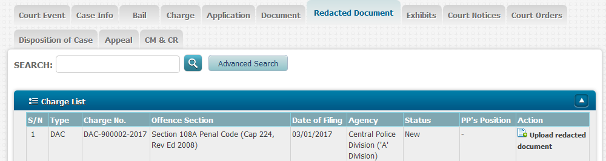
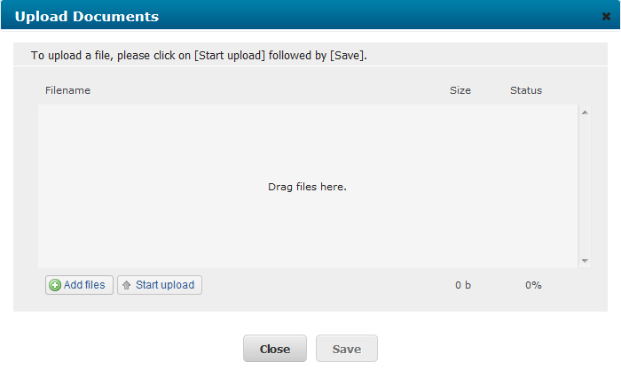
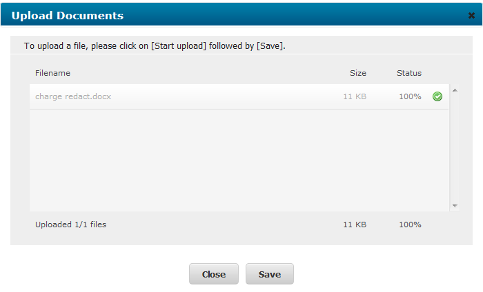
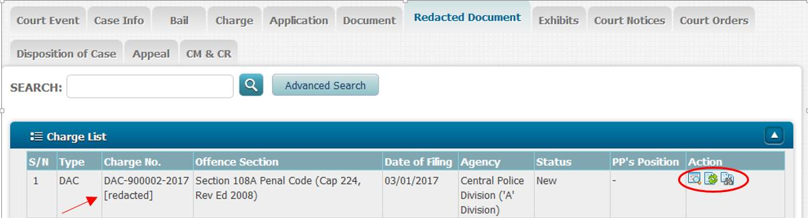

# Appendices

## Appendix A: Forms
### Form 1

**\[Deleted\]**

*
*

### Form 2

> ***Sample Letter of Offer
>***

To: \[Plaintiff/Defendant\]

\[Address\]

Dear Sir,

\[Heading e.g. as per letter of claim\]

We offer to settle \[your/your client’s claim OR the present matter\] on the following terms:

\[Set out the offer\]

Yours faithfully,

### Form 3

***PLAINTIFF’S/ DEFENDANT’S LIST OF ISSUES IN DISPUTE***

***AND LIST OF WITNESSES***

The list of issues in dispute in the claim is as follows:

| **No.** | **Issue /Matter in Dispute** | **Information Plaintiff/Defendant**

                                          **is Relying on in Support**          |
|---------|------------------------------|--------------------------------------|
|         |                              |                                      |
|         |                              |                                      |
|         |                              |                                      |

The witnesses whom the Plaintiff/Defendant intends to call to give evidence in support of its claim if the matter goes to court are as follows:

| **No.** | **Full Name of Witness** | **Reason for calling the Witness** |
|---------|--------------------------|------------------------------------|
|         |                          |                                    |
|         |                          |                                    |
|         |                          |                                    |
|         |                          |                                    |

Dated this day of 20 .

\_\_\_\_\_\_\_\_\_\_\_\_\_\_\_\_\_\_\_\_\_\_\_\_\_\_\_\_\_\_\_\_\_\_\_\_\_\_\_\_\_\_\_\_\_\_

**SOLICITORS FOR THE PLAINTIFF/DEFENDANT**

### Form 4A

***IN THE STATE COURTS OF THE REPUBLIC OF SINGAPORE***

MC Suit No. of 20 /

Between

( )

… Plaintiff

And

( )

… Defendant

***OPENING STATEMENT***

*(For all general civil Claims)*

***PROFILE OF PARTIES***

| Plaintiff | (If a firm or company, state the nature of the business. If an individual, state the age, gender and occupation.) |
|-----------|-------------------------------------------------------------------------------------------------------------------|
| Defendant |                                                                                                                   |

***CHRONOLOGY OF ESSENTIAL FACTS***

2. A summary of the essential facts of the Plaintiff’s/Defendant’s case in chronological sequence is annexed as “Annexure ‘A’” to the opening statement.

3. Item number(s) ( ) and ( ) of the essential facts has/have been agreed between the parties.

***SUMMARY OF ISSUES BETWEEN PARTIES***

4. A summary of the issues in respect of the Plaintiff’s /Defendant’s case and the applicable legal principles is annexed as “Annexure ‘B’” to the opening statement.

5. Where quantum is in dispute, the quantum table is annexed as “Annexure ‘C’” to the opening statement.

Dated this day of 20 .

\_\_\_\_\_\_\_\_\_\_\_\_\_\_\_\_\_\_\_\_\_\_\_\_\_\_\_\_\_\_\_\_

**SOLICITORS FOR THE PLAINTIFF/DEFENDANT**

***ANNEXURE ‘A’***

| ***NO.*** | ***DATE*** | ***ESSENTIAL FACTS*** | ***CROSS-REFERENCE***

                                                  (Pleading / Document)  | ***WITNESS(ES) TO BE CALLED*** |
|-----------|------------|-----------------------|-----------------------|--------------------------------|
| 1         |            |                       |                       |                                |
| 2         |            |                       |                       |                                |
| 3         |            |                       |                       |                                |
| 4         |            |                       |                       |                                |

***ANNEXURE ‘B’***

| ***NO.*** | ***ISSUES*** | ***PLAINTIFF’S/DEFENDANT’S POSITION***

                            ***\[Please include references to key documents\]***  | ***APPLICABLE LEGAL PRINCIPLES***

                                                                                   ***\[Please include reference to main authorities\]***  |
|-----------|--------------|------------------------------------------------------|--------------------------------------------------------|
| 1         |              |                                                      |                                                        |
| 2         |              |                                                      |                                                        |
| 3         |              |                                                      |                                                        |
| 4         |              |                                                      |                                                        |

***ANNEXURE ‘C’***

| ***NO.*** | ***DESCRIPTION OF ITEM CLAIMED BY PLAINTIFF*** | ***QUANTUM CLAIMED BY PLAINTIFF*** | ***PLAINTIFF’S SUPPORTING DOCUMENTS INCLUDING ANY EXPERT REPORT***

                                                                                                   ***\[Please include pg no. in Bundle of Documents\]***              | ***DEFENDANT’S COMMENTS ON ITEM CLAIMED*** | ***DEFENDANT’S SUBMISSION ON QUANTUM*** | ***DEFENDANT’S SUPPORTING DOCUMENTS INCLUDING ANY EXPERT REPORT***

                                                                                                                                                                                                                                                               ***\[Please include pg no. in Bundle of Documents\]***              |
|-----------|------------------------------------------------|------------------------------------|--------------------------------------------------------------------|--------------------------------------------|-----------------------------------------|--------------------------------------------------------------------|
| 1         |                                                | $                                  | 1)

                                                                                                   \_\_\_\_\_\_\_\_\_\_\_\_\_

                                                                                                   Pg\_\_\_\_\_\_\_\_\_\_\_

                                                                                                   2)

                                                                                                   \_\_\_\_\_\_\_\_\_\_\_\_\_

                                                                                                   Pg\_\_\_\_\_\_\_\_\_\_\_                                            |                                            | $                                       | 1)

                                                                                                                                                                                                                                                               \_\_\_\_\_\_\_\_\_\_\_\_\_

                                                                                                                                                                                                                                                               Pg\_\_\_\_\_\_\_\_\_\_\_

                                                                                                                                                                                                                                                               2)

                                                                                                                                                                                                                                                               \_\_\_\_\_\_\_\_\_\_\_\_\_

                                                                                                                                                                                                                                                               Pg\_\_\_\_\_\_\_\_\_\_\_                                            |
| 2         |                                                |                                    |                                                                    |                                            |                                         |                                                                    |
|           |                                                |                                    |                                                                    |                                            |                                         |                                                                    |
|           | TOTAL                                          | $                                  |                                                                    |                                            | $                                       |                                                                    |
|           | (at \_\_\_\_\_\_\_ %)                          | $\_\_\_\_\_\_\_\_\_\_\_\_          |                                                                    |                                            | $\_\_\_\_\_\_\_\_\_\_\_\_               |                                                                    |

### Form 4B

***IN THE STATE COURTS OF THE REPUBLIC OF SINGAPORE***

MC Suit No. of 20 /

Between

( )

… Plaintiff

And

( )

… Defendant

***OPENING STATEMENT***

*(For all NIMA/PI claims)*

***PROFILE OF PARTIES***

Date of accident:

|               | ***Vehicle no. ***

                 *(N.A. for pedestrian)*  | ***Age at time of accident*** | ***Present Age*** | ***Gender*** | ***Present Occupation*** |
|---------------|-------------------------|-------------------------------|-------------------|--------------|--------------------------|
| **Plaintiff** |                         |                               |                   |              |                          |
| **Defendant** |                         |                               |                   |              |                          |

***VERSIONS OF THE ACCIDENT***

2. A summary of the versions of the accident is as follows:

| ***Plaintiff’s Version*** | ***Defendant’s Version*** |
|---------------------------|---------------------------|
|                           |                           |

***SUBMISSION ON LIABILITY***

4. The Plaintiff’s/ Defendant’s submission on liability is as follows:

| Plaintiff’s / Defendant’s submission on liability                   |     |
|---------------------------------------------------------------------|-----|
| Plaintiff’s / Defendant’s reference from Motor Accident Guide (MAG) |     |
| Plaintiff’s / Defendant’s authorities                               |     |

***SUBMISSION ON QUANTUM***

5. Where quantum is also in dispute, the quantum table to be annexed is herewith as an “Annexure” to the opening statement.

6. Item number(s) ( ) and ( ) of the Plaintiff’s claim has/have been agreed between the parties.

Dated this day of 20 .

\_\_\_\_\_\_\_\_\_\_\_\_\_\_\_\_\_\_\_\_\_\_\_\_\_\_\_\_\_\_\_\_

**SOLICITORS FOR THE PLAINTIFF/DEFENDANT**

***Annexure (For NIMA matter)***

| ***NO.*** | ***HEAD OF DAMAGES CLAIMED*** | ***PLAINTIFF’S CLAIM FOR AWARD***                         | ***PLAINTIFF’S SUPPORTING***

                                                                                                         ***DOCUMENTS ***

                                                                                                         *\[Please include pg no. in Bundle of Documents\]*  | ***DEFENDANT’S ESTIMATE OF AWARD***                       | ***DEFENDANT’S SUPPORTING DOCUMENTS ***

                                                                                                                                                                                                                          *\[Please include pg no. in Bundle of Documents\]*  |
|-----------|-------------------------------|-----------------------------------------------------------|----------------------------------------------------|-----------------------------------------------------------|----------------------------------------------------|
| 1.        | Costs of Repairs              | $                                                         | 1)

                                                                                                         Pg \_\_\_\_\_

                                                                                                         2)

                                                                                                         Pg \_\_\_\_\_                                       | $                                                         | 1)

                                                                                                                                                                                                                          Pg \_\_\_\_\_

                                                                                                                                                                                                                          2)

                                                                                                                                                                                                                          Pg \_\_\_\_\_                                       |
| 2.        | Loss of Use                   | $\_\_\_\_ per day for \_\_\_\_ days = *$\_\_\_\_\_\_\_\_* |                                                    | $\_\_\_\_ per day for \_\_\_\_ days = *$\_\_\_\_\_\_\_\_* |                                                    |
| 3.        | Costs/Loss of Rental          | $\_\_\_\_ per day for \_\_\_\_ days = *$\_\_\_\_\_\_\_\_* |                                                    | $\_\_\_\_ per day for \_\_\_\_ days = *$\_\_\_\_\_\_\_\_* |                                                    |
| 4.        | Loss of Earnings              | $\_\_\_\_ per day for \_\_\_\_ days = *$\_\_\_\_\_\_\_\_* |                                                    | $\_\_\_\_ per day for \_\_\_\_ days = *$\_\_\_\_\_\_\_\_* |                                                    |
|           | TOTAL

             (at \_\_\_\_%)                 | $

                                             *$*                                                        |                                                    | $

                                                                                                                                                              *$*                                                        |                                                    |

### Form 5

**ORDER TO ALLOW ENTRY AND SEARCH OF PREMISES IN THE STATE COURTS OF THE REPUBLIC OF SINGAPORE**

MC/DC No.

Between

\[Intended\] Plaintiff

And

\[Intended\] Defendant

BEFORE THE DISTRICT JUDGE \_\_\_\_\_\_\_\_\_\_\_\_\_\_\_\_\_ IN CHAMBERS

**ORDER TO ALLOW ENTRY AND SEARCH OF PREMISES**

***IMPORTANT:-***

***NOTICE TO THE DEFENDANT***

**(1) This order orders you to allow the persons mentioned below to enter the premises described in the order and to search for, examine and remove or copy the articles specified in the order. This part of the order is subject to restrictions. The order also requires you to hand over any of the articles which are under your control and to provide information to the plaintiff's solicitors. You are also prohibited from doing certain acts. You should read all the terms of the order very carefully. You are advised to consult a solicitor as soon as possible.**

**(2) Before you the defendant or the person appearing to be in control of the premises allow anybody onto the premises to carry out this order you are entitled to have the solicitor who serves you with this order explain to you what it means in every day language.**

**(3) You are entitled to insist that there is nobody \[or nobody except \[name\] ...\] present who could gain commercially from anything he might read or see on your premises.**

**(4) You are entitled to refuse to permit entry before 9.00 a.m. or after 5.00 p.m. or at all on Saturdays, Sundays and public holidays.**

**(5) You are entitled to seek legal advice, and to ask the Court to vary or discharge this order, provided you do so at once, and provided that meanwhile you permit** **\[the supervising solicitor (who is a solicitor of the Court acting independently of the plaintiff) and\]**[^1] **the plaintiff's solicitor to enter, but not start to search: see paragraph 3 below.**

**(6) If you ... the defendant disobey this order you will be guilty of contempt of Court and may be sent to prison or fined.**[^2]

**THE ORDER**

An application was made today \[date\] by counsel for ... the plaintiff to District Judge \[ \] by way of ex-parte summons no. of . District Judge \[ \] heard the application and read the affidavit(s) of \[name\] filed on \[date\].

As a result of the application **IT IS ORDERED** by District Judge \[ \] that:

*Entry and search of premises and vehicles on the premises*

1 (1) The defendant must allow \[Mr/Mrs/Miss... (“the supervising solicitor”), together with\]+ \[name\] ... a solicitor of the Supreme Court from the firm of the plaintiff's solicitors ... and up to ... other persons being ... \[their capacity\] accompanying \[him/them/as appropriate\] to enter the premises mentioned or described in Schedule 1 to this order and any vehicles on the premises so that they can search for, inspect, photograph or photocopy, and deliver into the safekeeping of the plaintiff's solicitors all the documents and articles which are listed or described in Schedule 2 to this order (“the listed items”) or which \[name\] ... believes to be listed items. The defendant must allow those persons to remain on the premises until the search is complete, and if necessary to re-enter the premises on the same or the following day in order to complete the search.

(2) This order must be complied with either by the defendant himself or by a responsible employee of the defendant or by the person appearing to be in control of the premises.

(3) This order requires the defendant or his employee or the person appearing to be in control of the premises to permit entry to the premises immediately the order is served upon him, except as stated in paragraph 3 below.

*Restrictions on the service and carrying out of paragraph 1 of this order*

2 Paragraph 1 of this order is subject to the following restrictions:-

(1) This order may only be served between 9.00 a.m. and 5.00 p.m. on a weekday which is not a public holiday.

(2) This order may not be carried out at the same time as any search warrant.

(3) \[This order must be served by the supervising solicitor, and paragraph 1 of the order must be carried out in his presence and under his supervision.\][^3] \[At least 1 of the persons accompanying him as provided by paragraph 1 of this order shall be a woman.\][^4]+ \[At least 1 of the persons carrying out the order shall be a woman.\][^5]

(4) This order does not require the person served with the order to allow anyone \[or anyone except \[name\] ... \] who could gain commercially from anything he might read or see on the premises if the person served with the order objects.

(5) No item may be removed from the premises until a list of the items to be removed has been prepared, and a copy of the list has been supplied to the person served with the order, and he has been given a reasonable opportunity to check the list.

(6) The premises must not be searched, and items must not be removed from them, except in the presence of the defendant or a person appearing to be a responsible employee of the defendant.

\[(7) If the supervising solicitor is satisfied that full compliance with subparagraph (5) or (6) above is impracticable, he may permit the search to proceed and items to be removed without compliance with the impracticable requirements.\][^6]

*Obtaining legal advice and applying to the Court*

3 Before permitting entry to the premises by any person other than \[the supervising solicitor and\]+ the plaintiff's solicitors, the defendant or other person appearing to be in control of the premises may seek legal advice, and apply to the Court to vary or discharge this order, provided he does so at once. While this is being done, he may refuse entry to the premises by any other person, and may refuse to permit the search to begin, for a short time (not to exceed 2 hours, unless \[the supervising solicitor or\]+ the plaintiff's solicitor agrees to a longer period).

*Delivery of listed items and computer print-outs*

4 (1) The defendant must immediately hand over to the plaintiff's solicitors any of the listed items which are in his possession or under his control.

(2) If any of the listed items exists only in computer readable form, the defendant must immediately give the plaintiff's solicitors effective access to the computers, with all necessary passwords, to enable them to be searched, and cause the listed items to be printed out. A print out of the items must be given to the plaintiff's solicitors or displayed on the computer screen so that they can be read and copied. All reasonable steps shall be taken by the plaintiff to ensure that no damage is done to any computer or data. The plaintiff and his representatives may not themselves search the defendant's computers unless they have sufficient expertise to do so without damaging the defendant's system.

*Disclosure of information by the defendant*

5 (1) The defendant must immediately inform the plaintiff's solicitors:-

> (a) where all the listed items are; and

> (b) so far as he is aware:

> (i) the name and address of everyone who has supplied him, or offered to supply him, with listed items;

> (ii) the name and address of everyone to whom he has supplied, or offered to supply, listed items; and

> (iii) full details of the dates and quantities of every such supply and offer.

(2) Within ... days after being served with this order the defendant must prepare and swear an affidavit confirming the above information.

Nothing in this order shall abrogate the defendant's right against self-incrimination.

*Prohibited acts*

6 (1) Except for the purpose of obtaining legal advice \[or advising his banker\], the defendant must not directly or indirectly inform anyone of these proceedings or of the contents of this order, or warn anyone that proceedings have been or may be brought against him by the plaintiff until \[ \].

(2) \[Insert any negative injunctions.\]

***EFFECT OF THIS ORDER***

(1) A defendant who is an individual who is ordered not to do something must not do it himself or in any other way. He must not do it through others acting on his behalf or on his instructions or with his encouragement.

(2) A defendant which is a corporation and which is ordered not to do something must not do it itself or by its directors, officers, employees or agents or in any other way.

***UNDERTAKINGS***

The plaintiff, \[the supervising solicitor and\][^7] the plaintiff's solicitors gave to the Court the undertakings contained in Schedules 3, 4 and 5 respectively to this order.

***DURATION OF THIS ORDER***

Paragraph 6(2) of this order shall remain in force until the trial or further order.

***VARIATION OR DISCHARGE OF THIS ORDER***

The defendant (or anyone notified of this order) may apply to the Court at any time to vary or discharge this order (or so much of it as affects that person), but anyone wishing to do so must inform the plaintiff's solicitors.

***NAME AND ADDRESS OF PLAINTIFF'S SOLICITORS***

The plaintiff's solicitors are:-

\[Name of lawyer(s) having conduct of action or charge of matter.\]

\[Name of law firm.\]

\[Address of law firm.\]

Tel: \[Contact telephone number.\]

Fax: \[Contact facsimile number.\]

Ref: \[File reference of law firm.\]

\[***INTERPRETATION OF THIS ORDER***

(1) In this order “he”, “him” or “his” include “she” or “her” and “it” or “its”.

(2) Where there are 2 or more defendants then (unless the context indicates differently):

> (a) References to “the defendants” mean both or all of them;

> (b) An order requiring “the defendants” to do or not to do anything requires each defendant to do or not to do it;

> (c) A requirement relating to service of this order, or of any legal proceedings, on “the defendants” means on each of them;

> (d) Any other requirement that something shall be done to or in the presence of “the defendants” means to or in the presence of 1 of them.\]

Dated this day of , 20 .

*Registrar.*

***
SCHEDULE 1***

**The premises**

***SCHEDULE 2***

**The listed items**

***SCHEDULE 3***

**Undertakings given by the plaintiff**

(1) If the Court later finds that this order or the carrying out of it has caused loss to the defendant, and decides that the defendant should be compensated for that loss, the plaintiff shall comply with any order the Court may make.

\[(2) As soon as practicable to issue a writ of summons \[in the form of the draft writ produced to the Court\] \[claiming appropriate relief\].\]

(3) To \[swear and file an affidavit\] \[cause an affidavit to be sworn and filed\] \[substantially in the terms of the draft produced to the Court\] \[confirming the substance of what was said to the Court by the plaintiff's solicitors.\]

(4) To serve on the defendant at the same time as this order is served on him the writ and copies of the affidavits and copy-able exhibits containing the evidence relied on by the plaintiff. \[Copies of the confidential exhibits ... \[specify\] need not be served, but they must be made available for inspection by or on behalf of the defendant in the presence of the plaintiff's solicitors while the order is carried out. Afterwards they must be provided to a solicitor representing the defendant who gives a written undertaking not to permit the defendant to see them or make copies of them except in his presence and not to permit the defendant to make or take away any note or record of the exhibits.\]

\[(5) To serve on the defendant a copy of the supervising solicitor's report on the carrying out of this order as soon as it is received and to produce a copy of the report to the Court.\][^8]

(6) Not, without the leave of the Court, to inform anyone else of this order or the carrying out of this order or to use any information or documents obtained as a result of carrying out this order except for the purposes of these proceedings or to inform anyone else of these proceedings until the trial or further order.

(7) To insure the items removed from these premises.[^9]

***SCHEDULE 4***

**Undertakings given by the plaintiff's solicitors**

(1) To answer at once to the best of their ability any question as to whether a particular item is a listed item.

(2) To return the originals of all documents obtained as a result of this order (except original documents which belong to the plaintiff) as soon as possible and in any event within 2 working days of their removal.

(3) While ownership of any item obtained as a result of this order is in dispute, to deliver the article into the keeping of solicitors acting for the defendant within 2 working days from receiving a written undertaking by them to retain the article in safe keeping and to produce it to the Court when required.

(4) To retain in their own safe keeping all other items obtained as a result of this order until the Court directs otherwise.

(5) To execute this order calmly and orderly and in a manner respectful of the defendant's business.

(6) Not, without the leave of the Court, to inform anyone else of this order or the carrying out of this order or to use any information or documents obtained as a result of the carrying out of this order except for the purposes of these proceedings or to inform anyone else of these proceedings until the trial or further order.

***SCHEDULE 5***

**Undertakings given by the supervising solicitor**

(1) To offer to explain to the person served with the order its meaning and effect fairly and in everyday language, and to inform him of his right to seek legal advice and apply to vary or discharge the order as mentioned in paragraph 3 of the order.

(2) To make and provide the plaintiff's solicitor a written report on the carrying out of the order.\][^10]

### Form 6A

**INJUNCTION PROHIBITING DISPOSAL OF ASSETS WORLDWIDE IN THE STATE COURTS OF THE REPUBLIC OF SINGAPORE**

MC/DC No.

Between

\[Intended\] Plaintiff

And

\[Intended\] Defendant

BEFORE THE DISTRICT JUDGE \_\_\_\_\_\_\_\_\_\_\_\_\_\_\_\_\_ IN CHAMBERS

**INJUNCTION PROHIBITING DISPOSAL**

**OF ASSETS WORLDWIDE**

***IMPORTANT:-***

***NOTICE TO THE DEFENDANT***

**(1) This order prohibits you from dealing with your assets up to the amount stated. The order is subject to the exceptions stated at the end of the order. You should read all the terms of the order very carefully. You are advised to consult a solicitor as soon as possible. You have a right to ask the Court to vary or discharge this order.**

**(2) If you disobey this order you will be guilty of contempt of Court and may be sent to prison or fined.**[^11]

**
THE ORDER**

An application was made today \[date\] by counsel for ... the plaintiff to District Judge \[ \] by way of ex-parte summons no. of . District Judge \[ \] heard the application and read the affidavit(s) of \[name\] filed on \[date\].

As a result of the application **IT IS ORDERED** by District Judge \[ \] that:

*Disposal of assets*

1 (1) The defendant must not (i) remove from Singapore any of his assets which are in Singapore whether in his own name or not and whether solely or jointly owned up to the value of $ or (ii) in any way dispose of or deal with or diminish the value of any of his assets whether they are in or outside Singapore whether in his own name or not and whether solely or jointly owned up to the same value. This prohibition includes the following assets in particular: -

> (a) the property known as ... or the net sale money after payment of any mortgages if it has been sold;

> (b) the property and assets of the defendant's business known as ... (or carried on at ..) or the sale money if any of them have been sold; and

> (c) any money in the accounts numbered ....... at .....

(2) If the total unencumbered value of the defendant's assets in Singapore exceeds $ the defendant may remove any of those assets from Singapore or may dispose of or deal with them so long as the total unencumbered value of his assets still in Singapore remains above $ . If the total unencumbered value of the defendant's assets in Singapore does not exceed $ , the defendant must not remove any of those assets from Singapore and must not dispose of or deal with any of them, but if he has other assets outside Singapore the defendant may dispose of or deal with those assets so long as the total unencumbered value of all his assets whether in or outside Singapore remains above $          .

*
Disclosure of information*

2 (1) The defendant must inform the plaintiff in writing at once of all his assets whether in or outside Singapore and whether in his own name or not and whether solely or jointly owned, giving the value, location and details of all such assets.

(2) The information must be confirmed in an affidavit which must be served on the plaintiff's solicitors within ... days after this order has been served on the defendant.

***EXCEPTIONS TO THIS ORDER***

(1) This order does not prohibit the defendant from spending $     a week towards his ordinary living expenses and also $     a week \[*or* a reasonable sum\] on legal advice and representation. But before spending any money the defendant must tell the plaintiff's solicitors where the money is to come from.

(2) This order does not prohibit the defendant from dealing with or disposing of any of his assets in the ordinary and proper course of business. The defendant shall account to the plaintiff \[state interval\] for the amount of money spent in this regard.

(3) The defendant may agree with the plaintiff's solicitors that the above spending limits should be increased or that this order should be varied in any other respect but any such agreement must be in writing.

***EFFECT OF THIS ORDER***

(1) A defendant who is an individual who is ordered not to do something must not do it himself or in any other way. He must not do it through others acting on his behalf or on his instructions or with his encouragement.

(2) A defendant which is a corporation and which is ordered not to do something must not do it itself or by its directors, officers, employees or agents or in any other way.

***THIRD PARTIES***

(1) *Effect of this order*

> It is a contempt of Court for any person notified of this order knowingly to assist in or permit a breach of the order. Any person doing so may be sent to prison or fined.

(2) *Effect of this order outside Singapore*

> The terms of this order do not affect or concern anyone outside the jurisdiction of this Court until it is declared enforceable or is enforced by a Court in the relevant country and then they are to affect him only to the extent they have been declared enforceable or have been enforced **UNLESS** such person is:

> (a) a person to whom this order is addressed or an officer or an agent appointed by power of attorney of such a person; or

> (b) a person who is subject to the jurisdiction of this Court and (i) has been given written notice of this order at his residence or place of business within the jurisdiction of this Court and (ii) is able to prevent acts or omissions outside the jurisdiction of this Court which constitute or assist in a breach of the terms of this order.

(3) *Set off by banks*

> This injunction does not prevent any bank from exercising any right of set off it may have in respect of any facility which it gave to the defendant before it was notified of the order.

(4) *Withdrawals by the defendant*

> No bank need enquire as to the application or proposed application of any money withdrawn by the defendant if the withdrawal appears to be permitted by this order.

**\[*SERVICE OUT OF THE JURISDICTION AND SUBSTITUTED SERVICE***

(1) The plaintiff may serve the writ of summons on the defendant at ... by .... \[mode of service\].

(2) If the defendant wishes to defend the action he must enter an appearance within ..... days of being served with the writ of summons.\]

***UNDERTAKINGS***

The plaintiff gives to the Court the undertakings set out in Schedule 1 to this order.

***DURATION OF THIS ORDER***

This order will remain in force until the trial or further order.

***VARIATION OR DISCHARGE OF THIS ORDER***

The defendant (or anyone notified of this order) may apply to the Court at any time to vary or discharge this order (or so much of it as affects that person), but anyone wishing to do so must inform the plaintiff's solicitors.

***NAME AND ADDRESS OF PLAINTIFF'S SOLICITORS***

The plaintiff's solicitors are:-

\[Name of lawyer(s) having conduct of action or charge of matter.\]

\[Name of law firm.\]

\[Address of law firm.\]

Tel: \[Contact telephone number.\]

Fax: \[Contact facsimile number.\]

Ref: \[File reference of law firm.\]

***\[INTERPRETATION OF THIS ORDER***

(1) In this order references to “he”, “him” or “his” include “she” or “her” and “it” or “its”.

(2) Where there are 2 or more defendants then (unless the context indicates differently)

> (a) References to “the defendants” mean both or all of them;

> (b) An order requiring “the defendants” to do or not to do anything requires each defendant to do or not to do the specified thing; and

> (c) A requirement relating to service of this order, or of any legal proceedings, on “the defendants” means service on each of them.\]

Dated this day of , 20 .

*Registrar*

***SCHEDULE 1***

**Undertakings given to the Court by the plaintiff**

(1) If the Court later finds that this order has caused loss to the defendant, and decides that the defendant should be compensated for that loss, the plaintiff shall comply with any order the Court may make.

\[(2) The plaintiff, in respect of any order the Court may make pursuant to paragraph (1) above, will:

> (a) on or before \[date\] provide to the defendant security in the sum of \[$ \] by causing \[payment to be made into Court / a bond to be issued by an insurance company with a place of business within Singapore / a written guarantee to be issued from a bank with a place of business within Singapore / payment to the plaintiff’s solicitor to be held by the solicitor as an officer of the Court pending further order\]\*; and

> (\*Delete where appropriate)

> (b) cause evidence of the provision of security to be extended to the defendant immediately after the security has been put up.\]

(3) As soon as practicable the plaintiff shall \[issue and\] serve on the defendant \[a\] \[the\] writ of summons \[in the form of the draft writ produced to the Court\] \[claiming appropriate relief\] together with this order.

(4) The plaintiff shall cause an affidavit to be sworn and filed \[substantially in the terms of the draft affidavit produced to the Court\] \[confirming the substance of what was said to the Court by the plaintiff's solicitors\].

(5) As soon as practicable the plaintiff shall serve on the defendant a copy of the affidavits and exhibits containing the evidence relied on by the plaintiff.

(6) Anyone notified of this order will be given a copy of it by the plaintiff's solicitors.

(7) The plaintiff shall pay the reasonable costs of anyone other than the defendant which have been incurred as a result of this order including the costs of ascertaining whether that person holds any of the defendant's assets and if the Court later finds that this order has caused such person loss, and decides that such person should be compensated for that loss, the plaintiff will comply with any order the Court may make.

(8) If this order ceases to have effect, the plaintiff will immediately take all reasonable steps to inform in writing anyone to whom he has given notice of this order, or who he has reasonable grounds for supposing may act upon this order, that it has ceased to have effect.

\[(9) The plaintiff shall not without the leave of the Court begin proceedings against the defendant in any other jurisdiction or use information obtained as a result of an order of the Court in this jurisdiction for the purpose of civil or criminal proceedings in any other jurisdiction.

(10) The plaintiff shall not without the leave of the Court seek to enforce this order in any country outside Singapore \[or seek an order of a similar nature including orders conferring a charge or other security against the defendant or the defendant's assets\].\]

### Form 6B

**INJUNCTION PROHIBITING DISPOSAL OF ASSETS IN SINGAPORE**

**IN THE STATE COURTS OF**

**THE REPUBLIC OF SINGAPORE**

DC/MC No.

Between

\[Intended\] Plaintiff

And

\[Intended\] Defendant

BEFORE THE DISTRICT JUDGE \_\_\_\_\_\_\_\_\_\_\_\_\_\_\_\_ IN CHAMBERS

**INJUNCTION PROHIBITING DISPOSAL OF ASSETS**

**IN SINGAPORE**

***IMPORTANT:-***

***NOTICE TO THE DEFENDANT***

**(1) This order prohibits you from dealing with your assets up to the amount stated. The order is subject to the exceptions stated at the end of the order. You should read all the terms of the order very carefully. You are advised to consult a solicitor as soon as possible. You have a right to ask the Court to vary or discharge this order.**

**(2) If you disobey this order you will be guilty of contempt of Court and may be sent to prison or fined.**[^12]

**
THE ORDER**

An application was made today \[date\] by counsel for ... the plaintiff to District Judge \[ \] by way of ex-parte summons no.\_\_\_\_\_ of \_\_\_\_. District Judge \[ \] heard the application and read the affidavit(s) of (name) filed on (date).

As a result of the application IT IS ORDERED by District Judge \[ \] that:

*Disposal of assets*

1 (1) The defendant must not remove from Singapore in any way dispose of or deal with or diminish the value of any of his assets which are in Singapore whether in his own name or not and whether solely or jointly owned up to the value $ . This prohibition includes the following assets in particular

> (a) the property known as ... or the net sale money after payment of any mortgages if it has been sold;

> (b) the property and assets of the defendant's business known as ... (or carried on at ..) or the sale money if any of them have been sold; and

> (c) any money in the accounts numbered ....... at .....

(2) If the total unencumbered value of the defendant's assets in Singapore exceeds $ , the defendant may remove any of those assets from Singapore or may dispose of or deal with them so long as the total unencumbered value of his assets still in Singapore remain above $ .

> *Disclosure of information*

2 The defendant must inform the plaintiff in writing at once of all his assets in Singapore whether in his own name or not and whether solely or jointly owned, giving the value, location and details of all such assets. The information must be confirmed in an affidavit which must be served on the plaintiffs solicitors within ... days after this order has been served on the defendant.

***EXCEPTIONS TO THIS ORDER***

(1) This order does not prohibit the defendant from spending $ a week towards his ordinary living expenses and also $ a week \[or a reasonable sum\] on legal advice and representation. But before spending any money the defendant must tell the plaintiff's solicitors where the money is to come from.

(2) This order does not prohibit the defendant from dealing with or disposing of any of his assets in the ordinary and proper course of business. The defendant shall account to the plaintiff \[state interval\] for the amount of money spent in this regard.

(3) The defendant may agree with the plaintiff's solicitors that the above spending limits should be increased or that this order should be varied in any other respect but any such agreement must be in writing.

***EFFECT OF THIS ORDER***

(1) A defendant who is an individual who is ordered not to do something must not do it himself or in any other way. He must not do it through others acting on his behalf or on his instructions or with his encouragement.

(2) A defendant which is a corporation and which is ordered not to do something must not do it itself or by its directors, officers, employees or agents or in any other way.

***THIRD PARTIES***

(1) *Effect of this order*

It is a contempt of Court for any person notified of this order knowingly to assist in or permit a breach of the order. Any person doing so may be sent to prison or fined.

(2) *Set off by banks*

This injunction does not prevent any bank from exercising any right of set off it may have in respect of any facility which it gave to the defendant before it was notified of the order.

(3) *Withdrawals by the defendant*

No bank need enquire as to the application or proposed application of any money withdrawn by the defendant if the withdrawal appears to be permitted by this order.

> ***\[SERVICE OUT OF THE JURISDICTION AND SUBSTITUTED SERVICE***

(1) The plaintiff may serve the writ of summons on the defendant at ... by .... (mode of service).

(2) If the defendant wishes to defend the action he must enter an appearance within ..... days of being served with the writ of summons.\]

***UNDERTAKINGS***

The plaintiff gives to the Court the undertakings set out in Schedule 1 to this order.

***DURATION OF THIS ORDER***

This order will remain in force until the trial or further order.

***VARIATION OR DISCHARGE OF THIS ORDER***

The defendant (or anyone notified of this order) may apply to the Court at any time to vary or discharge this order (or so much of it as affects that person), but anyone wishing to do so must inform the plaintiff's solicitors.

***NAME AND ADDRESS OF PLAINTIFF'S SOLICITORS***

The plaintiff's solicitors are:-

\[Name of lawyer(s) having conduct of action or charge of matter.\]

\[Name of law firm.\]

\[Address of law firm.\]

Tel: \[Contact telephone number.\]

Fax: \[Contact facsimile number.\]

Tlx: \[Contact telex number and answer back code.\]

Ref: \[File reference of law firm.\]

***\[INTERPRETATION OF THIS ORDER***

(1) In this order references to “he”, “him” or “his” include “she” or “her” and “it” or “its”.

(2) Where there are 2 or more defendants then (unless the context indicates differently)

> (a) References to “the defendants” mean both or all of them;

> (b) An order requiring “the defendants” to do or not to do anything requires each defendant to do or not to do the specified thing; and

> (c) A requirement relating to service of this order or of any legal proceedings on “the defendants” means service on each of them.\]

Dated this day of , 20 .

*Registrar*

***SCHEDULE 1***

**Undertakings given to the Court by the plaintiff**

(1) If the Court later finds that this order has caused loss to the defendant, and decides that the defendant should be compensated for that loss, the plaintiff shall comply with any order the Court may make.

\[(2) The plaintiff, in respect of any order the Court may make pursuant to paragraph (1) above, will:

> (a) on or before \[date\] provide to the defendant security in the sum of \[$ \] by causing \[payment to be made into Court / a bond to be issued by an insurance company with a place of business within Singapore / a written guarantee to be issued from a bank with a place of business within Singapore / payment to the plaintiff’s solicitor to be held by the solicitor as an officer of the Court pending further order\]\*; and

> (\*Delete where appropriate)

> (b) cause evidence of the provision of security to be extended to the defendant immediately after the security has been put up.\]

(3) As soon as practicable the plaintiff shall \[issue and\] serve on the defendant \[a\] \[the\] writ of summons \[in the form of the draft writ produced to the Court\] \[claiming appropriate relief\] together with this order.

(4) The plaintiff shall cause an affidavit to be sworn and filed \[substantially in the terms of the draft affidavit produced to the Court\] \[confirming the substance of what was said to the Court by the plaintiff's solicitors\].

(5) As soon as practicable the plaintiff shall serve on the defendant a copy of the affidavits and exhibits containing the evidence relied on by the plaintiff.

(6) Anyone notified of this order shall be given a copy of it by the plaintiff's solicitors.

(7) The plaintiff shall pay the reasonable costs of anyone other than the defendant which have been incurred as a result of this order including the costs of ascertaining whether that person holds any of the defendant's assets and if the Court later finds that this order has caused such person loss, and decides that such person should be compensated for that loss, the plaintiff will comply with any order the Court may make.

(8) If this order ceases to have effect, the plaintiff will immediately take all reasonable steps to inform in writing anyone to whom he has given notice of this order, or who he has reasonable grounds for supposing may act upon this order, that it has ceased to have effect.

### Form 7

**COURT DISPUTE RESOLUTION (CDR)/ALTERNATIVE DISPUTE RESOLUTION (ADR) FORM**

*The State Courts regard Court Dispute Resolution (CDR) and Alternative Dispute Resolution (ADR) as the **first stop of a court process.** CDR/ADR is crucial in the cost-effective and amicable resolution of disputes. Early identification of cases is essential to help the parties save costs and improve settlement prospects. To assist in this regard, this Form should be completed by you and your client before the following hearings:*

> *(a) Case Management Conference, for MC writs filed on or after 1st November 2014 and by consent, DC writs (pursuant to Order 108 of the Rules of Court and Practice Direction 20);*

> *(b) Pre-Trial Conference called pursuant to Practice Direction 36 (which PTC will be called in respect of MC writs filed before 1st November 2014 and all DC writs filed on or after 1st April 2014); or*

> *(c) any Summons for Directions that is filed (pursuant to Practice Direction 26).*

*Information concerning CDR/ADR is provided on the second page of this Form.*

***This section is to be completed by solicitors***

| **Case details**        | MC/DC∗ \_\_\_\_\_\_\_\_\_ / \_\_\_\_\_(year) | SUM \_\_\_\_\_\_\_\_ /\_\_\_\_\_\_\_\_ (year)            |
|-------------------------|----------------------------------------------|----------------------------------------------------------|
| **Number of witnesses** | Plaintiff                                    |                                                          |
| **Nature of claim**     | Tort                                         | Defamation / Medical Negligence\*                        |
|                         | Contract                                     | Construction / Renovation / Supply of Goods & Services\* |
|                         | Others (Specify)                             |                                                          |

Signature of solicitor

Name of solicitor for Plaintiff/Defendant∗:

Law Firm:

Date:

*\*delete where inapplicable**
***

***This section is to be read by your client***

***What are my CDR and ADR options?***

The State Courts Centre for Dispute Resolution provides CDR services such as **mediation, conciliation** and **neutral evaluation**. Mediation services are also provided by the Singapore Mediation Centre ([*http://www.mediation.com.sg*](http://www.mediation.com.sg)) and the Singapore International Mediation Centre (<http://www.simc.com.sg>). The Law Society of Singapore also provides **arbitration** and **mediation** as an ADR service.

**Mediation** is a process in which a mediator (i.e. a neutral third party) helps you and the other party negotiate for a settlement of your dispute. The mediator does not focus on who is at fault for the dispute. Instead, the mediator will help you and the other side discuss and reach a solution that will meet the concerns of both parties. Apart from mediation in the State Courts Centre for Dispute Resolution, the Law Society also provides mediation services under the Law Society Mediation Scheme (LSMS) as a quick, cost-effective and user-friendly way to resolve civil disputes without having to commence or continue with litigation or arbitration. More details of this scheme may be found at <http://www.lawsociety.org.sg/For-Public/Dispute-Resolution-Schemes/Mediation-Scheme>.

**Conciliation** is a process in which a conciliator (i.e. a neutral third party) possessing expertise in the subject matter assists you and the other party to negotiate for a settlement of the dispute. A judge at the State Courts Centre for Dispute Resolution will play a more direct role in the resolution of the dispute and assist parties arrive at an optimal solution by developing and suggesting proposals for the settlement. Ultimately, the decision whether or not to accept the settlement proposal still remains with the parties.

**Neutral Evaluation** (NE) involves an early assessment of the merits of the case by a judge in the State Courts Centre for Dispute Resolution. Parties’ lawyers will present the case to the judge, who will review the evidence and provide an evaluation based on the merits of the case. The evaluation can be binding or non-binding, depending on what the parties choose.

More information on mediation, conciliation and neutral evaluation may be found at [*http://www.statecourts.gov.sg*](http://www.statecourts.gov.sg) under “Interested in Mediation/Conciliation/CDR”.

In **arbitration,** there will be a determination of who is at fault. However, the decision is made by a private individual, the arbitrator, instead of a judge. The Law Society Arbitration Scheme (LSAS) is provided by the Law Society of Singapore for parties to resolve their dispute through arbitration in a speedy and cost-effective way. More information concerning fees and details of the scheme can be found at <http://www.lawsociety.org.sg/For-Public/Dispute-Resolution-Schemes/Arbitration-Scheme>.

***Which CDR or ADR option should I choose?***

You should choose the CDR or ADR option that best addresses your needs. Most litigants are concerned about issues such as legal costs, the duration of the litigation process, confidentiality and whether they have control over the outcome of the case. Some other concerns may include the desire to preserve the relationship with the other party, discomfort over the formal proceedings and a need to be vindicated. Generally, mediation is an option that addresses most of these concerns.

However, you may consider other CDR/ADR options if you have unique considerations. To help you decide the best option for you, we have provided a diagram on page (iii) highlighting the features of each option. Your solicitor will also be able to advise you on the pros and cons of each CDR/ADR option.

***This section is to be completed by your client***

**FOR MAGISTRATE’S COURT CASES ONLY**

1. This is to certify that my solicitor has explained to me the available Court Dispute Resolution (CDR) and Alternative Dispute Resolution (ADR) services, and I am aware of the benefits of settling my case by CDR/ADR.

2. I have been advised and understand that the Judge may take the view that CDR/ADR is suitable for my case, and that any unreasonable refusal on my part to resolve this matter via mediation or other means of CDR/ADRD may then expose me to adverse costs orders pursuant to Order 59 Rule 5(1) (c) of the Rules of Court as set out below:

3. For a case commenced by writ on or after 1st November 2014 before a Magistrate’s Court:

> I have been advised and understand that my case may be referred for CDR/ADR under Order 108 Rule 3(3) of the Rules of Court as set out below:

4. My decision concerning CDR/ADR is as follows:-

> (*Tick the relevant boxes*)

-   I wish to opt out from CDR/ADR for the following reasons:-

    -   I have already attempted CDR/ADR i.e. \_\_\_\_\_\_\_\_\_\_\_\_\_\_\_\_\_\_\_\_\_\_\_\_\_\_\_\_\_\_

    -   The dispute involves a question of law / To establish legal precedence.

    -   Other good reasons i.e.\_\_\_\_\_\_\_\_\_\_\_\_\_\_\_\_\_\_\_\_\_\_\_\_\_\_\_\_\_\_\_\_\_\_\_\_\_\_

> (*Note: Your view that the other party has a weak case is *not* considered a good reason)*

-   I would like to be referred for the following CDR/ADR service(s)-

> *(Note: you may tick more than one type of CDR/ADR service.)*

-   Mediation at State Courts Centre for Dispute Resolution (SCCDR)

-   Conciliation at State Courts Centre for Dispute Resolution (SCCDR)

-   Neutral Evaluation at State Courts Centre for Dispute Resolution (SCCDR)

-   Mediation at Singapore Mediation Centre (SMC) / Singapore International Mediation Centre (SIMC)

-   Mediation under Law Society Mediation Scheme (LSMS)

-   Arbitration under Law Society Arbitration Scheme (LSAS)

-   Others: (Please specify) \_\_\_\_\_\_\_\_\_\_\_\_\_\_\_\_\_\_\_\_\_\_\_\_\_\_\_\_\_\_\_\_\_\_\_\_\_\_\_\_\_\_\_\_\_\_\_\_\_

Signature of Plaintiff/Defendant\*

Name:

Date:

*∗ Delete where inapplicable*

***This section is to be completed by your client***

**FOR DISTRICT COURT CASES ONLY**

1. This is to certify that my solicitor has explained to me the available Court Dispute Resolution (CDR) and Alternative Dispute Resolution (ADR) services, and I am aware of the benefits of settling my case by CDR/ADR.

2. I have been advised and understand that my case will be referred for CDR/ADR unless any of the parties opt out of CDR/ADR.

3. I have been advised and understand that the Judge may take the view that CDR/ADR is suitable for my case, and that any unreasonable refusal on my part to resolve this matter via mediation or other means of CDR/ADR may then expose me to adverse costs orders pursuant to Order 59 Rule 5(1) (c) of the Rules of Court as set out below:

4. My decision concerning CDR/ADR is as follows: (*Tick the relevant boxes*)

-   I wish to opt out from CDR/ADR.

> Reason(s):\_\_\_\_\_\_\_\_\_\_\_\_\_\_\_\_\_\_\_\_\_\_\_\_\_\_\_\_\_\_\_\_\_\_\_\_\_\_\_\_\_\_\_\_\_\_\_\_\_\_\_\_\_\_\_\_\_\_\_\_\_\_\_\_\_

> \_\_\_\_\_\_\_\_\_\_\_\_\_\_\_\_\_\_\_\_\_\_\_\_\_\_\_\_\_\_\_\_\_\_\_\_\_\_\_\_\_\_\_\_\_\_\_\_\_\_\_\_\_\_\_\_\_\_\_\_\_\_\_\_\_\_\_\_\_\_\_\_\_

-   I would like to be referred for the following CDR/ADR service(s):

> *(Note: You may tick more than one type of CDR/ADR service)*

-   Mediation at State Courts Centre for Dispute Resolution (SCCDR)

> ***I am aware that each party in this case is required to pay Court ADR fees of *$250* in accordance with Order 90A rule 5A of the Rules of Court (except for non-injury motor accident actions, any action for damages for death or personal injury and any action under the Protection from Harassment Act 2014).***

-   Conciliation at State Courts Centre for Dispute Resolution (SCCDR)

> ***I am aware that each party in this case is required to pay Court ADR fees of *$250* in accordance with Order 90A rule 5A of the Rules of Court (except for non-injury motor accident actions, any action for damages for death or personal injury and any action under the Protection from Harassment Act 2014).***

-   Neutral Evaluation at State Courts Centre for Dispute Resolution (SCCDR)

> ***I am aware that each party in this case is required to pay Court ADR fees of *$250* in accordance with Order 90A rule 5A of the Rules of Court (except for non-injury motor accident actions, any action for damages for death or personal injury and any action under the Protection from Harassment Act 2014).***

-   Mediation at Singapore Mediation Centre (SMC) / Singapore International Mediation Centre (SIMC)

-   Mediation under Law Society Mediation Scheme (LSMS)

-   Arbitration under Law Society Arbitration Scheme (LSAS)

-   Others: (Please specify)\_\_\_\_\_\_\_\_\_\_\_\_\_\_\_\_\_\_\_\_\_\_\_\_\_\_\_\_\_\_\_\_\_\_\_\_\_\_\_\_\_\_\_\_\_\_\_\_\_

Signature of Plaintiff / Defendant\*

Name:

Date:

*∗ Delete where inapplicable.*

### Form 8

***Part A***

**REQUEST FOR SKYPE MEDIATION**

**(BY–CONSENT OF PARTIES ONLY)**

***(This section is to be *completed by the solicitors*. Please confirm that parties have satisfied the necessary conditions stated in Paragraph 25(23) before making this application.** **This Form shall be filed via the Electronic Filing Service in PDF Format together with the Request for CDR.)***

Case Number: DC/MC \_\_\_\_\_\_\_\_\_\_\_\_\_\_\_of \_\_\_\_\_\_\_\_\_\_\_

We, the solicitors acting for the Plaintiff(s) and Defendant(s) (and other party, where applicable), do confirm as follows:

***(Tick the relevant boxes.)***

(1) The Plaintiff/Defendant/other party\* is the overseas party requesting to appear for mediation via Skype because

-   The overseas party (not being a corporation) is unable to travel to Singapore on certified medical grounds, or provides other evidence of inability to travel to Singapore for mediation (please see supporting documents attached); or

-   The overseas party is a foreign incorporated company with no local presence and/or representative.

(2) **All solicitors will attend the mediation session conducted at the State Courts Centre for Dispute Resolution in person, even if their client is appearing via Skype.**

(3) All solicitors and parties consent to this application to mediate at the State Courts Centre for Dispute Resolution, with the overseas party appearing via Skype.

| **Details of the party appearing for the mediation session via Skype** |
|------------------------------------------------------------------------|
| Party                                                                  |
| Name of party/representative                                           |
| Country party will connect from                                        |
| Skype ID of party                                                      |
| Email address of party                                                 |

\_\_\_\_\_\_\_\_\_\_\_\_\_\_\_\_\_\_\_\_\_\_\_\_ \_\_\_\_\_\_\_\_\_\_\_\_\_\_\_\_\_\_\_\_\_\_\_\_ \_\_\_\_\_\_\_\_\_\_\_\_\_\_\_\_\_\_\_\_\_\_\_

Signature of solicitor Signature of solicitor Signature of solicitor

for the Plaintiff for the Defendant or the Other Party

Name of law firm Name of law firm Name of law firm

\_\_\_\_\_\_\_\_\_\_\_\_\_\_\_\_\_\_\_\_\_\_\_\_ \_\_\_\_\_\_\_\_\_\_\_\_\_\_\_\_\_\_\_\_\_\_\_\_\_ \_\_\_\_\_\_\_\_\_\_\_\_\_\_\_\_\_\_\_\_\_\_\_

Date: Date: Date:

*\*Delete where inapplicable.*

***Part B***

**CONFIDENTIALITY UNDERTAKING FOR SKYPE MEDIATION**

**(BY OVERSEAS PARTY ONLY)**

***(This section is to be *completed by the overseas party* at the time of filing of Part A.)***

Case Number: DC/MC \_\_\_\_\_\_\_\_\_\_\_\_\_\_\_of \_\_\_\_\_\_\_\_\_\_\_

1.  This is to certify that my solicitor has explained to me the benefits of settling my case by mediation.

2.  I have been advised and understand that **all communication, negotiations or offers of settlement** by and between any parties of the mediation, or during any private mediation sessions with the mediator at the State Courts Centre for Dispute Resolution, **shall remain confidential**.

3.  I have been advised and understand that audio, video or any other form of recording of the mediation session is ***not permissible,*** and only relevant parties should attend the mediation session via Skype.

4.  I have been advised and understand that any unauthorised audio recording of the mediation session may expose me to contempt of Court proceedings pursuant to Order 38A, Rule 4 of the Rules of Court.

\_\_\_\_\_\_\_\_\_\_\_\_\_\_\_\_\_\_\_\_\_\_\_\_\_\_\_\_\_\_\_\_\_\_\_\_

Signature of Plaintiff/Defendant/Other party\*

Name:

Date:

*\*Delete where inapplicable.*

### Form 9A

**LIABILITY INDICATION FORM**

**(NIMA AND PIMA CLAIMS)**

**Instructions: *Where liability indication is required*, this Form is to be completed *before* the CDR session by *all solicitors* having conduct of the case.**

| **Case number:** | *\_\_\_\_\_\_\_\_\_\_\_\_\_\_\_\_* | **Plaintiff’s Counsel/signature:**\_\_\_\_\_\_\_\_\_\_\_\_\_\_\_\_\_\_\_\_\_\_\_\_\_\_\_\_\_\_\_\_\_\_\_ |
|------------------|------------------------------------|----------------------------------------------------------------------------------------------------------|
| **CDR Date:**    | *\_\_\_\_\_\_\_\_\_\_\_\_\_\_\_\_* | **Defendant’s Counsel/signature:**\_\_\_\_\_\_\_\_\_\_\_\_\_\_\_\_\_\_\_\_\_\_\_\_\_\_\_\_\_\_\_\_\_     |
|                  |                                    | **(Other Party’s Counsel/signature):**\_\_\_\_\_\_\_\_\_\_\_\_\_\_\_\_\_\_\_\_\_\_\_\_\_\_\_\_\_\_       |

| **(1) Case type**                                                              | □ NIMA; or □ Chain Collision involved

                                                                                  □ PIMA; or (Use pg 2)

                                                                                  □ NIMA & PIMA                                                                   | □ Accident involving motor vehicles only

                                                                                                                                                                   □ Pedestrian involved

                                                                                                                                                                   □ Cyclist involved

                                                                                                                                                                   □ Claim by passenger                                             |
|--------------------------------------------------------------------------------|--------------------------------------------------------------------------------|-----------------------------------------------------------------|
| **(2) Other relevant details**                                                 |
| **(a) Quantum of claim (if not agreed)**

 Cost of repair:$\_\_\_\_\_\_\_\_\_\_\_\_\_\_\_\_\_\_\_\_

 Loss of use/rental: $\_\_\_\_\_\_\_\_\_\_\_\_\_\_\_\_

 General damages: $\_\_\_\_\_\_\_\_\_\_\_\_\_\_\_\_

 Special damages: $\_\_\_\_\_\_\_\_\_\_\_\_\_\_\_\_\_                            | **(b) Have all parties been brought in?**

                                                                                  □ Yes

                                                                                  □ No

                                                                                  Which party: \_\_\_\_\_\_\_\_\_\_\_\_\_\_\_\_\_\_\_\_\_                         | **(c) Is there a related suit? **

                                                                                                                                                                   □ Yes

                                                                                                                                                                   Suit No: \_\_\_\_\_\_\_\_\_\_\_\_\_\_\_\_\_\_\_\_\_\_\_\_\_\_

                                                                                                                                                                   Status/outcome:\_\_\_\_\_\_\_\_\_\_\_\_\_\_\_\_\_\_\_\_

                                                                                                                                                                   □ No                                                             |
| **(d) Has police action been taken**?

 □ Yes

 Which party: \_\_\_\_\_\_\_\_\_\_\_\_\_\_\_\_\_\_\_\_\_

 Type of action: \_\_\_\_\_\_\_\_\_\_\_\_\_\_\_\_\_\_\_\_

 □ No                                                                            | **(e)(i) Are there scene photographs? **

                                                                                  □ Yes □ No

                                                                                  **(ii) Is there a video recording?**

                                                                                  □ Yes □ No

                                                                                  Have parties exchanged these?

                                                                                  □ Yes □ No                                                                      | **(f) Is there an independent witness? **

                                                                                                                                                                   □ Yes

                                                                                                                                                                   Witness for: \_\_\_\_\_\_\_\_\_\_\_\_\_\_\_\_\_\_\_\_\_\_\_\_\_

                                                                                                                                                                   Statement/SD/AEIC available: \_\_\_\_\_\_\_\_\_\_

                                                                                                                                                                   □ No                                                             |
| **(3A) PLAINTIFF’S CASE**                                                      | **(3B) DEFENDANT’S / OTHER PARTY’S CASE**                                      |
| **Is there a relevant scenario in the Motor Accident Guide?**

 □ Yes

 Page / Serial number in MAG:\_\_\_\_\_\_\_\_\_\_\_\_\_\_\_\_\_\_\_\_\_\_\_\_

 Plaintiff’s proposal on liability:

 Plf: \_\_\_\_\_\_% Def: \_\_\_\_\_\_% Other Party: \_\_\_\_\_\_%

 Date proposal was made: \_\_\_\_\_\_\_\_\_\_\_\_\_\_\_\_\_\_\_\_\_\_\_\_\_\_\_

 □ No                                                                            | **Is there a relevant scenario in the Motor Accident Guide? **

                                                                                  □ Yes

                                                                                  Page / Serial number in MAG:\_\_\_\_\_\_\_\_\_\_\_\_\_\_\_\_\_\_\_\_\_\_\_\_

                                                                                  Defendant’s proposal on liability:

                                                                                  Plf: \_\_\_\_\_\_% Def: \_\_\_\_\_\_% Other Party: \_\_\_\_\_\_%

                                                                                  Date proposal was made: \_\_\_\_\_\_\_\_\_\_\_\_\_\_\_\_\_\_\_\_\_\_\_\_\_\_\_

                                                                                  □ No                                                                            |
| **The following are enclosed with the indication Form:**

 □ GIA or police reports

 □ Scene / damage photographs

 □ Witness’ statement/SD/AEIC (delete where inapplicable)

 **Sketch of accident** (if none in GIA/police report):                          | **The following are enclosed with the indication Form:**

                                                                                  □ GIA or police reports

                                                                                  □ Scene / damage photographs

                                                                                  □ Witness’ statement/SD/AEIC (delete where inapplicable)

                                                                                  **Sketch of accident** (if none in GIA/police report):                          |

Page 2

Chain Collision Accident Summary for CDR

> **Instructions: Please indicate the area of damage to the front and rear of each vehicle. Use a separate sheet of paper to represent accident if not a straight line front to rear collision.**

*First vehicle cut in from another lane, causing chain collision **YES /NO***

> *2*

### Form 9A(A)

**LIABILITY INDICATION FORM
(INDUSTRIAL ACCIDENT CLAIMS)**

Instructions: *Where liability indication is required*, this form is to be completed *before* the CDR session by *all solicitors* having conduct of the case.

Case Number: \_\_\_\_\_\_\_\_\_\_\_\_\_\_\_\_\_\_\_\_\_\_\_\_ Plaintiff’s Counsel/Signature: \_\_\_\_\_\_\_\_\_\_\_\_\_\_\_\_\_\_\_\_\_\_\_\_\_

CDR Date: \_\_\_\_\_\_\_\_\_\_\_\_\_\_\_\_\_\_\_\_\_\_\_\_\_\_\_ Defendant’s Counsel/Signature: \_\_\_\_\_\_\_\_\_\_\_\_\_\_\_\_\_\_\_\_\_\_\_

> \[Other Party’s Counsel/Signature\]:  \_\_\_\_\_\_\_\_\_\_\_\_\_\_\_\_\_\_

| **(1) Have all parties been brought in?**

 Yes

 No

 Which party: \_\_\_\_\_\_\_\_\_                                                                                                                            | **(2) Capacity of Defendant(s) – e.g. Work permit employer / occupier of worksite / sub-contractor etc :**

                                                                                                                                                             1st Defendant: \_\_\_\_\_\_\_\_\_\_\_\_\_\_\_\_\_\_\_\_\_\_\_\_\_\_\_\_\_\_

                                                                                                                                                             2nd Defendant:  \_\_\_\_\_\_\_\_\_\_\_\_\_\_\_\_\_\_\_\_\_\_\_\_\_\_\_\_\_

                                                                                                                                                             3rd Defendant/3rd Party/4th & Subsequent Party: \_\_\_\_\_\_\_\_\_\_\_\_\_\_\_\_\_\_\_\_\_\_\_\_\_\_\_\_\_\_\_\_\_\_\_\_\_\_\_\_\_\_\_  | **(3) Has prosecution been instituted?**

                                                                                                                                                                                                                                                                                                      No

                                                                                                                                                                                                                                                                                                      Yes

                                                                                                                                                                                                                                                                                                      Which party: \_\_\_\_\_\_\_\_\_ Outcome: \_\_\_\_\_\_\_\_\_\_\_\_  |
|-----------------------------------------------------------------------------------------------------------------------------------------------------------|----------------------------------------------------------------------------------------------------------------------------------------|-------------------------------------------------------------------|
| **(4) Was Notice of Accident lodged with MOM?**

 No

 Yes

 By which party: \_\_\_\_\_\_\_\_\_\_\_\_\_\_\_\_                                                                                                           | **(5) Are there scene / location photographs / video recording? **

                                                                                                                                                             Yes

                                                                                                                                                             No                                                                                                                                      | **(6) Is there a witness(es)? **

                                                                                                                                                                                                                                                                                                      Yes

                                                                                                                                                                                                                                                                                                      Witness for: \_\_\_\_\_\_\_\_\_\_\_\_\_\_\_\_\_\_\_\_\_\_

                                                                                                                                                                                                                                                                                                      Statement/SD/AEIC available: \_\_\_\_\_\_\_

                                                                                                                                                                                                                                                                                                      No                                                                 |
| **Other relevant details**                                                                                                                                |
| **(7) Nature of Accident:**

  Fall from height, e.g. ladder, scaffoldings, building etc.

  Lifting / hoisting / crane operations

  Injuries caused by tools /machinery / equipment                                                                                                          |  Act / omission of co-worker(s) / supervisors

                                                                                                                                                              Injuries caused by falling object(s)

                                                                                                                                                              Injuries caused by burns / inflammable substances

                                                                                                                                                              Others - Please specify: \_\_\_\_\_\_\_\_\_\_\_\_\_\_\_\_\_\_\_\_\_\_                                                                 |
| **(8) Applicable statutory provision(s):** \_\_\_\_\_\_\_\_\_\_\_\_\_\_\_\_\_\_\_\_\_\_\_\_\_\_\_\_\_\_\_­­­­­­\_\_\_\_\_\_\_\_\_\_\_\_\_\_\_\_\_\_\_\_\_ |
| **Plaintiff’s Case**                                                                                                                                      | **Defendant’s/Other Party’s Case**                                                                                                     |
| *Date and brief description of the Accident*                                                                                                              |
|                                                                                                                                                           |                                                                                                                                        |

| **Plaintiff’s Documents**                              |
|--------------------------------------------------------|
| *Have these been attached to this Form?*               |
| Photographs of accident scene/location/video recording

 Yes No Not available                                    |
| Notice of Accident lodged with MOM

 Yes No Not available                                    |
| MOM Notice of Assessment

 Yes No Not available                                    |
| Outcome of Prosecution

 Yes No Not available                                    |
| Statement/AEIC/SD of witness

 Yes No No witness                                       |
| Medical report(s) of treating doctor(s)

 Yes No                                                  |
| Applicable statutory provisions

 Yes No None                                             |
| Other relevant documents:

 Please specify: \_\_\_\_\_\_\_\_\_\_\_\_\_\_\_\_

 Yes No Not available                                    |

| **Defendant’s/Other Party’s Documents**                |
|--------------------------------------------------------|
| *Have these been attached to this Form?*               |
| Photographs of accident scene/location/video recording

 Yes No Not available                                    |
| Notice of Accident lodged with MOM

 Yes No Not available                                    |
| MOM Notice of Assessment

 Yes No Not available                                    |
| Outcome of Prosecution

 Yes No Not available                                    |
| Statement/AEIC/SD of witness

 Yes No No witness                                       |
| Applicable statutory provisions

 Yes No None                                             |
| Other relevant documents:

 Please specify: \_\_\_\_\_\_\_\_\_\_\_\_\_\_\_\_

 Yes No Not available                                    |

### Form 9B

NOTE: Actual Form is in landscape orientation and may be downloaded at [*http://www.statecourts.gov.sg*](http://www.statecourts.gov.sg)

| ***QUANTUM INDICATION FORM***                                                 |
|-------------------------------------------------------------------------------|
| ***PORTION TO BE COMPLETED BY SOLICITORS***                                   |
| Case No: DC / MC \_\_\_\_\_\_\_\_\_ of \_\_\_\_\_\_\_\_\_\_\_\_\_\_\_\_

 Nature of Claim: PIMA/IA/\_\_\_\_\_\_\_\_\_\_\_\_\_\_\_\_\_\_\_\_\_\_\_\_\_\_  |
| **Heads of Claim **                                                           |
| **(I) Pain and Suffering **                                                   |
| 1.                                                                            |
| 2.                                                                            |
| 3.                                                                            |
| **(II) Loss of future earnings / Loss of earning capacity**                   |
| **(III) Loss of Dependency **                                                 |
| **(IV) \_\_\_\_\_\_\_\_\_\_\_\_\_\_\_\_\_**

 **(*other items of claim*)**                                                   |
| **(V) \_\_\_\_\_\_\_\_\_\_\_\_\_\_\_\_\_**

 **(*other items of claim*)**                                                   |

### Form 9C

*Form may be downloaded from http://www.statecourts.gov.sg under “Civil Justice Division – Court Dispute Resolution”*

| **APPLICATION FOR DIRECTIONS UNDER O 37 **

 **FOR PERSONAL INJURY / NON-INJURY MOTOR ACCIDENT CLAIMS**

 *Note: Additional prayers (if any) may be listed in a separate sheet of paper to be attached to this Form.*                                                                                                                                                         |
|--------------------------------------------------------------------------------------------------------------------------------------------------------------------------------------------------------------------------------------------------------------------|
| Case number: DC / MC \_\_\_\_\_\_\_\_\_\_\_\_\_ of \_\_\_\_\_\_\_\_\_\_

 Nature of Claim: PIMA / IA / \_\_\_\_\_\_\_\_\_\_\_\_\_\_\_\_\_\_\_\_\_

 Date (dd/mm/yy) : \_\_ \_\_ / \_\_ \_\_ / \_\_ \_\_                                                                                                                                                                                                                 |
| **Directions Sought For By The Plaintiff:- **

 **(To be completed by the Plaintiff’s Counsel)**                                                                                                                                                                                                                    |
|                                                                                                                                                                                                                                                                    |
| -   List of documents and affidavit verifying list of documents to be filed andserved within 2 weeks \_\_\_\_\_\_week i.e. by \_\_ \_\_ / \_\_ \_\_ / \_\_ \_\_.                                                                                                   |
| -   By consent, parties agree to dispense with affidavit verifying list of documents.                                                                                                                                                                              |
| -   Inspection to be done within 3 weeks / \_\_\_\_\_\_ weeks i.e. by \_\_ \_\_ / \_\_ \_\_ / \_\_ \_\_.                                                                                                                                                           |
| -   Plaintiff's witnesses limited to \_\_\_\_\_\_ witness(es) of fact and \_\_\_\_\_\_ expert witnesses.                                                                                                                                                           |
| -   Defendant's witnesses limited to \_\_\_\_\_\_witness(es) of fact and \_\_\_\_\_\_ expert witnesses.                                                                                                                                                            |
| -   \_\_\_\_\_\_\_\_\_\_\_witnesses limited to \_\_\_\_\_\_witness(es) of fact and \_\_\_\_\_\_ expert witnesses.                                                                                                                                                  |
| -   Parties to exchange AEICs of all witnesses within 8 weeks / \_\_\_\_\_\_ weeks i.e. by \_\_ \_\_ /\_\_ \_\_ /\_\_ \_\_.

 > *(Note: AEICs should be *filed and served* for cases involving litigants-in-person)*                                                                                                                                                                              |
| -   By consent, AEICs of medical experts shall be dispensed with. The evidence of the medical experts shall be given in the form of their respective medical reports to be exchanged within 8 weeks / \_\_\_\_\_\_weeks i.e. by \_\_ \_\_ / \_\_ \_\_ / \_\_ \_\_. |
| -   Parties to file and serve Notice of Objections to AEICs within 9 weeks /\_\_\_\_weeks i.e. by

 > \_\_ \_\_ /\_\_ \_\_ /\_\_ \_\_                                                                                                                                                                                                                                   |
| -   Plaintiff to file and serve Notice of Appointment for Assessment of Damages for \_\_\_\_\_\_days of hearing within 10 weeks / \_\_\_\_\_\_weeks i.e. by

 > \_\_ \_\_ / \_\_ \_\_ / \_\_ \_\_.                                                                                                                                                                                                                                |
| -   Costs reserved to the Registrar.                                                                                                                                                                                                                               |
| -   Order of Court with the names of the witnesses to be extracted within 3 weeks from the date of the Order i.e. by \_\_ \_\_/\_\_ \_\_ /\_\_ \_\_.                                                                                                               |

**
**

### Form 9C(A)

*Form may be downloaded from http://www.statecourts.gov.sg under “Civil Justice Division – Court Dispute Resolution”*

| **APPLICATION FOR DIRECTIONS UNDER ORDER 37 OF THE RULES OF COURT**

 **FOR MAGISTRATE’S COURT CASES FIXED FOR SIMPLIFIED AD**

 **PURSUANT TO ORDER 108**

 *Note: Additional prayers (if any) may be listed in a separate sheet of paper to be attached to this Form.*                                                                                                       |
|------------------------------------------------------------------------------------------------------------------------------------------------------------------------------------------------------------------|
| Case number: DC / MC \_\_\_\_\_\_\_\_\_\_\_\_\_ of \_\_\_\_\_\_\_\_\_\_

 Nature of Claim: PIMA / IA / \_\_\_\_\_\_\_\_\_\_\_\_\_\_\_\_\_\_\_\_\_

 Date (dd/mm/yy) : \_\_ \_\_ / \_\_ \_\_ / \_\_ \_\_                                                                                                                                                               |
| **Directions Sought By The Plaintiff:- **

 **(To be completed by the Plaintiff’s Counsel (PC))**                                                                                                                                                             |
|                                                                                                                                                                                                                  |
| -   Supplementary List of documents, if any, to be filed and served within 3 /\_\_\_\_\_\_week(s) i.e.

 > by \_\_\_\_\_\_\_\_\_\_.                                                                                                                                                                                        |
| -   Inspection to be done within 4 / \_\_\_\_\_\_ week(s) i.e. by \_\_\_\_\_\_\_\_\_\_\_\_\_\_\_.                                                                                                                |
| -   (*For Personal Injury cases)* AEICs of single joint expert (medical) shall be dispensed with. The medical report(s) shall be disclosed within 4/ \_\_\_\_\_\_weeks i.e. by \_\_\_\_\_\_\_\_\_\_\_\_\_\_\_\_. |
| -   Parties to exchange AEICs of all witnesses within 8 / \_\_\_\_\_\_ weeks i.e. by \_\_\_\_\_\_\_\_\_\_\_\_\_\_\_\_\_\_.

 > *(Note: AEICs should be *filed and served* for cases involving litigants-in-person)*                                                                                                                            |
| -   Parties to file and serve Notice of Objections to AEICs within 9 /\_\_\_\_weeks i.e. by \_\_\_\_\_\_\_\_\_\_\_\_\_\_.                                                                                        |
| -   Plaintiff to file and serve Notice of Appointment for Assessment of Damages for \_\_\_\_\_\_days of hearing within 12 / \_\_\_\_\_\_weeks i.e. by \_\_\_\_\_\_\_\_\_\_\_\_\_\_\_\_.                          |
| -   Order of Court with the names of the witnesses to be extracted within 4/\_\_\_\_\_\_\_\_ weeks from the date of the Order i.e. by \_\_\_\_\_\_\_\_\_\_\_\_\_\_\_\_\_\_\_\_\_\_.                              |
| **Directions Sought By The Parties:- **                                                                                                                                                                          |
| -   Plaintiff's witnesses of fact limited to \_\_\_\_\_\_witness(es).                                                                                                                                            |
| -   Defendant's witnesses of fact limited to \_\_\_\_\_\_witness(es).                                                                                                                                            |
| -   \_\_\_\_\_\_\_ Single Joint Expert (SJE) appointed by parties pursuant to O. 108 r. 5(3)(a) as follows:

 > (a)\_\_\_\_\_\_\_\_\_\_\_\_\_\_\_(Area of expertise : )
 >
 > (state name)
 >
 > (b)\_\_\_\_\_\_\_\_\_\_\_\_\_\_\_(Area of expertise : )
 >
 > (state name)

 -   Where parties are unable to agree on expert to be appointed, the Court shall pursuant to O. 108 r. 5(3)(b) appoint the SJE and fix the amount of remuneration payable to the SJE.

 -   SJE report is to be released by \_\_\_\_\_\_\_\_\_\_\_\_\_\_\_\_\_                                                                                                                                            |
| -   Costs reserved to the Registrar.                                                                                                                                                                             |

### Form 9D

***IN THE STATE COURTS OF THE REPUBLIC OF SINGAPORE***

MC / DC Suit No. of 20 /

Between

( )

... Plaintiff

And

( )

...Defendant

***JOINT OPENING STATEMENT***

*(For Personal Injury Claims)*

1.  Assessment of damages hearing no. NA ( ) in respect of the present matter is to be heard before the Honourable Court on ( date ) at 9.30am / 2.30pm.

2.  Interlocutory judgment was entered at ( ) % in the Plaintiff’s favour with damages to be assessed, costs, interests and disbursements to be reserved to the Registrar on ( date ). *\[If by consent, to state that IJ was entered by consent of parties\]*.

3.  A summary of the Plaintiff’s Profile is as follows:

<!-- -->

1.  Date of Accident:

2.  Gender of Plaintiff:

3.  Plaintiff’s Age at time of accident:

4.  Plaintiff’s Occupation at time of accident:

5.  Plaintiff’s Income per month at time of accident:

6.  Plaintiff’s Present Age:

7.  Plaintiff’s Present Occupation:

8.  Plaintiff’s Present Income per month:

<!-- -->

1.  A summary table of the Plaintiff’s and Defendant’s respective present positions on quantum is annexed herewith as an “Annexure” to the opening statement.

2.  Item number(s) ( ) and ( ) of the Plaintiff’s claim has/have been agreed between the parties.

> Dated this ( )

**\_\_\_\_\_\_\_\_\_\_\_\_\_\_\_\_\_\_\_\_\_\_\_\_\_\_\_\_ \_\_\_\_\_\_\_\_\_\_\_\_\_\_\_\_\_\_\_\_\_\_\_\_\_\_\_\_\_**

**SOLICITORS FOR THE PLAINTIFF SOLICITORS FOR THE DEFENDANT**

***ANNEXURE***

| ***NO.*** | ***HEAD OF DAMAGES CLAIMED*** | ***PLAINTIFF'S CLAIM FOR AWARD***        | ***PLAINTIFF'S EXPERT REPORT** \[Please include pg no. in Bundle of Documents\]* | ***PLAINTIFF'S DOCUMENTS IN SUPPORT** \[Please include pg no. in Bundle of Documents\]* | ***DEFENDANT'S ESTIMATE OF AWARD***      | ***DEFENDANT'S EXPERT REPORT** \[Please include pg no. in Bundle of Documents\]* | ***DEFENDANT'S DOCUMENTS IN SUPPORT***                    |
|-----------|-------------------------------|------------------------------------------|----------------------------------------------------------------------------------|-----------------------------------------------------------------------------------------|------------------------------------------|----------------------------------------------------------------------------------|-----------------------------------------------------------|
|           |                               |                                          |                                                                                  |                                                                                         |                                          |                                                                                  |                                                           |
| *(I)*     | PAIN AND SUFFERING            |                                          |                                                                                  |                                                                                         |                                          |                                                                                  |                                                           |
| 1         | Nature of Injury              | $

                                             *Authorities*: (1) Case Name Award Given

                                             (2) Case Name Award Given                 | 1) Medical Report by Dr \_\_\_\_\_\_\_\_\_\_\_ Pg \_\_\_\_\_\_\_\_\_

                                                                                        2) Medical Report by Dr \_\_\_\_\_\_\_\_\_ Pg \_\_\_\_\_\_\_\_\_                  | 1) \_\_\_\_\_\_\_\_\_\_\_\_\_\_ Pg \_\_\_\_\_\_\_\_\_\_\_

                                                                                                                                                                           2) \_\_\_\_\_\_\_\_\_\_\_\_\_ Pg\_\_\_\_\_\_\_\_\_\_\_\_                                 | $

                                                                                                                                                                                                                                                                     *Authorities*: (1) Case Name Award Given

                                                                                                                                                                                                                                                                     (2) Case Name Award Given                 | 1) Medical Report by Dr \_\_\_\_\_\_\_\_\_\_\_ Pg \_\_\_\_\_\_\_\_\_

                                                                                                                                                                                                                                                                                                                2) Medical Report by Dr \_\_\_\_\_\_\_\_\_

                                                                                                                                                                                                                                                                                                                Pg \_\_\_\_\_\_\_\_\_                                                             | 1) \_\_\_\_\_\_\_\_\_\_\_\_\_\_ Pg \_\_\_\_\_\_\_\_\_\_\_

                                                                                                                                                                                                                                                                                                                                                                                                   2) \_\_\_\_\_\_\_\_\_\_\_\_\_ Pg\_\_\_\_\_\_\_\_\_\_\_\_   |

1

| 2   | Nature of Injury | $

                          *Authorities*: (1) Case Name Award Given

                          (2) Case Name Award Given                 | 1) Medical Report by Dr \_\_\_\_\_\_\_\_\_\_\_ Pg \_\_\_\_\_\_\_\_\_

                                                                     2) Medical Report by Dr \_\_\_\_\_\_\_\_\_ Pg \_\_\_\_\_\_\_\_\_      | 1) \_\_\_\_\_\_\_\_\_\_\_\_\_\_ Pg \_\_\_\_\_\_\_\_\_\_\_

                                                                                                                                            2) \_\_\_\_\_\_\_\_\_\_\_\_\_ Pg\_\_\_\_\_\_\_\_\_\_\_\_   | $

                                                                                                                                                                                                        *Authorities*: (1) Case Name Award Given

                                                                                                                                                                                                        (2) Case Name Award Given                 | 1) Medical Report by Dr \_\_\_\_\_\_\_\_\_\_\_ Pg \_\_\_\_\_\_\_\_\_

                                                                                                                                                                                                                                                   2) Medical Report by Dr \_\_\_\_\_\_\_\_\_

                                                                                                                                                                                                                                                   Pg \_\_\_\_\_\_\_\_\_                                                 | 1) \_\_\_\_\_\_\_\_\_\_\_\_\_\_ Pg \_\_\_\_\_\_\_\_\_\_\_

                                                                                                                                                                                                                                                                                                                          2) \_\_\_\_\_\_\_\_\_\_\_\_\_ Pg\_\_\_\_\_\_\_\_\_\_\_\_   |
|-----|------------------|------------------------------------------|----------------------------------------------------------------------|-----------------------------------------------------------|------------------------------------------|----------------------------------------------------------------------|-----------------------------------------------------------|
| 3   | Nature of Injury | $

                          *Authorities*: (1) Case Name Award Given

                          (2) Case Name Award Given                 | 1) Medical Report by Dr \_\_\_\_\_\_\_\_\_\_\_ Pg \_\_\_\_\_\_\_\_\_

                                                                     2) Medical Report by Dr \_\_\_\_\_\_\_\_\_ Pg \_\_\_\_\_\_\_\_\_      | 1) \_\_\_\_\_\_\_\_\_\_\_\_\_\_ Pg \_\_\_\_\_\_\_\_\_\_\_

                                                                                                                                            2) \_\_\_\_\_\_\_\_\_\_\_\_\_ Pg\_\_\_\_\_\_\_\_\_\_\_\_   | $

                                                                                                                                                                                                        *Authorities*: (1) Case Name Award Given

                                                                                                                                                                                                        (2) Case Name Award Given                 | 1) Medical Report by Dr \_\_\_\_\_\_\_\_\_\_\_ Pg \_\_\_\_\_\_\_\_\_

                                                                                                                                                                                                                                                   2) Medical Report by Dr \_\_\_\_\_\_\_\_\_

                                                                                                                                                                                                                                                   Pg \_\_\_\_\_\_\_\_\_                                                 | 1) \_\_\_\_\_\_\_\_\_\_\_\_\_\_ Pg \_\_\_\_\_\_\_\_\_\_\_

                                                                                                                                                                                                                                                                                                                          2) \_\_\_\_\_\_\_\_\_\_\_\_\_ Pg \_\_\_\_\_\_\_\_\_\_\_\_  |

2

| *(II)*  | LOSS OF EARNING CAPACITY | $

                                      *Authorities*: (1) Case Name Award Given

                                      (2) Case Name Award Given                                             | 1) Medical Report by Dr \_\_\_\_\_\_\_\_\_\_\_ Pg \_\_\_\_\_\_\_\_\_

                                                                                                             2) Medical Report by Dr \_\_\_\_\_\_\_\_\_ Pg \_\_\_\_\_\_\_\_\_      | 1) \_\_\_\_\_\_\_\_\_\_\_\_\_\_ Pg \_\_\_\_\_\_\_\_\_\_\_

                                                                                                                                                                                    2) \_\_\_\_\_\_\_\_\_\_\_\_\_ Pg \_\_\_\_\_\_\_\_\_\_\_\_  | $

                                                                                                                                                                                                                                                *Authorities*: (1) Case Name Award Given

                                                                                                                                                                                                                                                (2) Case Name Award Given                                             | 1) Medical Report by Dr \_\_\_\_\_\_\_\_\_\_\_ Pg \_\_\_\_\_\_\_\_\_

                                                                                                                                                                                                                                                                                                                       2) Medical Report by Dr \_\_\_\_\_\_\_\_\_

                                                                                                                                                                                                                                                                                                                       Pg \_\_\_\_\_\_\_\_\_                                                 | 1) \_\_\_\_\_\_\_\_\_\_\_\_\_\_ Pg \_\_\_\_\_\_\_\_\_\_\_

                                                                                                                                                                                                                                                                                                                                                                                              2) \_\_\_\_\_\_\_\_\_\_\_\_\_ Pg\_\_\_\_\_\_\_\_\_\_\_\_   |
|---------|--------------------------|----------------------------------------------------------------------|----------------------------------------------------------------------|-----------------------------------------------------------|----------------------------------------------------------------------|----------------------------------------------------------------------|-----------------------------------------------------------|
|         |                          |                                                                      |                                                                      |                                                           |                                                                      |                                                                      |                                                           |
| *(III)* | LOSS OF FUTURE EARNINGS  | Multiplier: \_\_\_\_\_\_ years x Multiplicand: $\_\_\_\_\_\_\_\_ = $

                                      *Authorities*: (1) Case Name Award Given

                                      (2) Case Name Award Given                                             | 1) Medical Report by Dr \_\_\_\_\_\_\_\_\_\_\_ Pg \_\_\_\_\_\_\_\_\_

                                                                                                             2) Medical Report by Dr \_\_\_\_\_\_\_\_\_ Pg \_\_\_\_\_\_\_\_\_      | 1) \_\_\_\_\_\_\_\_\_\_\_\_\_\_ Pg \_\_\_\_\_\_\_\_\_\_\_

                                                                                                                                                                                    2) \_\_\_\_\_\_\_\_\_\_\_\_\_ Pg\_\_\_\_\_\_\_\_\_\_\_\_   | Multiplier: \_\_\_\_\_\_ years x Multiplicand: $\_\_\_\_\_\_\_\_ = $

                                                                                                                                                                                                                                                *Authorities*: (1) Case Name Award Given

                                                                                                                                                                                                                                                (2) Case Name Award Given                                             | 1) Medical Report by Dr \_\_\_\_\_\_\_\_\_\_\_ Pg \_\_\_\_\_\_\_\_\_

                                                                                                                                                                                                                                                                                                                       2) Medical Report by Dr \_\_\_\_\_\_\_\_\_

                                                                                                                                                                                                                                                                                                                       Pg \_\_\_\_\_\_\_\_\_                                                 | 1) \_\_\_\_\_\_\_\_\_\_\_\_\_\_ Pg \_\_\_\_\_\_\_\_\_\_\_

                                                                                                                                                                                                                                                                                                                                                                                              2) \_\_\_\_\_\_\_\_\_\_\_\_\_ Pg\_\_\_\_\_\_\_\_\_\_\_\_   |

3

| *(IV)* | FUTURE MEDICAL EXPENSES & TREATMENTS                          | $   | 1) Medical Report by Dr \_\_\_\_\_\_\_\_\_\_\_ Pg \_\_\_\_\_\_\_\_\_

                                                                                2) Medical Report by Dr \_\_\_\_\_\_\_\_\_ Pg \_\_\_\_\_\_\_\_\_      | 1) \_\_\_\_\_\_\_\_\_\_\_\_\_\_ Pg \_\_\_\_\_\_\_\_\_\_\_

                                                                                                                                                       2) \_\_\_\_\_\_\_\_\_\_\_\_\_ Pg\_\_\_\_\_\_\_\_\_\_\_\_   | $   | 1) Medical Report by Dr \_\_\_\_\_\_\_\_\_\_\_ Pg \_\_\_\_\_\_\_\_\_

                                                                                                                                                                                                                         2) Medical Report by Dr \_\_\_\_\_\_\_\_\_

                                                                                                                                                                                                                         Pg \_\_\_\_\_\_\_\_\_                                                 | 1) \_\_\_\_\_\_\_\_\_\_\_\_\_\_ Pg \_\_\_\_\_\_\_\_\_\_\_

                                                                                                                                                                                                                                                                                                2) \_\_\_\_\_\_\_\_\_\_\_\_\_ Pg\_\_\_\_\_\_\_\_\_\_\_\_   |
|--------|---------------------------------------------------------------|-----|----------------------------------------------------------------------|-----------------------------------------------------------|-----|----------------------------------------------------------------------|-----------------------------------------------------------|
|        |                                                               |     |                                                                      |                                                           |     |                                                                      |                                                           |
| *(V)*  | OTHER ITEMS OF GENERAL DAMAGES \[Includes Dependency Claims\] | $   | 1) Medical Report by Dr \_\_\_\_\_\_\_\_\_\_\_ Pg \_\_\_\_\_\_\_\_\_

                                                                                2) Medical Report by Dr \_\_\_\_\_\_\_\_\_ Pg \_\_\_\_\_\_\_\_\_      | 1) \_\_\_\_\_\_\_\_\_\_\_\_\_\_ Pg \_\_\_\_\_\_\_\_\_\_\_

                                                                                                                                                       2) \_\_\_\_\_\_\_\_\_\_\_\_\_ Pg\_\_\_\_\_\_\_\_\_\_\_\_   | $   | 1) Medical Report by Dr \_\_\_\_\_\_\_\_\_\_\_ Pg \_\_\_\_\_\_\_\_\_

                                                                                                                                                                                                                         2) Medical Report by Dr \_\_\_\_\_\_\_\_\_

                                                                                                                                                                                                                         Pg \_\_\_\_\_\_\_\_\_                                                 | 1) \_\_\_\_\_\_\_\_\_\_\_\_\_\_ Pg \_\_\_\_\_\_\_\_\_\_\_

                                                                                                                                                                                                                                                                                                2) \_\_\_\_\_\_\_\_\_\_\_\_\_ Pg\_\_\_\_\_\_\_\_\_\_\_\_   |
|        |                                                               |     |                                                                      |                                                           |     |                                                                      |                                                           |

4

| *(VI)* | SPECIAL DAMAGES            |                                                    |     |                                                           |                                                        |     |                                                           |
|--------|----------------------------|----------------------------------------------------|-----|-----------------------------------------------------------|--------------------------------------------------------|-----|-----------------------------------------------------------|
| 1      | Medical Expenses           | $                                                  |     | 1) \_\_\_\_\_\_\_\_\_\_\_\_\_\_ Pg \_\_\_\_\_\_\_\_\_\_\_

                                                                                                  2) \_\_\_\_\_\_\_\_\_\_\_\_\_ Pg\_\_\_\_\_\_\_\_\_\_\_\_   | $                                                      |     | 1) \_\_\_\_\_\_\_\_\_\_\_\_\_\_ Pg \_\_\_\_\_\_\_\_\_\_\_

                                                                                                                                                                                                                             2) \_\_\_\_\_\_\_\_\_\_\_\_\_ Pg\_\_\_\_\_\_\_\_\_\_\_\_   |
| 2      | Transport Expenses         | $                                                  |     | 1) \_\_\_\_\_\_\_\_\_\_\_\_\_\_ Pg \_\_\_\_\_\_\_\_\_\_\_

                                                                                                  2) \_\_\_\_\_\_\_\_\_\_\_\_\_ Pg\_\_\_\_\_\_\_\_\_\_\_\_   | $                                                      |     | 1) \_\_\_\_\_\_\_\_\_\_\_\_\_\_ Pg \_\_\_\_\_\_\_\_\_\_\_

                                                                                                                                                                                                                             2) \_\_\_\_\_\_\_\_\_\_\_\_\_ Pg\_\_\_\_\_\_\_\_\_\_\_\_   |
| 3      | Pre-Trial Loss of Earnings | $\_\_\_\_\_\_\_\_ per month for \_\_\_\_ month = $ |     | 1) \_\_\_\_\_\_\_\_\_\_\_\_\_\_ Pg \_\_\_\_\_\_\_\_\_\_\_

                                                                                                  2) \_\_\_\_\_\_\_\_\_\_\_\_\_ Pg\_\_\_\_\_\_\_\_\_\_\_\_   | $\_\_\_\_\_\_\_\_ per month for \_\_\_\_\_\_ month = $ |     | 1) \_\_\_\_\_\_\_\_\_\_\_\_\_\_ Pg \_\_\_\_\_\_\_\_\_\_\_

                                                                                                                                                                                                                             2) \_\_\_\_\_\_\_\_\_\_\_\_\_ Pg\_\_\_\_\_\_\_\_\_\_\_\_   |

5

| 4   | Other items of Special Damages | $                         |     | 1) \_\_\_\_\_\_\_\_\_\_\_\_\_\_ Pg \_\_\_\_\_\_\_\_\_\_\_

                                                                          2) \_\_\_\_\_\_\_\_\_\_\_\_\_ Pg\_\_\_\_\_\_\_\_\_\_\_\_   | $                             |     | 1) \_\_\_\_\_\_\_\_\_\_\_\_\_\_ Pg \_\_\_\_\_\_\_\_\_\_\_

                                                                                                                                                                            2) \_\_\_\_\_\_\_\_\_\_\_\_\_ Pg\_\_\_\_\_\_\_\_\_\_\_\_   |
|-----|--------------------------------|---------------------------|-----|-----------------------------------------------------------|-------------------------------|-----|-----------------------------------------------------------|
|     |                                |                           |     |                                                           |                               |     |                                                           |
|     | TOTAL                          | $                         |     |                                                           | $                             |     |                                                           |
|     | (at \_\_\_\_\_\_%)             | *$\_\_\_\_\_\_\_\_\_\_\_* |     |                                                           | *$\_\_\_\_\_\_\_\_\_\_\_\_\_* |     |                                                           |

6

### Form 9E

***IN THE STATE COURTS OF THE REPUBLIC OF SINGAPORE***

MC / DC Suit No. of 20 /

Between

( )

... Plaintiff

And

( )

...Defendant

***JOINT OPENING STATEMENT***

*(For Non-Injury Motor Accident Claims)*

1.  Assessment of damages hearing no. NA ( ) in respect of the present matter is to be heard before the Honourable Court on ( date ) at 9.30am / 2.30pm.

2.  Interlocutory judgment was entered at ( ) % in the Plaintiff’s favour with damages to be assessed, costs, interests and disbursements to be reserved to the Registrar on ( date ). *\[If by consent, to state that IJ was entered by consent of parties\].*

3.  This is a summary table of the Plaintiff’s and Defendant’s respective present positions on quantum.

| ***NO.*** | ***HEAD OF DAMAGES CLAIMED*** | ***PLAINTIFF’S CLAIM FOR AWARD***                         | ***PLAINTIFF’S SUPPORTING***

                                                                                                         ***DOCUMENTS ***

                                                                                                         *\[Please include pg no. in Bundle of Documents\]*  | ***DEFENDANT’S ESTIMATE OF AWARD***                       | ***DEFENDANT’S SUPPORTING DOCUMENTS ***

                                                                                                                                                                                                                          *\[Please include pg no. in Bundle of Documents\]*  |
|-----------|-------------------------------|-----------------------------------------------------------|----------------------------------------------------|-----------------------------------------------------------|----------------------------------------------------|
| 1.        | Costs of Repairs              | $                                                         | 1)

                                                                                                         Pg \_\_\_\_\_

                                                                                                         2)

                                                                                                         Pg \_\_\_\_\_                                       | $                                                         | 1)

                                                                                                                                                                                                                          Pg \_\_\_\_\_

                                                                                                                                                                                                                          2)

                                                                                                                                                                                                                          Pg \_\_\_\_\_                                       |
| 2.        | Loss of Use                   | $\_\_\_\_ per day for \_\_\_\_ days = *$\_\_\_\_\_\_\_\_* |                                                    | $\_\_\_\_ per day for \_\_\_\_ days = *$\_\_\_\_\_\_\_\_* |                                                    |
| 3.        | Costs/Loss of Rental          | $\_\_\_\_ per day for \_\_\_\_ days = *$\_\_\_\_\_\_\_\_* |                                                    | $\_\_\_\_ per day for \_\_\_\_ days = *$\_\_\_\_\_\_\_\_* |                                                    |
| 4.        | Loss of Earnings              | $\_\_\_\_ per day for \_\_\_\_ days = *$\_\_\_\_\_\_\_\_* |                                                    | $\_\_\_\_ per day for \_\_\_\_ days = *$\_\_\_\_\_\_\_\_* |                                                    |
|           | TOTAL

             (at \_\_\_\_%)                 | $

                                             *$*                                                        |                                                    | $

                                                                                                                                                              *$*                                                        |                                                    |

1.  Item number(s) ( ) and ( ) of the Plaintiff’s claim has/have been agreed between the parties.

> Dated this ( )

**\_\_\_\_\_\_\_\_\_\_\_\_\_\_\_\_\_\_\_\_\_\_\_\_\_\_\_\_ \_\_\_\_\_\_\_\_\_\_\_\_\_\_\_\_\_\_\_\_\_\_\_\_\_\_\_\_\_**

**SOLICITORS FOR THE PLAINTIFF SOLICITORS FOR THE DEFENDANT**

### Form 9F

***IN THE STATE COURTS OF THE REPUBLIC OF SINGAPORE***

MC / DC Suit No. of 20 /

Between

( )

... Plaintiff

And

( )

...Defendant

***JOINT OPENING STATEMENT***

*(For General Claims excluding Personal Injury and Non-Injury Motor Accident claims)*

1.  Assessment of damages hearing no. NA ( ) in respect of the present matter is to be heard before the Honourable Court on ( date ) at 9.30am / 2.30pm.

2.  Interlocutory judgment was entered at ( ) % in the Plaintiff’s favour with damages to be assessed, costs, interests and disbursements to be reserved to the Registrar on ( date ). *\[If by consent, to state that IJ was entered by consent of parties\]*.

3.  A summary table of the Plaintiff’s and Defendant’s respective present positions on quantum is annexed herewith as an “Annexure” to the opening statement.

4.  Item number(s) ( ) and ( ) of the Plaintiff’s claim has/have been agreed between the parties.

> Dated this ( )

**\_\_\_\_\_\_\_\_\_\_\_\_\_\_\_\_\_\_\_\_\_\_\_\_\_\_\_\_ \_\_\_\_\_\_\_\_\_\_\_\_\_\_\_\_\_\_\_\_\_\_\_\_\_\_\_\_\_**

**SOLICITORS FOR THE PLAINTIFF SOLICITORS FOR THE DEFENDANT**

***ANNEXURE***

| ***NO.*** | ***DESCRIPTION OF ITEM CLAIMED BY PLAINTIFF*** | ***QUANTUM CLAIMED BY PLAINTIFF*** | ***PLAINTIFF'S SUPPORTING DOCUMENTS INCLUDING ANY EXPERT REPORT** \[Please include pg no. in Bundle of Documents\]* | ***DEFENDANT’S COMMENTS ON ITEM CLAIMED*** | ***DEFENDANT'S SUBMISSION ON QUANTUM*** | ***DEFENDANT'S SUPPORTING DOCUMENTS INCLUDING ANY EXPERT REPORT** \[Please include pg no. in Bundle of Documents\]* |
|-----------|------------------------------------------------|------------------------------------|---------------------------------------------------------------------------------------------------------------------|--------------------------------------------|-----------------------------------------|---------------------------------------------------------------------------------------------------------------------|
|           |                                                |                                    |                                                                                                                     |                                            |                                         |                                                                                                                     |
| 1         |                                                | $                                  | 1)

                                                                                                   \_\_\_\_\_\_\_\_\_\_\_\_\_\_\_

                                                                                                   Pg \_\_\_\_\_\_\_\_\_\_\_\_\_

                                                                                                   2)

                                                                                                   \_\_\_\_\_\_\_\_\_\_\_\_\_\_\_

                                                                                                   Pg \_\_\_\_\_\_\_\_\_\_\_\_\_                                                                                        |                                            | $                                       | 1)

                                                                                                                                                                                                                                                                                                                \_\_\_\_\_\_\_\_\_\_\_\_\_\_\_

                                                                                                                                                                                                                                                                                                                Pg \_\_\_\_\_\_\_\_\_\_\_\_\_

                                                                                                                                                                                                                                                                                                                2)

                                                                                                                                                                                                                                                                                                                \_\_\_\_\_\_\_\_\_\_\_\_\_\_\_

                                                                                                                                                                                                                                                                                                                Pg \_\_\_\_\_\_\_\_\_\_\_\_\_                                                                                        |
| 2         |                                                |                                    |                                                                                                                     |                                            |                                         |                                                                                                                     |
|           |                                                |                                    |                                                                                                                     |                                            |                                         |                                                                                                                     |
|           | TOTAL                                          | $                                  |                                                                                                                     |                                            | $                                       |                                                                                                                     |
|           | (at \_\_\_\_\_\_%)                             | ***$\_\_\_\_\_\_\_\_\_\_\_***      |                                                                                                                     |                                            | ***$\_\_\_\_\_\_\_\_\_\_\_\_\_***       |                                                                                                                     |

### Form 9G

| **REQUEST FOR FAST TRACK ADCDR**

 *AFTER INTERLOCUTORY JUDGMENT HAS BEEN ENTERED BUT*

 *BEFORE AEICs ARE BEING FILED AND EXCHANGED*

 **(BY-CONSENT OF BOTH PARTIES ONLY)**                                                                                                                                                                                                                                                 |
|--------------------------------------------------------------------------------------------------------------------------------------------------------------------------------------------------------------------------------------------------------------------------------------|
| Case Number DC/MC\_\_\_\_\_\_\_\_ of \_\_\_\_\_\_\_\_\_ Interlocutory judgment entered on \_\_\_\_\_\_\_\_\_\_\_\_\_

 Plaintiff’s reference \_\_\_\_\_\_\_\_\_\_\_\_\_\_\_\_\_\_\_ Date of Application: \_\_\_\_\_\_\_\_\_\_\_\_\_\_\_\_\_\_\_\_\_\_\_\_

 Defendant’s/Third Party’s reference (D.C/T.P.C) \_\_\_\_\_\_\_\_\_\_\_\_\_\_\_\_\_\_\_\_\_\_\_\_\_\_\_\_\_\_\_\_\_\_\_\_\_\_\_\_\_\_                                                                                                                                                  |
| (Please confirm that parties *have* satisfied the conditions stated below before making the application)

 We, counsel acting for the plaintiff and defendant (and Third/Fourth party, where applicable), do confirm as follows:

 1.  All medical reports of the Plaintiff \[including any medical re-examination and/or clarification report(s)\] are available for parties to request for an indication on quantum;

 2.  The Plaintiff has already attended medical re-examination by the Defendant’s/Third Party’s medical expert or the Defendant/Third Party confirms that no medical re-examination of the Plaintiff is required;

 3.  No indication on quantum for loss of future earnings and/or loss of earning capacity is required; and

 4.  All parties consent to this application.                                                                                                                                                                                                                                          |
| \_\_\_\_\_\_\_\_\_\_\_\_\_\_\_\_\_\_\_\_\_\_\_\_\_\_\_\_\_\_\_\_\_\_\_\_ \_\_\_\_\_\_\_\_\_\_\_\_\_\_\_\_\_\_\_\_\_\_\_\_\_\_\_\_\_\_\_\_\_\_\_\_\_\_\_\_\_

 Counsel for the Plaintiff Counsel for the Defendant

 Name of law firm: Name of law firm

 DID fax No.: DID fax no.                                                                                                                                                                                                                                                              |
| \*NOTE: The Form shall be filed via the Electronic Filing Service in PDF Format.

 A date for a fast track ADCDR session shall generally be given *within 3 weeks* from date of application. Please ensure that parties are ready for indication on the day of the ADCDR hearing with the completed Form 9B under Appendix A of the Practice Directions duly completed.  |

### Form 9I\#

| **RECORDING SETTLEMENT / ENTERING JUDGMENT BY CONSENT (NIMA/PI/PIMA)**                                                                                                                                 |
|--------------------------------------------------------------------------------------------------------------------------------------------------------------------------------------------------------|
| Case Number: DC/MC\_\_\_\_\_\_\_\_\_\_\_\_\_\_\_\_\_ of \_\_\_\_\_\_\_\_\_\_\_ Date : \_\_\_\_\_\_\_\_\_\_\_\_\_\_\_\_\_\_\_\_\_\_\_\_

 Plaintiff’s Law Firm / Solicitor: \_\_\_\_\_\_\_\_\_\_\_\_\_\_\_\_\_\_\_\_\_\_\_\_\_\_\_\_\_\_\_\_\_\_\_\_\_\_\_\_\_\_\_\_\_\_\_\_\_\_\_\_\_\_\_\_\_\_\_\_\_\_\_\_\_\_\_\_\_\_\_\_\_\_\_\_\_\_\_\_\_\_

 Defendant’s Law Firm / Solicitor : \_\_\_\_\_\_\_\_\_\_\_\_\_\_\_\_\_\_\_\_\_\_\_\_\_\_\_\_\_\_\_\_\_\_\_\_\_\_\_\_\_\_\_\_\_\_\_\_\_\_\_\_\_\_\_\_\_\_\_\_\_\_\_\_\_\_\_\_\_\_\_\_\_\_\_\_\_\_\_\_

 Other party’s Law Firm(s) / Solicitor(s):\_\_\_\_\_\_\_\_\_\_\_\_\_\_\_\_\_\_\_\_\_\_\_\_\_\_\_\_\_\_\_\_\_\_\_\_\_\_\_\_\_\_\_\_\_\_\_\_\_\_\_\_\_\_\_\_\_\_\_\_\_\_\_\_\_\_\_\_\_\_\_\_\_\_\_\_       |
| ***\[I\]***

 ***Settlement ***

 **(a)NIMA / PI *AND* **

 **(b)PIMA matters where the “relevant amount” relating to damages for death / bodily injury does not exceed $5,000 **                                                                                   |
| **Person Under Disability**                                                                                                                                                                            |
| **(II)**

 ***Interlocutory Judgment***                                                                                                                                                                            |
| ***(III) Final Judgment***

 **(a)NIMA /**

 **PI *AND* (b)PIMA**

 **matters where the “relevant amount” relating to damages for death / bodily injury exceeds $5,000**                                                                                                    |
| ***Usual***

 ***Consequential Orders***

 **ONLY For PIMA cases**

 **where the “relevant amount” relating to damages for death /**

 **bodily injury exceeds $5,000 **                                                                                                                                                                       |
| **Public Trustee’s Fee**                                                                                                                                                                               |
| **Costs**                                                                                                                                                                                              |
| **Judge’s Orders / Directions**                                                                                                                                                                        |
|                                                                                                                                                                                                        |
|                                                                                                                                                                                                        |
| \# *This Form may be downloaded from: *http://www.statecourts.gov.sg* under “Civil Justice Division – Court Dispute Resolution”
 *\*delete where appropriate. v. 01.05.2015                                                                                                                                                   |

### Form 9J\*

***Confidential and Without Prejudice***

***IN THE STATE COURTS OF THE REPUBLIC OF SINGAPORE***

***\[CASE NUMBER\]***

***OPENING STATEMENT FOR PLAINTIFF/DEFENDANT (MEDIATION)***

**1. Parties attending the mediation session**

> (a) Plaintiff/Defendant/other party to suit

> (b) \[Name of any other party attending; reason for attending\]

> (c)

*Where party is a corporate entity,*

> (a) \[Name and position of authorised representative of Plaintiff/Defendant\]

**2. Brief summary of facts**

\[Summarise your version of facts that gave rise to your claim/defence.\]

**3. Claim/Defence/Counterclaim/Defence to Counterclaim**

\[Summarise your legal claim or Defence.\]

*\*This Form may be downloaded* *from: *http://www.statecourts.gov.sg* under “Civil Justice Division – Court Dispute Resolution”.*

***Confidential and Without Prejudice***

**4. Evidence supporting claim**

**A. Essential documents**

> The following *essential* documents are currently being relied on to support our claim/defence (without prejudice to modification after discovery):

> (a) \[Provide very brief details on how document supports your case. Append a copy of document to opening statement.\]

> (b)

> …

**B. Essential witnesses**

> We currently intend to rely on the following *essential* witnesses if the case goes to court (without prejudice to modification after extracting order of court containing court’s directions for exchange of affidavits of evidence-in-chief):

> (a) \[Provide very brief outline of what you believe each essential witness will say.\]

> (b)

…

**5. Negotiation history**

The parties have not engaged in any negotiations to settle the dispute OR

> The parties have been engaging in discussions to attempt to settle the dispute privately. The parties have made the following offers on a “without prejudice” basis:

> (a) \[Provide details on the offer, and why it was not accepted.\]

> (b)

**6. Other relevant information for settlement**

> \[Provide any other information that may be beneficial in reaching a settlement.\]

Dated this \[-\] day of \[-\] 20\_\_

**\_\_\_\_\_\_\_\_\_\_\_\_\_\_\_\_\_\_\_\_\_\_\_\_\_**

**SOLICITORS FOR THE \[PLAINTIFF/DEFENDANT\]**

***Confidential and Without Prejudice***

| **SAMPLE OPENING STATEMENT FOR MEDIATION** |
|--------------------------------------------|

***IN THE STATE COURTS OF THE REPUBLIC OF SINGAPORE***

***\[CASE NUMBER\]***

***OPENING STATEMENT FOR PLAINTIFF (MEDIATION)***

**1. Parties attending the mediation session on 7 May 2012**

> (a) The Plaintiff, Ms Sharon Lee

> (b) Ms Chloe See, a key witness

**2. Brief summary of facts**

> The Plaintiff enrolled for a business course in the Defendant school on 10 December 2011. The course brochure stated that the course would be taught by a highly qualified lecturer from a renowned business school and would include lectures by prominent guest speakers from the business field. After attending 6 weeks of the course since 3 January 2012, the Plaintiff found the lecturer unimpressive and did not have the requisite qualifications. In addition, she saw in the course schedule that there were to be no guest lecturers. Her request for a refund from the Defendant on 14 February was declined. The Plaintiff commenced this present suit seeking a refund of her course fees of $8,000. The Defendant lodged a counterclaim in defamation for the Plaintiff’s postings on her blog referring to the Defendant as a “scam operation”.

**3. Claim and Defence to Counterclaim**

> The Plaintiff’s claim lies in misrepresentation. She was induced by statements in the course brochure and statements made by the Defendant’s Principal on 10 December to enrol for the course. Both statements concerning the credentials of the lecturer and the inclusion of guest lecturers in the course were untrue. The Plaintiff seeks rescission of the contract and refund of the entire course fees. In the alternative, the Plaintiff claims that there were breaches of contract entitling her to damages.

> With regard to the Defendant’s counterclaim, the Plaintiff has pleaded the defence of justification. The Plaintiff has sufficient evidence to show that there have been many instances of the Defendant’s dishonest dealings with other students.

***Confidential and Without Prejudice***

**4. Evidence supporting claim**

**A. Essential documents**

> The following *essential* documents are currently being relied on to support our claim (without prejudice to modification after discovery):

> (a) Course brochure

> This brochure was given to the Plaintiff by the Defendant’s Principal. It contained the alleged statements inducing the Plaintiff to enrol for the course. A copy of the brochure is appended to this statement as “Annex A”.

**B. Essential witnesses**

> We currently intend to rely on the following *essential* witnesses if the case goes to court (without prejudice to modification after extracting order of court containing court’s directions for exchange of affidavits of evidence-in-chief):

> (a) Ms Chloe See

> Ms See was with the Plaintiff when she enrolled for the course at the Defendant school. She heard the statements made by the principal concerning the promises made in the course brochure.

> (b) Ms Denise Bo

> Ms Bo enrolled for a similar course with the Defendant school and was similarly disappointed by the Defendant’s misrepresentation.

**5. Negotiation history**

> The parties have been engaging in discussions to attempt to settle the dispute privately. The parties have made the following offers on a “without prejudice” basis:

> (a) The Defendant suggested on 2 April 2012 that the parties settle on a “drop hands” basis. The Plaintiff declined as she thinks that the Counterclaim has no merit.

> (b) The Plaintiff made a counter-proposal on 4 April 2012 that the Defendant gave a $5,000 refund. This was declined by the Defendant without any reasons.

***Confidential and Without Prejudice***

**6. Other relevant information for settlement**

> The Plaintiff and the Defendant’s Principal were involved in a previous suit (MC00/2011). This was a claim by the Defendant’s Principal against the Plaintiff for defamation concerning a separate incident. The matter was settled in 2011.

Dated this 2nd day of May 2012

**\_\_\_\_\[*SIGNED\]*\_\_\_\_\_\_\_\_\_\_\_\_\_\_\_\_\_\_\_\_\_**

**SOLICITORS FOR THE PLAINTIFF**

### Form 9J (A)\*

> ***Confidential and Without Prejudice***

***IN THE STATE COURTS OF THE REPUBLIC OF SINGAPORE***

> ***\[CASE NUMBER\]***

> ***OPENING STATEMENT FOR PLAINTIFF/DEFENDANT (CONCILIATION)***

**1. Parties attending the conciliation session**

1.  Plaintiff/Defendant/other party to suit

2.  \[Name of any other party attending; reason for attending\]

> (c)

> *Where party is a corporate entity,*

> (a) \[Name and position of authorised representative of Plaintiff/Defendant\]

**2. Brief summary of facts**

\[Summarise your version of facts that gave rise to your claim/defence.\]

**3. Claim/Defence/Counterclaim/Defence to Counterclaim**

\[Summarise your legal claim or Defence.\]

*\*This Form may be downloaded* *from: *http://www.statecourts.gov.sg* under “Resources, Forms, Civil Matters”.*

***Confidential and Without Prejudice***

**4. Evidence supporting claim**

> **A. Essential documents**

> The following *essential* documents are currently being relied on to support our claim/defence (without prejudice to modification after discovery):

> (a) \[Provide very brief details on how each document supports your case. Append a copy of the essential documents to your opening statement.\]

> (b) …

> **B. Essential witnesses**

> We currently intend to rely on the following *essential* witnesses if the case goes to court (without prejudice to modification after extracting order of court containing court’s directions for exchange of affidavits of evidence-in-chief):

> (a) \[Provide a very brief outline of what you believe each essential witness will say.\]

> (b) …

**5. Suggested Possible Solution/s at Resolving Dispute**

The Plaintiff/Defendant suggests the following to resolve the dispute:

> (a) \[Provide details on the suggested solution/s and reason/s why the party thinks it is viable and effective. If the suggested solution is premised on statute or legal precedents, set out the statutory provision(s) or points of law briefly.\]

**6. Other relevant information for settlement**

> \[Provide any other information that may be beneficial in reaching a settlement.\]

> Dated this \[-\] day of \[-\] 20\_\_

> **\_\_\_\_\_\_\_\_\_\_\_\_\_\_\_\_\_\_\_\_\_\_\_\_\_**

> **SOLICITORS FOR THE \[PLAINTIFF/DEFENDANT\]**

### Form 9K\*

***IN THE STATE COURTS OF THE REPUBLIC OF SINGAPORE***

***\[CASE NUMBER\]***

***OPENING STATEMENT FOR PLAINTIFF/DEFENDANT (NEUTRAL EVALUATION)***

**1. Parties attending the Neutral Evaluation**

> (a) Plaintiff/Defendant/other party to suit

> (b) \[Name of any other party attending; reason for attending\]

> (c)

*Where party is a corporate entity,*

> (a) \[Name and position of authorised representative of Plaintiff/Defendant\]

**2. Brief summary of facts**

\[Summarise your version of facts that gave rise to your claim/defence.\]

**3. Claim/Defence/Counterclaim/Defence to Counterclaim**

\[Summarise your legal claim or Defence.\]

*\*This Form may be downloaded* *from: *http://www.statecourts.gov.sg* under “Civil Justice Division – Court Dispute Resolution”.*

**4. Issues for Neutral Evaluation Evidence supporting claim**

**A. Legal issues in dispute**

> (a) \[Summarise legal issue and refer to relevant legal authorities supporting your submission.\]

> (b)

> (c)

**B. Disputes of Fact and supporting evidence**

> (a) \[Summarise dispute of fact.\]

> Refer to *essential* documents you are currently relying on to support your position. This is without prejudice to modification after discovery. Append a copy of the relevant documents to the Opening Statement.

> Refer to *essential* witnesses you are relying on, and provide brief outline of what you believe the witnesses will say. This is without prejudice to modification after extracting order of court containing directions for exchange of affidavits of evidence-in-chief.\]

> (b)

> (c)

Dated this \[-\] day of \[-\] 20\_\_

**\_\_\_\_\_\_\_\_\_\_\_\_\_\_\_\_\_\_\_\_\_\_\_\_\_**

**SOLICITORS FOR THE \[PLAINTIFF/DEFENDANT\]**

| **SAMPLE OPENING STATEMENT FOR NEUTRAL EVALUATION** |
|-----------------------------------------------------|

***IN THE STATE COURTS OF THE REPUBLIC OF SINGAPORE***

***\[CASE NUMBER\]***

***OPENING STATEMENT FOR PLAINTIFF (NEUTRAL EVALUATION)***

**1. Parties attending the Neutral Evaluation on 7 May 2012**

*Where party is a corporate entity,*

> (a) Mr See Chin Chong, director of Plaintiff company Z Renovation Pte Ltd

> Ms See is authorised by the Defendant to settle the dispute.

> (b) Mr Ho Xin Xin, designer of Plaintiff company Z Renovation Pte Ltd

> Mr Ho was directly involved in the renovation of the Defendant’s premises.

**2. Brief summary of facts**

> The Defendant Mr Koh Xin Bok engaged the Plaintiff company to carry out renovation works of their property at 20 XX Street, Singapore on 3 January 2012. In a written agreement signed by the parties, the required works were specified in detail and it was stated that $70,000 to be paid to the Plaintiff in 4 payments. By 2 March 2012, the Defendant had paid a total sum of $40,000. The last payment of $30,000 was due on 3 April 2012.

> On 15 March, the Plaintiff contacted Mr Ho, alleging that there were defects that had to be repaired before he would make payment. Mr Ho arranged to rectify the alleged defects on 16 March. However, by 21 March, the Defendant told Mr Ho that the rectification was not done satisfactorily. On 22 March, Mr Ho and the Plaintiff’s workers were unable to enter the premises as the Defendant had changed the lock. In a heated conversation, the Defendant told Mr Ho that he was terminating the renovation works and would not pay the balance due. The Plaintiff commenced this suit on 2 April 2012 to claim for the sum of $30,000 due under the contract. The Defendant has counterclaimed for the estimated cost of $35,000 that is required to rectify the alleged defects.

**3. Claim/Defence to Counterclaim**

> The Plaintiff claims that the Defendant had wrongfully terminated the renovation contract by preventing the Defendant from entering the premises to rectify the defects when they were willing and ready to do so. The specified works in the written agreement were completed by the Plaintiff according to the Defendant’s instructions. The Plaintiff now claims for the balance sum due under the written contract, as well as loss of profits caused by the Defendant’s wrongful termination.

> The Defendant has hired a surveyor to list the alleged defects that were not rectified satisfactorily by the Plaintiff, and to provide the estimated cost of rectification. The Plaintiff avers that many of these items were not defects, and that the cost of rectification in any case would be lower than the Plaintiff’s estimated sum of $35,000.

**4. Issues for Neutral Evaluation Evidence supporting claim**

**A. Legal issues in dispute**

> Nil.

**B. Disputes of Fact and supporting evidence**

> (a) Whether there were defects

| **Alleged Defects**                     | **Plaintiff’s evidence**                                                                   | **Defendant’s evidence**          |
|-----------------------------------------|--------------------------------------------------------------------------------------------|-----------------------------------|
| Uneven floor tiles in kitchen           | Plaintiff’s photo 1 showing satisfactory quality (photos are appended to this statement)

                                           Plaintiff’s surveyor report pg 3.                                                           | Defendant’s surveyor report pg 2. |
| Damaged doors for kitchen cabinet       | Plaintiff’s photo 2 showing satisfactory quality (photos are appended to this statement)

                                           Plaintiff’s surveyor report pg 4                                                            | Defendant’s surveyor report pg 3. |
| Defective false wall in living room     | Plaintiff’s photo 3-5 showing satisfactory quality (photos are appended to this statement)

                                           Plaintiff’s surveyor report pg 6                                                            | Defendant’s surveyor report pg 5. |
| Defective design for study room cabinet | Plaintiff’s photo 6-9 showing satisfactory quality (photos are appended to this statement)

                                           Plaintiff’s surveyor report pg 8                                                            | Defendant’s surveyor report pg 7. |

> (b) If there were defects, cost of rectification

| **Alleged item of defect**              | **Plaintiff’s evidence for cost of rectification** | **Defendant’s evidence for cost of rectification** |
|-----------------------------------------|----------------------------------------------------|----------------------------------------------------|
| Uneven floor tiles in kitchen           | $3,000

                                           Plaintiff’s surveyor report pg 3.                   | $10,000

                                                                                                Defendant’s surveyor report pg 2.                   |
| Damaged doors for kitchen cabinet       | $2,000

                                           Plaintiff’s surveyor report pg 4.                   | $8,000

                                                                                                Defendant’s surveyor report pg 3.                   |
| Defective false wall in living room     | $2,000

                                           Plaintiff’s surveyor report pg 6                    | $5,000

                                                                                                Defendant’s surveyor report pg 5.                   |
| Defective design for study room cabinet | $5,000

                                           Plaintiff’s surveyor report pg 8                    | $12,000

                                                                                                Defendant’s surveyor report pg 7.                   |

Dated this 2nd day of May 2012

\[SIGNED\]

**\_\_\_\_\_\_\_\_\_\_\_\_\_\_\_\_\_\_\_\_\_\_\_\_\_**

**SOLICITORS FOR THE PLAINTIFF**

### Form 10

**NOTICE OF OBJECTIONS TO CONTENTS OF AFFIDAVITS OF EVIDENCE-IN-CHIEF**

(Title as in cause or matter).

Take notice that the (plaintiff or defendant or as the case may be) intends to object to the contents of the several affidavits hereunder specified (or the identified portions thereof) at the trial or hearing of the cause or matter for which these were filed for the reasons stated below.

1. The first (or second or as the case may be) affidavit of (name of deponent) filed on (date) on behalf of the (plaintiff or defendant or as the case may be).

OR

1. Paragraphs 1, 2 and 3, and exhibits AB-1 and AB-2 of the first (or second or as the case may be) affidavit of (name of deponent) filed on (date) on behalf of the (plaintiff or defendant or as the case may be).

The grounds for this objection are (state the grounds).

Dated this day of , 20 .

Solicitors for

### Form 11

**REQUEST FOR EARLY EXPERT PRE-TRIAL CONFERENCE**

*\[Suit Number\]*

1.  We act for the *\[Plaintiff(s)/Defendant(s)/Other Party\]* in the above suit, and *\[Name of law firm(s)\]* act for the *\[Plaintiff(s)/Defendant(s)/Other Party\]*.

2.  We wish to request an Early Expert Pre-Trial Conference as our client is likely to rely on the opinion of an expert witness should the matter proceed for trial. Memorandum of Appearance(s) has/have been entered by the *\[Defendant(s)/Other Party\]* on *\[date\]*.

3. We are *\[requesting/not requesting\]* that the hearing be conducted via video-conferencing \[JusticeOnLine/VOLE\].

Yours faithfully,

Cc: *\[Names of all parties to the proceedings\]*

***
***

### Form 12

**NOTE TO EXPERT WITNESS**

If you have been approached to act as an expert witness in court proceedings or asked to prepare an expert’s report for court proceedings, you should be aware of

-   Your Duties to the Court as an Expert Witness; and

-   The Mandatory Requirements in Expert Reports.

These requirements are prescribed in greater detail in Order 40A of the Rules of Court. Please check with the person instructing you if you require further clarification.

**Note: Your evidence may be discredited or rejected by the Court if you do not comply with Order 40A of the Rules of Court.**

**Your Duties to the Court as an Expert Witness**

1.  It is the duty of the expert to familiarise himself with the general duties set out herein before accepting an appointment to provide an expert report or to give expert evidence.

2.  It is the duty of the expert to assist the Court on matters within his expertise. This duty is paramount and overrides any obligation to the person from whom the expert has received instructions or by whom he is paid.

3.  It is the duty of the expert to be independent and unbiased in the formation of his opinion. In this context, an expert will be independent if he would give the same opinion if given the same instructions by the opposing party.

4.  In expressing his opinion, it is the duty of the expert to consider all relevant and material facts, including those which might detract from his opinion.

5.  The expert should clearly state the literature or any other materials on which he has relied upon in forming his opinion and in the case when he is not able to reach a definite opinion, for example because he has insufficient information, the extent to which such opinion may be provisional or qualified by further information or facts.

6.  When the opinion is based upon experiments or joint inspections, the expert should clearly state the methodology, results and conclusions of these experiments and joint inspections and the extent to which such information has been relied upon for his opinion.

7.  It is the duty of the expert to only confine his opinion to matters which are material to the dispute between the parties and to provide opinions in relation only to matters that lie within his own expertise. An expert should make it clear when a question or issue falls outside his expertise.

8.  If after producing a report, an expert changes his view on any material matter, such a change of view should be communicated to all parties without delay, and when appropriate, to the Court.

**Mandatory Requirements in Expert Reports**

You must comply with the mandatory requirements of Order 40A, Rule 3, of the Rules of Court if you are preparing an expert’s report for purposes of Court proceedings. To avoid inadvertent non-compliance with Order 40A, Rule 3, of the Rules of Court your report should follow the following format:

> 1. Please state your qualifications – Order 40A, Rule 3(2)(a), of the Rules of Court.

-   Relevant professional or academic qualifications;

-   Specific training and experience;

-   The number of times you appeared as an expert witness in litigation proceedings and the number of occasions for plaintiffs and defendants.

> 2. Please state the issues you were asked to consider and the basis upon which evidence is given - Order 40A, Rule 3(2)(c), of the Rules of Court.

-   What were the complete instructions given to you;

-   A statement of facts leading to your opinion;

-   What were the facts known by you to be true;

-   What were the facts you were instructed to assume;

-   What were the facts you have assumed.

1.  Please state a one-paragraph summary of your conclusions reached – Order 40A, Rule 3(2)(f), of the Rules of Court.

> 4. If you had to rely on the work of others - Order 40A, Rule 3(2)(b), of the Rules of Court.

-   Identify the literature or other material you relied on in making this report;

-   State whether you had the opportunity to verify the report;

-   State the identity and qualifications of the author of the report;

1.  If you are aware of experiments, tests, examinations, inspections or surveys conducted – Order 40A, Rule 3(2)(d) of the Rules of Court.

-   Identify the person(s) conducting those tests etc;

-   State the qualifications of such person(s);

-   State whether those tests were conducted under your instruction or supervision;

-   State whether you relied on those tests etc;

-   State the extent to which your opinion may be qualified by inaccuracies or mistakes in such tests etc.

> 6. If there is a range of differing opinions amongst experts on the matters dealt with in your report - Order 40A, Rule 3(2)(e), of the Rules of Court.

-   Summarise the range you consider to be acceptable and the reasons why;

-   Summarise the range you consider unacceptable and the reasons why.

> *After completing your report*

1.  You must make the following declaration which is

-   a statement of belief of correctness of your opinion; and

-   a statement that you understand that in giving this report, your duty is to the Court, and that you have complied with that duty.

> *“I confirm that insofar as the facts stated in my report are within my own knowledge I have made clear they are and I believe them to be correct, and that the opinions I have expressed represent my accurate and complete professional opinion.*

> *I also confirm that in preparing this report, I am aware that my primary duty is to the Court and not the person(s) from whom I have received my instructions or by whom I am paid”*.

### Form 12A

***JOINT EXPERT REPORT***

*IN THE STATE COURTS OF THE REPUBLIC OF SINGAPORE*

DC Suit No. of 20 /

> Between

> ( ) ... Plaintiff

> And

> ( ) ... Defendant

**List of expert witnesses:**

|                 | ***NAME*** | ***DESIGNATION*** |
|-----------------|------------|-------------------|
| ***PLAINTIFF*** |            |                   |
|                 |            |                   |
| ***DEFENDANT*** |            |                   |

***JOINT EXPERT REPORT***

*(For the Concurrent Expert Evidence (**“**CEE”) Programme)*

1.  A summary of the expert issues agreed between the Plaintiff and Defendant’s experts is annexed to this Joint Expert Report as “Appendix A”.

2.  A summary of the disputed expert issues between the Plaintiff and Defendant’s experts, and their respective positions thereon, is annexed to this Joint Expert Report as “Appendix B”.

Dated this ( )

**SOLICITORS FOR THE PLAINTIFF SOLICITORS FOR THE DEFENDANT**

***ANNEX 1***

*(TO THE JOINT EXPERT REPORT)*

***LIST OF AGREED EXPERT ISSUES***

| ***NO.*** | ***ISSUE*** | ***REASON(S)***

                           *\[Include cross-referencing to relevant section of relevant report, if appropriate\]*  | ***SUPPORTING DOCUMENT***

                                                                                                                    *\[Include cross-referencing to relevant section of document, if relevant\]*  |
|-----------|-------------|----------------------------------------------------------------------------------------|------------------------------------------------------------------------------|
|           |             |                                                                                        |                                                                              |
|           |             |                                                                                        |                                                                              |
|           |             |                                                                                        |                                                                              |
|           |             |                                                                                        |                                                                              |
|           |             |                                                                                        |                                                                              |
|           |             |                                                                                        |                                                                              |

***ANNEX 2***

*(TO THE JOINT EXPERT REPORT)*

***LIST OF DISPUTED EXPERT ISSUES***

|     | ***ISSUE*** | ***PLAINTIFF*** | ***DEFENDANT***                                                                               | ***REASON FOR***

                                                                                                                                       ***DIFFERENCE IN***

                                                                                                                                       ***OPINION ***

                                                                                                                                       *\[E.g. Whether difference is due to different factual assumptions, or different conclusions reached\]*  |
|-----|-------------|-----------------|-----------------------------------------------------------------------------------------------|---------------------------------------------------------------------------------------------------------|
|     |             | ***EXPERT’S***

                     ***POSITION***   | ***REASON(S)***

                                       *\[Include cross-referencing to relevant section of Plaintiff’s expert report, if relevant\]*  | ***SUPPORTING***

                                                                                                                                       ***DOCUMENTS***

                                                                                                                                       *\[Include cross-referencing to relevant section of document, if relevant\]*                             |
| 1.  |             |                 |                                                                                               |                                                                                                         |
| 2.  |             |                 |                                                                                               |                                                                                                         |
| 3.  |             |                 |                                                                                               |                                                                                                         |
|     |             |                 |                                                                                               |                                                                                                         |
|     |             |                 |                                                                                               |                                                                                                         |
|     |             |                 |                                                                                               |                                                                                                         |
|     |             |                 |                                                                                               |                                                                                                         |

### Form 13

**INDEX TO AGREED BUNDLE OF DOCUMENTS**

|                               |                 |               |                        |          |
|-------------------------------|-----------------|---------------|------------------------|----------|
| **No.**

 **(To be numbered serially)**  | **Description** | **Original/**

                                                   **Copy**       | **Scope of agreement** | **Page** |
|                               |                 |               |                        |          |

### Form 14

**APPLICATION TO BE REGISTERED USER OFTHE**

**ELECTRONIC FILING SERVICE**

\[Letterhead *of law firm or organisation*\]

\[Date\]

The Registrar

Supreme Court

1 Supreme Court Lane

Singapore 178879

(Attn: eLitigation Project Director)

Dear Sir

**APPLICATION TO BE REGISTERED USER OF THE ELECTRONIC FILING SERVICE**

> I, \[*name of managing partner of law practice*\]*,* am the managing partner of \[*name of* *law practice*\], \[*law practice UEN*\], and I am duly authorised to make this application on behalf of \[*name of* *law practice*\].

2. The law practice of \[*name of* *law practice*\] hereby applies to be a registered user of the electronic filing service, eLitigation, established under Order 63A of the Rules of Court.

3. As required under Order 63A, I hereby designate (*name of appointed administrator*), NRIC/FIN (*NRIC/FIN number of appointed administrator*), as an authorised user to administer the service on behalf of my law practice. The SingPass identification code of the said authorised user is his NRIC/FIN number.

4. The duly completed application form and subscriber agreement with the designated electronic filing service provider, CrimsonLogic Pte Ltd, for the use of the electronic filing service, eLitigation, and the duly completed application form for interbank GIRO payment facilities for the payment of all fees and charges incurred by my law practice’s use of the electronic filing service are annexed hereto.

Yours faithfully

*\[Signature of authorised signatory\]*

*\[Name and designation of authorised signatory\]*

### Form 15

**LETTER OF AUTHORITY TO ACT AS AUTHORISED BAILIFF**

**(a) Letter of Authority to be filed if the Authorised Bailiff is to be appointed at time of filing of the writ of seizure and sale (WSS) or writ of distress (WD)**

To: (1) (Requesting Law Firm)

(2) (Authorised Bailiff)

**LETTER OF AUTHORITY TO ACT AS AUTHORISED BAILIFF**

This is to certify that (name) (“the Authorised Bailiff”) of (name and address of law firm) is duly authorised by the Registrar of the State Courts of the Republic of Singapore pursuant to Section 15A State Courts Act (Cap. 321) to exercise the powers and perform the duties of a bailiff in the execution proceedings in (to insert title as in action).

\[\*WSS or WD Number: \[\*Seal

Date of issue of WSS or WD: \] Signature of Registrar\]

\* Denotes auto-generation by EFS upon acceptance of WSS or WD for filing.

**(b) Letter of Authority to be submitted if the Authorised Bailiff is to be appointed after the writ of seizure and sale (WSS) or writ of distress (WD) has been issued**

To: (1) (Requesting Law Firm)

(2) (Authorised Bailiff)

(Date of filing)

**LETTER OF AUTHORITY TO ACT AS AUTHORISED BAILIFF**

This is to certify that (name) (“the Authorised Bailiff”) of (name and address of law firm) is duly authorised by the Registrar of the State Courts of the Republic of Singapore pursuant to Section 15A State Courts Act (Cap. 321, 1999 Revised Edition) to exercise the powers and perform the duties of a bailiff in the execution proceedings hereunder (WSS or WD No. in {to insert title in action}) issued on (date).

\[\*Seal

Signature of Registrar\]

\*Denotes auto-generation by EFS upon acceptance of WSS or WD for filing.

### Form 16

(Title as in the action)

**QUESTIONNAIRE FOR THE EXAMINATION OF
(NAME OF INDIVIDUAL JUDGMENT DEBTOR)**

Please be informed that you, (name of judgment debtor), have been summoned by the abovementioned judgment creditor to attend at the State Courts on (date and time) to —

> (a) provide answers to the questions set out herein; and

> (b) produce documents set out below:

> (i) your bank statements for the past 6 months;

> (ii) your payslips for the past 3 months;

> (iii) your income tax returns and Form IR8A for the last period of assessment;

> (iv) your last 3 statements from the Central Provident Fund (CPF) Board;

> (v) your last 3 statements from the Central Depository (CDP) and/or your securities broker or fund manager in respect of your shares, bonds and/or unit trusts;

> (vi) your motor vehicle log card/printout of your vehicle registration details and hire purchase agreement in respect of your motor vehicle;

> (vii) your lease agreements, title deeds or certificates of title in respect of your properties, or your rental agreements.

Please answer these questions carefully as the Court will require you to confirm on oath that your answers are true to the best of your knowledge, information and belief. Please bring this completed questionnaire and the documents with you at the Court hearing.

**IMPORTANT NOTICE**: You are required to attend the hearing unless you have obtained the consent of the judgment creditor to dispense with your attendance in Court or to discharge the Order requiring your attendance. If you fail to attend the hearing without obtaining the consent of the judgment creditor, the judgment creditor may commence committal proceedings against you for your failure to attend Court. The penalty that may be imposed by Court for such failure is fine and/or imprisonment.

You may therefore wish to contact the solicitor for the judgment creditor (name of law firm and solicitor having conduct of the case) at (address and telephone contact no.) to obtain the consent of the judgment creditor for the necessary dispensation and discharge. You may also choose to engage your own solicitor to advise you on your rights and duties in relation to these proceedings.

**Personal particulars**

| 1.  | Full Name:         |
|-----|--------------------|
| 2.  | NRIC/Passport No.: |
| 3.  | Home Address:      |
| 4.  | Mobile Number:     |
| 5.  | Email Address:     |

**Work particulars**

| 6.  | Occupation: |
|-----|-------------|

| 7   | If you are an employee, please state the following:                                          |
|-----|----------------------------------------------------------------------------------------------|
| (a) | the name and address of your employer;                                                       |
| (b) | your monthly income; and                                                                     |
| (c) | when your monthly income is paid to you and how you are paid (whether by GIRO or otherwise). |

| 8.  | If you are self-employed, please state the following:                       |
|-----|-----------------------------------------------------------------------------|
| (a) | the name and address of your business (sole proprietorship or partnership); |
| (b) | the nature of the business; and                                             |
| (c) | your monthly income including salary, allowances, commissions and bonuses.  |

| 9.  | Aside from your income from your employment, please state all your other sources of income and the amount received. |
|-----|---------------------------------------------------------------------------------------------------------------------|

**Particulars of your Debtors**

| 10. | Please state whether you have any debtors.

       Yes / No. If yes, please provide the details in Annex A  |
|-----|---------------------------------------------------------|

**Particulars of your immovable properties situated locally or overseas**

| 11. | Please state the following if you own any immovable property locally or overseas: |
|-----|-----------------------------------------------------------------------------------|
| (a) | the address(es) of property owned;                                                |
| (b) | the names of joint-owners (if any); and                                           |
| (c) | the names of mortgagee/chargee (if any) and the amount outstanding.               |

| 12. | Please state if you are leasing any immovable property.

       Yes / No. If yes, please provide the details in Annex B.                                        |
|-----|------------------------------------------------------------------------------------------------|
| 13. | Please state if you have any tenants/subtenants in respect of your owned or leased properties.

       Yes/No. If yes, please provide the details in Annex B.                                          |

**Particulars of your motor vehicles**

| 14. | Please state if you own a motor vehicle.

       Yes/No. If yes, please provide the details in Annex B.  |
|-----|--------------------------------------------------------|

**Particulars of your bank accounts**

| 15. | Please state the following if you have any bank accounts or safe deposit boxes:                                                    |
|-----|------------------------------------------------------------------------------------------------------------------------------------|
| (a) | name and branch of the Bank where your account or safe deposit box is maintained;                                                  |
| (b) | the account number;                                                                                                                |
| (c) | type of account held (e.g. current, savings, fixed deposit, overdraft);                                                            |
| (d) | name of joint account holder (if any);                                                                                             |
| (e) | the balance due to you at this date (for fixed deposits, please state the date of maturity and the amount due to you at that date) |

**Particulars of your other assets**

| 16. | Please state if you have any insurance policies.

       Yes/No. If yes, please provide details in Annex C                                                                                          |
|-----|-------------------------------------------------------------------------------------------------------------------------------------------|
| 17. | Please state if you own any shares and/or unit trusts.

       Yes/No. If yes, please provide details in Annex C                                                                                          |
| 18. | Please state if you are a beneficiary under any trust, will or estate in intestacy.

       Yes/No. If yes, please provide details in Annex C                                                                                          |
| 19. | Please state if you are a member (whether in Singapore or overseas) of any country clubs, timeshare holiday clubs.

       Yes/No. If yes, please provide details in Annex C                                                                                          |
| 20. | Please state if you own any other assets, savings or investments not listed thus far (e.g. antiques, collectibles, jewellery, paintings).

       Yes/No. If yes, please provide details in Annex C                                                                                          |

| 21. | What offer of repayment do you wish to make to the judgment creditor? |
|-----|-----------------------------------------------------------------------|

**Additional questions by the judgment creditor**

22. (Please state additional questions if any.)

**Confirmation statement**

I, (name of judgment debtor and NRIC No.) confirm that my answers to the questions above are true to the best of my knowledge, information and belief.

(Signature of judgment debtor)

> Dated this day of 20

**
ANNEX A**

**Particulars of Debtors and Creditors**

**(From Question 10)**

1.  Please list the names of your **debtors** (i.e. people who owe you money) as follows:

|        |                       |               |                        |                           |
|--------|-----------------------|---------------|------------------------|---------------------------|
| *Name* | *Contact Particulars* | *Amount owed* | *Due date for payment* | *How did the debt arise?* |
|        |                       |               |                        |                           |
|        |                       |               |                        |                           |

1.  Please state the following if you have commenced legal proceedings against your debtors to recover your debt:

|           |                  |                  |                    |
|-----------|------------------|------------------|--------------------|
| *Name of*

 *Debtor*   | *MC/DC/Suit No.* | *Amount claimed* | *Status of action* |
|           |                  |                  |                    |
|           |                  |                  |                    |

**ANNEX B**

**Particulars of Property Owned or Rented**

**(From Question 12)**

Please provide details of the immoveable property that you have leased out:

1.  Name of landlord:

2.  Address of rented property:

3.  Period of tenancy:

4.  Amount of monthly rental paid and due date of rental:

5.  Whether there is any written tenancy agreement:

**(From Question 13)**

Please provide details of the tenancy of any immoveable property that you own:

1.  Name of tenant:

2.  Address of tenanted property:

3.  Period of tenancy:

4.  Amount of monthly rental received and due date of rental:

5.  Whether there is any written tenancy agreement:

**(From Question 14)**

Please provide details of any motor vehicles that you own:

1.  The registration number of the motor vehicle(s):

2.  The colour and make of the motor vehicle(s):

3.  Whether the motor vehicle(s) is/are on hire purchase:

4.  If on hire purchase, the name of the finance company and the amount outstanding under the hire purchase agreement:

**ANNEX C**

**Particulars of Other Assets**

**Insurance Policies (From Question 16)**

|           |                              |                  |                   |
|-----------|------------------------------|------------------|-------------------|
| *Name of*

 *Insurer*  | *Type of policy/ Policy No.* | *Amount insured* | *Monthly premium*

                                                               *payable*          |
|           |                              |                  |                   |
|           |                              |                  |                   |
|           |                              |                  |                   |

1.  Please identify the beneficiaries under your insurance policies apart from yourself:

2.  If applicable, please state the dates when each of your insurance policies will mature and the surrender value as at this date:

**Shares (From Question 17)**

1.  If you own shares, please state the name of the company and the number of shares held. If you use a securities broker, please give particulars:

2.  If you own unit trusts, please state the name of the bank/financial institution managing your unit trusts:

3.  Please state the estimated value of the shares/unit trusts:

**Beneficiary of trust, will or estate in intestacy (From Question 18)**

1.  Please state the name of the person managing your beneficial interest i.e. your trustee, executor (where the deceased left a will) or administrator (where the deceased left no will):

2.  Please state the name of the party leaving you the beneficial interest:

3.  Please state the value of your interest:

4.  If probate or letters of administration have been granted, please state the case no. for the grant:

**Other Assets (From Question 20)**

1.  Please provide details of the assets listed in Question 20 and state the estimated value of each asset and the basis for the estimation:

### Form 17

(Title as in the action)

**QUESTIONNAIRE FOR THE EXAMINATION OF
(NAME OF OFFICER OF JUDGMENT DEBTOR)**

Please be informed that you, (name of officer of judgment debtor), have been summoned by the abovementioned judgment creditor to attend at the State Courts on (date and time) to —

> (a) provide answers to the questions set out herein; and

> (b) produce documents set out below:

> (i) the Company’s bank statements for the past 6 months;

> (ii) the Company’s audited returns for the last period of assessment;

> (iii) the Company’s last 3 statements from the Central Provident Fund (CPF) Board;

> (iv) the Company’s last 3 statements from the Central Depository (CDP) and/or its securities broker or fund manager in respect of its shares, bonds and/or unit trusts;

> (v) the Company’s motor vehicle log card/printout of its motor vehicle registration details and hire purchase agreement in respect of the Company’s motor vehicle;

> (vi) the Company’s lease agreements, title deeds or certificates of title in respect of its properties, or its rental agreements.

Please answer these questions carefully as the Court will require you to confirm on oath that your answers are true to the best of your knowledge, information and belief. Please bring this completed questionnaire and the documents with you at the Court hearing.

**IMPORTANT NOTICE**: You are required to attend the hearing unless you have obtained the consent of the judgment creditor to dispense with your attendance in Court or to discharge the Order requiring your attendance. If you fail to attend the hearing without obtaining the consent of the judgment creditor, the judgment creditor may commence committal proceedings against you for your failure to attend Court. The penalty that may be imposed by Court for such failure is fine and/or imprisonment.

You may therefore wish to contact the solicitor for the judgment creditor (name of law firm and solicitor having conduct of the case) at (address and telephone contact no.) to obtain the consent of the judgment creditor for the necessary dispensation and discharge. You may also choose to engage your own solicitor to advise you on your rights and duties in relation to these proceedings.

**Personal particulars**

| 1.  | Full Name:         |
|-----|--------------------|
| 2.  | NRIC/Passport No.: |
| 3.  | Home Address:      |
| 4.  | Mobile Number:     |
| 5.  | Email Address:     |

| 6.  | Please state the position you are holding in the Judgment Debtor (“the Company”). |
|-----|-----------------------------------------------------------------------------------|

**Company particulars**

| 7.    | Please state if the Company is still carrying on business:     |
|-------|----------------------------------------------------------------|
| (a)   | Yes/No. If yes, please state:                                  |
| (i)   | the business that the Company is presently engaged in;         |
| (ii)  | the present location of the Company’s business operations; and |
| (iii) | whether the Company is making trading profits or losses.       |

| 8.  | Please state whether the Company declared any dividends this year or the last year:

       Yes/ No. If yes, please state when the dividends were declared, and how much was declared.  |
|-----|--------------------------------------------------------------------------------------------|

**Remuneration**

| 9.  | Please state if the officers of the Company, including yourself, receive remuneration for work done for the Company (i.e. salary or director’s fees).

       Yes/No. If yes, please state how much remuneration each officer receives.                                                                              |
|-----|-------------------------------------------------------------------------------------------------------------------------------------------------------|

**Auditors**

| 10. | Please state the name and address of the accountants and auditors of the Company.                                            |
|-----|------------------------------------------------------------------------------------------------------------------------------|
| 11. | Please state the date when the accounts of the Company were last audited.                                                    |
| 12. | Please state the date when the Company last filed its Annual Returns with the Accounting and Corporate Regulatory Authority. |

**Particulars of the Company’s Debtors**

| 13. | Please state whether anyone owes the Company money.

       Yes / No. If yes, please provide the details in Annex A                                                                                                                                                     |
|-----|------------------------------------------------------------------------------------------------------------------------------------------------------------------------------------------------------------|
| 14. | Please state whether the Company has taken any steps to apply or is it in the process of applying to Court for a Scheme of Arrangement to compromise its debts with its creditors under the Companies Act.

       Yes/No. If yes, please state particulars.                                                                                                                                                                   |

**Particulars of immovable properties situated locally or overseas**

| 15. | Please state whether the Company owns any immovable property locally or overseas.

       Yes/No. If yes, please provide details in Annex B.                                 |
|-----|-----------------------------------------------------------------------------------|

| 16. | Please state the following if the Company is leasing any immovable property: |
|-----|------------------------------------------------------------------------------|
| (a) | name of landlord and address of rented property;                             |
| (b) | period of tenancy, amount of monthly rental paid and due date of rental; and |
| (c) | whether there is any written tenancy agreement.                              |

| 17. | Please state whether the Company has any tenants/subtenants in respect of the owned or leased properties.

       Yes/No. If yes, please provide details in Annex B.                                                         |
|-----|-----------------------------------------------------------------------------------------------------------|

**Particulars of the Company’s motor vehicles**

| 18. | Please state if the Company owns any motor vehicle.

       Yes/No. If yes, please provide the details in Annex B.  |
|-----|--------------------------------------------------------|

**Particulars of the Company’s bank accounts**

| 19. | Please state the following if the Company has any bank accounts (held solely and/or jointly) or safe deposit boxes:                                |
|-----|----------------------------------------------------------------------------------------------------------------------------------------------------|
| (a) | name and branch of the Bank where the account or safe deposit box is maintained;                                                                   |
| (b) | the account number;                                                                                                                                |
| (c) | type of account held (e.g. current, savings, fixed deposit, overdraft);                                                                            |
| (d) | name of joint account holder (if any);                                                                                                             |
| (e) | the balance due to the Company at this date (for fixed deposits, please state the date of maturity and the amount due to the Company at that date) |

**Particulars of the Company’s other assets**

| 20. | Please state if the Company has any insurance policies.

       Yes/No. If yes, please provide details in Annex C                |
|-----|-----------------------------------------------------------------|
| 21. | Please state if the Company owns any shares and/or unit trusts,

       Yes/No. If yes, please provide details in Annex C                |

| 22. | Please state if the Company owns any other assets, savings or investments not listed thus far.

       Yes/No. If yes, please provide details in Annex C                                               |
|-----|------------------------------------------------------------------------------------------------|

**
**

**Other Matters**

| 23. | Are there any goods on the Company’s premises that do not belong to the Company but belong to other people or are jointly owned with others? If so, please list the goods and how such ownership can be established. |
|-----|----------------------------------------------------------------------------------------------------------------------------------------------------------------------------------------------------------------------|
| 24. | What offer of repayment do you wish to make to the judgment creditor?                                                                                                                                                |

**Additional questions by the judgment creditor**

25. (Please state additional questions if any.)

**Confirmation statement**

I, (name of officer of judgment debtor and NRIC No.) confirm that my answers to the questions above are true to the best of my knowledge, information and belief.

(Signature of officer of judgment debtor)

> Dated this day of 20

**ANNEX A**

**Particulars of Debtors**

**(From Question 13)**

1.  Please list the names of the Company’s **debtors** (i.e. people who owe the Company money):

|        |                       |               |                        |                           |
|--------|-----------------------|---------------|------------------------|---------------------------|
| *Name* | *Contact Particulars* | *Amount owed* | *Due date for payment* | *How did the debt arise?* |
|        |                       |               |                        |                           |

1.  Please state the following if the Company has commenced legal proceedings against its debtors to recover its debt:

|           |                  |                  |                    |
|-----------|------------------|------------------|--------------------|
| *Name of*

 *debtor*   | *MC/DC/Suit No.* | *Amount claimed* | *Status of action* |
|           |                  |                  |                    |

**ANNEX B**

**Particulars of Property Owned or Leased**

**(From Question 15)**

1.  Please provide details of the properties owned by the Company:

> (a) Addresses of properties owned:

> (b) Names of joint-owners (if any):

> (c) Names of mortgagee/chargee (if any) and amount outstanding:

**(From Question 17)**

1.  Please provide details of the tenancy of any immoveable property that the Company owns:

> (a) Name of tenant and address of tenanted property:

> (b) Period of tenancy, amount of monthly rental received and due date of rental:

> (c) Whether there is any written tenancy agreement:

**(From Question 18)**

1.  Please provide details of the vehicles the Company owns:

> (a) The registration number, make and colour of the motor vehicle(s):

> (b) Whether the motor vehicle(s) is/are on hire purchase:

> (c) If on hire purchase, the name of the finance company and the amount outstanding under the hire purchase agreement:

**ANNEX C**

**Particulars of Other Assets**

**Insurance Policies (From Question 20)**

|           |                              |                  |                   |
|-----------|------------------------------|------------------|-------------------|
| *Name of*

 *insurer*  | *Type of policy/ Policy No.* | *Amount insured* | *Monthly premium*

                                                               *payable*          |
|           |                              |                  |                   |

1.  Please identify the beneficiaries under the policies apart from the Company.

2.  If applicable, please state the dates when each of the Company’s policies will mature and the surrender value as at this date.

**Shares/Unit Trusts (From Question 21)**

1.  If the Company owns shares in another company, please state the name of the company and the number of shares held. If the Company has a securities broker, please provide particulars of the same:

2.  If the Company owns unit trusts, please state the name of the bank/financial institution managing the unit trusts:

3.  Please state the estimated value of the shares/unit trusts and the basis for estimation:

**Other Assets (From Question 22)**

1.  Please provide details of the assets listed in Question 22 and state the estimated value of each asset and the basis of the estimation.

### Form 18

BILL OF COSTS FOR CONTENTIOUS BUSINESS - TRIALS

**IN THE STATE COURTS OF THE REPUBLIC OF SINGAPORE**

DC/MC No. of 20

Bill of Costs No. of 20

GST Reg. No. (solicitors for \[*state the party*\]): \[*Set out the GST number*\]

GST Reg. No. (*state the party*): \[*Indicate the GST number or “No GST No.” and the percentage of input tax applicable to each party entitled to costs.*\]

Between

….. Plaintiff(s)

And

….. Defendant(s)

***BILL OF COSTS FOR CONTENTIOUS BUSINESS - TRIALS***

Applicant: \[*State the party for whom the bill is filed.*\]

Nature of bill: \[*State whether the bill is a party-and-party or solicitor-and-client bill.*\]

Basis of taxation: \[*State the basis of taxation, that is, standard or indemnity basis.*\]

Basis for taxation: Judgment dated \_\_\_\_\_\_\_\_ ordering \[*set out the order on costs under which the bill is to be taxed, including such details as the party who is ordered to pay costs and the party entitled to claim costs.*\]

|                                                  |
|--------------------------------------------------|
| **Section 1: Work done other than for taxation** |

|                                       |                                                                                                 |                                                                                                                                                                                                               |                                                                                                                                                                      |
|---------------------------------------|-------------------------------------------------------------------------------------------------|---------------------------------------------------------------------------------------------------------------------------------------------------------------------------------------------------------------|----------------------------------------------------------------------------------------------------------------------------------------------------------------------|
| *No.*                                 | *Item*                                                                                          | *Description *                                                                                                                                                                                                | *Remarks*                                                                                                                                                            |
| **1**.                                | **The claim**                                                                                   |
| 1.1                                   | Nature of claim                                                                                 | \[*Give a brief description of the nature of claim.*\]                                                                                                                                                        |                                                                                                                                                                      |
| **2.**                                | **Pleadings**                                                                                   |
| 2.1                                   | Writ & statement of claim                                                                       | \[*Set out the number of pages in each pleading.*\]                                                                                                                                                           |                                                                                                                                                                      |
| 2.2                                   | Defence & counterclaim                                                                          | \[*Set out the number of pages in each pleading.*\]                                                                                                                                                           |                                                                                                                                                                      |
| 2.3                                   | Reply & defence to counterclaim                                                                 | \[*Set out the number of pages in each pleading.*\]                                                                                                                                                           |                                                                                                                                                                      |
| 2.4                                   | Relief claimed                                                                                  | \[*Set out succinctly the reliefs claimed in the statement of claim and counterclaim, if any.*\]                                                                                                              |                                                                                                                                                                      |
| 2.5                                   | Affidavits deemed or ordered to stand as pleadings                                              | \[*Set out the number of pages in each affidavit.*\]                                                                                                                                                          |                                                                                                                                                                      |
| **3.**                                | **Interlocutory attendances**                                                                   |
| 3.1                                   | Interlocutory applications - costs fixed by court                                               | \[*Set out in relation to each interlocutory application, the application number, the nature of the application, the number of affidavits filed, the orders made on costs and the amount of costs awarded.*\] | \[*Set out the amount of time taken for the hearing and other relevant information.*\]                                                                               |
| 3.2                                   | Interlocutory applications – costs not fixed by court                                           | \[*Set out in relation to each interlocutory application, the application number, the number of affidavits filed, the nature of the application and the orders made on costs.*\]                              | \[*Set out the amount of time taken for the hearing and such other information as will enable the court to determine the costs to award for the application.*\]      |
| 3.3                                   | Appeals to District Judge in chambers                                                           | \[*Set out in relation to each appeal, the appeal number, the nature of the appeal, the orders made on costs and the amount of costs awarded, if any.*\]                                                      | \[*Set out the amount of time taken for the hearing and such other information as will enable the court to determine the costs to award for the appeal.*\]           |
| 3.4                                   | Pre-trial conferences                                                                           | \[*Set out the dates of the PTCs.*\]                                                                                                                                                                          | \[*Provide details if a substantial application is heard during a PTC and the amount of time taken.*\]                                                               |
| 3.5                                   | Other attendances                                                                               | \[*Set out the dates and the nature of hearings if there are other attendances in court which should be taken into consideration*.\]                                                                          | \[*Set out the amount of time taken for the hearing and such other relevant information as will enable the court to determine the costs to award for the hearing.*\] |
| **4.**                                | **Discovery **                                                                                  |
| 4.1                                   | Number of lists of documents                                                                    | \[*Set out the number of lists of documents, including supplementary lists, filed by each party*.\]                                                                                                           |                                                                                                                                                                      |
| 4.2                                   | Total number of documents disclosed                                                             | \[*Set out the number of documents, with the total number of pages, disclosed by each party*.\]                                                                                                               | \[*Provide such information as is relevant, such as the number of pages that overlap*.\]                                                                             |
| **5.**                                | **Trial **                                                                                      |
| 5.1                                   | Opening statement                                                                               | \[*Set out the number of pages of opening statement filed by each party*.\]                                                                                                                                   |                                                                                                                                                                      |
| 5.2                                   | Number of days and date(s) of trial                                                             | \[*Indicate the total number of days fixed for trial, the actual number of days taken and the date(s) of the trial*.\]                                                                                        | \[*Provide such information as is relevant, such as whether digital or mechanical recording was used during the trial.*\]                                            |
| 5.3                                   | Part heard                                                                                      | \[*Set out the period of time between each tranche of hearing, if any.*\]                                                                                                                                     |                                                                                                                                                                      |
| 5.4                                   | Affidavits of evidence in chief – text and exhibits                                             | \[*Set out the number of affidavits filed by each party and the total number of pages of text and exhibits of all affidavits filed.*\]                                                                        |                                                                                                                                                                      |
| 5.5                                   | Bundle of documents                                                                             | \[*Set out the number of volumes and the total number of pages in each bundle filed in respect of the trial.*\]                                                                                               |                                                                                                                                                                      |
| 5.6                                   | Witnesses at trial                                                                              | \[*Set out the number of witnesses of fact and expert witnesses for each party.*\]                                                                                                                            |                                                                                                                                                                      |
| 5.7                                   | Closing submissions and authorities cited                                                       | \[*Set out the number of pages and authorities cited in the closing submissions, if any, of each party.*\]                                                                                                    |                                                                                                                                                                      |
| 5.8                                   | Submissions in reply and authorities cited                                                      | \[*Set out the number of pages and authorities cited in the reply submissions, if any, of each party.*\]                                                                                                      |                                                                                                                                                                      |
| 5.9                                   | Orders made at trial                                                                            | \[*Set out succinctly the orders made.*\]                                                                                                                                                                     |                                                                                                                                                                      |
| 5.10                                  | Other post-trial filings/matters                                                                | \[*Set out the number of pages and authorities cited in any other documents filed by each party.*\]                                                                                                           |                                                                                                                                                                      |
| **6.**                                | **Complexity of case**                                                                          |
| 6.1                                   | Legal issues                                                                                    | \[*Set out succinctly all the legal issues raised.*\]                                                                                                                                                         |                                                                                                                                                                      |
| 6.2                                   | Factual issues                                                                                  | \[*Set out succinctly all the factual issues raised.*\]                                                                                                                                                       |                                                                                                                                                                      |
| 6.3                                   | Complexity                                                                                      | \[*Set out succinctly the matters that affect the complexity of the case.*\]                                                                                                                                  |                                                                                                                                                                      |
| 6.4                                   | Grounds of decision                                                                             | \[*Set out the number of pages in the grounds of decision and highlight the paragraph(s) where the court commented on the complexity of the case or the novelty of the issues raised.*\]                      |                                                                                                                                                                      |
| **7. **                               | **Urgency and importance to client**                                                            |
| 7.1                                   | Urgency                                                                                         | \[*Set out the factors that rendered the suit one of urgency for the party entitled to claim costs.*\]                                                                                                        |                                                                                                                                                                      |
| 7.2                                   | Importance to client                                                                            | \[*Set out the factors that rendered the suit one of importance for the party entitled to claim costs.*\]                                                                                                     |                                                                                                                                                                      |
| **8.**                                | **Time and labour expended**                                                                    |
| 8.1                                   | Number of letters/ faxes/emails exchanged between the parties                                   | \[*Set out the total amount of correspondence exchanged between the parties and also between the parties and the court.*\]                                                                                    |                                                                                                                                                                      |
| 8.2                                   | Number of letters/ faxes/emails to client                                                       | \[*Set out the total amount of correspondence between the party entitled to claim costs and counsel.*\]                                                                                                       |                                                                                                                                                                      |
| 8.3                                   | Meetings with opposing counsel                                                                  | \[*Set out the total number of meetings, and the time taken for them*.\]                                                                                                                                      |                                                                                                                                                                      |
| 8.4                                   | Time spent                                                                                      | \[*Set out the total number of hours spent on the case by each counsel or solicitor.*\]                                                                                                                       |                                                                                                                                                                      |
| 8.5                                   | Others                                                                                          | \[*Set out any other relevant factors for the court’s consideration.*\]                                                                                                                                       |                                                                                                                                                                      |
| **9.**                                | **Counsel and solicitors involved**                                                             |
| 9.1                                   | Counsel and solicitors                                                                          | \[*List all the lawyers acting for each party and their seniority.*\]                                                                                                                                         |                                                                                                                                                                      |
| 9.2                                   | Certificate of more than 2 counsel                                                              | \[*Indicate if the court has certified that the costs of more than two counsel are allowed.*\]                                                                                                                |                                                                                                                                                                      |
| **10.**                               | **Costs claimed **                                                                              |
| 10.1                                  | Amount claimed                                                                                  | **Amount claimed for \[***specify name of counsel or solicitor*\]**: $ \[***insert amount***\]. **

                                                                                                                                           \[*Set out in relation to each counsel or solicitor, the amount of costs claimed for Section 1, with a breakdown of – *

                                                                                                                                           1.  *the amount claimed for work done by the counsel or solicitor; *

                                                                                                                                           2.  *the percentage of input tax for which a party entitled to claim costs is not entitled to credit; *

                                                                                                                                           3.  *the amount of input tax for which a party entitled to claim costs is not entitled to credit; and*

                                                                                                                                           4.  *the GST claimed for work done,*

                                                                                                                                           *in relation to the periods for which different rates of GST are applicable.*\]                                                                                                                                |                                                                                                                                                                      |
| **Section 2: Work done for taxation** |
| *No.*                                 | *Item*                                                                                          | *Description*                                                                                                                                                                                                 | *Remarks*                                                                                                                                                            |
| 11.                                   | Work done                                                                                       | \[*Describe the work done for the preparation of the bill of costs and the taxation of the bill.*\]                                                                                                           |                                                                                                                                                                      |
| 12.                                   | Amount claimed                                                                                  | **Total amount claimed: $ \[***insert amount***\]. **

                                                                                                                                           \[*Set out the amount of costs claimed for Section 2, with a breakdown of – *

                                                                                                                                           1.  *the amount claimed for work done for Section 2; *

                                                                                                                                           2.  *the percentage of input tax for which a party entitled to claim costs is not entitled to credit; *

                                                                                                                                           3.  *the amount of input tax for which a party entitled to claim costs is not entitled to credit; and*

                                                                                                                                           4.  *the GST claimed for work done.*\]                                                                                                                                                                         |                                                                                                                                                                      |
| **Section 3: Disbursements **         |
| *No.*                                 | *Date*                                                                                          | *Description and amount claimed*                                                                                                                                                                              | *Remarks *                                                                                                                                                           |
| 13.                                   | \[*Set out in different rows the dates or period of time when each disbursement is incurred.*\] | *Disbursements on which GST is not chargeable*

                                                                                                                                           \[*Set out the amount of each disbursement claimed.*\]

                                                                                                                                           *Disbursements on which GST is chargeable *

                                                                                                                                           \[*Set out the amount of each disbursement claimed.*\]                                                                                                                                                         |                                                                                                                                                                      |
| \[ \]                                 | -                                                                                               | **Total amount claimed for disbursements on which GST is not chargeable: $ \[***insert amount***\]. **

                                                                                                                                           \[*Set out the total amount of disbursements claimed for Section 3 on which GST is not chargeable.*\]

                                                                                                                                           **Total amount claimed for disbursements on which GST is chargeable: $ \[***insert amount***\]. **

                                                                                                                                           \[*Set out the total amount of disbursements claimed for Section 3 on which GST is chargeable with a breakdown of – *

                                                                                                                                           1.  *the amount claimed for disbursements for Section 3; *

                                                                                                                                           2.  *the percentage of input tax for which a party entitled to claim costs is not entitled to credit; *

                                                                                                                                           3.  *the amount of input tax for which a party entitled to claim costs is not entitled to credit; and*

                                                                                                                                           4.  *the GST claimed for disbursements,*

                                                                                                                                           *in relation to the periods for which different rates of GST are applicable.*\]                                                                                                                                |                                                                                                                                                                      |

|             |
|-------------|
| **Summary** |
|             |

Dated this day of 20 .

> Solicitors for

> \[*State the party for whom the bill is filed*\].

To:

### Form 19

BILL OF COSTS FOR CONTENTIOUS BUSINESS OTHER THAN TRIALS

**IN THE STATE COURTS OF THE REPUBLIC OF SINGAPORE**

DC/MC No. of 20

Bill of Costs No. of 20

GST Reg. No. (solicitors for \[*state the party*\]): \[*Set out the GST number*\]

GST Reg. No. (*state the party*): \[*Indicate the GST number or “No GST No.” and the percentage of input tax applicable to each party entitled to costs.*\]

Between

….. Plaintiff(s)

And

….. Defendant(s)

***BILL OF COSTS FOR CONTENTIOUS BUSINESS OTHER THAN TRIALS***

Applicant: \[*State the party for whom the bill is filed.*\]

Nature of bill: \[*State whether the bill is a party-and-party or solicitor-and-client bill.*\]

Basis of taxation: \[*State the basis of taxation, that is, standard or indemnity basis.*\]

Basis for taxation: Judgment dated \_\_\_\_\_\_\_\_ ordering \[*set out the order on costs under which the bill is to be taxed, including such details as the party who is ordered to pay costs and the party entitled to claim costs.*\]

|                                                  |
|--------------------------------------------------|
| **Section 1: Work done other than for taxation** |

|                                       |                                                                                                 |                                                                                                                                                                                                               |                                                                                                                                                                      |
|---------------------------------------|-------------------------------------------------------------------------------------------------|---------------------------------------------------------------------------------------------------------------------------------------------------------------------------------------------------------------|----------------------------------------------------------------------------------------------------------------------------------------------------------------------|
| *No.*                                 | *Item*                                                                                          | *Description*                                                                                                                                                                                                 | *Remarks*                                                                                                                                                            |
| **1**.                                | **The claim**                                                                                   |
| 1.1                                   | Nature of claim                                                                                 | \[*Give a brief description of the nature of claim, such as whether the substantive claim is for breach of contract or negligence.*\]                                                                         |                                                                                                                                                                      |
| **2.**                                | **Application / Proceedings**                                                                   |
| 2.1                                   | Nature of application or proceedings for taxation                                               | \[*Give a brief description of the nature of proceedings or application to which the bill relates, e.g., for an appeal or interlocutory application.*\]                                                       |                                                                                                                                                                      |
| **3.**                                | **Interlocutory attendances**                                                                   |
| 3.1                                   | Interlocutory applications - costs fixed by court                                               | \[*Set out in relation to each interlocutory application, the application number, the nature of the application, the number of affidavits filed, the orders made on costs and the amount of costs awarded.*\] | \[*Set out the amount of time taken for the hearing and other relevant information.*\]                                                                               |
| 3.2                                   | Interlocutory applications – costs not fixed by court                                           | \[*Set out in relation to each interlocutory application, the application number, the nature of the application, the number of affidavits filed and the orders made on costs.*\]                              | \[*Set out the amount of time taken for the hearing and such other information as will enable the court to determine the costs to award for the application.*\]      |
| 3.3                                   | Appeals to District Judge in chambers                                                           | \[*Set out in relation to each appeal, the appeal number, the nature of the appeal, the orders made on costs and the amount of costs awarded, if any.*\]                                                      | \[*Set out the amount of time taken for the hearing and such other information as will enable the court to determine the costs to award for the appeal.*\]           |
| 3.4                                   | Other attendances                                                                               | \[*Set out the dates and the nature of hearings if there are other attendances in court which should be taken into consideration*.\]                                                                          | \[*Set out the amount of time taken for the hearing and such other relevant information as will enable the court to determine the costs to award for the hearing.*\] |
| **4.**                                | **Hearing**                                                                                     |
| 4.1                                   | Number of days/hours and date(s) of hearing                                                     | \[*Indicate the total number of days or hours fixed for the hearing, the actual number of days or hours taken and the date(s) of the hearing*.\]                                                              | \[*Provide such information as is relevant, such as whether digital or mechanical recording was used.*\]                                                             |
| 4.2                                   | Documents (apart from written submissions and authorities)                                      | \[*Set out the number of volumes and the total number of pages in each bundle filed in respect of the hearing.*\]                                                                                             |                                                                                                                                                                      |
| 4.3                                   | Witnesses (if any)                                                                              | \[*Set out the number of witnesses of fact and expert witnesses for each party, if any.*\]                                                                                                                    |                                                                                                                                                                      |
| 4.4                                   | Written submissions                                                                             | \[*Set out the number of pages of the submissions, if any, filed by each party.*\]                                                                                                                            |                                                                                                                                                                      |
| 4.5                                   | Authorities cited                                                                               | \[*Set out the number of authorities cited by each party.*\]                                                                                                                                                  |                                                                                                                                                                      |
| 4.6                                   | Orders made                                                                                     | \[*Set out succinctly the orders made.*\]                                                                                                                                                                     |                                                                                                                                                                      |
| 4.7                                   | Other post-hearing filings                                                                      | \[*Set out the number of pages and authorities cited in any other documents filed by each party.*\]                                                                                                           |                                                                                                                                                                      |
| **5.**                                | **Complexity of case**                                                                          |
| 5.1                                   | Legal issues                                                                                    | \[*Set out succinctly all the legal issues raised.*\]                                                                                                                                                         |                                                                                                                                                                      |
| 5.2                                   | Factual issues                                                                                  | \[*Set out succinctly all the factual issues raised.*\]                                                                                                                                                       |                                                                                                                                                                      |
| 5.3                                   | Complexity                                                                                      | \[*Set out succinctly the matters that affect the complexity of the case.*\]                                                                                                                                  |                                                                                                                                                                      |
| 5.4                                   | Grounds of decision                                                                             | \[*Set out the number of pages in the grounds of decision and highlight the paragraph(s) where the court commented on the complexity of the case or the novelty of the issues raised.*\]                      |                                                                                                                                                                      |
| **6. **                               | **Urgency and importance to client**                                                            |
| 6.1                                   | Urgency                                                                                         | \[*Set out the factors that rendered the suit one of urgency for the party entitled to claim costs.*\]                                                                                                        |                                                                                                                                                                      |
| 6.2                                   | Importance to client                                                                            | \[*Set out the factors that rendered the suit one of importance for the party entitled to claim costs.*\]                                                                                                     |                                                                                                                                                                      |
| 6.3                                   | Amount involved                                                                                 | \[*Set out the amount involved in the substantive dispute between the parties.*\]                                                                                                                             |                                                                                                                                                                      |
| **7.**                                | **Time and labour expended**                                                                    |
| 7.1                                   | Number of letters/ faxes/emails exchanged between the parties                                   | \[*Set out the total amount of correspondence exchanged between the parties and also between the parties and the court.*\]                                                                                    |                                                                                                                                                                      |
| 7.2                                   | Number of letters/ faxes/emails to client                                                       | \[*Set out the total amount of correspondence between the party entitled to claim costs and counsel.*\]                                                                                                       |                                                                                                                                                                      |
| 7.3                                   | Meetings with opposing counsel                                                                  | \[*Set out the total number of meetings, and the time taken for them.*\]                                                                                                                                      |                                                                                                                                                                      |
| 7.4                                   | Time spent                                                                                      | \[*Set out the total number of hours spent on the case by each counsel or solicitor.*\]                                                                                                                       |                                                                                                                                                                      |
| 7.5                                   | Others                                                                                          | \[*Set out any other relevant factors for the court’s consideration.*\]                                                                                                                                       |                                                                                                                                                                      |
| **8.**                                | **Counsel and solicitors involved**                                                             |
| 8.1                                   | Counsel and solicitors                                                                          | \[*List all the lawyers acting for each party and their seniority.*\]                                                                                                                                         |                                                                                                                                                                      |
| 8.2                                   | Certificate of more than 2 counsel                                                              | \[*Indicate if the court has certified that the costs of more than two counsel are allowed.*\]                                                                                                                |                                                                                                                                                                      |
| **9.**                                | **Costs claimed **                                                                              |
| 9.1                                   | Amount claimed                                                                                  | **Amount claimed for \[***specify name of counsel or solicitor*\]**: $ \[***insert amount***\]. **

                                                                                                                                           \[*Set out in relation to each counsel or solicitor, the amount of costs claimed for Section 1, with a breakdown of – *

                                                                                                                                           1.  *the amount claimed for work done by the counsel or solicitor; *

                                                                                                                                           2.  *the percentage of input tax for which a party entitled to claim costs is not entitled to credit; *

                                                                                                                                           3.  *the amount of input tax for which a party entitled to claim costs is not entitled to credit; and*

                                                                                                                                           4.  *the GST claimed for work done,*

                                                                                                                                           *in relation to the periods for which different rates of GST are applicable.*\]                                                                                                                                |                                                                                                                                                                      |
| **Section 2: Work done for taxation** |
| *No.*                                 | *Item*                                                                                          | *Description*                                                                                                                                                                                                 | *Remarks*                                                                                                                                                            |
| 10.                                   | Work done                                                                                       | \[*Describe the work done for the preparation of the bill of costs and the taxation of the bill.*\]                                                                                                           |                                                                                                                                                                      |
| 11.                                   | Amount claimed                                                                                  | **Total amount claimed: $ \[***insert amount***\]. **

                                                                                                                                           \[*Set out the amount of costs claimed for Section 2, with a breakdown of – *

                                                                                                                                           1.  *the amount claimed for work done for Section 2; *

                                                                                                                                           2.  *the percentage of input tax for which a party entitled to claim costs is not entitled to credit; *

                                                                                                                                           3.  *the amount of input tax for which a party entitled to claim costs is not entitled to credit; and*

                                                                                                                                           4.  *the GST claimed for work done.*\]                                                                                                                                                                         |                                                                                                                                                                      |
| **Section 3: Disbursements **         |
| *No.*                                 | *Date*                                                                                          | *Description and amount claimed*                                                                                                                                                                              | *Remarks *                                                                                                                                                           |
| 12.                                   | \[*Set out in different rows the dates or period of time when each disbursement is incurred.*\] | *Disbursements on which GST is not chargeable *

                                                                                                                                           \[*Set out the amount of each disbursement claimed.*\]

                                                                                                                                           *Disbursements on which GST is chargeable *

                                                                                                                                           \[*Set out the amount of each disbursement claimed.*\]                                                                                                                                                         |                                                                                                                                                                      |
| \[ \]                                 | -                                                                                               | **Total amount claimed for disbursements on which GST is not chargeable: $ \[***insert amount***\]. **

                                                                                                                                           \[*Set out the total amount of disbursements claimed for Section 3 on which GST is not chargeable.*\]

                                                                                                                                           **Total amount claimed for disbursements on which GST is chargeable: $ \[***insert amount***\]. **

                                                                                                                                           \[*Set out the total amount of disbursements claimed for Section 3 on which GST is chargeable with a breakdown of – *

                                                                                                                                           1.  *the amount claimed for disbursements for Section 3; *

                                                                                                                                           2.  *the percentage of input tax for which a party entitled to claim costs is not entitled to credit; *

                                                                                                                                           3.  *the amount of input tax for which a party entitled to claim costs is not entitled to credit; and*

                                                                                                                                           4.  *the GST claimed for disbursements,*

                                                                                                                                           *in relation to the periods for which different rates of GST are applicable.*\]                                                                                                                                |                                                                                                                                                                      |

|             |
|-------------|
| **Summary** |
|             |

Dated this day of 20 .

> Solicitors for

> \[*State the party for whom the bill is filed*\].

> To:

### Form 20

BILL OF COSTS FOR NON-CONTENTIOUS BUSINESS

**IN THE STATE COURTS OF THE REPUBLIC OF SINGAPORE**

Bill of Costs No. of 20

GST Reg. No. (solicitors for \[*state the party*\]): \[*Set out the GST number*\]

GST Reg. No. (*state the party*): \[*Indicate the GST number or “No GST No.” and the percentage of input tax applicable to each party entitled to costs.*\]

In the matter of …

***BILL OF COSTS FOR NON-CONTENTIOUS BUSINESS***

Applicant: \[*State the party for whom the bill is filed*\].

Nature of bill: *Solicitor-and-client bill*

Basis of taxation: *Indemnity basis*

Basis for taxation: \[*Set out the basis under which the bill of costs may be taxed.*\]

|                                                  |
|--------------------------------------------------|
| **Section 1: Work done other than for taxation** |

|                                       |                                                                                                 |                                                                                                                            |            |
|---------------------------------------|-------------------------------------------------------------------------------------------------|----------------------------------------------------------------------------------------------------------------------------|------------|
| *No.*                                 | *Item*                                                                                          | *Description*                                                                                                              | *Remarks*  |
| **1.**                                | **The work done**                                                                               |
| 1.1                                   | Nature of work                                                                                  | \[*Give a brief description of the nature of work to which the bill relates.*\]                                            |            |
| 1.2                                   | Scope of brief (including relevant court orders, if any)                                        | \[*Give a brief description of the scope of the brief.*\]                                                                  |            |
| 1.3                                   | Period of work                                                                                  | \[*State the period(s) of time in which the work was done.*\]                                                              |            |
| **2.**                                | **Complexity of matter**                                                                        |
| 2.1                                   | Legal issues                                                                                    | \[*Set out succinctly all the legal issues raised.*\]                                                                      |            |
| 2.2                                   | Factual issues                                                                                  | \[*Set out succinctly all the factual issues raised.*\]                                                                    |            |
| 2.3                                   | Complexity                                                                                      | \[*Set out succinctly the matters that affect the complexity of the work.*\]                                               |            |
| 2.4                                   | Amount involved                                                                                 | \[*Set out the amount involved in relation to the work done.*\]                                                            |            |
| **3.**                                | **Time and labour expended**                                                                    |
| 3.1                                   | Number of letters/ faxes/emails exchanged with others                                           | \[*Set out the total amount of correspondence exchanged between the parties and also between the parties and the court.*\] |            |
| 3.2                                   | Number of letters/ faxes/emails to client                                                       | \[*Set out the total amount of correspondence.*\]                                                                          |            |
| 3.3                                   | Meetings with client                                                                            | \[*Set out the total number of meetings and the time taken.*\]                                                             |            |
| 3.4                                   | Meetings with other parties (by class)                                                          | \[*Set out the total number of meetings and the time taken.*\]                                                             |            |
| 3.5                                   | Documents (including legal opinions)                                                            | \[*Set out the total number of pages of documents perused and legal opinions rendered.*\]                                  |            |
| 3.6                                   | Time spent                                                                                      | \[*Set out the total number of hours spent on the case by each counsel or solicitor.*\]                                    |            |
| 3.7                                   | Other relevant work                                                                             | \[*Set out any other relevant factors for the court’s consideration.*\]                                                    |            |
| **4.**                                | **Counsel and solicitors involved**                                                             |
| 4.1                                   | Solicitor                                                                                       | \[*List all the lawyers acting for each party and their seniority.*\]                                                      |            |
| **5.**                                | **Costs claimed **                                                                              |
| 5.1                                   | Amount claimed                                                                                  | **Amount claimed for \[***specify name of counsel or solicitor*\]**: $ \[***insert amount***\]. **

                                                                                                                                           \[*Set out in relation to each counsel or solicitor, the amount of costs claimed for Section 1, with a breakdown of – *

                                                                                                                                           1.  *the amount claimed for work done by the counsel or solicitor; *

                                                                                                                                           2.  *the percentage of input tax for which a party entitled to claim costs is not entitled to credit; *

                                                                                                                                           3.  *the amount of input tax for which a party entitled to claim costs is not entitled to credit; and*

                                                                                                                                           4.  *the GST claimed for work done,*

                                                                                                                                           *in relation to the periods for which different rates of GST are applicable.*\]                                             |            |
| **Section 2: Work done for taxation** |
| *No.*                                 | *Item*                                                                                          | *Description*                                                                                                              | *Remarks*  |
| 6.                                    | Work done                                                                                       | \[*Describe the work done for the preparation of the bill of costs and the taxation of the bill.*\]                        |            |
| 7.                                    | Amount claimed                                                                                  | **Total amount claimed: $ \[***insert amount***\]. **

                                                                                                                                           \[*Set out the amount of costs claimed for Section 2, with a breakdown of – *

                                                                                                                                           1.  *the amount claimed for work done for Section 2; *

                                                                                                                                           2.  *the percentage of input tax for which a party entitled to claim costs is not entitled to credit; *

                                                                                                                                           3.  *the amount of input tax for which a party entitled to claim costs is not entitled to credit; and*

                                                                                                                                           4.  *the GST claimed for work done.*\]                                                                                      |            |
| **Section 3: Disbursements **         |
| *No.*                                 | *Date*                                                                                          | *Description and amount claimed*                                                                                           | *Remarks * |
| 8.                                    | \[*Set out in different rows the dates or period of time when each disbursement is incurred.*\] | *Disbursements on which GST is not chargeable *

                                                                                                                                           \[*Set out the amount of each disbursement claimed.*\]

                                                                                                                                           *Disbursements on which GST is chargeable *

                                                                                                                                           \[*Set out the amount of each disbursement claimed.*\]                                                                      |            |
| \[ \]                                 | -                                                                                               | **Total amount claimed for disbursements on which GST is not chargeable: $ \[***insert amount***\]. **

                                                                                                                                           \[*Set out the total amount of disbursements claimed for Section 3 on which GST is not chargeable.*\]

                                                                                                                                           **Total amount claimed for disbursements on which GST is chargeable: $ \[***insert amount***\]. **

                                                                                                                                           \[*Set out the total amount of disbursements claimed for Section 3 on which GST is chargeable with a breakdown of – *

                                                                                                                                           1.  *the amount claimed for disbursements for Section 3; *

                                                                                                                                           2.  *the percentage of input tax for which a party entitled to claim costs is not entitled to credit; *

                                                                                                                                           3.  *the amount of input tax for which a party entitled to claim costs is not entitled to credit; and*

                                                                                                                                           4.  *the GST claimed for disbursements,*

                                                                                                                                           *in relation to the periods for which different rates of GST are applicable.*\]                                             |            |

|             |
|-------------|
| **Summary** |
|             |

Dated this day of 20 .

> Solicitors for

> \[*State the party for whom the bill is filed*\].

To:

### Form 21

NOTICE OF DISPUTE ON BILL OF COSTS

**IN THE STATE COURTS**

**THE REPUBLIC OF SINGAPORE**

Suit No. of

Bill of Costs

No. of

Between

.... Plaintiff

And

.... Defendant

Take notice that the solicitors for the intend to dispute the bill of costs No. of lodged in the abovenamed cause or matter.

***NOTICE OF DISPUTE***

|     |                          |     |                                                                                                                     |
|-----|--------------------------|-----|---------------------------------------------------------------------------------------------------------------------|
|     | ITEM                     | P/Q | GROUNDS OF DISPUTE                                                                                                  |
| 1.  | *Section 1*

       (Party & Party)

       \[List items disputed\]   |     | \[Specify ***grounds*** of dispute for each item - Stating that \`amount claimed is excessive' is not sufficient.\] |
| 2.  | *Section 2*

       (Work done for taxation)  |     |                                                                                                                     |
| 3.  | *Section 3*

       (Disbursements)

       \[List items disputed\]   |     | \[Specify ***grounds*** of dispute for each item - Stating that \`amount claimed is excessive' is not sufficient.\] |

Dated this day of

ABC & CO.

(Address of Solicitors)

### Form 22

SPECIMEN GOVERNMENT MEDICAL CERTIFICATE

|     |                                                                                                                                                                             |                                    |                                                          |     |
|-----|-----------------------------------------------------------------------------------------------------------------------------------------------------------------------------|------------------------------------|----------------------------------------------------------|-----|
|     | ORIGINAL                                                                                                                                                                    | MEDICAL CERTIFICATE                | Serial No.                                               |     |
|     | Name                                                                                                                                                                        | NRIC No.                           |                                                          |
|     | \*This is to certify that the abovenamed is unfit for duty for a period of ..........................................................................

       ..................................................................... days from ...................................... to ...................................... inclusive.  |                                    |
|     | **Type of medical leave granted —**                                                                                                                                         |                                    |
|     | Hospitalisation Leave                                                                                                                                                       | Outpatient Sick Leave.             |                                                          |     |
|     | Admitted on .......................                                                                                                                                         | Maternity Leave.                   | Delivered on ........................................... |     |
|     | Discharged on .....................                                                                                                                                         | Sterilization Leave.               | Operated on ............................................ |     |
|     | This Certificate is \*valid/not valid for absence from court attendance.                                                                                                    |                                    |
|     | Diagnosis                                                                                                                                                                   | Surgical Operation (if applicable) |                                                          |
|     | \*Fit for normal/light duty from ....................................................... to ........................................................                        |                                    |
|     | \*The abovenamed patient attended my clinic at ................................. am/pm and left at ................................. am/pm.

       No medical leave is necessary                                                                                                                                                |                                    |
|     | Hospital/Clinic                                                                                                                                                             | Ward No.                           | Signature, Name (In BLOCK LETTERS)

                                                                                                                                                                                                                          and Designation                                           |     |
|     |                                                                                                                                                                             | Date                               |                                                          |     |
|     | MD 965                                                                                                                                                                      | *\*Delete as necessary*            |                                                          |     |

### Form 23

**\[Deleted\]**

### Form 24

**REQUISITION FOR IMPRESSED STAMPS**

**STATE COURTS, SINGAPORE**

**REQUISITION FOR IMPRESSED STAMPS**

|                                              |                      |
|----------------------------------------------|----------------------|
| **Name of Applicant**                        | **Telephone No.**    |
| **Address**                                  |
| **Description of document(s) to be stamped** | **No. of documents** |
| **1**                                        |                      |
| **2**                                        |                      |
| **3**                                        |                      |
| **4**                                        |                      |
| **5**                                        |                      |
| **6**                                        |                      |
| **7**                                        |                      |
| **8**                                        |                      |
| **9**                                        |                      |
| **10**                                       |                      |
| **Total no. of documents**                   |                      |

**BANK:**

**CHEQUE NO.:**

> **\`**

**\_\_\_\_\_\_\_\_\_\_\_\_ \_\_\_\_\_\_\_\_\_\_\_\_ \_\_\_\_\_\_\_\_\_\_\_\_\_ Receipt No. Cashier Date**

### Form 25

**NOTING OF APPEARANCE OF** **ADVOCATES/PROSECUTORS**

|                                   |
|-----------------------------------|
| **STATE COURTS COURT NO: \_\_\_** |
| Case No:                          |
| Advocate's Name/

 Prosecutor's Name                  |
| Advocate 's Firm/

 Prosecutor's Department            |
| Telephone No.:                    |
| Email Address:                    |
| Name of Accused/Party:            |

### Form 26

**APPLICATION FOR RECORDS OF CRIMINAL PROCEEDINGS FOR NON-ICMS CASES**

| Name of Applicant / Solicitor’s Firm : ………………………………………………………………………………………

 NRIC No. : ………………………………………………………………………………………

 Address : ………………………………………………………………………………………

 : ………………………………………………………………………………………

 File Reference No: ……………………………………………………. Email: …………………………………………………….

 Telephone No: ……………………………………………………. Facsimile No: ………………………………………………….                                                                                                                                                                                                                                                                                                                                                                                     | *Date of Application*                    |
|-----------------------------------------------------------------------------------------------------------------------------------------------------------------------------------------------------------------------------------------------------------------------------------------------------------------------------------------------------------------------------------------------------------------------------------------------------------|------------------------------------------|
|                                                                                                                                                                                                                                                                                                                                                                                                                                                           | *Solicitor Acting For :-*

                                                                                                                                                                                                                                                                                                                                                                                                                                                             *( where applicable)*

                                                                                                                                                                                                                                                                                                                                                                                                                                                             >  Complainant
                                                                                                                                                                                                                                                                                                                                                                                                                                                             >
                                                                                                                                                                                                                                                                                                                                                                                                                                                             >  Respondent
                                                                                                                                                                                                                                                                                                                                                                                                                                                             >
                                                                                                                                                                                                                                                                                                                                                                                                                                                             >  Others:
                                                                                                                                                                                                                                                                                                                                                                                                                                                             >
                                                                                                                                                                                                                                                                                                                                                                                                                                                             > …………………………………
                                                                                                                                                                                                                                                                                                                                                                                                                                                             >
                                                                                                                                                                                                                                                                                                                                                                                                                                                             > *(please specify)*                      |
| **DOCUMENTS APPLIED FOR**                                                                                                                                                                                                                                                                                                                                                                                                                                 |
| **CRIMINAL JUSTICE DIVISION **                                                                                                                                                                                                                                                                                                                                                                                                                            |
| ***NRIC/ Name of Accused / Complainant / Respondent / Deceased:***
 >
 > ……………………………………………………………………………………………………………………………………………………………………………………………………………………….....                                                                                                                                                                                                                                                                                                                                                                   |
| Case No: ………………………………………………………………………………………………………………………………………………………………………………………………………………
 >
 > *(Please specify Case Reference No.)*
 >
 > DAC/MAC No(s): …………………………………………………………………………………………………………………………………………………………………………………………………….
 >
 > Coroner’s Inquiry No: ………………………………………………………………………………………………………………………………………………………………………………………………..
 >
 > Others: ………………………………………………………………………………………………………………………………………………………………………………………………………………...                                                                                                                                                                                                                                                                                                                                                                |
| *Type of Document ( where applicable)*

 -   Charges

 -   Complaint Form

 -   Notes of Evidence: ……………………………………………………………………………………………………………………………………………………………………………………………

 *(please specify hearing dates)*

 -   Registrar’s Certificate

 -   Statement of Facts

 -   Others: …………………………………………………………………………………………………………………………………………………………………………………………………………

 > *(please specify)*                                                                                                                                                                                                                                                                                                                                                                                                                                       |
| ***Reasons For Application (** **where applicable)***                                                                                                                                                                                                                                                                                                                                                                                                    |
| -   Misplaced Original Copy of the Order/Charge/Others

 > ………………………………………………………………………………………….

 -   For reference                                                                                                                                                                                                                                                                                                                                                                                                                                          | -   To seek legal advice/ representation

                                                                                                                                                                                                                                                                                                                                                                                                                                                             -   Others :

                                                                                                                                                                                                                                                                                                                                                                                                                                                             > ………………………………………………………………………………………….

                                                                                                                                                                                                                                                                                                                                                                                                                                                             *(please specify)*                        |
| 1.  I understand that I am to pay the required fees for the above in accordance with regulation 2(1)(a) (ii), (1)(b) and (2) of the Criminal Procedure Code (Prescribed Fees) Regulations 2013 or paragraph 3 of the Fees (State Courts – Criminal Jurisdiction) Order 2014, as applicable, upon submission of the application Form. I also understand that the document(s) applied for can only be collected after the stipulated payment has been made.

 2.  I also understand that the Court, upon approval of the application, will only release the document(s) applied for to parties named in the action or their solicitors.

 3.  I also understand that my application will be deemed as lapsed if the document(s) applied for is/are not collected within 21 days from the date I am informed on the availability thereof. I also understand that I am required to provide a **Letter of Authorisation** for another person to collect the requested document(s) on my behalf if I am unable to collect them personally.

 > \_\_\_\_\_\_\_\_\_\_\_\_\_\_\_\_\_\_\_\_\_\_\_\_\_\_\_\_\_\_\_ \_\_\_\_\_\_\_\_\_\_\_\_\_\_\_\_\_\_\_\_\_\_\_\_\_

 Signature of Applicant Date                                                                                                                                                                                                                                                                                                                                                                                                                                |
| **FOR OFFICIAL USE ONLY**                                                                                                                                                                                                                                                                                                                                                                                                                                 |
| **The application is:**

 *( where applicable)*                                                                                                                                                                                                                                                                                                                                                                                                                                     | -   Approved                             |
| *\_\_\_\_\_\_\_\_\_\_\_\_\_\_\_\_\_\_\_\_\_\_\_\_\_\_\_\_\_\_\_\_\_\_\_\_\_\_\_\_\_\_\_\_\_\_\_\_\_\_\_\_\_\_\_\_\_\_\_\_\_\_\_\_*

 *Name and Signature of District Judge/Magistrate/Deputy Registrar*                                                                                                                                                                                                                                                                                                                                                                                         |                                          |
| -   Total Fees payable : \_\_\_\_\_\_\_\_\_\_\_\_\_\_\_\_\_\_\_\_\_\_\_\_\_\_\_\_\_\_\_\_\_\_\_\_\_\_\_\_\_\_\_\_\_\_\_\_\_

 -   Minimum Fees payable ($15 x no. of document types applied): \_\_\_\_\_\_\_\_\_\_\_\_\_\_\_\_                                                                                                                                                                                                                                                                                                                                                           | No. of documents collected:              |
| -   Paid on: \_\_\_\_\_\_\_\_\_\_\_\_\_\_\_\_\_\_\_\_ Receipt No: \_\_\_\_\_\_\_\_\_\_\_\_\_\_\_\_\_\_\_\_\_\_\_\_\_\_\_\_\_                                                                                                                                                                                                                                                                                                                              | Document(s) collected by:                |
| -   Balance Fees payable ($0.50 per page, where applicable): \_\_\_\_\_\_\_\_\_\_\_\_\_\_\_\_\_\_

 -   Paid on: \_\_\_\_\_\_\_\_\_\_\_\_\_\_\_\_\_\_\_\_ Receipt No: \_\_\_\_\_\_\_\_\_\_\_\_\_\_\_\_\_\_\_\_\_\_\_\_\_\_\_\_\_                                                                                                                                                                                                                                                                                                                               | Name & Signature of Collector

                                                                                                                                                                                                                                                                                                                                                                                                                                                             NRIC/Passport/ FIN No:

                                                                                                                                                                                                                                                                                                                                                                                                                                                             Date:                                     |

> **Page 1 of 2**

**Collection Time: Mondays to Fridays – 9.00 am to 1:00pm & 2.00pm to 5.00pm**

> 1. All requests for copies of the records of any criminal proceedings are subject to the approval of the court.

> 2. Once the request has been approved and the applicant has been informed on the availability of the requested document(s) and the cost (where applicable), the said documents will be available for collection for a period of 21 days. Any document(s) not collected within the stipulated period will be destroyed and a fresh request must be submitted thereafter if the applicant still requires the document(s).

> 3. An application for copies of the records of any criminal proceedings will only be processed after the stipulated payment has been made.

> **Prescribed Fees**

> 4. The fees payable are as follows:

| **Document Type**                                                                                                                              | **Fee Amount**                                                                                                                  | **Remarks**                                                                                               |
|------------------------------------------------------------------------------------------------------------------------------------------------|---------------------------------------------------------------------------------------------------------------------------------|-----------------------------------------------------------------------------------------------------------|
| Registrar’s Certificate[^13]                                                                                                                    | $20                                                                                                                             | Payable upon Application                                                                                  |
| All other documents (including a copy of any Judgment, Sentence, Order, Deposition or other part of the record of any criminal proceedings[^14] | $5 for each type of document requested in the application and $0.50 per page thereof, subject to a minimum of $15 per document. | Minimum of $15 (per document) payable upon Application

                                                                                                                                                                                                                                                                                    \**Any additional amount (based on number of pages) may be payable before collection of the document(s).*  |
| Application for an additional copy of the record of any criminal proceedings or the Grounds of Decision[^15]                                    | $0.50 for each page thereof, subject to a minimum of $10 for each copy of the record of proceedings and grounds of decision     | Minimum of $10 (per document) payable upon Application

                                                                                                                                                                                                                                                                                    \**Any additional amount (based on number of pages) may be payable before collection of the document(s).*  |

> 5. There is a $5 non-refundable application fee for each type of document applied for. A fee of $0.50 for each page of the document, subject to a minimum fee of $15 for each type of document requested is also payable. The total sum of $15 is payable when the application for the records is submitted.

> 6. The additional amount of fee (based on the actual number of pages provided) is payable before the document(s) can be collected.

> **Refund of Fees Paid**

> 7. The $5 application fee is non-refundable.

> 8. A refund of the minimum fee already collected will only be made through directly crediting the applicant’s bank account. The applicant must furnish the photocopies of the following:

> a. applicant’s NRIC or Passport; and

> b. applicant’s bank statement or savings passbook (reflecting his name and the account number)

> **Payment Modes**

> 9. Local Applicants: Cash, NETS or local Solicitor’s cheque

> \[For cheque payment, please make the cheque payable to *“Registrar, State Courts”* and indicate the Case Number at the back of the cheque\]

> 10. Overseas Applicants: Bank Draft in Singapore Currency (payable to *Registrar, State Courts*)

> Payment should also include all bank charges

> **Contact Us**

> For enquiries pertaining to Criminal Justice matters, please email us at [*StateCourts\_Crime\_Registry@statecourts.gov.sg*](javascript:_e(%7B%7D,'cvml','StateCourts_Crime_Registry@statecourts.gov.sg');) or contact us at (65) 6435 5095

> Page 2 of 2

### Form 27

**MENTION SLIP**

| **Case No.:**

 **PIC / DAC / MAC / PS**                    |                                                   |
|-------------------------------------------------------------------------------------------|---------------------------------------------------|
| **Solicitor’s Name / **

 **Prosecutor’s Name**                       |                                                   |
| **Telephone No.:**                         |                                                   |
| **Fax No.:**                               |                                                   |
| 1.

                                                                                             2.

                                                                                             3.  |
| **Accused on bail/ Remanded at \***        |                                                   |

\*indicate place of remand

### Form 28

**CLAIM**

**IN THE COMMUNITY DISPUTES RESOLUTION TRIBUNALS**

Claim No. )

Of 20 . )

Between

*(name of Plaintiff)*

And

*(name of Respondent)*

| **IMPORTANT: THIS FORM MUST BE TYPE-WRITTEN. **

 **READ EXPLANATORY NOTE TO THE PLAINTIFF ON PAGE 4 BEFORE COMPLETING IT.**

 **It is an offence to give information or to produce any document to the Tribunal which you know or believe to be false.**  |
|----------------------------------------------------------------------------------------------------------------------------|

**Part A – Particulars of Plaintiff and Respondent**

1.  My particulars are as follows:

> (a) Name:

> (b) NRIC No. (for Singapore citizen/Singapore Permanent Resident)/No., type and country of issue of foreign identification document (for foreign citizen):

> (c) Address:

> (d) Telephone No.:

> (e) E-mail Address (optional):

> (f) Fax No. (if available):

1.  I wish to lodge a claim under section 4 of the Community Disputes Resolution Act (Act No. 7 of 2015) against the respondent.

2.  The respondent’s particulars are as follows:

> (a) Name:

> (b) Address:

> (c) Telephone No. (if known):

> (d) E-mail Address (if known):

> (e) Fax No. (if known):

**
**

**Part B – Particulars of Claim**

1.  The respondent is a neighbour who lawfully resides *(please tick only one box)*:

> □ in the same building as I do.

> □ within 100 metres of my place of residence.

1.  The respondent has caused unreasonable interference with my enjoyment or use of my place of residence in the following way / ways *(please tick the relevant box / boxes)*:

> □ causing excessive noise, smell, smoke, light or vibration.

> □ littering at or in the vicinity of my place of residence.

> □ obstructing my place of residence, by placing any thing or object, or by any other manner, at or in the vicinity of my place of residence.

> □ interfering with me/my movable property, at or in the vicinity of my place of residence.

> □ surveillance of me or my place of residence, where the surveillance is done at or in the vicinity of my place of residence.

> □ trespassing on my place of residence.

> □ allowing an animal owned by or under the care or control of the respondent to trespass on my place of residence, to cause excessive noise or smell, or to defecate or urinate at or in the vicinity of my place of residence.

> □ others (please state) \_\_\_\_\_\_\_\_\_\_\_\_\_\_\_\_\_\_\_\_.

1.  The particulars of each incident are as follows *(please provide details of each incident, including the relevant date and time of each incident, and according to the actual sequence of incidents)*:

|     |
|-----|

1.  I wish to claim the following remedies *(please tick the relevant box / boxes)*:

> □ a tribunal order for damages in the sum of $\_\_\_\_\_\_\_\_\_\_\_.

> □ an injunction (*please state the specific act / acts which you want to be stopped*):

> \_\_\_\_\_\_\_\_\_\_\_\_\_\_\_\_\_\_\_\_\_\_\_\_\_\_\_\_\_\_\_\_\_\_\_\_\_\_\_\_\_\_\_\_\_\_\_\_\_\_\_\_\_\_\_\_\_\_\_\_\_\_\_\_\_\_.

> □ specific performance *(please state the specific act / acts which you want to be performed)*:

> \_\_\_\_\_\_\_\_\_\_\_\_\_\_\_\_\_\_\_\_\_\_\_\_\_\_\_\_\_\_\_\_\_\_\_\_\_\_\_\_\_\_\_\_\_\_\_\_\_\_\_\_\_\_\_\_\_\_\_\_\_.

> □ an apology to me, in such form or manner as the court thinks fit.

> □ other remedies *(please specify what other remedies):*

> \_\_\_\_\_\_\_\_\_\_\_\_\_\_\_\_\_\_\_\_\_\_\_\_\_\_\_\_\_\_\_\_\_\_\_\_\_\_\_\_\_\_\_\_\_\_\_\_\_\_\_\_\_\_\_\_\_\_\_\_\_.

1.  I attach the following evidence in support of my claim *(please tick the relevant box / boxes)* :

> □ Document (s) *(please specify what documents):*

> *\_\_\_\_\_\_\_\_\_\_\_\_\_\_\_\_\_\_\_\_\_\_\_\_\_\_\_\_\_\_\_\_\_\_\_\_\_\_\_\_\_\_\_\_\_\_\_\_\_\_\_\_\_\_\_\_\_\_\_\_*\_\_

> □ Photograph (s).

> □ Other evidence (including video recordings, audio recordings, electronic documents or other records) *(please specify what other evidence):*

> \_\_\_\_\_\_\_\_\_\_\_\_\_\_\_\_\_\_\_\_\_\_\_\_\_\_\_\_\_\_\_\_\_\_\_\_\_\_\_\_\_\_\_\_\_\_\_\_\_\_\_\_\_\_\_\_\_\_\_\_\_\_

1.  The evidence which I attached in paragraph 5 above shows the following acts in support of my claim *(please specify what acts are relied upon in *each piece of evidence* provided, including the relevant date and time of each act, and according to the actual sequence of incidents)*:

|     |
|-----|

**Part C – Confirmation of Contents**

1.  I declare that the information that I have provided in this claim and the supporting evidence is true and correct.

2.  I am aware that I am liable to prosecution if I have provided in this claim and the supporting evidence information which I know or have reason to believe is false.

Dated this day of , 20

\[Signature of plaintiff\]

Name of plaintiff

**
EXPLANATORY NOTE TO THE PLAINTIFF**

| **IMPORTANT: You must provide the *full name of your neighbour* and his / her address. **

 **Please fill in all the fields in the form. An incomplete form and / or incomplete supporting evidence will delay the processing of your application.**  |
|----------------------------------------------------------------------------------------------------------------------------------------------------------|

1. You may lodge a Claim in the Community Disputes Resolution Tribunal (“the Tribunal”) against your neighbour if he/she has by an act or omission, directly or indirectly, and whether intentionally, recklessly or negligently, caused unreasonable interference with your enjoyment or use of your place of residence.

2. You must include in your Claim all supporting evidence (including documents, photographs, video recordings, audio recordings, electronic evidence etc.) to prove the matters which are stated in your Claim. If you are submitting video or audio recordings, you must provide them in CD rom and also provide relevant transcripts. Any evidence that is not in English must be translated into English by a certified translator before submission.

3. The fee for filing a Claim is **$150.00**.

**CONDITIONS FOR MAKING A CLAIM**

4. Your neighbour must be an individual who lawfully resides in a place of residence that is:

> (a) in the same building as your place of residence; or

> (b) within 100 metres of your place of residence.

This *does not* include an individual who occupies the same place of residence as you, such as a person who lives with you in the same flat / house but in a different room.

**BRIEF PROCEDURE FOR LODGING A CLAIM**

5. After filing your Claim, you must serve a copy of the Claim and supporting evidence on your neighbour within 14 days.

6. You must file a Declaration of Service in **Form 29** before the time of the first Pre-Trial Conference, which will be provided to you.

7. Your neighbour has 14 days after the date on which you serve the Claim and supporting evidence on him/her to file a Reply to contest your Claim and serve it on you.

8. You must attend the Pre-Trial Conference on the date, time and place which will be given to you. If you fail to attend the Pre-Trial Conference, the Judge may proceed with the Pre-Trial Conference in your absence and may make such orders as the Judge thinks fit, including dismissing your Claim.

**FURTHER INFORMATION**

Ministry of Law website: [*www.minlaw.gov.sg*](http://www.minlaw.gov.sg)

Ministry of Culture, Community and Youth website: [*www.mccy.gov.sg*](http://www.mccy.gov.sg)

State Courts website: [*www.statecourts.gov.sg*](http://www.statecourts.gov.sg)

### Form 29

**DECLARATION OF SERVICE**

**IN THE COMMUNITY DISPUTES RESOLUTION TRIBUNALS**

Claim No. )

Of 20 . )

Between

*(name of Plaintiff)*

And

*(name of Respondent)*

I, \[name of plaintiff / applicant\], \[plaintiff’s / applicant’s NRIC No.\], the plaintiff / applicant, declare that I did on the \[ \] day of \[month\] \[year\] at \[time\] serve the \[claim / application for a special direction / application for a compliance bond / application for exclusion order\] and supporting evidence on \[name of respondent / person to be bonded / other party to be served\] (*please delete as appropriate)* by:

> □ leaving a copy of the abovementioned documents with the respondent / person to be bonded / other party to be served.

> □ leaving at the address of the respondent / persons to be bonded / other party to be served *(please specify address and manner of service):*

> \_\_\_\_\_\_\_\_\_\_\_\_\_\_\_\_\_\_\_\_\_\_\_\_\_\_\_\_\_\_\_\_\_\_\_\_\_\_\_\_\_\_\_\_\_\_\_\_\_\_\_\_\_\_\_\_\_\_\_\_\_.

> □ ordinary post to the address of the respondent / person to be bonded / other party to be served *(please specify address):*

> \_\_\_\_\_\_\_\_\_\_\_\_\_\_\_\_\_\_\_\_\_\_\_\_\_\_\_\_\_\_\_\_\_\_\_\_\_\_\_\_\_\_\_\_\_\_\_\_\_\_\_\_\_\_\_\_\_\_\_\_\_.

> □ fax to the fax number of the respondent / person to be bonded / other party to be served *(please specify fax number):*

> \_\_\_\_\_\_\_\_\_\_\_\_\_\_\_\_\_\_\_\_\_\_\_\_\_\_\_\_\_\_\_\_\_\_\_\_\_\_\_\_\_\_\_\_\_\_\_\_\_\_\_\_\_\_\_\_\_\_\_\_\_.

> □ manner as agreed between the respondent / person to be bonded / other party to be served and I *(please specify method)*

> \_\_\_\_\_\_\_\_\_\_\_\_\_\_\_\_\_\_\_\_\_\_\_\_\_\_\_\_\_\_\_\_\_\_\_\_\_\_\_\_\_\_\_\_\_\_\_\_\_\_\_\_\_\_\_\_\_\_\_\_\_.

> □ manner as directed by the court *(please specify method)*

> \_\_\_\_\_\_\_\_\_\_\_\_\_\_\_\_\_\_\_\_\_\_\_\_\_\_\_\_\_\_\_\_\_\_\_\_\_\_\_\_\_\_\_\_\_\_\_\_\_\_\_\_\_\_\_\_\_\_\_\_\_.

I declare that the information that I have provided in this declaration is true and correct.

I am aware that I am liable to prosecution if I have provided in this declaration information which I know or have reason to believe is false.

Dated this day of , 20

\[Signature of plaintiff / applicant\]

Name of plaintiff / applicant

### Form 30

**REPLY**

**IN THE COMMUNITY DISPUTES RESOLUTION TRIBUNALS**

Claim No. )

Of 20 . )

Between

*(name of Plaintiff)*

And

*(name of Respondent)*

| **IMPORTANT: THIS FORM MUST BE TYPE-WRITTEN. **

 **READ EXPLANATORY NOTE TO THE RESPONDENT ON PAGE 4 BEFORE COMPLETING IT.**

 **It is an offence to give information or to produce any document to the Tribunal which you know or believe to be false.**  |
|----------------------------------------------------------------------------------------------------------------------------|

**Part A – Particulars of Respondent**

1.  My particulars are as follows:

> (a) Name:

> (b) NRIC No. (for Singapore citizen/Singapore Permanent Resident)/No., type and country of issue of foreign identification document and Foreign Identification Number (FIN) (for foreign citizen):

> (c) Address:

> (d) Telephone No.:

> (e) E-mail Address (optional):

> (f) Fax No. (if available):

**Part B – Particulars of Claim**

1.  A claim has been lodged against me in Claim No. \[ \] of 20 .

2.  I am opposing the plaintiff’s claim for the following reasons *(please provide detailed reasons for each incident which the plaintiff has stated in his / her claim)*:

|     |
|-----|

1.  I attach the following evidence in support of my reply:

> □ document (s) *(please specify what documents)*:

> \_\_\_\_\_\_\_\_\_\_\_\_\_\_\_\_\_\_\_\_\_\_\_\_\_\_\_\_\_\_\_\_\_\_\_\_\_\_\_\_\_\_\_\_\_\_\_\_\_\_\_\_\_\_\_\_\_\_\_\_\_\_

> □ photograph (s)

> □ other evidence (including video recordings, audio recordings, electronic documents or other records) *(please specify what other evidence):*

> \_\_\_\_\_\_\_\_\_\_\_\_\_\_\_\_\_\_\_\_\_\_\_\_\_\_\_\_\_\_\_\_\_\_\_\_\_\_\_\_\_\_\_\_\_\_\_\_\_\_\_\_\_\_\_\_\_\_\_\_\_\_

1.  The evidence which I attach shows the following acts in support of my reply *(please specify what acts are relied upon in *each* piece of evidence provided, including the relevant date and time of each act, and according to the actual sequence of incidents)*:

|     |
|-----|

**Part C – Confirmation of Contents**

1.  I declare that the information that I have provided in this reply and supporting evidence is true and correct

2.  I am aware that I am liable to prosecution if I have provided in this reply and the supporting evidence information which I know or have reason to believe is false.

Dated this day of , 20

\[Signature of respondent\]

Name of respondent

**EXPLANATORY NOTE TO THE RESPONDENT**

| **IMPORTANT: Please fill in all the fields in the form. An incomplete form and / or incomplete supporting evidence will delay the processing of your submission. ** |
|---------------------------------------------------------------------------------------------------------------------------------------------------------------------|

1. A Claim under the Community Disputes Resolution Tribunal (“the Tribunal”) may be lodged against a respondent who has by an act or omission, directly or indirectly, and whether intentionally, recklessly or negligently, caused unreasonable interference with the plaintiff’s enjoyment or use of his/her place of residence.

2. A respondent who wishes to contest the Claim must file a Reply in this form and include all supporting evidence (including documents, photographs, video recordings, audio recordings, electronic evidence etc.) to prove the matters which are stated. If you are submitting video or audio recordings, you must provide them in CD rom and also provide relevant transcripts. Any evidence that is not in English must be translated into English by a certified translator before submission.

3. The fee for filing a Reply is **$20.00**.

**BRIEF PROCEDURE FOR FILING A REPLY**

4. You have *14 days after the date on which you are served* the Claim and supporting evidence to file a Reply to contest the Claim against you and serve it on the plaintiff.

5. You must attend the Pre-Trial Conference on the date, time and place, which will be given to you. If you fail to attend the Pre-Trial Conference, the Judge may proceed with the Pre-Trial Conference in your absence and may make such orders as the Judge thinks fit, including making an order against you.

**FURTHER INFORMATION**

Ministry of Law website: [*www.minlaw.gov.sg*](http://www.minlaw.gov.sg)

Ministry of Culture, Community and Youth website: [*www.mccy.gov.sg*](http://www.mccy.gov.sg)

State Courts website: [*www.statecourts.gov.sg*](http://www.statecourts.gov.sg)

### Form 31

**NOTICE OF PRE-TRIAL CONFERENCE**

(Title as in action)

Claim No. )

Of 20 . )

To the plaintiff and the respondent:

Take notice that the above claim filed by the plaintiff against the respondent has been fixed for Pre-Trial Conference before the Judge on \[date\] at \[time\] at \[place\].

You are required to attend before the Judge for the Pre-Trial Conference.

And take notice that if you do not appear at the Pre-Trial Conference, the Judge may proceed with the Pre-Trial Conference in your absence and may make such orders as the Judge thinks fit, including dismissing the claim or entering judgment on the claim.

Dated this \[ \] day of \[month\] 20 .

*Registrar*

### Form 32

**NOTICE OF HEARING**

(Title as in action)

Claim No. )

Of 20 . )

To the plaintiff and the respondent:

Take notice that the above claim filed by the plaintiff against the respondent has been fixed for hearing before the Judge on \[date\] at \[time\] at \[place\].

You are required to attend before the Judge for the hearing of the above claim.

And take notice that if you do not appear at the hearing, the Judge may proceed with the hearing in your absence and may make such orders as the Judge thinks fit, including dismissing the claim or entering judgment on the claim.

Dated this \[ \] day of \[month\] 20 .

*Registrar*

### Form 33A

**APPLICATION FOR SPECIAL DIRECTION UNDER SECTION 6(1) OF THE COMMUNITY DISPUTES RESOLUTION ACT**

**IN THE COMMUNITY DISPUTES RESOLUTION TRIBUNALS**

Application No. )

Of 20 . )

Between

*(name of Applicant)*

And

*(name of Respondent)*

| **IMPORTANT: THIS FORM MUST BE TYPE-WRITTEN. **

 **READ EXPLANATORY NOTE TO THE APPLICANT ON PAGE 4 BEFORE COMPLETING IT.**

 **It is an offence to give information or to produce any document to the Tribunal which you know or believe to be false.**  |
|----------------------------------------------------------------------------------------------------------------------------|

**Part A – Particulars of Applicant and Respondent**

1.  My particulars are as follows:

> (a) Name:

> (b) NRIC No. (for Singapore citizen/Singapore Permanent Resident)/No., type and country of issue of foreign identification document/foreign identification number (FIN) (for foreign citizen):

> (c) Address:

> (d) Telephone No.:

> (e) E-mail Address (optional):

> (f) Fax No. (if available):

1.  I wish to apply for a special direction under section 6(1) of the Community Disputes Resolution Act (Act 7 of 2015) (“the Act”), as the respondent has failed to comply with an order of the Community Disputes Resolution Tribunal (“the Tribunal”) made under section 5 of the Act (“the Tribunal Order”).

2.  The respondent’s particulars are as follows:

> (a) Name:

> (b) Address:

> (c) Telephone No. (if known):

> (d) E-mail Address (if known):

> (e) Fax No. (if known):

**
Part B – Particulars of Application**

1.  On \[Date\]\[Month\]\[Year\], the Tribunal made an order under section 5 of the Act in my favour against the respondent.

2.  According to the Tribunal Order \[*please state the Tribunal Order Reference Number*\], the respondent was to (*please state what the respondent was ordered to do / not to do):*

|     |
|-----|

1.  I wish to apply for a special direction under section 6(1) of the Act as the respondent has failed to comply with the Tribunal Order in the following ways *(please provide details of *each* incident, including the relevant date and time of each incident, and according to the actual sequence of incidents)*:

|     |
|-----|

1.  I attach the following evidence in support of my application *(please tick the relevant box / boxes)*:

> □ a copy of the Tribunal Order **(required)**.

> □ document (s) *(please specify what documents)*:

> \_\_\_\_\_\_\_\_\_\_\_\_\_\_\_\_\_\_\_\_\_\_\_\_\_\_\_\_\_\_\_\_\_\_\_\_\_\_\_\_\_\_\_\_\_\_\_\_\_\_\_\_\_\_\_\_\_\_\_\_\_\_

> □ photograph (s)

> *□* other evidence *(including video recordings, audio recordings, electronic documents or other records) (please specify what other evidence):*

> \_\_\_\_\_\_\_\_\_\_\_\_\_\_\_\_\_\_\_\_\_\_\_\_\_\_\_\_\_\_\_\_\_\_\_\_\_\_\_\_\_\_\_\_\_\_\_\_\_\_\_\_\_\_\_\_\_\_\_\_\_\_

1.  The evidence which I attach shows the following acts in support of my application *(please specify what acts are relied upon in each piece of evidence provided, including the relevant date and time of *each* act, and according to the actual sequence of incidents)*:

|     |
|-----|

**
**

**Part C – Confirmation of Contents**

1.  I declare that the information that I have provided in this application and the supporting evidence is true and correct.

2.  I am aware that I am liable to prosecution if I have provided in this application and the supporting evidence any information which I know or have reason to believe is false.

Dated this day of , 20

\[Signature of applicant\]

Name of applicant

**
**

**EXPLANATORY NOTE TO THE APPLICANT**

| **IMPORTANT: Please fill in all the fields in the form. An incomplete form and / or incomplete supporting evidence will delay the processing of your application.** |
|---------------------------------------------------------------------------------------------------------------------------------------------------------------------|

**SPECIAL DIRECTION (Form 33A)**

1. Where a respondent has failed to comply with an order of the Community Disputes Resolution Tribunal (“the Tribunal”), the party in whose favour the order was made may apply to the Tribunal for a Special Direction that the respondent must now comply with the order under section 6(1) of the Community Disputes Resolution Act (Act 7 of 2015) (“the Act”).

2. You must include in your application in **Form 33A** ***a copy of the Tribunal Order which the respondent had allegedly disobeyed*** and all supporting evidence (including documents, photographs, video recordings, audio recordings, electronic evidence etc.) to prove the matters which are stated in your application. If you are submitting video or audio recordings, you must provide them in CD rom and also provide relevant transcripts. Any evidence that is not in English must be translated into English by a certified translator before submission.

3. The application fee for a Special Direction is **$100.00**.

**BRIEF PROCEDURE FOR SPECIAL DIRECTION**

4. After filing your application and supporting evidence, you must serve a copy of the application and supporting materials on the respondent within 14 days.

5. You must file a declaration of service within 8 days after the date on which the application and supporting materials are served on the respondent.

6. The respondent has 14 days after the date on which you serve the application and supporting evidence on him / her to file a Reply to contest your claim and serve it on you.

7. You must attend the Pre-Trial Conference on the date, time and place, which will be given to you. If you fail to attend the Pre-Trial Conference, the Judge may proceed with the Pre-Trial Conference in your absence and may make such orders as the Judge thinks fit, including dismissing your application.

**COMPLIANCE BOND (Form 33B)**

8. If you are also applying under section 6(3) of the Act for a person to enter into a bond to ensure that the respondent complies with the Special Direction, you are required to make the application in **Form 33B** and include in your application for such a bond supporting evidence to prove the matters stated in the application.

9. The application fee for an order for a person to enter into a bond is **$100.00**. Please note that this fee is *separate* from the fee for an application for Special Direction.

**BRIEF PROCEDURE FOR COMPLIANCE BOND**

10. If you are filing your application and supporting evidence for the compliance bond at the same time as your application and supporting evidence for the Special Direction, you should serve both applications with their supporting evidence on the person to be bonded at the same time.

11. If you are filing your application and supporting evidence for the compliance bond at any other time, you must serve a copy of the application and supporting evidence on the person to be bonded within 14 days of such filing.

12. You must file a separate declaration of service within 8 days after the date on which the application and supporting materials are served on the person to be bonded.

13. The person to be bonded has 14 days after the date on which you serve the application and supporting evidence on him/her to file a Reply to contest your application and serve it on you.

14. You must attend the Pre-Trial Conference on the date, time and place, which will be given to you. If you fail to attend the Pre-Trial Conference, the Judge may proceed with the Pre-Trial Conference in your absence and may make such orders as the Judge thinks fit, including dismissing your application.

**FURTHER INFORMATION**

Ministry of Law website: [*www.minlaw.gov.sg*](http://www.minlaw.gov.sg)

Ministry of Culture, Community and Youth website: [*www.mccy.gov.sg*](http://www.mccy.gov.sg)

State Courts website: [*www.statecourts.gov.sg*](http://www.statecourts.gov.sg)

### Form 33B

**APPLICATION FOR COMPLIANCE BOND**

**IN THE COMMUNITY DISPUTES RESOLUTION TRIBUNALS**

Application No. )

Of 20 . )

Between

*(name of Applicant)*

And

*(name of Respondent)*

| **IMPORTANT: THIS FORM MUST BE TYPE-WRITTEN. **

 **You may make an application for a Compliance Bond *only if* you are also applying for OR have applied for a Special Direction for the respondent to obey an Order which was previously issued by the Tribunal. **

 **It is an offence to give information or to produce any document to the Tribunal which you know or believe to be false.**                                                                                           |
|---------------------------------------------------------------------------------------------------------------------------------------------------------------------------------------------------------------------|

**Part A – Particulars of Applicant and Person to be Bonded**

1. My particulars are as follows:

> (a) Name:

> (b) NRIC No. (for Singapore citizen/Singapore Permanent Resident)/No., type and country of issue of foreign identification document/foreign identification number (FIN) (for foreign citizen):

> (c) Address:

> (d) Telephone No.:

> (e) E-mail Address (optional):

> (f) Fax No. (if available):

2. The respondent’s particulars are as follows:

> (a) Name:

> (b) Address:

> (c) Telephone No. (if known):

> (d) E-mail Address (if known):

> (e) Fax No. (if known):

> 3. Particulars of the person to be bonded are as follows:

> (a) Name:

> (b) Address:

> (c) Telephone No. (if known):

> (d) E-mail Address (if known):

> (e) Fax No. (if known):

> (f) Relationship with the respondent:

**Part B – Particulars of Application**

1.  I have applied / am applying for a special direction under section 6(1) of the Community Disputes Resolution Act (Act 7 of 2015) (“the Act”) against the respondent, as the respondent has failed to comply with an order of the tribunal made under section 5 of the Act (“the Tribunal Order”).

2.  I wish to apply for \[Name of person to be bonded\] to be bonded under section 6(3) of the Act to ensure that the respondent complies with the Tribunal Order.

3.  I believe that \[Name of person to be bonded\] is able to ensure that the respondent complies with the tribunal order because:

|     |
|-----|

1.  I attach the following evidence in support of my application *(please tick the relevant box / boxes)*:

> □ Document (s) *(please specify what documents)*:

> \_\_\_\_\_\_\_\_\_\_\_\_\_\_\_\_\_\_\_\_\_\_\_\_\_\_\_\_\_\_\_\_\_\_\_\_\_\_\_\_\_\_\_\_\_\_\_\_\_\_\_\_\_\_\_\_\_\_\_\_\_\_

> □ Photograph (s)

> *□* Other evidence *(including video recordings, audio recordings, electronic documents or other records) (please specify what other evidence):*

> \_\_\_\_\_\_\_\_\_\_\_\_\_\_\_\_\_\_\_\_\_\_\_\_\_\_\_\_\_\_\_\_\_\_\_\_\_\_\_\_\_\_\_\_\_\_\_\_\_\_\_\_\_\_\_\_\_\_\_\_\_\_

1.  The evidence which I attach shows the following acts in support of my application (*please specify what facts are relied upon in each piece of evidence provided, including the relevant date and time of each act, and according to the actual sequence of incidents*):

|     |
|-----|

**Part C – Confirmation of Contents**

1.  I declare that the information that I have provided in this application and the supporting evidence is true and correct.

2.  I am aware that I am liable to prosecution if I have provided in this document and the supporting materials information which I know or have reason to believe is false.

Dated this day of , 20

\[Signature of applicant\]

Name of applicant

### Form 34A

**REPLY TO APPLICATION FOR SPECIAL DIRECTION UNDER SECTION 6(1) OF THE COMMUNITY DISPUTES RESOLUTION ACT**

**IN THE COMMUNITY DISPUTES RESOLUTION TRIBUNALS**

Application No. )

Of 20 . )

Between

*(name of Applicant)*

And

*(name of Respondent)*

| **IMPORTANT: THIS FORM MUST BE TYPE-WRITTEN. **

 **READ EXPLANATORY NOTE TO THE RESPONDENT ON PAGE 4 BEFORE COMPLETING IT.**

 **It is an offence to give information or to produce any document to the Tribunal which you know or believe to be false.**  |
|----------------------------------------------------------------------------------------------------------------------------|

**Part A – Particulars of Respondent**

1.  My particulars are as follows:

> (a) Name:

> (b) NRIC No. (for Singapore citizen/Singapore Permanent Resident)/No., type and country of issue of foreign identification document /foreign identification number (FIN) (for foreign citizen):

> (c) Address:

> (d) Telephone No.:

> (e) E-mail Address (optional):

> (f) Fax No. (if available):

**Part B – Particulars of Reply**

1.  An application has been lodged against me in Claim No. \[ \] of 20 for a special direction under section 6(1) of the Community Disputes Resolution Act (Act 7 of 2015).

2.  I am opposing the application for the following reasons *(please provide details for your reasons, including the relevant date and time of incidents which you wish to raise, and according to the actual sequence of incidents)*:

|     |
|-----|

1.  I attach the following evidence in support of my reply *(please tick the relevant box / boxes)*

> □ Document (s) *(please specify what documents)*:

> \_\_\_\_\_\_\_\_\_\_\_\_\_\_\_\_\_\_\_\_\_\_\_\_\_\_\_\_\_\_\_\_\_\_\_\_\_\_\_\_\_\_\_\_\_\_\_\_\_\_\_\_\_\_\_\_\_\_\_\_\_\_

> □ Photograph (s)

> *□* Other evidence *(including video recordings, audio recordings, electronic documents or other records) (please specify what other evidence):*

> \_\_\_\_\_\_\_\_\_\_\_\_\_\_\_\_\_\_\_\_\_\_\_\_\_\_\_\_\_\_\_\_\_\_\_\_\_\_\_\_\_\_\_\_\_\_\_\_\_\_\_\_\_\_\_\_\_\_\_\_\_\_

1.  The evidence which I attach shows the following acts in support of my reply *(please specify what acts are relied upon in each piece of evidence provided, including the relevant date and time of each act, and according to the actual sequence of incidents*):

|     |
|-----|

**Part C – Confirmation of Contents**

1.  I declare that the information that I have provided in this reply and the supporting evidence is true and correct.

2.  I am aware that I am liable to prosecution if I have provided in this reply and the supporting evidence information which I know or have reason to believe is false

Dated this day of , 20

\[Signature of respondent\]

Name of respondent

**
**

**EXPLANATORY NOTE TO THE RESPONDENT IN AN APPLICATION FOR SPECIAL DIRECTION**

| **IMPORTANT: Please fill in all the fields in the form. **

 **An incomplete form and / or incomplete supporting evidence will delay the processing of your submission.**  |
|--------------------------------------------------------------------------------------------------------------|

1. An application for a Special Direction in the Community Disputes Resolution Tribunal (“the Tribunal”) may be lodged against a respondent who has failed to comply with an order which was previously given by the Tribunal.

2. A respondent who wishes to contest the application must file a Reply in this form and include all supporting evidence (including documents, photographs, video recordings, audio recordings, electronic evidence etc.) to prove the matters which are stated. If you are submitting video or audio recordings, you must provide them in CD rom and also provide relevant transcripts. Any evidence that is not in English must be translated into English by a certified translator before submission.

3. The fee for filing a Reply is **$20.00**.

4. A breach of a Special Direction by the Tribunal amounts to a criminal offence under section 7(1) of the Community Disputes Resolution Act. A person who fails to comply with a Special Direction shall be liable on conviction –

> (a) To a fine not exceeding $5,000 or to imprisonment for a term not exceeding 3 months or to both; and

> (b) In the case of a continuing offence, to a further fine not exceeding $1,000 for every day or part of the day during which the offence continues after conviction, but not exceeding $10,000 in total.

**BRIEF PROCEDURE FOR FILING A REPLY**

5. You have *14 days after the date on which you were served* the application for a Special Direction and supporting evidence to file a Reply to contest the application against you and serve it on the applicant.

6. You must attend the Pre-Trial Conference on the date, time and place, which will be given to you. If you fail to attend the Pre-Trial Conference, the Judge may proceed with the Pre-Trial Conference in your absence and may make such orders as the Judge thinks fit, including making an order against you.

**FURTHER INFORMATION**

Ministry of Law website: [*www.minlaw.gov.sg*](http://www.minlaw.gov.sg)

Ministry of Culture, Community and Youth website: [*www.mccy.gov.sg*](http://www.mccy.gov.sg)

State Courts website: [*www.statecourts.gov.sg*](http://www.statecourts.gov.sg)

### Form 34B

**REPLY TO APPLICATION FOR COMPLIANCE BOND**

**IN THE COMMUNITY DISPUTES RESOLUTION TRIBUNALS**

Application No. )

Of 20 . )

Between

*(name of Applicant)*

And

*(name of Respondent)*

| **IMPORTANT: THIS FORM MUST BE TYPE-WRITTEN. **

 **READ EXPLANATORY NOTE TO THE RESPONDENT ON PAGE 4 BEFORE COMPLETING IT.**

 **It is an offence to give information or to produce any document to the Tribunal which you know or believe to be false.**  |
|----------------------------------------------------------------------------------------------------------------------------|

**Part A – Particulars of Person to be bonded**

1.  My particulars are as follows:

> (a) Name:

> (b) NRIC No. (for Singapore citizen/Singapore Permanent Resident)/No., type and country of issue of foreign identification document /foreign identification number (FIN) (for foreign citizen):

> (c) Address:

> (d) Telephone No.:

> (e) E-mail Address (optional):

> (f) Fax No. (if available):

**Part B – Particulars of Objection**

1.  An application has been lodged against me in Claim No. \[ \] of 20 to enter into a bond under section 6(3) of the Community Disputes Resolution Act (Act 7 of 2015) to ensure that the respondent in the claim complies with the Tribunal Order.

2.  I am objecting to the application for the following reasons *(please provide details for your reasons, including the relevant date and time of incidents which you wish to raise, and according to the actual sequence of incidents)*:

|     |
|-----|

1.  I attach the following evidence in support of my reply *(please tick the relevant box / boxes)*

> □ Document (s) *(please specify what documents)*:

> \_\_\_\_\_\_\_\_\_\_\_\_\_\_\_\_\_\_\_\_\_\_\_\_\_\_\_\_\_\_\_\_\_\_\_\_\_\_\_\_\_\_\_\_\_\_\_\_\_\_\_\_\_\_\_\_\_\_\_\_\_\_

> □ Photograph (s)

> *□* Other evidence *(including video recordings, audio recordings, electronic documents or other records) (please specify what other evidence):*

> \_\_\_\_\_\_\_\_\_\_\_\_\_\_\_\_\_\_\_\_\_\_\_\_\_\_\_\_\_\_\_\_\_\_\_\_\_\_\_\_\_\_\_\_\_\_\_\_\_\_\_\_\_\_\_\_\_\_\_\_\_\_

1.  The evidence which I attach shows the following acts in support of my reply *(please specify what acts are relied upon in *each piece of* evidence provided, including the relevant date and time of each act, and according to the actual sequence of incidents*):

|     |
|-----|

**Part C – Confirmation of Contents**

1.  I declare that the information that I have provided in this reply and the supporting evidence is true and correct.

2.  I am aware that I am liable to prosecution if I have provided in this reply and the supporting evidence information which I know or have reason to believe is false.

Dated this day of , 20

\[Signature of person to be bonded\]

Name of person to be bonded

**
**

**EXPLANATORY NOTE TO THE RESPONDENT IN AN APPLICATION FOR COMPLIANCE BOND**

| **IMPORTANT: Please fill in all the fields in the form. An incomplete form and / or incomplete supporting evidence will delay the processing of your submission.** |
|--------------------------------------------------------------------------------------------------------------------------------------------------------------------|

1. An application for a Special Direction in the Community Disputes Resolution Tribunal (“the Tribunal”) may be lodged against a respondent who has failed to comply with an order which was previously given by the Tribunal. At the same time, an application may also be made against a person to enter into a bond to ensure that the respondent complies with the Special Direction (“person to be bonded”).

2. A person to be bonded who wishes to contest the application for such a bond must file a Reply in this form and include all supporting evidence (including documents, photographs, video recordings, audio recordings, electronic evidence etc.) to prove the matters which are stated. If you are submitting video or audio recordings, you must provide them in CD rom and also provide relevant transcripts. Any evidence that is not in English must be translated into English by a certified translator before submission.

3. The fee for filing a Reply is **$20.00**.

4. If an order is made by the Tribunal for the person to enter into such a bond, a failure to do so amounts to a criminal offence under section 6(8) of the Community Disputes Resolution Act and attracts a fine not exceeding $2,000 on conviction.

**BRIEF PROCEDURE FOR FILING A REPLY**

5. You have *14 days after the date on which you were served* the application and supporting evidence to file a Reply to contest the application against you and serve it on the applicant.

6. You must attend the Pre-Trial Conference on the date, time and place, which will be given to you. If you fail to attend the Pre-Trial Conference, the Judge may proceed with the Pre-Trial Conference in your absence and may make such orders as the Judge thinks fit, including making an order against you.

**FURTHER INFORMATION**

Ministry of Law website: [*www.minlaw.gov.sg*](http://www.minlaw.gov.sg)

Ministry of Culture, Community and Youth website: [*www.mccy.gov.sg*](http://www.mccy.gov.sg)

State Courts website: [*www.statecourts.gov.sg*](http://www.statecourts.gov.sg)

### Form 35

**APPLICATION FOR EXCLUSION ORDER UNDER SECTION 9(1) OF THE COMMUNITY DISPUTES RESOLUTION ACT**

**IN THE COMMUNITY DISPUTES RESOLUTION TRIBUNALS**

Application No. )

Of 20 . )

Between

*(name of Applicant)*

And

*(name of Respondent)*

| **IMPORTANT: THIS FORM MUST BE TYPE-WRITTEN. **

 **READ EXPLANATORY NOTE TO THE APPLICANT ON PAGE 4 BEFORE COMPLETING IT.**

 **It is an offence to give information or to produce any document to the Tribunal which you know or believe to be false.**  |
|----------------------------------------------------------------------------------------------------------------------------|

**Part A – Particulars of Applicant and Respondent**

1.  My particulars are as follows:

> (a) Name:

> (b) NRIC No. (for Singapore citizen/Singapore Permanent Resident)/No., type and country of issue of foreign identification document /foreign identification number (FIN) (for foreign citizen):

> (c) Address:

> (d) Telephone No.:

> (e) E-mail Address (optional):

> (f) Fax No. (if available):

1.  I wish to apply for an exclusion order under section 9(1) of the Community Disputes Resolution Act (Act 7 of 2015) (“the Act”), as the respondent has failed to comply with the special direction of the Community Disputes Resolution Tribunal (“the Tribunal”) made under section 6(1) of the Act (“the special direction”).

2.  The respondent’s particulars are as follows:

> (a) Name:

> (b) Address:

> (c) Telephone No. (if known):

> (d) E-mail Address (if known):

> (e) Fax No. (if known):

**Part B – Particulars of Application**

1.  On \[Date\]\[Month\]\[Year\], the Tribunal made a special direction under section 6 of the Act in my favour, for the respondent to comply with the order of the Tribunal made under section 5 of the Act (“the Tribunal Order”).

2.  According to the special direction \[Tribunal Order Reference Number\], the respondent is to *(please state what the respondent was order to do / not to do):*

|     |
|-----|

1.  I wish to apply for an exclusion order under section 9(1) of the Act to exclude the respondent from his / her place of residence as the respondent has failed to comply with the special direction in the following ways *(please provide details of incidences, including the relevant date and time of *each* incident, and describe the incidents according to their actual sequence)*:

|     |
|-----|

1.  I attach the following evidence in support of my application *(please tick the relevant box / boxes)*

> □ A copy of the special direction (***required***).

> □ Document (s) *(please specify what documents)*:

> \_\_\_\_\_\_\_\_\_\_\_\_\_\_\_\_\_\_\_\_\_\_\_\_\_\_\_\_\_\_\_\_\_\_\_\_\_\_\_\_\_\_\_\_\_\_\_\_\_\_\_\_\_\_\_\_\_\_\_\_\_\_

> □ Photograph (s)

> *□* Other evidence *(including video recordings, audio recordings, electronic documents or other records) (please specify what other evidence):*

> \_\_\_\_\_\_\_\_\_\_\_\_\_\_\_\_\_\_\_\_\_\_\_\_\_\_\_\_\_\_\_\_\_\_\_\_\_\_\_\_\_\_\_\_\_\_\_\_\_\_\_\_\_\_\_\_\_\_\_\_\_\_

1.  The evidence which I attach shows the following acts in support of my application *(please specify what acts are relied upon in *each piece of* evidence provided, including the relevant date and time of each act, and according to the actual sequence of incidents* ):

|     |
|-----|

**Part C – Confirmation of Contents**

1.  I declare that the information that I have provided in this application and the supporting evidence is true and correct.

2.  I am aware that I am liable to prosecution if I have provided in this document and the supporting evidence information which I know or have reason to believe is false.

Dated this day of , 20

\[Signature of applicant\]

Name of applicant

**
**

**EXPLANATORY NOTE TO THE APPLICANT FOR AN EXCLUSION ORDER**

| **IMPORTANT: Please fill up all the fields in the form. **

 **An incomplete form and / or incomplete supporting evidence will delay the processing of your application.**  |
|---------------------------------------------------------------------------------------------------------------|

**EXCLUSION ORDER**

1. Where a respondent has failed to comply with a Special Direction of the Community Disputes Resolution Tribunal (“the Tribunal”), the party in whose favour the direction was made may apply to the Tribunal for an order that the respondent be excluded from his / her place of residence under section 9(1) of the Community Disputes Resolution Act (Act 7 of 2015) (“the Act”).

2. You must include with your application ***a copy of the Special Direction of the Tribunal which the respondent had allegedly failed to comply with*** and all supporting evidence (including documents, photographs, video recordings, audio recordings, electronic evidence etc.) to prove the matters which are stated in your application. If you are submitting video or audio recordings, you must provide them in CD rom and also provide relevant transcripts. Any evidence that is not in English must be translated into English by a certified translator before submission.

3. The application fee for an exclusion order is **$100.00**.

**BRIEF PROCEDURE**

4. After filing your application and supporting evidence, you must serve a copy of the application and supporting materials on the respondent within 14 days.

5. You must file a declaration of service within 8 days after the date on which the application and supporting materials are served on the respondent.

6. The respondent has 14 days after the date on which you serve the application and supporting evidence on him/her to file a Reply to contest your Claim and serve it on you.

7. You must attend the Pre-Trial Conference on the date, time and place, which will be given to you. If you fail to attend the Pre-Trial Conference, the Judge may proceed with the Pre-Trial Conference in your absence and may make such orders as the Judge thinks fit, including dismissing your application.

**FURTHER INFORMATION**

Ministry of Law website: [*www.minlaw.gov.sg*](http://www.minlaw.gov.sg)

Ministry of Culture, Community and Youth website: [*www.mccy.gov.sg*](http://www.mccy.gov.sg)

State Courts website: [*www.statecourts.gov.sg*](http://www.statecourts.gov.sg)

### Form 36

**REPLY TO APPLICATION FOR EXCLUSION ORDER UNDER SECTION 9(1) OF THE COMMUNITY DISPUTES RESOLUTION ACT**

**IN THE COMMUNITY DISPUTES RESOLUTION TRIBUNALS**

Application No. )

Of 20 . )

Between

*(name of Applicant)*

And

*(name of Respondent)*

| **IMPORTANT: THIS FORM MUST BE TYPE-WRITTEN. **

 **READ EXPLANATORY NOTE TO THE RESPONDENT ON PAGE 4 BEFORE COMPLETING IT.**

 **It is an offence to give information or to produce any document to the Tribunal which you know or believe to be false.**  |
|----------------------------------------------------------------------------------------------------------------------------|

**Part A – Particulars of Respondent**

1.  My particulars are as follows:

> (a) Name:

> (b) NRIC No. (for Singapore citizen/Singapore Permanent Resident)/No., type and country of issue of foreign identification document /foreign identification number (FIN) (for foreign citizen):

> (c) Address:

> (d) Telephone No.:

> (e) E-mail Address (optional):

> (f) Fax No. (if available):

**Part B – Particulars of Reply**

1.  An application has been lodged against me in Claim No. \[ \] of 20 for an exclusion order under section 9(1) of the Community Disputes Resolution Act (Act 7 of 2015).

2.  I am opposing the application for the following reasons *(please provide details for your reasons, including the relevant date and time of *each* incident which you wish to raise, and according to the actual sequence of incidents)* :

|     |
|-----|

1.  I attach the following evidence in support of my reply *(please tick the relevant box / boxes)*

> □ Document (s) *(please specify what documents)*:

> \_\_\_\_\_\_\_\_\_\_\_\_\_\_\_\_\_\_\_\_\_\_\_\_\_\_\_\_\_\_\_\_\_\_\_\_\_\_\_\_\_\_\_\_\_\_\_\_\_\_\_\_\_\_\_\_\_\_\_\_\_\_

> □ Photograph (s)

> *□* Other evidence *(including video recordings, audio recordings, electronic documents or other records) (please specify what other evidence):*

> \_\_\_\_\_\_\_\_\_\_\_\_\_\_\_\_\_\_\_\_\_\_\_\_\_\_\_\_\_\_\_\_\_\_\_\_\_\_\_\_\_\_\_\_\_\_\_\_\_\_\_\_\_\_\_\_\_\_\_\_\_\_

1.  The evidence which I attach shows the following acts in support of my reply *(please specify what acts are relied upon in *each* piece of evidence provided, including the relevant date and time of each act, and according to the actual sequence of incidents*):

|     |
|-----|

**Part C – Confirmation of Contents**

1.  I declare that the information that I have provided in this reply and the supporting evidence is true and correct.

2.  I am aware that I am liable to prosecution if I have provided in this reply and the supporting evidence information which I know or have reason to believe is false.

Dated this day of , 20

\[Signature of respondent\]

Name of respondent

**
**

**EXPLANATORY NOTE TO THE RESPONDENT IN AN APPLICATION FOR EXCLUSION ORDER**

| **IMPORTANT: Please fill in all the fields in the form. An incomplete form and / or incomplete supporting evidence will delay the processing of your submission.** |
|--------------------------------------------------------------------------------------------------------------------------------------------------------------------|

1. An application for an Exclusion Order in the Community Disputes Resolution Tribunal (“the Tribunal”) may be lodged against a respondent who has failed to comply with a Special Direction which was previously given by the Tribunal.

2. A respondent who wishes to contest the application must file a Reply in this form and include all supporting evidence (including documents, photographs, video recordings, audio recordings, electronic evidence etc.) to prove the matters which are stated. If you are submitting video or audio recordings, you must provide them in CD rom and also provide relevant transcripts. Any evidence that is not in English must be translated into English by a certified translator before submission.

3. The fee for filing a Reply is **$20.00**.

4. A breach of an Exclusion Order by the Tribunal amounts to a criminal offence under section 10(1) of the Community Dispute Resolution Act. A person who fails to comply with an Exclusion Order shall be liable on conviction –

> (a) To a fine not exceeding $5,000 or to imprisonment for a term not exceeding 3 months or to both; and

> (b) In the case of a continuing offence, to a further fine not exceeding $1,000 for every day or part of the day during which the offence continues after conviction, but not exceeding $10,000 in total.

**BRIEF PROCEDURE FOR FILING A REPLY**

5. You have *14 days after the date on which you were served* the application for an Exclusion Order and supporting evidence to file a Reply to contest the application against you and serve it on the applicant.

6. You must attend the Pre-Trial Conference on the date, time and place, which will be given to you. If you fail to attend the Pre-Trial Conference, the Judge may proceed with the Pre-Trial Conference in your absence and may make such orders as the Judge thinks fit, including making an order against you.

**FURTHER INFORMATION**

Ministry of Law website: [*www.minlaw.gov.sg*](http://www.minlaw.gov.sg)

Ministry of Culture, Community and Youth website: [*www.mccy.gov.sg*](http://www.mccy.gov.sg)

State Courts website: [*www.statecourts.gov.sg*](http://www.statecourts.gov.sg)

### Form 37

**APPLICATION TO SET ASIDE ORDER, JUDGMENT, DIRECTION**

**IN THE COMMUNITY DISPUTES RESOLUTION TRIBUNALS**

Application No. )

Of 20 . )

Between

*(name of Applicant)*

And

*(name of Respondent)*

| **IMPORTANT: THIS FORM MUST BE TYPE-WRITTEN. **

 **It is an offence to give information or to produce any document to the Tribunal which you know or believe to be false.**  |
|----------------------------------------------------------------------------------------------------------------------------|

**Part A – Particulars of Applicant**

1.  My particulars are as follows:

> (a) Name:

> (b) NRIC No. (for Singapore citizen/Singapore Permanent Resident)/No., type and country of issue of foreign identification document /foreign identification number (FIN) (for foreign citizen):

> (c) Address:

> (d) Telephone No.:

> (e) E-mail Address (optional):

> (f) Fax No. (if available):

1.  I am the plaintiff / respondent (\*delete as appropriate) in this case.

2.  I wish to apply to set aside the following judgment / order / direction that was made against me by the Registrar / Judge (\*delete as appropriate) on \[date\]:

> Name which judgment / order / direction was made in favour of:

> Date of judgment / order / direction:

> Reference no. of judgment / order / direction:

1.  I was not present at the Pre-Trial Conference / hearing (\*delete as appropriate) on the abovementioned date because *(please provide details for your reasons):*

|     |
|-----|

1.  I attach the following evidence in support of my application *(please specify):*

> \_\_\_\_\_\_\_\_\_\_\_\_\_\_\_\_\_\_\_\_\_\_\_\_\_\_\_\_\_\_\_\_\_\_\_\_\_\_\_\_\_\_\_\_\_\_\_\_\_\_\_\_\_\_\_\_\_\_\_\_\_\_\_\_\_\_\_\_\_\_\_\_

**Confirmation of Contents**

1.  I declare that the information that I have provided in this application and supporting evidence is true and correct.

2.  I am aware that I am liable to prosecution if I have provided in this document and the supporting evidence information which I know or have reason to believe is false.

Dated this day of , 20

\[Signature of applicant\]

Name of applicant

### Form 38

**REPLY TO APPLICATION TO SET ASIDE ORDER, JUDGMENT, DIRECTION**

**IN THE COMMUNITY DISPUTES RESOLUTION TRIBUNALS**

Application No. )

Of 20 . )

Between

*(name of Applicant)*

And

*(name of Respondent)*

| **IMPORTANT: THIS FORM MUST BE TYPE-WRITTEN. **

 **It is an offence to give information or to produce any document to the Tribunal which you know or believe to be false.**  |
|----------------------------------------------------------------------------------------------------------------------------|

**Part A – Particulars of Respondent**

1.  My particulars are as follows:

> (a) Name:

> (b) NRIC No. (for Singapore citizen/Singapore Permanent Resident)/No., type and country of issue of foreign identification document /foreign identification number (FIN) (for foreign citizen):

> (c) Address:

> (d) Telephone No.:

> (e) E-mail Address (optional):

> (f) Fax No. (if available):

**Part B – Particulars of Reply**

1.  The applicant has lodged an application to set aside the following judgment / order / direction (*delete as appropriate*) that was made by the Registrar / Judge:

> Name which judgment / order / direction was made in favour of:

> Date of judgment / order / direction:

> Reference no. of judgment / order / direction:

1.  I am opposing the application for the following reasons *(please provide details for your reasons, including the relevant date and time of *each* incident which you wish to raise, and according to the actual sequence of incidents)* :

|     |
|-----|

**Part C – Confirmation of Contents**

1.  I declare that the information that I have provided in this reply and the supporting evidence is true and correct.

2.  I am aware that I am liable to prosecution if I have provided in this reply and the supporting evidence information which I know or have reason to believe is false.

Dated this day of , 20

\[Signature of respondent\]

Name of respondent

### Form 39

**NOTICE OF HEARING OF APPLICATION TO SET ASIDE ORDER**

(Title as in action)

To the applicant and the respondent:

Take notice that the applicant has filed an application to set aside the judgment / order / direction (\*delete as appropriate) of the tribunal / Registrar, a copy of which, together with supporting documents and evidence, is attached.

And take further notice that you are required to attend before the tribunal/Registrar (\*delete where appropriate) on \[date\] at \[time\] at \[place\] for the hearing of the above application.

If you fail to attend the hearing on the date and time appointed, the tribunal/Registrar (\*delete as appropriate) may dismiss the application or make such orders as the tribunal/Registrar (\*delete as appropriate) thinks fit.

Dated this day of , 20

*Registrar*

### Form 40

**APPLICATION FOR LEAVE TO APPEAL UNDER SECTION 26(2) OF COMMUNITY DISPUTES RESOLUTION ACT**

**IN THE COMMUNITY DISPUTES RESOLUTION TRIBUNALS**

Application No. )

Of 20 . )

Between

*(name of Appellant)*

And

*(name of Respondent)*

To the appellant and the respondent:

Take notice that the appellant, being dissatisfied with the decision, direction or order of the Tribunal Judge \[name\] made on \[date\] applies for leave to appeal to the High Court on the following ground(s):

|     |
|-----|

Dated this day of , 20

\[Signature of appellant\]

Name of appellant:

### Form 41

**REPLY TO APPLICATION FOR LEAVE TO APPEAL
UNDER SECTION 26(2) OF COMMUNITY DISPUTES RESOLUTION ACT**

**IN THE COMMUNITY DISPUTES RESOLUTION TRIBUNALS**

Application No. )

Of 20 . )

Between

*(name of Appellant)*

And

*(name of Respondent)*

| **IMPORTANT: THIS FORM MUST BE TYPE-WRITTEN.
 It is an offence to give information or to produce any document to the Tribunal which you know or believe to be false.**  |
|--------------------------------------------------------------------------------------------------------------------------|

**Part A – Particulars of Respondent**

1.  My particulars are as follows:

> (a) Name:

> (b) NRIC No. (for Singapore citizen/Singapore Permanent Resident)/No., type and country of issue of foreign identification document (for foreign citizen):

> (c) Address:

> (d) Telephone No.:

> (e) E-mail Address (optional):

> (f) Fax No. (if available):

**Part B – Particulars of Reply**

1.  The applicant has lodged an application for leave to appeal against the following decision / direction / order (*delete as appropriate*) of the Community Disputes Resolution Tribunal:

> Name which decision / direction / order was made in favour of:

> Date of decision / direction / order:

> Reference no. of decision / direction / order:

1.  I am opposing the application for the following reasons *(please provide details for your reasons, including the relevant date and time of *each* incident which you wish to raise, and according to the actual sequence of incidents)* :

|     |
|-----|

1.  I attach the following evidence in support of my application *(please specify):*

\_\_\_\_\_\_\_\_\_\_\_\_\_\_\_\_\_\_\_\_\_\_\_\_\_\_\_\_\_\_\_\_\_\_\_\_\_\_\_\_\_\_\_\_\_\_\_\_\_\_\_\_\_\_\_\_\_\_\_\_\_\_\_\_\_\_\_\_\_\_\_\_

**Part C – Confirmation of Contents**

1.  I declare that the information that I have provided in this reply and the supporting evidence is true and correct.

2.  I am aware that I am liable to prosecution if I have provided in this reply and the supporting evidence information which I know or have reason to believe is false.

Dated this day of , 20

\[Signature of respondent\]

Name of respondent

### Form 42

**NOTICE OF HEARING OF APPLICATION FOR LEAVE TO APPEAL**

(Title as in action)

To the appellant and the respondent:

Take notice that the appellant, being dissatisfied with the decision, direction or order of the Tribunal Judge \[name\] made on \[date\] (a copy of which is attached), has filed an application for leave to appeal to the High Court.

And take further notice that you are required to attend before the Tribunal on \[date\] at \[time\] at \[place\] for the hearing of the above application.

If you fail to attend the hearing on the date and time appointed, the Tribunal may dismiss the application or make such orders as it thinks fit.

Dated this \[ \] day of \[month\] 20 .

*Registrar*

### Form 43

**NOTICE OF APPEAL**

(Title as in action)

Application No. )

Of 20 . )

Between

*(name of Appellant)*

And

*(name of Respondent)*

| **IMPORTANT: THIS FORM MUST BE TYPE-WRITTEN. ** |
|-------------------------------------------------|

To the Registrar and to \[name of other party\] (*please specify)*:

Take notice that an appeal has been filed by the above-named appellant to the High Court.

The appeal is against the following decision / direction / order of the Tribunal Judge \[name\] given on \[date\] as follows: (*please state the whole or part of the decision which you are appealing against*):

|     |
|-----|

Dated this day of , 20

\[Signature of appellant\]

Name of appellant

### Form 44

**CERTIFICATE FOR SECURITY FOR COSTS**

(Title as in action)

Application No. )

Of 20 . )

Between

*(name of Appellant)*

And

*(name of Respondent)*

This is to certify that the above-named appellant has deposited the sum of $\[amount\] (*please specify amount paid*) by way of security for the respondent’s costs of the appeal in the Registry / with the Accountant – General (*delete as appropriate*).

Dated this day of , 20

*Registrar*

### Form 45

**UNDERTAKING FOR SECURITY FOR COSTS**

(Title as in action)

Application No. )

Of 20 . )

Between

*(name of Appellant)*

And

*(name of Respondent)*

To the respondent,

We, the solicitors for the appellant, undertake to hold the sum of $\[amount\] (*please specify amount paid*) by way of security for your costs of the appeal and, if costs are payable to the respondent under any order made by the High Court, to release to you the said amount without set-off unless the High Court otherwise orders.

Dated this day of , 20

*Solicitors for the Appellant*

### Form 46

**CERTIFICATE FOR SECURITY FOR COSTS**

**(BY WAY OF AN UNDERTAKING)**

(Title as in action)

Application No. )

Of 20 . )

Between

*(name of Appellant)*

And

*(name of Respondent)*

To the Registrar,

We, the solicitors for the appellant, hereby certify that we have furnished an undertaking in accordance with Rule 17(3)(b) of the Community Disputes Resolution Tribunals Rules as security for the respondent’s costs of the appeal.

Dated this day of , 20

*Solicitors for the Appellant*

### Form 47

**IN THE COMMUNITY DISPUTES RESOLUTION TRIBUNALS**

Claim No. )

Of 20 . )

Between

*(name of Plaintiff)*

And

*(name of Respondent)*

***ORDER OF COURT***

Before District Judge \[name\]

In Open Court/In Chambers

***UPON*** the application of the plaintiff made by way of Claim No. \[ \] of 20 ***AND UPON READING*** the claim of the plaintiff and the reply by the respondent ***AND UPON HEARING*** the plaintiff and the respondent, ***IT IS ORDERED*** that:

1.  \[Court order\]

> (a) \[Court order\]

> (b) \[Court order\]

1.  \[Court order\]

> (a) \[Court order\]

> (b) \[Court order\]

Dated this \[ \] day of \[month\] 20 .

*Registrar*

### Form 48

**IN THE COMMUNITY DISPUTES RESOLUTION TRIBUNALS**

Application No. )

Of 20 . )

Between

*(name of Applicant)*

And

*(name of Respondent)*

And

*(name of Person to be bonded)*

***SPECIAL DIRECTION OF COURT***

Before District Judge \[name\]

In Open Court/In Chambers

***UPON*** the application of the applicant made by way of Application No. \[ \] of 20 ***AND UPON READING*** the application of the applicant and the reply by the respondent (and objection by the person to be bonded) ***AND UPON HEARING*** the applicant and the respondent (and the person to be bonded), ***IT IS DIRECTED*** that:

1.  \[Special direction\]

> (a) \[Special direction\]

> (b) \[Special direction\]

1.  \[Special direction\]

> (a) \[Special direction\]

> (b) \[Special direction\]

***IT IS FURTHER DIRECTED*** that:

1.  The person to be bonded shall enter into a bond for the sum of \[amount\] to ensure that the respondent complies with this Special Direction of Court.

2.  \[any other direction to person to be bonded\]

3.  \[any other conditions\]

Dated this \[ \] day of \[month\] 20 .

*Registrar*

*
*### Form 49

**IN THE COMMUNITY DISPUTES RESOLUTION TRIBUNALS**

Application No. )

Of 20 . )

Between

*(name of Applicant)*

And

*(name of Respondent)*

***EXCLUSION ORDER***

Before District Judge \[name\]

In Open Court/In Chambers

***UPON*** the application of the applicant made by way of Application No. \[ \] of 20 ***AND UPON READING*** the application of the applicant and the reply by the respondent ***AND UPON HEARING*** the applicant and the respondent , ***IT IS ORDERED*** that:

The respondent be excluded from his / her place of resident at \[address\] for the period from \[date\] to \[date\].

Dated this \[ \] day of \[month\] 20 .

*Registrar*

### Form 50

**BOND TO ENSURE COMPLIANCE WITH SPECIAL DIRECTION UNDER SECTION 6(3) OF THE COMMUNITY DISPUTES RESOLUTION ACT**

**IN THE COMMUNITY DISPUTES RESOLUTION TRIBUNALS**

Whereas I, (*name, ID and address of Surety*), have been called upon to enter into a bond to ensure that (*name, ID and address of contravening party*), complies with the Special Direction as stated below within (specify time/period), I hereby bind myself to forfeit to the Government the sum of \_\_\_\_\_\_\_\_\_\_\_\_\_\_\_\_\_\_ dollars if the said (name of contravening party) fails to so comply.

Court Order:

(1)

(2)

(3)

Special Direction:

(1)

(2)

(3)

Dated this day of , 20 .

Signature:

Name:

NRIC No:

\_\_\_\_\_\_\_\_\_\_\_\_\_\_\_\_\_\_\_\_ \_\_\_\_\_\_\_\_\_\_\_\_\_\_\_\_\_\_\_\_

Interpreter Tribunal Judge

\[In \_\_\_\_\_\_\_\_\_\_\_\_\_\_\]

### Form 51

**APPLICATION FOR REPRESENTATION UNDER SECTION 29(2)(a) OF THE COMMUNITY DISPUTES RESOLUTION ACT**

**IN THE COMMUNITY DISPUTES RESOLUTION TRIBUNALS**

**Date: \_\_\_\_\_\_\_\_\_\_\_\_\_\_\_\_\_\_\_\_\_\_\_\_\_\_\_\_\_\_\_\_\_**

**Application No: \_\_\_\_\_\_\_\_\_\_\_\_\_\_\_\_\_\_\_\_\_\_\_\_\_\_\_\_\_\_\_ (for official use only)**

1. \_\_\_\_\_\_\_\_\_\_\_\_\_\_\_\_\_\_\_\_\_\_\_\_\_\_\_\_\_\_\_\_\_\_\_\_\_\_\_\_\_\_\_, bearing Identification Number \_\_\_\_\_\_\_\_\_\_\_\_\_\_\_\_\_\_\_\_\_\_\_\_\_\_\_\_\_\_\_\_\_\_\_\_\_\_ (Date of Birth: \_\_\_\_\_\_\_\_\_\_\_\_\_\_\_\_\_\_\_\_\_), the \*Plaintiff / Respondent in Case No. \_\_\_\_\_\_\_\_\_\_\_\_\_\_\_\_\_\_ is below 21 years old as at \_\_\_\_\_\_\_\_\_\_\_\_\_\_\_\_\_\_\_\_\_\_\_\_\_\_\_\_\_\_.

2. I, \_\_\_\_\_\_\_\_\_\_\_\_\_\_\_\_\_\_\_\_\_\_\_\_\_\_\_, bearing Identification Number \_\_\_\_\_\_\_\_\_\_\_\_\_\_\_\_\_, am related to \_\_\_\_\_\_\_\_\_\_\_\_\_\_\_\_\_\_\_\_\_\_\_\_\_\_\_\_ in the following way:

*(Please tick the appropriate box)*

-   Parent

-   Guardian

-   State relationship: \_\_\_\_\_\_\_\_\_\_\_\_\_\_\_\_\_\_\_\_\_\_\_\_\_\_\_\_\_\_\_\_\_\_\_\_\_\_\_\_\_\_

My address is \_\_\_\_\_\_\_\_\_\_\_\_\_\_\_\_\_\_\_\_\_\_\_\_\_\_\_\_\_\_\_\_\_\_\_\_\_\_\_\_\_ and my contact number is \_\_\_\_\_\_\_\_\_\_\_\_\_\_\_\_\_\_\_\_\_\_\_\_\_\_\_\_\_\_\_\_\_\_\_\_\_\_\_\_.

3. I am applying to present the case on \*his/ her behalf as \*he/ she is unable to present \*his/ her own case.  

4. I enclose the following document(s) in support of this application:

\_\_\_\_\_\_\_\_\_\_\_\_\_\_\_\_\_\_\_\_\_\_\_\_\_\_\_\_\_\_\_\_\_\_\_\_\_\_\_\_\_\_\_\_\_\_\_\_\_\_\_\_\_\_\_\_\_\_\_\_\_\_\_\_\_\_\_\_\_\_\_\_\_\_\_

5. I confirm that the \*Plaintiff / Respondent has no objections to my application.

6. I declare that the information that I have provided in this application and the supporting documents is true and correct. I am aware that I am liable to prosecution if I have provided in this application and the supporting documents any information which I know or have reason to believe is false.

**\_\_\_\_\_\_\_\_\_\_\_\_\_\_\_\_\_\_\_\_\_\_\_\_\_\_\_\_\_\_\_\_ \_\_\_\_\_\_\_\_\_\_\_\_\_\_\_\_\_\_\_\_\_\_\_\_\_\_**

**Signature of \*Plaintiff / Respondent Signature of Representative**

**\* *Delete where inapplicable***

**EXPLANATORY NOTE TO THE APPLICANT**

\[a\] Please attach the following documents to the original application form:

1.  Photocopy of the identification document (e.g. NRIC, passport) of the Plaintiff / Respondent and the intended representative; and

2.  Photocopy of the supporting document(s).

The original application form and the above documents must be submitted at the Community Justice and Tribunals Division located at Level 1 of the State Courts before the next scheduled Hearing.

\[b\] The Plaintiff / Respondent and the intended representative must attend the next scheduled Hearing, where the Tribunal will decide on the application.

\[c\] If the Plaintiff / Respondent is unable to attend the next scheduled Hearing, please provide full reasons on why he / she is unable to do so and enclose a photocopy of the supporting document(s).

\[d\] This application should be made only if the Plaintiff / Respondent is UNABLE to present his or her own case for the reason(s) stated.

\[e\] The intended representative must not be an agent, whether paid or otherwise.

\[f\] The intended representative must have sufficient knowledge of the case and must have sufficient authority to bind the party whom he represents.

| **IMPORTANT: THIS FORM MUST BE TYPE-WRITTEN.** |
|------------------------------------------------|

### Form 52

**APPLICATION FOR REPRESENTATION UNDER SECTION 29(2)(b) OF THE COMMUNITY DISPUTES RESOLUTION ACT**

**IN THE COMMUNITY DISPUTES RESOLUTION TRIBUNALS**

**Date: \_\_\_\_\_\_\_\_\_\_\_\_\_\_\_\_\_\_\_\_\_\_\_\_\_\_\_\_\_\_\_**

**Application No: \_\_\_\_\_\_\_\_\_\_\_\_\_\_\_\_\_\_\_\_\_\_\_\_\_\_\_\_\_\_\_ (for official use only)**

1. I \_\_\_\_\_\_\_\_\_\_\_\_\_\_\_\_\_\_\_\_\_\_\_\_\_\_\_\_\_\_\_\_\_\_\_\_\_\_, bearing Identification Number \_\_\_\_\_\_\_\_\_\_\_\_\_\_\_\_\_\_\_\_\_\_\_\_\_\_\_, the \*Plaintiff / Respondent in Case No. \_\_\_\_\_\_\_\_\_\_\_\_\_\_\_\_\_\_ am not a resident in Singapore and am unable to remain in Singapore until the hearing of the case.

2. I duly authorise \_\_\_\_\_\_\_\_\_\_\_\_\_\_\_\_\_\_\_\_\_\_\_\_\_\_\_\_\_\_\_\_\_, bearing Identification Number \_\_\_\_\_\_\_\_\_\_\_\_\_\_\_\_\_\_\_\_\_\_\_\_\_, to present the case on my behalf. \*His / Her address is \_\_\_\_\_\_\_\_\_\_\_\_\_\_\_\_\_\_\_\_\_\_\_\_\_\_\_\_\_\_\_\_\_\_\_\_\_\_\_\_\_ and \*his / her contact number is \_\_\_\_\_\_\_\_\_\_\_\_\_\_\_\_\_\_\_\_\_\_\_\_\_\_\_\_\_\_\_\_\_\_\_\_\_\_\_\_.

3. I enclose the following document(s) in support of this application:

\_\_\_\_\_\_\_\_\_\_\_\_\_\_\_\_\_\_\_\_\_\_\_\_\_\_\_\_\_\_\_\_\_\_\_\_\_\_\_\_\_\_\_\_\_\_\_\_\_\_\_\_\_\_\_\_\_\_\_\_\_\_\_\_\_\_\_\_\_\_\_\_\_\_\_

4. I confirm that the Representative has no objections to my application.

5. I declare that the information that I have provided in this application and the supporting documents is true and correct. I am aware that I am liable to prosecution if I have provided in this application and the supporting documents any information which I know or have reason to believe is false.

**\_\_\_\_\_\_\_\_\_\_\_\_\_\_\_\_\_\_\_\_\_\_\_\_\_\_\_\_\_\_\_\_ \_\_\_\_\_\_\_\_\_\_\_\_\_\_\_\_\_\_\_\_\_\_\_\_\_\_**

**Signature of \*Plaintiff / Respondent Signature of Representative**

**\* *Delete where inapplicable***

**EXPLANATORY NOTE TO THE APPLICANT**

\[a\] Please attach the following documents to the original application form:

1.  Photocopy of the identification document (e.g. NRIC, passport) of the Plaintiff / Respondent and the intended representative; and

2.  Photocopy of the supporting document(s).

The original application form and the above documents must be submitted at the Community Justice and Tribunals Division located at Level 1 of the State Courts before the next scheduled Hearing.

\[b\] The Plaintiff / Respondent and the intended representative must attend the next scheduled Hearing, where the Tribunal will decide on the application.

\[c\] If the Plaintiff / Respondent is unable to attend the next scheduled Hearing, please provide full reasons on why he / she is unable to do so and enclose a photocopy of the supporting document(s).

\[d\] This application should be made only if the Plaintiff / Respondent is UNABLE to present his or her own case for the reason(s) stated.

\[e\] The intended representative must not be an agent, whether paid or otherwise.

\[f\] The intended representative must have sufficient knowledge of the case and must have sufficient authority to bind the party whom he represents.

| **IMPORTANT: THIS FORM MUST BE TYPE-WRITTEN.** |
|------------------------------------------------|

### Form 53

**APPLICATION FOR REPRESENTATION UNDER SECTION 29(2)(c) OF THE COMMUNITY DISPUTES RESOLUTION ACT – SELF-INITIATED**

**IN THE COMMUNITY DISPUTES RESOLUTION TRIBUNALS**

**Date: \_\_\_\_\_\_\_\_\_\_\_\_\_\_\_\_\_\_\_\_\_\_\_\_\_\_\_\_\_\_\_**

**Application No: \_\_\_\_\_\_\_\_\_\_\_\_\_\_\_\_\_\_\_\_\_\_\_\_\_\_\_\_\_\_\_ (for official use only)**

1. I \_\_\_\_\_\_\_\_\_\_\_\_\_\_\_\_\_\_\_\_\_\_\_\_\_\_\_\_\_\_\_\_\_\_\_\_\_\_\_\_\_, bearing Identification Number \_\_\_\_\_\_\_\_\_\_\_\_\_\_\_\_\_\_\_\_, the \*Plaintiff / Respondent in Case No. \_\_\_\_\_\_\_\_\_\_\_\_\_\_\_\_\_\_, am unable to present my own case by reason of:

*(Please tick the appropriate box)*

-   Old age

-   Illiteracy

-   Infirmity of mind

-   Infirmity of body

2. I duly authorise \_\_\_\_\_\_\_\_\_\_\_\_\_\_\_\_\_\_\_\_\_\_\_\_\_\_\_\_\_\_\_\_\_\_\_\_\_, bearing Identification Number \_\_\_\_\_\_\_\_\_\_\_\_\_\_\_\_\_\_\_\_\_\_\_\_\_\_\_\_\_\_\_\_, to present the case on my behalf. \*His / Her address is \_\_\_\_\_\_\_\_\_\_\_\_\_\_\_\_\_\_\_\_\_\_\_\_\_\_\_\_\_\_\_\_\_\_\_\_\_\_\_\_\_ and \*his / her contact number is \_\_\_\_\_\_\_\_\_\_\_\_\_\_\_\_\_\_\_\_\_\_\_\_\_\_\_\_\_\_\_\_\_\_\_\_\_\_\_\_.

3. I enclose the following document(s) in support of this application:

\_\_\_\_\_\_\_\_\_\_\_\_\_\_\_\_\_\_\_\_\_\_\_\_\_\_\_\_\_\_\_\_\_\_\_\_\_\_\_\_\_\_\_\_\_\_\_\_\_\_\_\_\_\_\_\_\_\_\_\_\_\_\_\_\_\_\_\_\_\_\_\_\_\_\_

4. I confirm that the Representative has no objections to my application.

5. I declare that the information that I have provided in this application and the supporting documents is true and correct. I am aware that I am liable to prosecution if I have provided in this application and the supporting documents any information which I know or have reason to believe is false.

**\_\_\_\_\_\_\_\_\_\_\_\_\_\_\_\_\_\_\_\_\_\_\_\_\_\_\_\_ \_\_\_\_\_\_\_\_\_\_\_\_\_\_\_\_\_\_\_\_\_\_\_\_\_\_**

**Signature of \*Plaintiff / Respondent Signature of Representative**

**\* *Delete where inapplicable***

**EXPLANATORY NOTE TO THE APPLICANT**

\[a\] Please attach the following documents to the original application form:

1.  Photocopy of the identification document (e.g. NRIC, passport) of the Plaintiff / Respondent and the intended representative; and

2.  Photocopy of the supporting document(s).

The original application form and the above documents must be submitted at the Community Justice and Tribunals Division located at Level 1 of the State Courts before the next scheduled Hearing.

\[b\] The Plaintiff / Respondent and the intended representative must attend the next scheduled Hearing, where the Tribunal will decide on the application.

\[c\] If the Plaintiff / Respondent is unable to attend the next scheduled Hearing, please provide full reasons on why he / she is unable to do so and enclose a photocopy of the supporting document(s).

\[d\] This application should be made only if the Plaintiff / Respondent is UNABLE to present his or her own case for the reason(s) stated.

\[e\] The intended representative must not be an agent, whether paid or otherwise.

\[f\] The intended representative must have sufficient knowledge of the case and must have sufficient authority to bind the party whom he represents.

| **IMPORTANT: THIS FORM MUST BE TYPE-WRITTEN.** |
|------------------------------------------------|

### Form 54

**APPLICATION FOR REPRESENTATION UNDER SECTION 29(2)(c) OF THE COMMUNITY DISPUTES RESOLUTION ACT – INITIATED BY THIRD PARTY**

**IN THE COMMUNITY DISPUTES RESOLUTION TRIBUNALS**

**Date: \_\_\_\_\_\_\_\_\_\_\_\_\_\_\_\_\_\_\_\_\_\_\_\_\_\_\_\_\_\_\_**

**Application No: \_\_\_\_\_\_\_\_\_\_\_\_\_\_\_\_\_\_\_\_\_\_\_\_\_\_\_\_\_\_\_ (for official use only)**

1. \_\_\_\_\_\_\_\_\_\_\_\_\_\_\_\_\_\_\_\_\_\_\_\_\_\_\_\_\_\_\_\_\_\_\_\_, bearing Identification Number \_\_\_\_\_\_\_\_\_\_\_\_\_\_\_\_\_\_\_\_\_\_\_\_\_\_, the \*Plaintiff / Respondent in Case No. \_\_\_\_\_\_\_\_\_\_\_\_\_\_\_\_, is unable to present \*his / her own case by reason of:

*(Please tick the appropriate box)*

-   Old age

-   Illiteracy

-   Infirmity of mind

-   Infirmity of body

2. I, \_\_\_\_\_\_\_\_\_\_\_\_\_\_\_\_\_\_\_\_\_\_\_\_, bearing Identification Number \_\_\_\_\_\_\_\_\_\_\_\_\_\_\_\_\_, am applying to present the case on \*his / her behalf. My address is \_\_\_\_\_\_\_\_\_\_\_\_\_\_\_\_\_\_\_\_\_\_\_\_\_\_\_\_\_\_\_\_\_\_\_\_\_\_\_\_\_ and my contact number is \_\_\_\_\_\_\_\_\_\_\_\_\_\_\_\_\_\_\_\_\_\_\_\_\_\_\_\_\_\_\_\_\_\_\_\_\_\_\_\_.

3. I enclose the following document(s) in support of this application:

\_\_\_\_\_\_\_\_\_\_\_\_\_\_\_\_\_\_\_\_\_\_\_\_\_\_\_\_\_\_\_\_\_\_\_\_\_\_\_\_\_\_\_\_\_\_\_\_\_\_\_\_\_\_\_\_\_\_\_\_\_\_\_\_\_\_\_\_\_\_\_\_\_\_\_

4. I confirm that the \*Plaintiff / Respondent has no objections to my application.

5. I declare that the information that I have provided in this application and the supporting documents is true and correct. I am aware that I am liable to prosecution if I have provided in this application and the supporting documents any information which I know or have reason to believe is false.

**\_\_\_\_\_\_\_\_\_\_\_\_\_\_\_\_\_\_\_\_\_\_\_\_\_\_\_\_\_ \_\_\_\_\_\_\_\_\_\_\_\_\_\_\_\_\_\_\_\_\_\_\_\_\_\_**

**Signature of \*Plaintiff / Respondent Signature of Representative**

**\* *Delete where inapplicable***

**EXPLANATORY NOTE TO THE APPLICANT**

\[a\] Please attach the following documents to the original application form:

1.  Photocopy of the identification document (e.g. NRIC, passport) of the Plaintiff / Respondent and the intended representative; and

2.  Photocopy of the supporting document(s).

The original application form and the above documents must be submitted at the Community Justice and Tribunals Division located at Level 1 of the State Courts before the next scheduled Hearing.

\[b\] The Plaintiff / Respondent and the intended representative must attend the next scheduled Hearing, where the Tribunal will decide on the application.

\[c\] If the Plaintiff / Respondent is unable to attend the next scheduled Hearing, please provide full reasons on why he / she is unable to do so and enclose a photocopy of the supporting document(s).

\[d\] This application should be made only if the Plaintiff / Respondent is UNABLE to present his or her own case for the reason(s) stated.

\[e\] The intended representative must not be an agent, whether paid or otherwise.

\[f\] The intended representative must have sufficient knowledge of the case and must have sufficient authority to bind the party whom he represents.

| **IMPORTANT: THIS FORM MUST BE TYPE-WRITTEN.** |
|------------------------------------------------|

### Form 55

**APPLICATION FOR REPRESENTATION UNDER SECTION 29(3) OF THE COMMUNITY DISPUTES RESOLUTION ACT**

**IN THE COMMUNITY DISPUTES RESOLUTION TRIBUNALS**

**Date: \_\_\_\_\_\_\_\_\_\_\_\_\_\_\_\_\_\_\_\_\_\_\_\_\_\_\_\_\_\_\_**

**Application No: \_\_\_\_\_\_\_\_\_\_\_\_\_\_\_\_\_\_\_\_\_\_\_\_\_\_\_\_\_\_\_ (for official use only)**

1. I \_\_\_\_\_\_\_\_\_\_\_\_\_\_\_\_\_\_\_\_\_\_\_\_\_\_\_\_\_\_\_\_\_\_\_\_\_\_\_\_\_, bearing Identification Number \_\_\_\_\_\_\_\_\_\_\_\_\_\_\_\_\_\_\_\_\_\_\_\_\_\_\_\_\_\_\_\_, the \*Plaintiff / Respondent in Case No. \_\_\_\_\_\_\_\_\_\_\_\_\_\_\_\_\_\_, am applying for leave to be represented by an advocate and solicitor in the proceedings for the following reason(s):

\_\_\_\_\_\_\_\_\_\_\_\_\_\_\_\_\_\_\_\_\_\_\_\_\_\_\_\_\_\_\_\_\_\_\_\_\_\_\_\_\_\_\_\_\_\_\_\_\_\_\_\_\_\_\_\_\_\_\_\_\_\_\_\_\_\_\_\_\_\_\_\_\_\_\_\_\_\_\_\_\_\_\_\_\_\_\_\_\_\_\_\_\_\_\_\_\_\_\_\_\_\_\_\_\_\_\_\_\_\_\_\_\_\_\_\_\_\_\_\_\_\_\_\_\_\_\_\_\_\_\_\_\_\_\_\_\_\_\_\_\_\_\_\_\_\_\_\_\_\_\_\_\_\_\_\_\_\_\_\_\_\_\_\_\_\_\_\_\_\_\_\_\_\_\_\_\_\_\_\_\_\_\_\_\_\_\_\_\_\_\_\_\_\_\_\_\_\_\_\_\_\_\_\_\_\_\_\_\_\_\_\_\_\_\_\_\_\_\_\_\_\_\_\_\_\_\_\_\_\_\_\_\_\_\_\_\_\_\_\_\_\_\_\_\_\_\_\_\_\_\_\_\_\_\_\_\_\_\_\_\_\_\_\_\_\_\_\_\_\_\_\_\_\_\_\_\_\_\_\_\_\_\_\_\_\_\_\_\_\_\_\_\_\_\_\_\_\_\_\_

2. I \*have / have not confirmed that all the parties to the proceedings agree for me to be represented by an advocate and solicitor.

3. The particulars of the advocate and solicitor whom I intend to instruct are:

Name of advocate and solicitor: \_\_\_\_\_\_\_\_\_\_\_\_\_\_\_\_\_\_\_\_\_\_\_\_\_\_\_\_\_\_\_\_\_\_\_\_\_\_\_\_\_\_\_\_\_\_\_\_

Name of Law Firm: \_\_\_\_\_\_\_\_\_\_\_\_\_\_\_\_\_\_\_\_\_\_\_\_\_\_\_\_\_\_\_\_\_\_\_\_\_\_\_\_\_\_\_\_\_\_\_\_\_\_\_\_\_\_\_\_\_\_

Address of Law Firm: \_\_\_\_\_\_\_\_\_\_\_\_\_\_\_\_\_\_\_\_\_\_\_\_\_\_\_\_\_\_\_\_\_\_\_\_\_\_\_\_\_\_\_\_\_\_\_\_\_\_\_\_\_\_\_\_

Contact Number: \_\_\_\_\_\_\_\_\_\_\_\_\_\_\_\_\_\_\_\_\_\_\_\_\_\_\_\_\_\_\_\_\_\_\_\_\_\_\_\_\_\_\_\_\_\_\_\_\_\_\_\_\_\_\_\_\_\_\_\_

4. I accept that even if leave is given for an advocate and solicitor to represent me in the proceedings, costs, other than disbursements, may not be granted to me.

**\_\_\_\_\_\_\_\_\_\_\_\_\_\_\_\_\_\_\_\_\_\_\_\_\_\_\_\_\_\_\_\_**

**Signature of \*Plaintiff / Respondent**

| **IMPORTANT: THIS FORM MUST BE TYPE-WRITTEN.** |
|------------------------------------------------|

**\* *Delete where inapplicable***

### Form 56

**ORDER FOR MEDIATION UNDER SECTION 30(2) OF THE COMMUNITY DISPUTES RESOLUTION ACT**

**IN THE COMMUNITY DISPUTES RESOLUTION TRIBUNALS**

Claim No./ Application No. )

Of 20 . )

You, (Name of Plaintiff)

> and

You, (Name of Respondent)

**ARE HEREBY ORDERED** to attend personally before a Mediator of \[Organisation\] located at \[Address\] on \[Day\], \[Date\] at \[Time**\]**, as well as any subsequent mediation session that is scheduled by the \[Organisation\].

Dated this day of , 20 .

(Signature)

Deputy Registrar/ Tribunal Judge

Community Disputes Resolution Tribunal

State Courts

Singapore

| **SECTION 30(3) COMMUNITY DISPUTES RESOLUTION ACT 2015**

 **Any person who fails to comply with the Registrar’s or tribunal judge’s order made under subsection (2) commits contempt of court and action may be taken against that person under section 8 of the State Courts Act (Cap. 321).**  |
|---------------------------------------------------------------------------------------------------------------------------------------------------------------------------------------------------------------------------------------|

### Form 57

**APPLICATION FOR ORDER TO A WITNESS UNDER RULE 13(2) OF THE COMMUNITY DISPUTES RESOLUTION TRIBUNALS RULES 2015**

**IN THE COMMUNITY DISPUTES RESOLUTION TRIBUNALS**

**Date: \_\_\_\_\_\_\_\_\_\_\_\_\_\_\_\_\_\_\_\_\_\_\_\_\_\_\_\_\_\_\_**

**Application No: \_\_\_\_\_\_\_\_\_\_\_\_\_\_\_\_\_\_\_\_\_\_\_\_\_\_\_\_\_\_\_ (for official use only)**

1.  I, \_\_\_\_\_\_\_\_\_\_\_\_\_\_\_\_\_\_\_\_\_\_\_\_\_\_\_\_\_\_\_\_\_\_\_\_\_\_\_\_\_, bearing Identification Number \_\_\_\_\_\_\_\_\_\_\_\_\_\_\_\_\_\_\_\_\_\_\_\_\_\_\_\_\_\_\_\_, the \*Plaintiff / Respondent in Case No. \_\_\_\_\_\_\_\_\_\_\_\_\_\_\_\_\_\_, am applying for an order for the following persons to be called as witnesses to give evidence / produce documents / file a written report at the Hearing on \_\_\_\_\_\_\_\_\_\_\_\_\_\_\_\_\_\_\_\_\_\_\_ before Tribunal Judge \_\_\_\_\_\_\_\_\_\_\_\_\_\_\_\_\_\_\_\_\_\_:

| **S/n** | **Full Name & Address** | **Brief description of the nature of the evidence to be given / document to be produced / report to be filed & its relevance to the Hearing** | **Available to attend the Hearing**

                                                                                                                                                                                     **(Yes / No)**                       |
|---------|-------------------------|-----------------------------------------------------------------------------------------------------------------------------------------------|-------------------------------------|
| 1       |                         |                                                                                                                                               |                                     |
| 2       |                         |                                                                                                                                               |                                     |

2. I declare that the information that I have provided in this application and the supporting documents is true and correct. I am aware that I am liable to prosecution if I have provided in this application and the supporting documents any information which I know or have reason to believe is false.

**\_\_\_\_\_\_\_\_\_\_\_\_\_\_\_\_\_\_\_\_\_\_\_\_\_\_\_\_\_\_\_\_**

**Signature of \*Plaintiff / Respondent**

| **IMPORTANT: THIS FORM MUST BE TYPE-WRITTEN.** |
|------------------------------------------------|

**\* *Delete where inapplicable***

### Form 58

**ORDER TO A WITNESS UNDER RULE 13(2) OF THE COMMUNITY DISPUTES RESOLUTION TRIBUNALS RULES 2015**

**IN THE COMMUNITY DISPUTES RESOLUTION TRIBUNALS**

Claim No./ Application No. )

Of 20 . )

Between

*(Name of Plaintiff)*

And

*(Name of Respondent)*

***ORDER TO A WITNESS***

To: (Name of person) of (Official Address)

You are required to attend at:

Hearing date / time:

Venue: State Courts, Community Justice and Tribunals Division, Counter

Before: Tribunal Judge

Mode of attendance:

In person.

Purpose of attendance:

1.  To give evidence at the Hearing where you shall be examined and cross-examined.

2.  To produce the following specified documents at the Hearing:

(Specify the documents to be produced).

1.  To file the following written report at the Hearing.

(Specify the nature of report to be filed).

Dated this day of , 20 .

*Registrar*

### Form 59

**NOTICE OF APPEAL**

(Title as in action)

Application No. )

Of 20 . )

Between

*(Name of Appellant)*

And

*(Name of Respondent)*

| **IMPORTANT: THIS FORM MUST BE TYPE-WRITTEN. ** |
|-------------------------------------------------|

To the Registrar and to \[name of other party\] (*please specify)*:

Take notice that an appeal has been filed by the above-named appellant to the Tribunal Judge.

The appeal is against the judgment / order / direction of the Deputy Registrar \[name\] given on \[date\], as follows: (*please state the whole or part of the decision which you are appealing against*):

|     |
|-----|

Dated this day of , 20 .

\[Signature of appellant\]

Name of appellant

**
**

### Form 60

**NOTICE OF HEARING OF APPEAL**

(Title as in action)

To the appellant and the respondent:

Take notice that the appellant, being dissatisfied with the judgment, order or direction of the Deputy Registrar \[name\] given on \[date\] (a copy of which is attached), has filed an appeal to the Tribunal Judge.

And take further notice that you are required to attend before the Tribunal Judge on \[date\] at \[time\] at \[place\] for the hearing of the above appeal.

If you fail to attend the hearing on the date and time appointed, the Tribunal Judge may proceed with the hearing in your absence and make such orders as the Tribunal Judge thinks fit.

Dated this day of , 20

*Registrar*

**
**

### Form 61

**APPLICATION FOR VARIATION OF MODE OF SERVICE OF DOCUMENTS UNDER RULE 21 OF THE COMMUNITY DISPUTES RESOLUTION TRIBUNALS RULES 2015**

**IN THE COMMUNITY DISPUTES RESOLUTION TRIBUNALS**

**Date: \_\_\_\_\_\_\_\_\_\_\_\_\_\_\_\_\_\_\_\_\_\_\_\_\_\_\_\_\_\_\_**

**Application No: \_\_\_\_\_\_\_\_\_\_\_\_\_\_\_\_\_\_\_\_\_\_\_\_\_\_\_\_\_\_\_ (for official use only)**

1.  I, \_\_\_\_\_\_\_\_\_\_\_\_\_\_\_\_\_\_\_\_\_\_\_\_\_\_\_\_\_\_\_\_\_\_\_\_\_\_\_\_\_, bearing Identification Number \_\_\_\_\_\_\_\_\_\_\_\_\_\_\_\_\_\_\_\_\_\_\_\_\_\_\_\_\_\_\_\_, am the \*Plaintiff / Respondent / Plaintiff’s Representative / Respondent’s Representative in Case No. \_\_\_\_\_\_\_\_\_\_\_\_\_\_\_\_\_\_.

2.  On \_\_\_\_\_\_\_\_\_\_\_\_\_\_\_\_\_\_\_\_\_\_\_\_\_, Deputy Registrar/ Tribunal Judge \_\_\_\_\_\_\_\_\_\_\_\_\_\_\_\_\_\_\_\_\_\_\_\_\_\_\_\_\_ directed me to serve the \*Claim / Application / Reply / Tribunal Order on the \*Respondent / Plaintiff / Respondent’s Representative / Plaintiff’s Representative in the following way:

☐ **Personal Service**

☐ **Leaving at the usual or last known address of the person to be served**

☐ **Post to the usual or last known address of the person to be served**

☐ **As agreed between parties: \_\_\_\_\_\_\_\_\_\_\_\_\_\_\_\_\_\_\_\_\_\_\_\_\_\_\_\_\_\_\_\_\_\_\_\_\_\_\_\_\_\_\_\_\_\_\_\_\_\_\_\_\_\_\_\_**

☐ **As directed by the CDRT: \_\_\_\_\_\_\_\_\_\_\_\_\_\_\_\_\_\_\_\_\_\_\_\_\_\_\_\_\_\_\_\_\_\_\_\_\_\_\_\_\_\_\_\_\_\_\_\_\_\_\_\_\_\_\_\_**

1.  I have attempted to serve the \*Claim / Application / Reply / Tribunal Order on the \*Respondent / Plaintiff / Respondent’s Representative / Plaintiff’s Representative on the following occasions but have not been able to do so successfully:

**1st service attempt:** *\[Date\]* at *\[Time\]* \[Reason:\_\_\_\_\_\_\_\_\_\_\_\_\_\_\_\_\_\_\_\_\_\_\_\_\_\_\_\_\_\_\_\_\_\_\_\]

**2nd service attempt:** *\[Date\]* at *\[Time\]* \[Reason:\_\_\_\_\_\_\_\_\_\_\_\_\_\_\_\_\_\_\_\_\_\_\_\_\_\_\_\_\_\_\_\_\_\_\_\]

**3rd service attempt:** *\[Date\]* at *\[Time\]* \[Reason:\_\_\_\_\_\_\_\_\_\_\_\_\_\_\_\_\_\_\_\_\_\_\_\_\_\_\_\_\_\_\_\_\_\_\_\]

1.  In the circumstances, I am applying for the \*Claim / Application / Reply / Tribunal Order to be served on the \*Respondent / Plaintiff / Respondent’s Representative / Plaintiff’s Representative in the following way:

☐ **Personal Service**

☐ **Leaving at the usual or last known address of the person to be served**

☐ **Post to the usual or last known address of the person to be served**

☐ **As directed by the CDRT: \_\_\_\_\_\_\_\_\_\_\_\_\_\_\_\_\_\_\_\_\_\_\_\_\_\_\_\_\_\_\_\_\_\_\_\_\_\_\_\_\_\_\_\_\_\_\_\_\_**

1.  I declare that the information that I have provided in this application and the supporting documents is true and correct. I am aware that I am liable to prosecution if I have provided in this application and the supporting documents any information which I know or have reason to believe is false.

**\_\_\_\_\_\_\_\_\_\_\_\_\_\_\_\_\_\_\_\_\_\_\_\_\_\_\_\_\_\_\_\_**

**Signature of \*Plaintiff / Respondent** / **Plaintiff’s Representative / Respondent’s Representative**

**EXPLANATORY NOTE TO THE APPLICANT**

“Representative” refers to a person whom the Deputy Registrar / Tribunal Judge has granted permission to represent a party to the proceedings under section 29 of the Community Disputes Resolution Act.

| **IMPORTANT: THIS FORM MUST BE TYPE-WRITTEN.** |
|------------------------------------------------|

**\* *Delete where inapplicable***

### Form 62

**APPLICATION FOR REDACTION OF INFORMATION**

**IN THE COMMUNITY DISPUTES RESOLUTION TRIBUNALS**

**Date: \_\_\_\_\_\_\_\_\_\_\_\_\_\_\_\_\_\_\_\_\_\_\_\_\_\_\_\_\_\_\_**

**Application No: \_\_\_\_\_\_\_\_\_\_\_\_\_\_\_\_\_\_\_\_\_\_\_\_\_\_\_\_\_\_\_ (for official use only)**

1.  I, \_\_\_\_\_\_\_\_\_\_\_\_\_\_\_\_\_\_\_\_\_\_\_\_\_\_\_\_\_\_\_\_\_\_\_\_\_\_\_\_\_, bearing Identification Number \_\_\_\_\_\_\_\_\_\_\_\_\_\_\_\_\_\_\_\_\_\_\_\_\_\_\_\_\_\_\_\_, the \*Plaintiff / Respondent in Case No. \_\_\_\_\_\_\_\_\_\_\_\_\_\_\_\_\_\_, am applying for the following information to be redacted from the documents that are to be served on the \*Respondent / Plaintiff:

| **S/n** | **Document (including page / paragraph no.)** | **Information to be redacted** | **Reason for redaction** |
|---------|-----------------------------------------------|--------------------------------|--------------------------|
| 1       |                                               |                                |                          |
| 2       |                                               |                                |                          |

1.  I declare that the information that I have provided in this application and the supporting documents is true and correct. I am aware that I am liable to prosecution if I have provided in this application and the supporting documents any information which I know or have reason to believe is false.

**\_\_\_\_\_\_\_\_\_\_\_\_\_\_\_\_\_\_\_\_\_\_\_\_\_\_\_\_\_\_\_\_**

**Signature of \*Plaintiff / Respondent**

**EXPLANATORY NOTE TO THE APPLICANT**

The Name and Residential Address of the Plaintiff / Respondent shall NOT be redacted.

| **IMPORTANT: THIS FORM MUST BE TYPE-WRITTEN.** |
|------------------------------------------------|

**\* *Delete where inapplicable***

### Form 63

**WRITTEN CONSENT FOR WITHDRAWAL OF ACTION**

**IN THE COMMUNITY DISPUTES RESOLUTION TRIBUNALS**

To: The Community Disputes Resolution Tribunal

State Courts

1 Havelock Square

Singapore 059724

Claim / Application No.: \_\_\_\_\_\_\_\_\_\_\_\_\_\_\_\_\_\_\_\_\_\_\_\_\_\_\_\_\_\_\_\_\_\_\_\_\_\_\_\_\_\_\_\_\_\_\_\_\_\_\_

Name of \*Plaintiff / Applicant: \_\_\_\_\_\_\_\_\_\_\_\_\_\_\_\_\_\_\_\_\_\_\_\_\_\_\_\_\_\_\_\_\_\_\_\_\_\_\_\_\_\_\_\_\_\_\_\_

**I wish to withdraw my \*Claim / Application with immediate effect. Please close my case.**

| Signature:   | \_\_\_\_\_\_\_\_\_\_\_\_\_\_\_\_\_\_\_\_\_\_\_\_ |
|--------------|--------------------------------------------------|
| Contact No.: | \_\_\_\_\_\_\_\_\_\_\_\_\_\_\_\_\_\_\_\_\_\_\_\_ |
| Date:        | \_\_\_\_\_\_\_\_\_\_\_\_\_\_\_\_\_\_\_\_\_\_\_\_ |

Name of Respondent: \_\_\_\_\_\_\_\_\_\_\_\_\_\_\_\_\_\_\_\_\_\_\_\_\_\_\_\_\_\_\_\_\_\_\_\_\_\_\_\_\_\_\_\_\_\_\_\_\_\_\_\_\_\_\_\_

**I consent to the withdrawal of the \*Plaintiff’s / Applicant’s \*Claim / Application and closure of the case.**

| Signature:   | \_\_\_\_\_\_\_\_\_\_\_\_\_\_\_\_\_\_\_\_\_\_\_\_ |
|--------------|--------------------------------------------------|
| Contact No.: | \_\_\_\_\_\_\_\_\_\_\_\_\_\_\_\_\_\_\_\_\_\_\_\_ |
| Date:        | \_\_\_\_\_\_\_\_\_\_\_\_\_\_\_\_\_\_\_\_\_\_\_\_ |

**\* *Delete where inapplicable***

### Form 64

**APPLICATION FORM - GENERAL**

**IN THE COMMUNITY DISPUTES RESOLUTION TRIBUNALS**

**Date: \_\_\_\_\_\_\_\_\_\_\_\_\_\_\_\_\_\_\_\_\_\_\_\_\_\_\_\_\_\_\_**

**Application No: \_\_\_\_\_\_\_\_\_\_\_\_\_\_\_\_\_\_\_\_\_\_\_\_\_\_\_\_\_\_\_ (for official use only)**

1.  I, \_\_\_\_\_\_\_\_\_\_\_\_\_\_\_\_\_\_\_\_\_\_\_\_\_\_\_\_\_\_\_\_\_\_\_\_\_\_\_\_\_, bearing Identification Number \_\_\_\_\_\_\_\_\_\_\_\_\_\_\_\_\_\_\_\_\_\_\_\_\_\_\_\_\_\_\_\_, the \*Plaintiff / Respondent in Case No. \_\_\_\_\_\_\_\_\_\_\_\_\_\_\_\_\_\_\_\_\_\_\_\_\_\_\_\_\_\_\_\_, am applying for \_\_\_\_\_\_\_\_\_\_\_\_\_\_\_\_\_\_\_\_\_\_\_\_\_\_\_\_\_\_\_\_\_\_\_\_\_\_\_\_\_\_\_\_\_\_\_\_\_\_\_\_\_\_\_\_\_\_\_\_\_\_\_\_\_\_\_\_\_\_\_\_\_\_\_\_\_\_\_\_\_\_\_\_\_\_\_\_\_\_\_\_\_\_\_\_\_\_\_\_\_\_\_\_\_\_\_\_\_\_\_\_\_\_\_\_\_\_\_\_\_\_\_\_\_\_\_\_\_\_\_\_\_\_\_\_\_\_\_\_\_\_\_\_\_\_\_\_\_\_\_\_\_\_\_\_\_\_\_\_\_\_\_\_\_\_\_\_\_\_\_\_\_\_\_\_\_\_\_\_\_\_\_\_\_\_\_\_\_\_\_\_\_\_\_\_\_\_\_\_\_\_\_\_\_\_\_\_\_\_\_\_\_\_\_\_

2.  The reasons for my application are: \_\_\_\_\_\_\_\_\_\_\_\_\_\_\_\_\_\_\_\_\_\_\_\_\_\_\_\_\_\_\_\_\_\_\_\_\_\_\_\_\_\_\_ \_\_\_\_\_\_\_\_\_\_\_\_\_\_\_\_\_\_\_\_\_\_\_\_\_\_\_\_\_\_\_\_\_\_\_\_\_\_\_\_\_\_\_\_\_\_\_\_\_\_\_\_\_\_\_\_\_\_\_\_\_\_\_\_\_\_\_\_\_\_\_\_\_\_\_\_\_\_\_\_\_\_\_\_\_\_\_\_\_\_\_\_\_\_\_\_\_\_\_\_\_\_\_\_\_\_\_\_\_\_\_\_\_\_\_\_\_\_\_\_\_\_\_\_\_\_\_\_\_\_\_\_\_\_\_\_\_\_\_\_\_\_\_\_\_\_\_\_\_\_\_\_\_\_\_\_\_\_\_\_\_\_\_\_\_\_\_\_\_\_\_\_\_\_\_\_\_\_\_\_\_\_\_\_\_\_\_\_\_\_\_\_\_\_\_\_\_\_\_\_\_\_\_\_\_\_\_\_\_\_\_\_\_\_\_\_\_\_\_\_\_\_\_\_\_\_\_\_\_\_\_\_\_\_\_\_\_\_\_\_\_\_\_\_\_\_\_\_\_\_\_\_\_\_\_\_\_\_\_\_\_\_\_\_\_\_\_\_\_\_\_\_\_\_\_\_\_\_\_\_\_\_\_\_\_\_\_\_\_\_\_\_\_\_\_\_\_\_\_\_\_\_\_\_\_\_\_\_\_\_\_\_\_\_\_\_\_\_\_\_\_\_\_\_\_\_\_\_\_\_\_\_\_\_\_\_\_\_\_\_\_\_\_\_\_\_\_\_\_\_\_\_\_\_\_\_\_\_\_\_

3.  I enclose the following documents in support of my application: \_\_\_\_\_\_\_\_\_\_\_\_\_\_\_\_\_\_\_\_\_\_\_\_\_\_\_\_\_\_\_\_\_\_\_\_\_\_\_\_\_\_\_\_\_\_\_\_\_\_\_\_\_\_\_\_\_\_\_\_\_\_\_\_\_\_\_\_\_\_\_\_\_\_\_\_\_\_\_\_\_\_\_\_\_\_\_\_\_\_\_\_\_\_\_\_\_\_\_\_\_\_\_\_\_\_\_\_\_\_\_\_\_\_\_\_\_\_\_\_\_\_\_\_\_\_\_\_\_\_\_\_\_\_\_\_\_\_\_\_\_\_\_\_\_\_\_\_\_\_\_\_\_\_\_\_\_\_\_\_\_\_\_\_\_\_\_\_\_\_\_\_\_\_\_\_\_\_\_\_\_\_\_\_\_\_\_\_\_\_\_\_\_\_\_\_\_\_\_\_\_\_\_\_\_\_\_\_\_\_\_\_\_\_\_\_\_\_\_\_\_\_\_\_\_\_\_\_\_\_\_\_\_\_\_\_\_\_\_\_\_\_\_\_\_\_\_\_\_\_\_\_\_\_\_\_\_\_\_\_\_\_\_\_\_\_\_\_\_\_\_\_\_\_\_\_\_\_\_\_\_\_\_\_\_\_\_\_

4.  I declare that the information that I have provided in this application and the supporting documents is true and correct. I am aware that I am liable to prosecution if I have provided in this application and the supporting documents any information which I know or have reason to believe is false.

**\_\_\_\_\_\_\_\_\_\_\_\_\_\_\_\_\_\_\_\_\_\_\_\_\_\_\_\_\_\_\_\_**

**Signature of \*Plaintiff / Respondent**

| **IMPORTANT: THIS FORM MUST BE TYPE-WRITTEN.** |
|------------------------------------------------|

**\* *Delete where inapplicable***

### Form 65

**EMPLOYMENT CLAIMS TRIBUNALS**

Claim No.

(Seal)

Between

*(Name of Claimant)……..Claimant*

*NRIC / Fin No. / UEN No.*

And

*(Name of Respondent)……..Respondent*

*NRIC / Fin No. / UEN No.*

**CLAIM**

| **IMPORTANT: THIS FORM MUST BE TYPE-WRITTEN.**

 **READ THE EXPLANATORY NOTE BELOW BEFORE COMPLETING IT.**

 **It is an offence to give information or to produce any document to the Employment Claims Tribunals which you know or believe to be false.**  |
|-----------------------------------------------------------------------------------------------------------------------------------------------|

**Part A – Particulars of Claimant and Respondent**

| **Claimant’s Particulars**                                          | *\*delete accordingly* |
|---------------------------------------------------------------------|------------------------|
| **Status: Employer Employee Others (please specify): \_\_\_\_\_\_** |
| Individual / Company name**\***                                     |                        |
| NRIC / FIN / UEN number**\***                                       |                        |
| Individual / Company address**\***                                  |                        |

| **Respondent’s Particulars**                                        | *\*delete accordingly* |
|---------------------------------------------------------------------|------------------------|
| **Status: Employer Employee Others (please specify): \_\_\_\_\_\_** |
| Individual / Company name\*                                         |                        |
| NRIC / FIN / UEN number\*                                           |                        |
| Individual / Company address\*                                      |                        |

| **Employment Details of Employee**                                                                 |
|----------------------------------------------------------------------------------------------------|
| Marital status                                                                                     |
| Occupation                                                                                         |
| Occupational group                                                                                 |
| Employment type                                                                                    |
| Start date of employment *(DD / MM / YYYY)*                                                        |
| End date of employment *(DD / MM / YYYY) (if applicable)*                                          |
| Basic salary per month / day / hour\*                                                              |
| Total monthly fixed allowance

 *e.g. fixed food or housing allowances*                                                             |
| Total monthly variable payment

 *e.g. bonus or commission (average over 6 months or the duration of employment whichever is less)*  |
| Written employment contract or Key Employment Terms (KETs)                                         |
| Employment status                                                                                  |

**Part B – Particulars of Claim**

1.  I am claiming as an \*employee / employer under section 12(2)(*a*) / (*b*) / (*c*) of the Employment Claims Act against the respondent based on the claim referral certificate attached.

2.  The particulars of my claim are as follows: (*please provide details of your claim*)

| **Types of Employment Dispute **       |
|----------------------------------------|
| Nature of specified employment dispute |
| *e.g. overtime pay*                    |
|                                        |

1.  I wish to claim the following remedies *(please tick the relevant box / boxes)*:

> a tribunal order for the sum of $ to be paid by the respondent to me.

> a tribunal order requiring the respondent to pay costs of these proceedings.

1.  I attach the following evidence in support of my claim *(please tick the relevant box / boxes)*:

> Employment contract

Timesheet(s)

> Pay slip(s)

> Bank statements

Document(s) *(please specify what documents)*:

> Other evidence (including video recordings, audio recordings, electronic documents or other records) *(please specify what other evidence)*:

1.  My claim for this amount relating to a specified employment dispute as stated in the claim referral certificate \*is / is not pending in, and \*has / has not been heard and determined by any other court or an Industrial Arbitration Court.

2.  I \*have / have not made representations in writing under section 14(2) of the Employment Act (Cap. 91) to the Minister mentioned in that provision.

3.  I \*have / have not referred any question under section 84(2) of the Employment Act to the Minister mentioned in that provision.

4.  I \*have / have not made representations in writing under section 35(3) of the Industrial Relations Act (Cap. 136) to the Minister mentioned in that provision; and

5.  I \*have / have not made representations in writing under section 8(1) of the Retirement and Re‑employment Act (Cap. 274A) to the Minister mentioned in that provision.

**Part C – Confirmation of Contents**

1.  I declare that the information that I have provided in this claim and the supporting evidence is true and correct.

2.  I am aware that I am liable to prosecution if I have provided in this claim and the supporting evidence information which I know or have reason to believe is false.

Dated this day of , 20

> \[Signature of claimant\]

> Name of claimant

**
**

**EXPLANATORY NOTE TO THE CLAIMANT**

| **IMPORTANT: You must provide the *full name* of the respondent and his / her address. **

 **Please fill in all the fields in the form. An incomplete form and / or incomplete supporting evidence will delay the processing of your application.**  |
|----------------------------------------------------------------------------------------------------------------------------------------------------------|

1. You may lodge a Claim in the Employment Claims Tribunals against your employer or employee if the Claim is supported by a claim referral certificate issued in respect of every specified employment dispute for which the claim is lodged. Please attach a copy of the claim referral certificate together with your Claim.

2. You must include in your Claim all supporting evidence (including documents, photographs, video recordings, audio recordings, electronic evidence etc.) to prove the matters which are stated in your Claim. If you are submitting video or audio recordings, you must provide them in CD-ROM and also provide relevant transcripts. Any evidence that is not in English must be translated into English by a certified translator before submission

3. The fee for filing a Claim is **$30.00** for claims not more than $10,000 or **$60.00** for claims more than $10,000.

**BRIEF PROCEDURE FOR LODGING A CLAIM**

4. After filing your Claim, you must serve a copy of the Claim on the respondent within 7 days.

5. You must file a Declaration of Service within 4 weeks after the date of filing your Claim or before the time of the first Case Management Conference, whichever is earlier. The date, time and place of the first Case Management Conference will be provided to you.

6. You must attend the Case Management Conference on the date, time and place which will be given to you. If you fail to attend the Case Management Conference, the Registrar or tribunal may proceed with the Case Management Conference in your absence and may make such orders as the Registrar or tribunal thinks fit, including dismissing your Claim.

**FURTHER INFORMATION**

Ministry of Manpower website: [*www.mom.gov.sg*](http://www.mom.gov.sg)

State Courts website: [*www.statecourts.gov.sg*](http://www.statecourts.gov.sg)

**
**

**EXPLANATORY NOTE TO THE RESPONDENT**

1. A Claim has been filed against you. A respondent who wishes to contest the Claim must file a Response and include all supporting evidence (including documents, photographs, video recordings, audio recordings, electronic evidence etc.) to prove the matters which are stated. If you are submitting video or audio recordings, you must provide them in CD-ROM and also provide relevant transcripts. Any evidence that is not in English must be translated into English by a certified translator before submission.

2. All responses are to be submitted using **Form 66.**

3. The fee for filing a Response is **$30.00** for claims not more than $10,000 or **$60.00** for claims more than $10,000.

**BRIEF PROCEDURE FOR FILING A RESPONSE**

4. You have 7 days after the date on which you are served the Claim to file a Response to contest the Claim against you and serve it on the claimant.

5. You must file a Declaration of Service within 4 weeks after the date of filing your Response or before the time of the next Case Management Conference, whichever is earlier. The date, time and place of the Case Management Conference will be provided to you.

6. You must attend the Case Management Conference on the date, time and place which will be given to you. If you fail to attend the Case Management Conference, the Registrar or tribunal may proceed with the Case Management Conference in your absence and may make such orders as the Registrar or tribunal thinks fit, including making an order against you.

**FURTHER INFORMATION**

Ministry of Manpower website: [*www.mom.gov.sg*](http://www.mom.gov.sg)

State Courts website: [*www.statecourts.gov.sg*](http://www.statecourts.gov.sg)

**Form 66**

**EMPLOYMENT CLAIMS TRIBUNALS**

\*Claim / Counterclaim No.

Between

*(Name of Claimant)……..Claimant*

*NRIC / Fin No. / UEN No.*

And

*(Name of Respondent)……..Respondent*

*NRIC / Fin No. / UEN No.*

**RESPONSE**

| **IMPORTANT: THIS FORM MUST BE TYPE-WRITTEN.**

 **READ THE EXPLANATORY NOTE BELOW BEFORE COMPLETING IT.**

 **It is an offence to give information or to produce any document to the Employment Claims Tribunals which you know or believe to be false.**  |
|-----------------------------------------------------------------------------------------------------------------------------------------------|

**Part A – Particulars of Respondent**

1.  My particulars are as follows:

> (a) Name:

> (b) NRIC No. (for Singapore citizen / Singapore Permanent Resident) / No., type and country of issue of foreign identification document and Foreign Identification Number (FIN) (for foreign citizen) / UEN No.:

> (c) Address:

> (d) Telephone No.:

> (e) E-mail Address (optional):

> (f) Fax No. (if available):

**Part B – Particulars of \*Response / Response to Counterclaim** (\**delete as appropriate*)

1.  A \*claim / counterclaim has been lodged against me in \*Claim / Counterclaim No. of 20

2.  I am opposing the \*claimant’s / counterclaimant’s claim for the following reasons *(please provide detailed reasons for each incident which the claimant has stated in the claim)*:

3.  I attach the following evidence in support of my response:

> Document(s) *(please specify what documents)*:

> Photograph(s)

> Other evidence (including video recordings, audio recordings, electronic documents or other records) *(please specify what other evidence)*:

**Part C – Confirmation of Contents**

1.  I declare that the information that I have provided in this response and supporting evidence is true and correct.

2.  I am aware that I am liable to prosecution if I have provided in this response and the supporting evidence information which I know or have reason to believe is false.

Dated this day of , 20

> \[Signature of respondent\]

> Name of respondent

(\**delete as appropriate*)

**
**

**EXPLANATORY NOTE TO THE RESPONDENT**

| **IMPORTANT: Please fill in all the fields in the form. An incomplete form and / or incomplete supporting evidence will delay the processing of your submission.** |
|--------------------------------------------------------------------------------------------------------------------------------------------------------------------|

1. A Claim lodged against a respondent in the Employment Claims Tribunals must be supported by a claim referral certificate issued in respect of every specified employment dispute for which the claim is lodged.

2. A respondent who wishes to contest the Claim must file a Response in this form and include all supporting evidence (including documents, photographs, video recordings, audio recordings, electronic evidence etc.) to prove the matters which are stated. If you are submitting video or audio recordings, you must provide them in CD-ROM and also provide relevant transcripts. Any evidence that is not in English must be translated into English by a certified translator before submission.

3. The fee for filing a Response is **$30.00** for claims not more than $10,000, or **$60.00** for claims more than $10,000.

4. A respondent may lodge a Counterclaim against the claimant if the respondent wishes to bring his or her (or its) own claim against the claimant.

**BRIEF PROCEDURE FOR FILING A RESPONSE**

5. You have 7 days after the date on which you are served the Claim to file a Response to contest the Claim against you and serve it on the claimant.

6. You must file a Declaration of Service within 4 weeks after the date of filing your Response and, in any event, before the next Case Management Conference. The date, time and place of the Case Management Conference will be provided to you.

7. You must attend the Case Management Conference on the date, time and place which will be given to you. If you fail to attend the Case Management Conference, the Registrar or tribunal may proceed with the Case Management Conference in your absence and may make such orders as the Registrar or tribunal thinks fit, including making an order against you.

**FURTHER INFORMATION**

Ministry of Manpower website: [*www.mom.gov.sg*](http://www.mom.gov.sg)

State Courts website: [*www.statecourts.gov.sg*](http://www.statecourts.gov.sg)

**Form 67**

**EMPLOYMENT CLAIMS TRIBUNALS**

Counterclaim No.

(Seal)

Between

*(Name of Counterclaimant)……..Counterclaimant*

*NRIC / Fin No. / UEN No.*

And

*(Name of Respondent)……..Respondent*

*NRIC / Fin No. / UEN No.*

**COUNTERCLAIM**

| **IMPORTANT: THIS FORM MUST BE TYPE-WRITTEN.**

 **READ THE EXPLANATORY NOTE BELOW BEFORE COMPLETING IT.**

 **It is an offence to give information or to produce any document to the Employment Claims Tribunals which you know or believe to be false.**  |
|-----------------------------------------------------------------------------------------------------------------------------------------------|

**Part A – Particulars of Counterclaimant**

1.  My particulars are as follows:

> (a) Name:

> (b) NRIC No. (for Singapore citizen / Singapore Permanent Resident) / No., type and country of issue of foreign identification document / foreign identification number (FIN) (for foreign citizen) / UEN No.:

> (c) Address:

> (d) Telephone No.:

> (e) E-mail Address (optional):

> (f) Fax No. (if available):

**Part B – Particulars of Counterclaim**

1.  A claim based on the claim referral certificate attached in Claim No. of 20 has been lodged against me and I wish to lodge a counterclaim on the following grounds *(please specify)*:

2.  The particulars of my counterclaim are as follows: (*please provide details of your counterclaim*)

| **Types of Employment Dispute **       |
|----------------------------------------|
| Nature of specified employment dispute |
| *e.g. overtime pay*                    |
|                                        |

1.  I wish to claim the following remedies *(please tick the relevant box / boxes)*:

> a tribunal order for the sum of $ to be paid by the respondent to me.

> a tribunal order requiring the respondent to pay costs of these proceedings.

1.  I attach the following evidence in support of my application *(please specify)*:

> Employment contract

Timesheet(s)

> Pay slip(s)

> Bank statements

Document(s) *(please specify what documents)*:

> Other evidence (including video recordings, audio recordings, electronic documents or other records) *(please specify what other evidence)*:

1.  My claim for this amount relating to a specified employment dispute as stated in the claim referral certificate \*is / is not pending in, and \*has / has not been heard and determined by any other court or an Industrial Arbitration Court.

2.  I \*have / have not made representations in writing under section 14(2) of the Employment Act (Cap. 91) to the Minister mentioned in that provision.

3.  I \*have / have not referred any question under section 84(2) of the Employment Act to the Minister mentioned in that provision.

4.  I \*have / have not made representations in writing under section 35(3) of the Industrial Relations Act (Cap. 136) to the Minister mentioned in that provision; and

5.  I \*have / have not made representations in writing under section 8(1) of the Retirement and Re‑employment Act (Cap. 274A) to the Minister mentioned in that provision.

**Confirmation of Contents**

1.  I declare that the information that I have provided in this counterclaim and supporting evidence is true and correct.

2.  I am aware that I am liable to prosecution if I have provided in this document and the supporting evidence information which I know or have reason to believe is false.

Dated this day of , 20

> \[Signature of counterclaimant\]

> Name of counterclaimant

(\**delete as appropriate*)

**EXPLANATORY NOTE TO THE COUNTERCLAIMANT**

**IMPORTANT: You must provide the *full name* of the claimant and his / her address.**

**Please fill in all the fields in the form. An incomplete form and / or incomplete supporting evidence will delay the processing of your application.**

1. You may, if you have a claim against the claimant, file a Counterclaim against the claimant.

2. You must include in your Counterclaim all supporting evidence (including documents, photographs, video recordings, audio recordings, electronic evidence etc.) to prove the matters which are stated in your Counterclaim. If you are submitting video or audio recordings, you must provide them in CD-ROM and also provide relevant transcripts. Any evidence that is not in English must be translated into English by a certified translator before submission.

3. The fee for filing a Counterclaim is **$30.00** for claims not more than $10,000 or **$60.00** for claims more than $10,000.

**BRIEF PROCEDURE FOR LODGING A COUNTERCLAIM**

4. After filing your Counterclaim, you must serve a copy of the Counterclaim on the claimant within 7 days.

5. You must file a Declaration of Service within 4 weeks after the date of filing your Counterclaim or before the time of the next Case Management Conference, whichever is earlier. The date, time and place of the first Case Management Conference will be provided to you.

6. You must attend the Case Management Conference on the date, time and place which will be given to you. If you fail to attend the Case Management Conference, the Registrar or tribunal may proceed with the Case Management Conference in your absence and may make such orders as the Registrar or tribunal thinks fit, including dismissing your Counterclaim.

**FURTHER INFORMATION**

Ministry of Manpower website: [*www.mom.gov.sg*](http://www.mom.gov.sg)

State Courts website: [*www.statecourts.gov.sg*](http://www.statecourts.gov.sg)

**Form 68**

**EMPLOYMENT CLAIMS TRIBUNALS**

\*Claim / Counterclaim No.

\*Application No.

Between

*(Name of Claimant / Counterclaimant)……..Claimant / Counterclaimant*

*NRIC / Fin No. / UEN No.*

And

*(Name of Respondent)……..Respondent*

*NRIC / Fin No. / UEN No.*

**DECLARATION OF SERVICE**

| **IMPORTANT: THIS FORM MUST BE TYPE-WRITTEN.**

 **It is an offence to give information or to produce any document to the Employment Claims Tribunals which you know or believe to be false.**  |
|-----------------------------------------------------------------------------------------------------------------------------------------------|

I, \[name\], \[NRIC No. / Fin No. / UEN No.\], the \*claimant / respondent / counterclaimant / applicant in these proceedings, declare that I did on the \[ \] day of \[month\] \[year\] at \[time\] serve the \[\*claim / response / counterclaim / amended claim / application / (state other document) on \[name of party\] by:

> delivering it to that person at his last known place of residence *(please specify address)*:

> .

> sending it by registered post to the party’s last known place of residence or business in an envelope addressed to the person *(please specify address)*:

> .

> delivering it to the director, manager, secretary or other like officer of the body of persons or body corporate at its registered office or principal place of business *(please specify address)*:

> .

> sending it by registered post addressed to the body of persons or body corporate at its registered office or principal place of business *(please specify address)*:

> .

any other manner as directed by the tribunal or Registrar *(please specify method)*:

.

**Confirmation of Contents**

1.  I declare that the information that I have provided in this declaration is true and correct.

2.  I am aware that I am liable to prosecution if I have provided in this document and the supporting evidence information which I know or have reason to believe is false.

Dated this day of , 20

\[Signature of \*claimant / counterclaimant / respondent / applicant\]

Name of \*claimant / counterclaimant / respondent / applicant

(\**delete as appropriate*)

**Form 69**

**EMPLOYMENT CLAIMS TRIBUNALS**

\*Claim / Counterclaim No.

Between

*(Name of Claimant / Counterclaimant)……..Claimant / Counterclaimant*

*NRIC / Fin No. / UEN No.*

And

*(Name of Respondent)……..Respondent*

*NRIC / Fin No. / UEN No.*

**NOTICE OF DISCONTINUANCE / WITHDRAWAL (BEFORE SERVICE)**

| **IMPORTANT: THIS FORM MUST BE TYPE-WRITTEN.**

 **It is an offence to give information or to produce any document to the Employment Claims Tribunals which you know or believe to be false.**  |
|-----------------------------------------------------------------------------------------------------------------------------------------------|

> 1. I am the \*claimant / respondent in this case.

> 2. I wholly \[discontinue the \*claim / counterclaim against the \*respondent / claimant\] OR \[withdraw my response to the \*claim / counterclaim\] OR \[withdraw the following specified employment dispute(s)\]:

> 3. The reasons for discontinuing the \*claim / counterclaim are:

-   The \*claimant / respondent has paid the amount claimed.

-   I have made a private settlement agreement with the \*claimant / respondent.

-   I do not wish to pursue the \*claim / counterclaim / specified employment dispute further.

-   Other reasons (please specify):

Dated this day of , 20

> \[Signature of \*claimant / counterclaimant / respondent\]

> Name of \*claimant / counterclaimant / respondent

(\**delete as appropriate*)

**Form 70**

**EMPLOYMENT CLAIMS TRIBUNALS**

\*Claim / Counterclaim No.

Between

*(Name of Claimant / Counterclaimant)……..Claimant / Counterclaimant*

*NRIC / Fin No. / UEN No.*

And

*(Name of Respondent)……..Respondent*

*NRIC / Fin No. / UEN No.*

**NOTICE OF DISCONTINUANCE / WITHDRAWAL (AFTER SERVICE)**

| **IMPORTANT: THIS FORM MUST BE TYPE-WRITTEN.**

 **It is an offence to give information or to produce any document to the Employment Claims Tribunals which you know or believe to be false.**  |
|-----------------------------------------------------------------------------------------------------------------------------------------------|

1.  I am the \*claimant / counterclaimant / respondent in this case.

> 2. I wholly \[discontinue the \*claim / counterclaim against the \*respondent / claimant\] OR \[withdraw my response to the \*claim / counterclaim\] OR \[withdraw the following specified employment dispute\]:

> 3. The reasons for discontinuing the \*claim / counterclaim are:

-   The \*claimant / respondent has paid the amount claimed.

-   I have made a private settlement agreement with the \*claimant / respondent

-   I do not wish to pursue the claim / counterclaim / specified employment dispute further.

-   Other reasons (please specify):

Dated this day of , 20

> \[Signature of \*claimant / counterclaimant / respondent\]

> Name of \*claimant / counterclaimant / respondent

(\**delete as appropriate*)

| **FOR OFFICIAL USE ONLY** |
|---------------------------|
| **Received On**:          |

**
**

**Form 71**

**EMPLOYMENT CLAIMS TRIBUNALS**

\*Claim / Counterclaim No.

Application No.

Between

*(Name of Claimant / Counterclaimant)……..Claimant / Counterclaimant*

*NRIC / Fin No. / UEN No.*

And

*(Name of Respondent)……..Respondent*

*NRIC / Fin No. / UEN No.*

**NOTICE OF CASE MANAGEMENT CONFERENCE**

To the \*Claimant / Counterclaimant and the Respondent:

Take notice that you are required to attend before the \*Registrar / tribunal for a Case Management Conference for the above claim(s) on \[date\] at **\[**place\] at \[time\].

And take notice that if you do not appear at the Case Management Conference, the \*Registrar / tribunal may proceed with the Case Management Conference in your absence and may make such orders as the \*Registrar / tribunal thinks fit, including dismissing the claim or entering judgment on the claim.

Dated this day of , 20

> *Registrar
> Employment Claims Tribunals*

(\**delete as appropriate*)

**Form 72**

**EMPLOYMENT CLAIMS TRIBUNALS**

\*Claim / Counterclaim No.

Between

*(Name of Claimant / Counterclaimant)……..Claimant / Counterclaimant*

*NRIC / Fin No. / UEN No.*

And

*(Name of Respondent)……..Respondent*

*NRIC / Fin No. / UEN No.*

**NOTICE OF HEARING BEFORE TRIBUNAL**

To the \*Claimant / Counterclaimant and the Respondent:

Take notice that you are required to attend before the tribunal for the hearing of the above \*claim / counterclaim on \[date\] at **\[**place\] at \[time\].

And take notice that if you do not appear at the hearing, the tribunal may proceed with the hearing in your absence and may make such orders as the tribunal thinks fit, including dismissing the claim or entering judgment on the claim.

Dated this day of , 20

> *Registrar
> Employment Claims Tribunals*

(\**delete as appropriate*)

**Form 73**

**EMPLOYMENT CLAIMS TRIBUNALS**

\*Claim / Counterclaim No.

Application No.

Between

*(Name of Applicant)……..Applicant*

*NRIC / Fin No. / UEN No.*

And

*(Name of Respondent)……..Respondent*

*NRIC / Fin No. / UEN No.*

**APPLICATION FOR AN AUTHORISED REPRESENTATIVE**

| **IMPORTANT: THIS FORM MUST BE TYPE-WRITTEN.**

 **READ THE EXPLANATORY NOTE BELOW BEFORE COMPLETING IT.**

 **It is an offence to give information or to produce any document to the Employment Claims Tribunals which you know or believe to be false.**  |
|-----------------------------------------------------------------------------------------------------------------------------------------------|

| **Name of Applicant:**                                                                                                                                                                                                               |                                                                                                                                                                                     |
|--------------------------------------------------------------------------------------------------------------------------------------------------------------------------------------------------------------------------------------|-------------------------------------------------------------------------------------------------------------------------------------------------------------------------------------|
| **NRIC / ID / UEN No.:**                                                                                                                                                                                                             |                                                                                                                                                                                     |
| **Type of application: Tick () where applicable**                                                                                                                                                                                    | For a member of the union (Ordinary Branch[^16]) to be represented by the union.

                                                                                                                                                                                                                                        For a party below the age of 18 years old to be represented by a parent or guardian.

                                                                                                                                                                                                                                        For a person who is unable to present his own case by reason of illiteracy or infirmity of mind or body, to be represented by any other person who is authorised by him in writing.  |
| **Name of Proposed Representative:**                                                                                                                                                                                                 |                                                                                                                                                                                     |
| **NRIC / FIN No. of Proposed Representative:**                                                                                                                                                                                       |                                                                                                                                                                                     |
| ***Declaration***

 **I declare that the proposed representative is not an advocate and solicitor, or an agent whether paid or otherwise, and has sufficient knowledge of the case and is authorised to bind the represented party in the proceedings.**  |

Dated this day of , 20

\[Signature of applicant\]

Name of applicant

\# This form requires sealing by the Court and the signature of the Registrar / Tribunal.

(\**delete as appropriate*)

| **FOR OFFICIAL USE ONLY** |
|---------------------------|
| **Received On**:          |

**EXPLANATORY NOTE TO THE APPLICANT**

1.  Please attach copies of supporting document(s) to support your application and copies of identification documents (e.g. NRIC, passport) of both the party and the proposed representative.

2.  The original, signed application and the copies of the supporting document(s) must be handed in at the Case Management Conference or hearing that the intended representative is to attend. The outcome of the application will be decided at the said Case Management Conference and / or hearing.

3.  The filing of an application is not an automatic confirmation that the proposed representative can proceed to represent the party. Where appropriate, or when ordered by the Registrar or the Tribunal, both the intended representative and the party (who is being represented) are to attend. If the party is unable to attend, full reasons must be provided, together with copies of any supporting document(s).

4.  This application is to be made only if the party is UNABLE for the reason(s) stated, to present the case. An application should not be tendered simply because it is felt or thought that the representative is better at presenting the case, or knows the facts or situation better than the party.

5.  The authorised representative cannot be an advocate or solicitor, or an agent whether paid or otherwise, and must have sufficient knowledge of the case and be authorised to bind the party by what he does or says at the proceedings.

**Form 74**

**EMPLOYMENT CLAIMS TRIBUNALS**

\*Claim / Counterclaim No.

Between

*(Name of Claimant / Counterclaimant)……..Claimant / Counterclaimant*

*NRIC / Fin No. / UEN No.*

And

*(Name of Respondent)……..Respondent*

*NRIC / Fin No. / UEN No.*

**SUMMONS TO A WITNESS**

To: (Name of person) of (Official address)

You are ordered to attend at:

Hearing date / time:

Venue:

Before: Tribunal Magistrate (*Name of Tribunal Magistrate*)

Mode of attendance:

In person.

and so from day to day until the end of the above proceedings.

Purpose of attendance:

1.  To give evidence at the hearing where you shall be examined and cross-examined.

2.  To produce \*any document, record or thing which is relevant in any proceedings / the following specified documents at the hearing: (*Specify the documents to be produced*).

Dated this day of , 20

(\**delete as appropriate*)

\# This form requires sealing by the Court and the signature of the Registrar / Tribunal.

### Form 75

**EMPLOYMENT CLAIMS TRIBUNALS**

\*Claim / Counterclaim No.

Application No.

Between

*(Name of Applicant)……..Applicant*

*NRIC / Fin No. / UEN No.*

And

*(Name of Respondent)……..Respondent*

*NRIC / Fin No. / UEN No.*

**APPLICATION TO SET ASIDE**

**DECISION, DIRECTION OR ORDER GIVEN IN ABSENCE OF PARTY**

| **IMPORTANT: THIS FORM MUST BE TYPE-WRITTEN.**

 **It is an offence to give information or to produce any document to the Employment Claims Tribunals which you know or believe to be false.**  |
|-----------------------------------------------------------------------------------------------------------------------------------------------|

1.  I am the \*claimant / counterclaimant / respondent in this case.

2.  I wish to apply to set aside the following decision / direction / order that was made against me by the \*Registrar / tribunal on \[date\] in my absence:

> Date of \*decision / direction / order :

> Reference no. of \*decision / direction / order :

1.  I was not present at the \*Case Management Conference / hearing on the abovementioned date because *(please provide details for your reasons)*:

2.  I attach the following evidence in support of my application *(please specify)*:

**Confirmation of Contents**

1.  I declare that the information that I have provided in this application and supporting evidence is true and correct.

2.  I am aware that I am liable to prosecution if I have provided in this document and the supporting evidence, information which I know or have reason to believe is false.

Dated this day of , 20

> \[Signature of applicant\]

> Name of applicant

(\**delete as appropriate*)

\#This form requires sealing by the Court and the signature of the Registrar / Tribunal.

**
**

**Form 76**

**EMPLOYMENT CLAIMS TRIBUNALS**

\*Claim / Counterclaim No.

Application No.

Between

*(Name of Claimant / Counterclaimant)……..Claimant / Counterclaimant*

*NRIC / Fin No. / UEN No.*

And

*(Name of Respondent)……..Respondent*

*NRIC / Fin No. / UEN No.*

**RESPONSE TO APPLICATION TO SET ASIDE**

**DECISION, DIRECTION OR ORDER GIVEN IN ABSENCE OF PARTY**

| **IMPORTANT: THIS FORM MUST BE TYPE-WRITTEN.**

 **It is an offence to give information or to produce any document to the Employment Claims Tribunals which you know or believe to be false.**  |
|-----------------------------------------------------------------------------------------------------------------------------------------------|

1.  The applicant has lodged an application to set aside the following \*decision / direction / order that was made by the \*Registrar / Tribunal:

> Date of \*decision / direction / order:

> Reference no. of \*decision / direction / order:

1.  I am opposing the application for the following reasons *(please provide details for your reasons)*:

<!-- -->

1.  I attach the following evidence in support of my response *(please specify)*:

**Confirmation of Contents**

1.  I declare that the information that I have provided in this response and the supporting evidence is true and correct.

2.  I am aware that I am liable to prosecution if I have provided in this response and the supporting evidence information which I know or have reason to believe is false.

Dated this day of , 20

\[Signature of respondent\]

Name of respondent

(\**delete as appropriate*)

**
**

**Form 77**

**EMPLOYMENT CLAIMS TRIBUNALS**

\*Claim / Counterclaim No.

\*Application No.

Between

*(Name of Applicant)……..Applicant*

*NRIC / Fin No. / UEN No.*

And

*(Name of Respondent)……..Respondent*

*NRIC / Fin No. / UEN No.*

**APPLICATION TO CORRECT ORDER OF TRIBUNAL**

| **IMPORTANT: THIS FORM MUST BE TYPE-WRITTEN.**

 **It is an offence to give information or to produce any document to the Employment Claims Tribunals which you know or believe to be false.**  |
|-----------------------------------------------------------------------------------------------------------------------------------------------|

1.  I, bearing Identification Number , the \*claimant / counterclaimant / respondent in Case No. , am applying to correct the following order of the tribunal:

> Date of \*decision / direction / order:

> Reference no. of \*decision / direction / order:

1.  The reasons for my application are:

2.  I enclose the following documents in support of my application:

3.  I declare that the information that I have provided in this application and the supporting documents is true and correct.

4.  I am aware that I am liable to prosecution if I have provided in this application and the supporting documents any information which I know or have reason to believe is false.

Dated this day of , 20

> \[Signature of applicant\]

> Name of applicant

(\**delete as appropriate*)

\# This form requires sealing by the Court and the signature of the Registrar / Tribunal.

**Form 78**

**EMPLOYMENT CLAIMS TRIBUNALS**

\*Claim / Counterclaim No.

Application No.

Between

*(Name of Applicant)……..Applicant*

*NRIC / Fin No. / UEN No.*

And

*(Name of Respondent)……..Respondent*

*NRIC / Fin No. / UEN No.*

**RESPONSE TO APPLICATION TO CORRECT ORDER OF TRIBUNAL**

| **IMPORTANT: THIS FORM MUST BE TYPE-WRITTEN.**

 **It is an offence to give information or to produce any document to the Employment Claims Tribunals which you know or believe to be false.**  |
|-----------------------------------------------------------------------------------------------------------------------------------------------|

1.  The applicant has lodged an application to correct the order of tribunal:-

> Date of \*decision / direction / order:

> Reference no. of \*decision / direction / order:

1.  I wish to oppose the application for the following reasons:

2.  I enclose the following documents in support of my response:

3.  I declare that the information that I have provided in this response and the supporting documents is true and correct.

4.  I am aware that I am liable to prosecution if I have provided in this response and the supporting documents any information which I know or have reason to believe is false.

Dated this day of , 20

> \[Signature of respondent\]

> Name of respondent

> (\**delete as appropriate*)

**Form 79**

**EMPLOYMENT CLAIMS TRIBUNALS**

Application No.

Between

*(Name of Appellant)……..Appellant*

*NRIC / Fin No. / UEN No.*

And

*(Name of Respondent)……..Respondent*

*NRIC / Fin No. / UEN No.*

In the matter of Claim / Counterclaim No.

Between

*(Name of Claimant / Counterclaimant)…….Claimant / Counterclaimant*

*NRIC / Fin No. / UEN No.*

And

*(Name of Respondent)……..Respondent*

*NRIC / Fin No. / UEN No.*

**NOTICE OF APPEAL AGAINST DECISION, DIRECTION, OR ORDER OF REGISTRAR**

| **IMPORTANT: THIS FORM MUST BE TYPE-WRITTEN.**

 **It is an offence to give information or to produce any document to the Employment Claims Tribunals which you know or believe to be false.**  |
|-----------------------------------------------------------------------------------------------------------------------------------------------|

To the Registrar and the Respondent:

1.  Take notice that an appeal has been filed by the above-named appellant to the Tribunal.

2.  The appeal is against the \*decision / direction / order of the \*Registrar / Assistant Registrar \[name\] given on \[date\] as follows: (*please state the whole or part of the decision which you are appealing against)*

3.  The grounds in support of this appeal are as follows:-

Dated this day of , 20

> \[Signature of appellant\]

> Name of appellant

(\**delete as appropriate*)

\# This form requires sealing by the Court and the signature of the Registrar.

**
**

**Form 80**

**IN THE STATE COURTS OF THE REPUBLIC OF SINGAPORE**

\*Claim / Counterclaim No.

Application No.

Between

*(Name of Applicant)……..Applicant*

*NRIC / Fin No. / UEN No.*

And

*(Name of Respondent)……..Respondent*

*NRIC / Fin No. / UEN No.*

**APPLICATION FOR LEAVE TO APPEAL**

**UNDER SECTION 23(2) OF THE EMPLOYMENT CLAIMS ACT**

| **IMPORTANT: THIS FORM MUST BE TYPE-WRITTEN.**

 **It is an offence to give information or to produce any document to the Employment Claims Tribunals which you know or believe to be false.**  |
|-----------------------------------------------------------------------------------------------------------------------------------------------|

**Part A – Particulars of Appeal**

1.  I am applying for leave to appeal to the High Court against the following order of the Tribunal Magistrate:

> Date of order:

> Reference no. of order:

1.  I understand that under section 23 of the Employment Claims Act, I am only allowed to appeal to the High Court on a question of law, and/or on the basis that the claim was outside the jurisdiction of the tribunal.

2.  I am making my application on the following ground(s):

> There is a question of law involved; and / or

> The claim was outside the jurisdiction of the tribunal.

1.  The following is my summary:

-   *The question(s) of law* **that arise(s) is/are:**

|     |
|-----|

-   The claim is outside the jurisdiction of the tribunal in that (state the reasons):

|     |
|-----|

**Part B – Confirmation of Contents**

1.  I declare that the information that I have provided in this application is true and correct.

2.  I am aware that I am liable to prosecution if I have provided in this application any information which I know or have reason to believe is false.

Dated this day of , 20

\[Signature of applicant\]

Name of applicant

(\**delete as appropriate*)

\# This form requires sealing by the Court and the signature of the District Judge.

**
**

**Form 81**

**IN THE STATE COURTS OF THE REPUBLIC OF SINGAPORE**

\*Claim / Counterclaim No.

\*Application No.

Between

*(Name of Applicant)……..Applicant*

*NRIC / Fin No. / UEN No.*

And

*(Name of Respondent)……..Respondent*

*NRIC / Fin No. / UEN No.*

**RESPONSE TO APPLICATION FOR LEAVE TO APPEAL UNDER SECTION 23(2) OF EMPLOYMENT CLAIMS ACT**

| **IMPORTANT: THIS FORM MUST BE TYPE-WRITTEN.**

 **It is an offence to give information or to produce any document to the Employment Claims Tribunals which you know or believe to be false.**  |
|-----------------------------------------------------------------------------------------------------------------------------------------------|

**Part A – Particulars of Response**

1.  The applicant has lodged an application for leave to appeal to the High Court against the following order of the Employment Claims Tribunals:

> Date of order:

> Reference no. of \*decision / direction / order:

1.  I am opposing the application for the following reasons *(please provide details for your reasons)*:\_\_\_\_\_\_\_\_\_\_\_\_\_\_\_\_\_\_\_\_\_\_\_\_\_\_\_\_\_\_\_\_\_\_\_\_\_\_\_\_\_\_\_\_\_\_\_\_\_\_\_\_\_\_\_\_\_\_\_\_\_\_\_\_\_\_\_\_

**Part B – Confirmation of Contents**

1.  I declare that the information that I have provided in this response is true and correct.

2.  I am aware that I am liable to prosecution if I have provided in this response information which I know or have reason to believe is false.

Dated this day of , 20

\[Signature of respondent\]

Name of respondent

(\**delete as appropriate*)

**Form 82**

Employment Claims Appeal No.

Between

*(Name of Appellant)……..Appellant*

*NRIC / Fin No. / UEN No.*

And

*(Name of Respondent)……..Respondent*

*NRIC / Fin No. / UEN No.*

In the matter of Claim / Counterclaim No.

Between

*(Name of Claimant / Counterclaimant)…….Claimant / Counterclaimant*

*NRIC / Fin No. / UEN No.*

And

*(Name of Respondent)……..Respondent*

*NRIC / Fin No. / UEN No.*

**NOTICE OF APPEAL TO THE HIGH COURT**

| **IMPORTANT: THIS FORM MUST BE TYPE WRITTEN**

 **It is an offence to give information or to produce any document to the Employment Claims Tribunals which you know or believe to be false.**  |
|-----------------------------------------------------------------------------------------------------------------------------------------------|

To:

1.  The Registrar of the Supreme Court

2.  \[Name of other party\]

Take notice that an appeal has been filed by the above-named appellant to the High Court.

The appeal is against the following order of the Tribunal Magistrate \[name\] given on \[date\] on the grounds that there is a question of law involved / the claim was outside the jurisdiction of the tribunal\* as follows:

|     |
|-----|

Dated this day of , 20

> \[Signature of \*appellant / respondent\]

> Name of \*appellant / respondent

(\**delete as appropriate*)

\# This form requires sealing by the Court and the signature of the Registrar.

**Form 83**

**DIRECTION NO. \_\_\_\_\_\_\_\_\_\_\_\_\_\_\_\_\_\_\_\_\_\_\_\_\_\_OF \_\_\_\_\_\_\_\_**

Employment Claims Appeal No.

Between

*(Name of Appellant)……..Appellant*

*NRIC / Fin No. / UEN No.*

And

*(Name of Respondent)……..Respondent*

*NRIC / Fin No. / UEN No.*

In the matter of Claim / Counterclaim No.

Between

*(Name of Claimant / Counterclaimant)…….Claimant / Counterclaimant*

*NRIC / Fin No. / UEN No.*

And

*(Name of Respondent)……..Respondent*

*NRIC / Fin No. / UEN No.*

**DIRECTIONS TO ACCOUNTANT-GENERAL**

*LEDGER ACCOUNT AS ABOVE*

The Accountant-General Singapore, is hereby directed to receive the sum of $500.00 as security for the respondent’s cost of the appeal to the above action.

Dated this day of , 20

> *Registrar
> Employment Claims Tribunals*

*
*

**Form 84**

Employment Claims Appeal No.

Between

*(Name of Appellant)……..Appellant*

*NRIC / Fin No. / UEN No.*

And

*(Name of Respondent)……..Respondent*

*NRIC / Fin No. / UEN No.*

In the matter of Claim / Counterclaim No.

Between

*(Name of Claimant / Counterclaimant)…….Claimant / Counterclaimant*

*NRIC / Fin No. / UEN No.*

And

*(Name of Respondent)……..Respondent*

*NRIC / Fin No. / UEN No.*

**NOTICE OF PAYMENT INTO COURT**

| **IMPORTANT: THIS FORM MUST BE TYPE-WRITTEN.**

 **It is an offence to give information or to produce any document to the Employment Claims Tribunals which you know or believe to be false.**  |
|-----------------------------------------------------------------------------------------------------------------------------------------------|

To:

1.  The Registrar, Employment Claim Tribunals

2.  \*The Respondent / Solicitors for the Respondent

**TAKE NOTICE** that the appellant has paid the sum of Dollars Five Hundred ($500.00) by way of security of the respondent’s costs of the appeal with the Accountant-General, Singapore.

Dated this day of , 20

(\**delete as appropriate*)

*
*

**Form 85**

Employment Claims Appeal No.

Between

*(Name of Appellant)……..Appellant*

*NRIC / Fin No. / UEN No.*

And

*(Name of Respondent)……..Respondent*

*NRIC / Fin No. / UEN No.*

In the matter of Claim / Counterclaim No.

Between

*(Name of Claimant / Counterclaimant)…….Claimant / Counterclaimant*

*NRIC / Fin No. / UEN No.*

And

*(Name of Respondent)……..Respondent*

*NRIC / Fin No. / UEN No.*

**CERTIFICATE FOR SECURITY FOR COSTS**

This is to certify that the above-named appellant has deposited the sum of $\[amount\] (*please specify amount paid*) by way of security for the respondent’s costs of the appeal with the Accountant-General.

Dated this day of , 20

> *Registrar
> Employment Claims Tribunals*

*
*

**Form 86**

Employment Claims Appeal No.

Application No.

Of 20

Between

*(Name of Claimant / Counterclaimant)…….Claimant / Counterclaimant*

*NRIC / Fin No. / UEN No.*

And

*(Name of Respondent)……..Respondent*

*NRIC / Fin No. / UEN No.*

**APPLICATION FOR AN ORDER FOR THE REFUND OF SECURITY FOR COSTS**

| **IMPORTANT: THIS FORM MUST BE TYPE-WRITTEN.**

 **It is an offence to give information or to produce any document to the Employment Claims Tribunals which you know or believe to be false.**  |
|-----------------------------------------------------------------------------------------------------------------------------------------------|

To:

1.  The Registrar, Employment Claims Tribunals

2.  Name of Respondent

<!-- -->

1.  I am the appellant in Case No.

2.  I wish to apply for an order for the sum of S$ which had been deposited as security for the respondent’s costs in the appeal to be paid out to (*state* *name of payee*) , at the following bank account (*state bank account details*) .

3.  Enclosed herewith is a true copy of the certificate for security for costs dated (*state date*).

4.  I believe the appeal is deemed to be withdrawn (*please tick*):

> **☐** because the appellant’s case was not filed within the time specified in the Employment Claims Rules (“**Rules**”).

> **☐** because no respondent’s case was filed in the appeal, and the record of appeal was not filed and served by the appellant in accordance with the Rules.

> **☐** because no record of appeal was filed by either the appellant or the respondent after the filing of the respondent’s case in the appeal.

1.  (*Where applicable*) I have been unable to obtain the respondent’s written consent for payment of the security for costs to me because: (*to state reasons, if any*):

\_\_\_\_\_\_\_\_\_\_\_\_\_\_\_\_\_\_\_\_

Signature of applicant

If on behalf of a company / organisation, please state the following:

Name:

Designation:

Telephone:

Fax:

*(Where applicable)*

I consent to the payment of the security for costs to the applicant.

\_\_\_\_\_\_\_\_\_\_\_\_\_\_\_\_\_\_\_\_

Signature of respondent

If on behalf of a company / organisation, please state the following:

Name:

Designation:

Telephone:

Fax:

\# This form requires sealing by the Court and the signature of the Registrar / Tribunal.

(\**delete as appropriate*)

| **FOR OFFICIAL USE ONLY** |
|---------------------------|
| **Received On**:          |

**
**

**Form 87**

Employment Claims Appeal No.

Between

*(Name of Appellant)……..Appellant*

*NRIC / Fin No. / UEN No.*

And

*(Name of Respondent)……..Respondent*

*NRIC / Fin No. / UEN No.*

In the matter of Claim / Counterclaim No.

Between

*(Name of Claimant / Counterclaimant)……..Claimant / Counterclaimant*

*NRIC / Fin No. / UEN No.*

And

*(Name of Respondent)……..Respondent*

*NRIC / Fin No. / UEN No*

\_\_\_\_\_\_\_\_\_\_\_\_\_\_\_\_\_\_\_\_\_\_\_\_\_\_\_\_\_\_\_\_\_\_\_\_\_\_\_\_\_\_\_\_\_\_\_\_\_\_\_\_\_\_\_\_\_\_\_\_\_\_\_\_\_\_\_\_\_\_\_\_\_\_\_\_\_\_\_\_\_

**APPELLANT’S / RESPONDENT’S CASE**

**\_\_\_\_\_\_\_\_\_\_\_\_\_\_\_\_\_\_\_\_\_\_\_\_\_\_\_\_\_\_\_\_\_\_\_\_\_\_\_\_\_\_\_\_\_\_\_\_\_\_\_\_\_\_\_\_\_\_\_\_\_\_\_\_\_\_\_\_\_\_\_\_\_\_\_\_\_\_\_\_\_**

*Appellant* *Respondent*

*(Address and contact no. of appellant) (Address and contact no. of respondent)*

Dated this day of , 20

| **IMPORTANT: THIS FORM MUST BE TYPE-WRITTEN.**

 **It is an offence to give information or to produce any document to the Employment Claims Tribunals which you know or believe to be false.**  |
|-----------------------------------------------------------------------------------------------------------------------------------------------|

**Table of Contents**

**S / N. DESCRIPTIONS PAGE NO.**

1.  The reasons that a question of law is involved / the claim was outside the jurisdiction of the tribunal\* (*delete where appropriate*) OR The reasons that a question of law is not involved / the claim was within the jurisdiction of the tribunal\* (delete where appropriate)

2.  Appellant’s or respondent’s authorities in support

**Form 88**

Employment Claims Appeal No.

Between

*(Name of Appellant)……..Appellant*

*NRIC / Fin No. / UEN No.*

And

*(Name of Respondent)……..Respondent*

*NRIC / Fin No. / UEN No.*

In the matter of Claim / Counterclaim No.

Between

*(Name of Claimant / Counterclaimant)……..Claimant / Counterclaimant*

*NRIC / Fin No. / UEN No.*

And

*(Name of Respondent)……..Respondent*

*NRIC / Fin No. / UEN No.*

**NOTICE OF FILING RECORD OF APPEAL, ETC TO THE HIGH COURT**

To the Appellant and the Respondent:

Take notice that the record of appeal has been this day sent to the Registrar, Supreme Court.

Dated this day of , 20

> *Registrar
> Employment Claims Tribunals*

**Form 89**

Employment Claims Appeal No.

Between

*(Name of Appellant)……..Appellant*

*NRIC / Fin No. / UEN No.*

And

*(Name of Respondent)……..Respondent*

*NRIC / Fin No. / UEN No.*

In the matter of Claim / Counterclaim No.

Between

*(Name of Claimant / Counterclaimant)……..Claimant / Counterclaimant*

*NRIC / Fin No. / UEN No.*

And

*(Name of Respondent)……..Respondent*

*NRIC / Fin No. / UEN No.*

> **APPLICATION FOR STAY OF EXECUTION**

| **IMPORTANT: THIS FORM MUST BE TYPE-WRITTEN.**

 **It is an offence to give information or to produce any document to the Employment Claims Tribunals which you know or believe to be false.**  |
|-----------------------------------------------------------------------------------------------------------------------------------------------|

Take Notice that the \*claimant / counterclaimant / respondent intends to apply to a District Court / High Court at a.m. / p.m. on the day of 20 , for a stay of execution of the order of the tribunal dated the day of 20 on the ground(s) that: (*state grounds*)

Dated this day of , 20

\[Signature of \*claimant / counterclaimant / respondent\]

Name of \*claimant / counterclaimant / respondent

To: \*Claimant / Counterclaimant / Respondent

(\**delete as appropriate*)

\# This form requires sealing by the Court and the signature of the Registrar / Tribunal.

**
**

**Form 90**

**IN THE STATE COURTS OF THE REPUBLIC OF SINGAPORE**

Application No.

Between

*(Name of Applicant)……..Applicant*

*NRIC / Fin No. / UEN No.*

And

*(Name of Respondent)……..Respondent*

*NRIC / Fin No. / UEN No.*

**APPLICATION FOR REGISTRATION OF SETTLEMENT AGREEMENT**

| **IMPORTANT: THIS FORM MUST BE TYPE-WRITTEN.**

 **It is an offence to give information or to produce any document to the Employment Claims Tribunals which you know or believe to be false.**  |
|-----------------------------------------------------------------------------------------------------------------------------------------------|

**Part A – Particulars of Applicant**

1.  My particulars are as follows:

> (a) Name:

> (b) NRIC No. (for Singapore citizen / Singapore Permanent Resident) / No., type and country of issue of foreign identification document / foreign identification number (FIN) (for foreign citizen) / UEN No.:

> (c) Address:

> (d) Telephone No.:

> (e) E-mail Address (optional):

> (f) Fax No. (if available):

1.  I wish to apply to register the settlement agreement that was entered into by the respondent and me on \[date\].

2.  I attach herewith the true copy of the settlement agreement certified by an approved mediator.

**Confirmation of Contents**

1.  I declare that the information that I have provided in this application and supporting evidence is true and correct.

2.  I am aware that I am liable to prosecution if I have provided in this document and the supporting evidence information which I know or have reason to believe is false.

Dated this day of , 20

\[Signature of applicant\]

Name of applicant

\# This form requires sealing by the Court and the signature of the Registrar of the State Courts.

| **FOR OFFICIAL USE ONLY** |
|---------------------------|
| **Received On**:          |

**
**

**Form 91**

**IN THE STATE COURTS OF THE REPUBLIC OF SINGAPORE**

Application No.

Between

*(Name of Applicant)……..Applicant*

*NRIC / Fin No. / UEN No.*

And

*(Name of Respondent)……..Respondent*

*NRIC / Fin No. / UEN No.*

**NOTICE OF REGISTRATION OF SETTLEMENT AGREEMENT**

To the Applicant:

1.  Take notice that the settlement agreement that was entered into between parties on \[date\] has been registered by the District Court on \[date\] as \[Registration No.\].

2.  Enclosed herewith is a copy of the registered settlement agreement for your records.

3.  Take notice that the registration of the settlement agreement is valid for a period of 3 years beginning on the date of the registration.

Dated this day of , 20

(\**delete as appropriate*)

\# This form requires sealing by the Court and the signature of the Registrar of the State Courts.

**
**

**Form 92**

**IN THE STATE COURTS OF THE REPUBLIC OF SINGAPORE**

Application No.

Between

*(Name of Applicant)……..Applicant*

*NRIC / Fin No. / UEN No.*

And

*(Name of Respondent)……..Respondent*

*NRIC / Fin No. / UEN No.*

**APPLICATION TO RENEW REGISTRATION OF SETTLEMENT AGREEMENT**

| **IMPORTANT: THIS FORM MUST BE TYPE-WRITTEN.**

 **It is an offence to give information or to produce any document to the Employment Claims Tribunals which you know or believe to be false.**  |
|-----------------------------------------------------------------------------------------------------------------------------------------------|

1.  I am applying to renew the registration of the settlement agreement that was entered into by respondent and me on \[date\], and which was registered by the District Court on \[date\] as \[Registration No.\], for a period of 3 years (or state lesser period) starting from \[date\]. Enclosed herewith is a copy of the Notice of Registration dated \[date\].

**Confirmation of Contents**

1.  I declare that the information that I have provided in this application and supporting evidence is true and correct.

2.  I am aware that I am liable to prosecution if I have provided in this document and the supporting evidence information which I know or have reason to believe is false.

Dated this day of , 20

\[Signature of applicant\]

Name of applicant

\# This form requires sealing by the Court and the signature of the Registrar of the State Courts.

| **FOR OFFICIAL USE ONLY** |
|---------------------------|
| **Received On**:          |

**
**

**Form 93**

**IN THE STATE COURTS OF THE REPUBLIC OF SINGAPORE**

Application No.

Between

*(Name of Applicant)……..Applicant*

*NRIC / Fin No. / UEN No.*

And

*(Name of Respondent)……..Respondent*

*NRIC / Fin No. / UEN No.*

**APPLICATION TO SET ASIDE REGISTRATION OF SETTLEMENT AGREEMENT**

| **IMPORTANT: THIS FORM MUST BE TYPE-WRITTEN. **

 **It is an offence to give information or to produce any document to the Employment Claims Tribunals which you know or believe to be false.**  |
|-----------------------------------------------------------------------------------------------------------------------------------------------|

**Part A – Particulars of Applicant**

1.  My particulars are as follows:

> (a) Name:

> (b) NRIC No. (for Singapore citizen / Singapore Permanent Resident) / No., type and country of issue of foreign identification document / foreign identification number (FIN) (for foreign citizen):

> (c) Address:

> (d) Telephone No.:

> (e) E-mail Address (optional):

> (f) Fax No. (if available):

1.  I wish to apply to set aside the registration of the settlement agreement (*state registration number*) on the following grounds:

> the settlement agreement is void or voidable because of incapacity, fraud, misrepresentation, duress, coercion, mistake or any other ground for invalidating a contract;

> the settlement agreement includes subject matter that does not relate to a specified employment dispute;

> any term of the settlement agreement is not capable of enforcement as an order made by a District Court; or

> the registration of the settlement agreement is contrary to public policy.

1.  The reason(s) for my application is / are (\*delete as appropriate) as follows: *(please provide details):*

2.  I attach the following evidence in support of my application *(please specify):*

**Confirmation of Contents**

1.  I declare that the information that I have provided in this application and supporting evidence is true and correct.

2.  I am aware that I am liable to prosecution if I have provided in this document and the supporting evidence information which I know or have reason to believe is false.

Dated this day of , 20

\[Signature of applicant\]

Name of applicant

(\**delete as appropriate*)

\# This form requires sealing by the Court and the signature of the Registrar of the State Courts.

**
**

**Form 94**

**IN THE STATE COURTS OF THE REPUBLIC OF SINGAPORE**

Application No.

Between

*(Name of Applicant)……..Applicant*

*NRIC / Fin No. / UEN No.*

And

*(Name of Respondent)……..Respondent*

*NRIC / Fin No. / UEN No.*

*.*

**NOTICE OF HEARING**

To the Applicant and the Respondent:

1.  This notice is issued in relation to the application made by the applicant to set aside the registration of the settlement agreement entered into between the parties (*state registration number*).

2.  Take notice that you are required to attend before the District Judge for the hearing of the application to set aside the registration of the settlement agreement on \[date\] at **\[**place\] at \[time\].

3.  And take notice that if you do not appear at the hearing, the District Judge may proceed with the hearing in your absence and may make such orders as the District Judge thinks fit, including setting aside the registration of the settlement agreement, or upholding the registration of the same.

Dated this day of , 20

(\**delete as appropriate*)

\# This form requires sealing by the Court and the signature of the Registrar of the State Courts.

**Form 95**

**EMPLOYMENT CLAIMS TRIBUNALS**

\*Claim / Counterclaim No.

\*Application No.

Between

*(Name of Applicant)……..Applicant*

*NRIC / Fin No. / UEN No.*

And

*(Name of Respondent)……..Respondent*

*NRIC / Fin No. / UEN No.*

**REQUEST FOR HEARING DATES / FURTHER HEARING DATES**

To: The Registrar,

I request for the matter to be fixed for \*hearing / further hearing before the Tribunal.

Number of \*hearing / further hearing days requested: days

Number of hearing days previously expended: days

Hearing fees payable:

Issued by:

Dated this day of , 20

\[Signature of applicant\]

Name of applicant

(\**delete as appropriate*)

**
**

| **Form 96**

 **EMPLOYMENT CLAIMS TRIBUNALS**

 \*Claim / Counterclaim No.

 Between

 *(Name of Claimant / Counterclaimant)……..Claimant / Counterclaimant*

 *NRIC / Fin No. / UEN No.*

 And

 *(Name of Respondent)……..Respondent*

 *NRIC / Fin No. / UEN No.*

 ***REQUEST TO SEARCH / INSPECT / FOR COPIES OF DOCUMENTS***           |
|----------------------------------------------------------------------|
| The Registrar,                                                       |
| Please allow me to                                                   |
| Reason for request                                                   |
| Signature of applicant :                                             |
| Name of applicant :                                                  |
| Applicant’s NRIC / Fin No. / UEN No. :                               |
| Address :                                                            |
| Telephone / HP :                                                     |
| Date :                                                               |

\*Please delete accordingly.

| **NOTES**

 -   This form may be used to apply for any of the following requests, with the corresponding fee depending on the nature of your request:

 | **Request Type**                                                            | **Cost**                          |
 |-----------------------------------------------------------------------------|-----------------------------------|
 | Request to take a certified copy of the record, excluding order of tribunal | $8 per document plus $5 per page  |
 | Request to search or inspect the record.                                    | $20                               |
 | Request for a second or subsequent copy of an order of the tribunal         | $10                               |
 | Request to search the register of settlement agreements                     | $20                               |
 | Request for a copy of a settlement agreement                                | $10                               |
 | Request for a second or subsequent copy of a settlement agreement           | $5 per doc plus 15 cents per page |                        |
|-------------------------------------------------------------------------------------------------------------------------------------------|

-   Court file inspection is limited to **30 minutes** only.

-   Inspection hours are from **9 am – 12 pm** and **2.30 pm – 4.30 pm** from **Monday to Friday only**.

|                                                  |
|--------------------------------------------------|
| **FOR INTERNAL USE ONLY**

 Decision on Request: **APPROVED** / **REJECTED**

 Reason for Decision: *(Mandatory for Rejection)*

 …………………………
 *Registrar *

 *Employment Claims Tribunals*                     |

**Form 97**

**EMPLOYMENT CLAIMS TRIBUNALS**

\*Claim / Counterclaim No.

\*Application No.

Between

*(Name of Applicant)……..Applicant*

*NRIC / Fin No. / UEN No.*

And

*(Name of Respondent)……..Respondent*

*NRIC / Fin No. / UEN No.*

**GENERAL APPLICATION FORM**

| **IMPORTANT: THIS FORM MUST BE TYPE WRITTEN**

 **It is an offence to give information or to produce any document to the Employment Claims Tribunals which you know or believe to be false.**  |
|-----------------------------------------------------------------------------------------------------------------------------------------------|

1.  I, , bearing Identification Number , the \*claimant / respondent in Case No. , am applying for

2.  The reasons for my application are:

3.  I enclose the following documents in support of my application:

4.  I declare that the information that I have provided in this application and the supporting documents is true and correct.

5.  I am aware that I am liable to prosecution if I have provided in this application and the supporting documents any information which I know or have reason to believe is false.

Dated this day of , 20

\[Signature of applicant\]

Name of applicant

(\**delete as appropriate*)

\#This form requires sealing by the Court and the signature of the Registrar / Tribunal.

**Form 98**

**EMPLOYMENT CLAIMS TRIBUNALS**

\*Claim / Counterclaim No.

\*Application No.

Between

*(Name of Claimant)……..Claimant*

*NRIC / Fin No. / UEN No.*

And

*(Name of Respondent)……..Respondent*

*NRIC / Fin No. / UEN No.*

**GENERAL RESPONSE FORM**

| **IMPORTANT: THIS FORM MUST BE TYPE WRITTEN**

 **It is an offence to give information or to produce any document to the Employment Claims Tribunals which you know or believe to be false.**  |
|-----------------------------------------------------------------------------------------------------------------------------------------------|

1.  I, , bearing Identification Number , am the \*claimant / respondent in Case No. , am objecting to / responding to the \*claimant / respondent’s application in Application No. .

2.  I object to the application on the following grounds:

3.  I enclose the following documents in support of my response:

4.  I declare that the information that I have provided in this response and the supporting documents is true and correct.

5.  I am aware that I am liable to prosecution if I have provided in this application and the supporting documents any information which I know or have reason to believe is false.

Dated this day of , 20

\[Signature of respondent\]

Name of respondent

(\**delete as appropriate*)

## Appendix B: Guidelines for Court Dispute Resolution for Non-Injury Motor Accident Claims and Personal Injury Claims

**1. Introduction**

1.1 The State Courts Centre for Dispute Resolution provides Court Dispute Resolution (CDR) services for all civil matters. Two main processes – mediation and neutral evaluation – are used.

1.2 According to Practice Directions 37 and 38, all non-injury motor accident claims and personal injury claims are to proceed for CDR within 8 weeks after the Memorandum of Appearance has been filed.

1.3 Neutral evaluation will be used in the CDR sessions for these cases. This Appendix sets out the guidelines to be followed by solicitors.

**2. Application**

2.1 The guidelines in this Appendix shall apply to all writs for non-injury motor accident and personal injury claims that are filed in Court on or after 1st April 2016 and to all motor accident cases (whether or not involving any claim for personal injuries) and actions for personal injuries arising out of an industrial accident that are commenced in the High Court on or after 1st December 2016 and transferred to the District Court.

**3. Date of CDR**

3.1 As stated in Practice Directions 37(2) and 38(2), solicitors in these cases will receive a notice from the Court fixing the first CDR session.

3.2 A request for an adjournment of a CDR session shall be made ***only*** by filing a “Request for Refixing/Vacation of Hearing Dates” via the Electronic Filing Service.

3.3 The applicant must obtain the consent of the other parties to the adjournment, and list the dates that are unsuitable for all the parties.

3.4 The request must be made *not less than 2 working days before the date of the CDR.*

3.5 An adjournment of a CDR session will be granted only for good reason e.g. the solicitor is engaged in a trial or other hearing in the High Court or the State Courts, is away on in-camp training, is overseas, or on medical leave; or the party or his witness, if asked to attend, is out of the country or otherwise unavailable for good reason.

3.6 A CDR session from which one or all parties are absent without good reason will be counted as one CDR session.

**4. Attendance at CDR**

4.1 Only solicitors are required to attend CDR sessions. Their clients need not be present unless the Judge directs their attendance.

4.2 In certain cases, the Judge may direct the parties to attend subsequent CDR sessions. For instance, the drivers of the vehicles involved in a motor accident and eyewitnesses may be asked to be present at a later CDR session for the purpose of a more accurate neutral evaluation or to facilitate in negotiating a settlement.

**5. Preparation for CDR**

5.1 In all non-injury motor accident and personal injury claims, solicitors should exchange before the first CDR session, a list of all the relevant documents relating to both liability and quantum.

5.2 In addition, solicitors should exchange the following documents before the first CDR session:

> 5.2.1 For CDRs for **motor accident claims** -

>> (a) Full and complete Singapore Accident Statements and police reports including the names, identity card numbers and addresses of all persons involved in the accident, together with type-written transcripts of their factual accounts of the accident;

>> (b) Police sketch plan and if unavailable, the parties' sketches of the accident;

>> (c) Results of police investigations or outcome of prosecution for traffic offence(s);

>> (d) Police vehicle damage reports;

>> (e) Original, coloured copies or scanned photographs of damage to all vehicles;

>> (f) Original, coloured copies or scanned photographs of the accident scene;

>> (g) Video recording of the accident (if any);

>> (h) Accident reconstruction report (if any);

>> (i) Names and addresses of witnesses (if any);

>> (j) Repairer’s bill and evidence of payment;

>> (k) Surveyor’s report;

>> (l) Excess bill or receipt;

>> (m) Vehicle registration card;

>> (n) COE/PARF certificates;

>> (o) Rental agreement, invoice and receipt for rental of replacement vehicle (if any);

>> (p) Correspondences with the defendant's insurer relating to pre-repair survey and/or post-repair inspection of the plaintiff's vehicle;

>> (q) Any other supporting documents.

> 5.2.2 For CDRs for **personal injury claims** or where **personal injury forms part of the motor accident claim** -

>> (a) Medical reports from the treating doctor, reviewing doctor and medical specialist;

>> (b) Certificates for hospitalisation and medical leave;

>> (c) Bills for medical treatment and evidence of payment;

>> (d) Income tax notices of assessment and/or other evidence of income and loss thereof;

>> (e) Supporting documents for all other expenses claimed (if any).

> 5.2.3 For CDRs for **industrial accidents** -

>> (a) The parties' sketches of the accident;

>> (b) Notice of accident lodged with the Ministry of Manpower;

>> (c) Ministry of Manpower's investigation reports (if any);

>> (d) Notice of Assessment from the Occupational Safety and Health Division, Ministry of Manpower (if any);

>> (e) Outcome of prosecution (if any);

>> (f) Original, coloured copies or scanned photographs of the accident scene;

>> (g) Video recording of the accident (if any);

>> (h) Names and addresses of witnesses (if any);

>> (i) Any other supporting documents.

> 5.2.4 For CDRs for **any personal injury claim not involving motor accidents or industrial accidents** -

>> (a) The parties' sketches of the accident;

>> (b) Original, coloured copies or scanned photographs of the accident scene;

>> (c) Video recording of the accident (if any);

>> (d) Names and addresses of witnesses (if any);

>> (e) Any other supporting documents.

5.3 ***Documents and instructions***

> 5.3.1 Solicitors shall endeavour to obtain from their clients all documents in good time for exchange between the parties before the first CDR session. They should also check that all documents needed for consideration of the claim are ready. If any *additional* documents apart from those referred to in paragraph 5.2 are required, this shall be made known to the other party well before the CDR date. If a re-inspection of the other party's vehicle is required, it shall be conducted and the report exchanged before the first CDR session.

> 5.3.2 It is very important that solicitors take *full and complete* instructions from their respective clients before attending the CDR session. Before the CDR session, solicitors should evaluate with their clients the documents and reports and advise their clients on all the relevant aspects of their case.

> 5.3.3 Where a party is relying on the factual account of any witness in support of his case, a signed statement or Affidavit of Evidence-in-Chief should be procured from that witness and submitted to the Court at the first CDR session to enable the Court to be fully apprised of all the relevant evidence.

> 5.3.4 Insurers should notify their solicitors if, to their knowledge, other claims arising from the same accident have been filed in Court. Solicitors should assist the Court in identifying these related claims so that all the claims may be dealt with together at CDR sessions for a consistent outcome on liability. If an indication on liability has been given or interlocutory judgment has been entered in any related claim(s), solicitors should notify the Court accordingly and endeavour to resolve the remaining claims(s) on the same basis.

> 5.3.5 Third party proceedings, if any, should be commenced before the first CDR session.

5.4 To make the full use of CDR sessions, it is essential that solicitors be well prepared and familiar with their cases. This also applies to duty solicitors assigned by their firms to deal with the firm’s cases on a particular day. Duty solicitors must receive their files in good time and with clear instructions from the solicitor in charge so that they can familiarise themselves with the cases, understand the basis of instructions (i.e. why a certain position is taken) and to act on them (e.g. to convey the clients’ offer on quantum or liability to the opposing solicitor). Duty solicitors must, after the CDR session, ensure that they convey to the solicitor in charge, the rationale for the Judge’s indication, the discussion at CDR sessions, and the follow-up action to be taken before the date of the next CDR session.

**6. CDR Session**

***Claims subject to the simplified process under Order 108 of the Rules of Court***

6.1 All cases commenced by writ on or after 1st November 2014 in a Magistrate’s Court and any case commenced by writ on or after 1st November 2014 in a District Court (where parties have filed their consent in Form 233 of Appendix A of the Rules of Court for Order 108 to apply) will be subject to the simplified process under Order 108 of the Rules of Court (Cap. 322, R 5).

6.2 The requirement for upfront discovery under Order 108 Rule 2(4) of the Rules of Court (Cap. 322, R 5) and Practice Direction 19 (Upfront discovery) apply to such cases.

6.3 These claims will continue to be called for CDR within 8 weeks after the filing of the memorandum of appearance. There will be no case management conference convened. The rest of the guidelines in Appendix B also apply to CDRs for these claims.

6.4 Where parties are unable to resolve the case through CDR, the Court will manage the case, having regard to the provisions in Order 108 Rule 5 of the Rules of Court, by, inter alia, —

> 6.4.1  giving such directions as the Court thinks fit in order to ensure that the case progresses expeditiously (including directions for the list of witnesses to be called for trial, the appointment of a single joint expert where appropriate, the exchange and filing of Affidavits of Evidence-in-Chief and setting the matter down for trial);

> 6.4.2  fixing timelines to manage and control the progress of the case; and

> 6.4.3  taking such other action or making such other direction as the Court thinks appropriate in the circumstances including costs sanctions or unless orders.

6.5 Where any question requiring the evidence of an expert witness arises and parties are unable to agree on the expert to be appointed, the Court may, having regard to the provisions in Order 108, Rule 5(3) of the Rules of Court, appoint the expert for the parties at a CDR session. Each party is expected to furnish the following for the determination of the single joint expert:

> (a) names and *curriculum vitae* of two experts the party considers suitable to appoint (for which purpose a party may nominate the expert who has conducted an inspection, survey or review for him or provided him with medical treatment);

> (b) the fees charged by each nominated expert for preparing the report and attendance in Court;

> (c) the estimated time needed to prepare the report; and

> (d) whether the parties have complied with the pre-action protocol.

> The Court will appoint the single joint expert after hearing submissions on the suitability or unsuitability of the nominated experts to be appointed.

***Indications on liability and quantum***

6.6 For NIMA and PIMA cases, the Court will provide an indication on liability
> if —

> (a) the factual matrix of the particular motor accident does not correspond substantially with any of the scenarios set out in the *Motor Accident* *Guide* (1st Edn., 2014 State Courts, Singapore) (“*Motor Accident* *Guide*”) ; or

> (b) despite the parties’ reasonable efforts in resolving the question of liability through negotiation with reference to the *Motor Accident* *Guide* before the CDR session, no settlement has been reached.

6.7 Solicitors for all the parties seeking an indication on liability in NIMA and PIMA cases must submit a duly completed “Liability Indication Form (NIMA and PIMA Claims)” (see Form 9A) to the Court at the first CDR session. Except in cases where no corresponding scenario is provided for in the *Motor Accident Guide*, solicitors must specify in the Liability Indication Form the scenario(s) in the *Motor Accident Guide* that is/are relevant to the parties’ factual accounts of the accident and state their respective proposals on liability.

6.8 Solicitors for all parties seeking an indication on liability in industrial accident cases must submit a duly completed “Liability Indication Form (Industrial Accident Claims)” (see Form 9A(A)) to the Court at the first CDR session.

6.9 In CDR sessions for all personal injury claims, *except PIMA claims*, the Court will provide an indication on *both liability and quantum* of the claim. Solicitors for all the parties shall submit a duly completed “Quantum Indication Form” (see Form 9B) to the Court at the first CDR session.

6.10 In respect of PIMA cases, whether or not an indication on liability is given, the Court may, at its own discretion in appropriate cases or at solicitors’ request, provide an indication on quantum. Solicitors requesting for an indication on quantum must obtain each other’s consent before the CDR session, and submit the duly completed Quantum Indication Form (i.e. Form 9B) to the Court.

**7. Help and Co-operation of Insurers in facilitating CDR**

7.1 Insurers play a key role in the success of CDR. CDR sessions are intended for substantive discussion of the issues. A CDR is unproductive if:

> 7.1.1 parties have not —

>> (a) exchanged the relevant documents listed in paragraph 5; or

>> (b) identified the scenario(s) in the *Motor Accident Guide* that is/are relevant to their respective factual accounts of the accident

> well before the CDR session to facilitate assessment and discussion of options;

> 7.1.2 one or more of the solicitors for the parties have not received or are still taking client’s instructions; or

> 7.1.3 parties are still negotiating or are awaiting instructions upon a counter-offer.

**8.** **Follow up action after CDR**

8.1 Solicitors must inform their clients of the outcome of a CDR session and render their advice quickly on the liability and/or quantum indications given by the Court. To facilitate settlement, solicitors should obtain their clients' instructions and make the necessary proposals or offers of settlement early to enable the other party to consider their position or proposal and respond before the next CDR date. Reasons shall be given for the position taken on liability and/or quantum so that the solicitors can inform the Court of the basis for their clients' mandate at the next CDR session.

8.2 Rather than refraining from taking a position on liability or insisting that agreement on liability is *contingent* on quantum being settled at a particular sum (as is sometimes the case), parties who are able to agree on the issue of liability but not quantum shall consider allowing an *Interlocutory Judgment* to be recorded for liability and proceed for assessment of damages. A hearing to assess damages is far less costly than a full trial.

**Form 9A(A)**

**LIABILITY INDICATION FORM
(INDUSTRIAL ACCIDENT CLAIMS)**

Instructions: *Where liability indication is required*, this form is to be completed *before* the CDR session by *all solicitors* having conduct of the case.

Case Number: \_\_\_\_\_\_\_\_\_\_\_\_\_\_\_\_\_\_\_\_\_\_\_\_ Plaintiff’s Counsel/Signature: \_\_\_\_\_\_\_\_\_\_\_\_\_\_\_\_\_\_\_\_\_\_\_\_\_

CDR Date: \_\_\_\_\_\_\_\_\_\_\_\_\_\_\_\_\_\_\_\_\_\_\_\_\_\_\_ Defendant’s Counsel/Signature: \_\_\_\_\_\_\_\_\_\_\_\_\_\_\_\_\_\_\_\_\_\_\_\_\_

> \[Other Party’s Counsel/Signature\]: \_\_\_\_\_\_\_\_\_\_\_\_\_\_\_\_\_\_\_\_\_

| (1) Have all parties been brought in?

 Yes

 No

 If no, which party is missing? \_\_\_\_\_\_\_\_\_\_\_\_\_\_\_\_\_\_\_\_\_\_\_                                                                          | (2) Capacity of Defendant(s) – e.g. Work permit employer / occupier of worksite / sub-contractor etc :

                                                                                                                                                         1st Defendant:\_\_\_\_\_\_\_\_\_\_\_\_\_\_\_\_\_\_\_\_\_\_\_\_\_\_\_

                                                                                                                                                         2nd Defendant: \_\_\_\_\_\_\_\_\_\_\_\_\_\_\_\_\_\_\_\_\_\_\_\_\_\_

                                                                                                                                                         3rd Defendant/3rd Party/4th & Subsequent Party: \_\_\_\_\_\_\_\_\_\_\_\_\_\_\_\_\_\_\_\_\_\_\_\_\_\_\_\_\_\_\_\_\_  | (3) Has prosecution been instituted?

                                                                                                                                                                                                                                                                              No

                                                                                                                                                                                                                                                                              Yes

                                                                                                                                                                                                                                                                              Against which party? \_\_\_\_\_\_\_\_\_\_\_\_\_\_\_\_\_\_\_\_

                                                                                                                                                                                                                                                                              Outcome: \_\_\_\_\_\_\_\_\_\_\_\_                              |
|-------------------------------------------------------------------------------------------------------------------------------------------------------|--------------------------------------------------------------------------------------------------------------------|---------------------------------------------------------------|
| (4) Was Notice of Accident lodged with MOM?

 No

 Yes

 By which party? \_\_\_\_\_\_\_\_\_\_\_\_\_\_\_\_                                                                                                       | (5) Are there scene / location photographs / video recording?

                                                                                                                                                         Yes

                                                                                                                                                         No                                                                                                                  | (6) Is there a witness(es)?

                                                                                                                                                                                                                                                                              Yes

                                                                                                                                                                                                                                                                              Witness for:\_\_\_\_\_\_\_\_\_\_\_\_\_\_\_\_\_\_\_\_\_\_\_

                                                                                                                                                                                                                                                                              Statement/SD/AEIC available: \_\_\_\_\_\_\_

                                                                                                                                                                                                                                                                              No                                                             |
| Other relevant details                                                                                                                                |
| (7) Nature of Accident:

  Fall from height, e.g. ladder, scaffoldings, building etc.

  Lifting / hoisting / crane operations

  Injuries caused by tools /machinery / equipment                                                                                                      |  Act / omission of co-worker(s) / supervisors

                                                                                                                                                          Injuries caused by falling object(s)

                                                                                                                                                          Injuries caused by burns / inflammable substances

                                                                                                                                                          Others - Please specify: \_\_\_\_\_\_\_\_\_\_\_\_\_\_\_\_\_\_\_\_\_                                               |
| (8) Applicable statutory provision(s): \_\_\_\_\_\_\_\_\_\_\_\_\_\_\_\_\_\_\_\_\_\_\_\_\_\_\_\_\_\_\_­­­­­­\_\_\_\_\_\_\_\_\_\_\_\_\_\_\_\_\_\_\_\_\_ |
| Plaintiff’s Case                                                                                                                                      | Defendant’s/Other Party’s Case                                                                                     |
| *Date and brief description of the Accident *                                                                                                         |
|                                                                                                                                                       |                                                                                                                    |

## Appendix C: Pre-action Protocol for Non-Injury Motor Accident Cases

1. **Application**

1.1 The object of this protocol is to prescribe reasonable conduct for non-injury motor accident claims. It prescribes a framework for pre-writ negotiation and exchange of information. In exercising its discretion and powers, the court will have regard to compliance with this protocol or lack thereof; see, for example, Order 25, Rules 1, 1A and 8, Order 34A, Rule 1, Order 59, Rule 5, and Order 59 Appendix 2, of the Rules of Court (Cap. 322, R 5).

1.2 This protocol applies to actions arising out of non-injury motor accidents occurring on or after —

> (a) 1st April 2016 that are to be lodged with the Financial Industry Disputes Resolution Centre Ltd (“FIDReC”) or to be filed in in the Magistrate’s Court or the District Court, as the case may be; and

> (b) 1st December 2016 that are to be filed in the High Court (and subsequently transferred to the District Court).

> This protocol governs pre-action conduct and sets out best practices in respect of such claims.

1.3 Any reference to “the potential defendant” in this protocol refers to the potential defendant if he is not claiming under his insurance policy, or to his insurer if he is claiming under his policy.

1.4 Any reference to an “insurer” in this protocol refers to an insurer that is known or could be reasonably known to the claimant.

1.5 This protocol does not affect any privilege that may apply to any communication between the parties that is undertaken in compliance with it.

1.6 The Court will not impose sanctions where there are good reasons for non-compliance with the provisions of this protocol.

2. **Notice of Accident and Pre-repair Survey**

2.1 Time is of the essence in the joint selection of a motor surveyor and the conduct of a pre-repair survey of the claimant’s vehicle.

2.2 Within **3 working days** of the date of the accident, the claimant must send a notice of accident (Form 1 in this protocol) to the potential defendant and his insurer (or where there is a multi-party collision, to each of the potential defendants and his insurer). This is to facilitate a joint survey of the damage to the claimant’s vehicle prior to the commencement of repairs (“pre-repair survey”). The pre-repair survey will include a survey of the vehicle when its damaged parts are being dismantled prior to the commencement of repairs.

2.3 Within **2 working days** of receipt of the notice of accident, the insurer must reply to the claimant (Form 2 in this protocol) and if he intends to conduct a pre-repair survey of the claimant’s damaged vehicle, he must include in his reply a list of at least 10 motor surveyors.

2.4 Within **2 working days** of receipt of the insurer’s reply, the claimant must reply to the insurer stating whether he agrees or has any objections to the appointment of any of the motor surveyors proposed by the insurer. The claimant may specifically select one or more of the proposed motor surveyors. If the claimant fails to reply or fails in his reply to object to any of the motor surveyors listed by the insurer within the time stipulated by this paragraph, the claimant is deemed to have agreed to the appointment of any of the motor surveyors listed by the insurer.

2.5 The motor surveyor mutually agreed upon by the parties or presumed to be agreed by the claimant shall be referred to as the “single joint expert”. Upon reaching such agreement or upon the expiry of the time stipulated for the claimant to object to the motor surveyors proposed by the insurer and the claimant fails to do so (as the case may be), the insurer must **immediately** instruct the single joint expert to conduct the pre-repair survey. The single joint expert must complete the pre-repair survey within **2 working days** of his appointment.

2.6 If the claimant objects to all the motor surveyors proposed by the insurer, he must include in his reply a list of at least 10 motor surveyors whom he considers as suitable to appoint.

2.7 Within **2 working days** of receipt of the claimant’s list of proposed motor surveyors, the insurer must state whether he agrees or has any objections to any of the motor surveyors proposed by the claimant. The insurer may specifically select one or more of the proposed motor surveyors. If the insurer fails to reply or fails in his reply to object to any of the motor surveyors listed by the claimant within the time stipulated by this paragraph, the insurer is deemed to have agreed to the appointment of any of the motor surveyors listed by the claimant.

2.8 The motor surveyor mutually agreed upon by both parties or presumed to be agreed by the insurer shall be referred to as the “single joint expert”. Upon reaching such agreement, the insurer must **immediately** instruct the single joint expert to conduct the pre-repair survey. Alternatively, upon the expiry of the time stipulated for the insurer to object to the motor surveyors proposed by the claimant and the insurer fails to do so, the claimant must **immediately** instruct the single joint expert to conduct the pre-repair survey. The single joint expert instructed by the insurer or the claimant (as the case may be) must complete the pre-repair survey within **2 working days** of his appointment.

2.9 If the insurer objects to all the motor surveyors proposed by the claimant, both parties are not precluded from instructing a motor surveyor of their own choice to conduct the pre-repair survey. In such event, the motor surveyor appointed by the insurer must complete the pre-repair survey for the insurer within **2 working days** from the date of the insurer’s reply objecting to all the motor surveyors proposed by the claimant. If the quantum of the potential claim is likely to be within the Magistrate’s Court limit, parties are to be aware of Order 108, Rule 5(3) of the Rules of Court on the appointment of a single joint expert should the matter be unresolved subsequently and proceed for a simplified trial. Both parties shall in any event not unreasonably withhold consent to the appointment of a single joint expert as far as possible.

2.10 Once the pre-repair survey has been conducted, the claimant and the insurer shall negotiate and, as far as possible, come to an agreement on the cost of repairing the claimant’s vehicle. 

2.11 If parties are unable to come to an agreement on the cost of repairing the vehicle after negotiations, the claimant may proceed to repair his vehicle. The insurer may wish to request for an opportunity to conduct a post repair inspection once the vehicle has been repaired. The request should be made as soon as possible and before the repaired vehicle is returned to the claimant.

3. **Letter of Claim**

3.1 The claimant must send a letter of claim (Form 3 in this protocol) to every potential defendant and his insurer. The letter of claim must set out the full particulars of his claim and enclose a list of all the relevant documents relating to both liability and quantum. The claimant must also include in his letter of claim a copy each of all relevant supporting documents, where available, such as:

> (a) full and complete Singapore Accident Statements together with type-written transcripts of all persons involved in the accident, including a sketch plan;

> (b) repairer’s bill and evidence of payment;

> (c) motor surveyor’s report;

> (d) excess bill/receipt;

> (e) vehicle registration card;

> (f) COE/PARF certificates;

> (g) names of all witnesses (where possible to disclose);

> (h) original, coloured copies or scanned photographs of damage to all vehicles;

> (i) original, coloured copies or scanned photographs of the accident scene;

> (j) video recording of the accident (if any);

> (k) accident reconstruction report (if any);

> (l) rental agreement, invoice and receipt for rental of replacement vehicle (if any);

> (m) correspondences with the potential defendant’s insurer relating to pre-repair survey and/or post repair inspection of the claimant’s vehicle;

> (n) any other supporting documents.

3.2 The claimant must also state in his letter of claim whether he had notified the insurer of the accident by sending the notice of accident. If a pre-repair survey was conducted and the claim for cost of repairs is made pursuant to the amount negotiated and agreed upon by the parties, this should be stated in the letter of claim.

3.3 If, to the claimant’s knowledge, the insurer had waived the requirement for pre-repair survey and/or post-repair inspection of the vehicle, he should state so accordingly in the letter of claim.

3.4 The letter of claim must also instruct the potential defendant to immediately pass the letter and documents to his insurer if he wishes to claim under his insurance policy. The letters to any other potential defendants must be copied to the rest of the parties. The letter(s) to the potential defendant(s) must be sent by e-mail, fax or certificate of posting. The letters to insurers must be sent by e-mail, fax, A.R. Registered mail or by hand (in which case an acknowledgement of receipt should be obtained).

4. **Potential** **Defendant’s response**

4.1 If the insurer wishes to conduct a post-repair inspection of the claimant’s vehicle not conducted previously, he must make the request to the claimant within **7 days** of receipt of the letter of claim. The insurer must state in the letter of request why a post-repair inspection is now sought, especially if the opportunity for pre-repair survey and/or post-repair inspection had earlier been waived.

4.2 The claimant must reply within 7 days of receipt of the letter of request. Where valid reasons are given by the insurer, the parties shall as far as possible, agree on the arrangements for the post-repair inspection so as to facilitate an amicable resolution of the claim as soon as possible.

4.3 The potential defendant must send an acknowledgement letter (Form 4 or Form 4A in this protocol) to the claimant within **14 days** of receipt of the letter of claim. If he is ready to take a position on the claim, he must state his position. If not, he must first send an acknowledgement.

4.4 If the claimant does not receive an acknowledgement letter within the requisite **14 days**, the claimant may commence proceedings without any sanction by the Court.

4.5 If the potential defendant replies to the claimant with only an acknowledgement, within **8 weeks** from the date of receipt of the letter of claim or within **14 days** after inspecting the vehicle, whichever is later, the potential defendant must reply to the claimant substantively, stating the potential defendant’s position on the claim as to both liability and quantum, for example whether the claim is admitted or denied or making an offer of settlement (Form 4 or Form 4A in this protocol).

4.6 If the claim is not admitted in full, the potential defendant must:

> (a) give reasons and provide the claimant with a list setting out all the relevant documents;

> (b) include in his reply a copy of each of all relevant supporting documents;

> (c) confirm/state the identity of the person driving his vehicle at the time of the accident and provide the driver’s identification number and address if this is not already stated in the Singapore Accident Statement;

> (d) enclose full and complete Singapore Accident Statements showing the names, identification numbers and addresses of all other persons involved in the accident and typewritten transcripts of their factual accounts of the accident;

> (e) enclose any pre-repair and/or post-repair survey/inspection report(s); and

> (f) specify the particular scenario in the *Motor Accident Guide* that is applicable to his account of the accident, enclose with his reply a copy of the relevant page of the *Motor Accident Guide*, and, except where the claim is denied, make an offer on liability (Form 4A in this protocol).

4.7 If the insurer is the party replying to the claimant, the reply shall also state the name(s), telephone number(s) and fax number(s) of the insurance officer(s) handling the matter and the insurer’s file reference number(s), to facilitate correspondence.

4.8 If the potential defendant has a counterclaim, he must include it in his reply giving full particulars of the counterclaim together with all relevant supporting documents. If the potential defendant is pursuing his counterclaim separately, i.e. his insurer is only handling his defence but not his counterclaim, the potential defendant must send a letter to the claimant giving full particulars of the counterclaim together with all relevant supporting documents within **8 weeks** from receipt of the letter of claim. If the potential defendant has already furnished particulars in a separate letter of claim, he need only refer to that letter of claim in his reply.

4.9 If the claimant does not receive the potential defendant’s substantive reply to his letter of claim within the requisite timeframe stipulated in paragraph 4.5, he may commence proceedings without any sanction by the Court.

4.10 The letter of claim and the responses are not intended to have the effect of pleadings in an action.

5. **Third parties**

5.1 Where a potential defendant wishes to bring in a third party, he must inform the claimant and the other potential defendants by letter within **14 days** of receipt of the claimant’s letter of claim. The potential defendant shall send to the third party and his insurer a letter each setting out full particulars of his claim against the third party together with a copy each of the claimant’s letter of claim and all relevant supporting documents within the same period. The potential defendant’s letter to the third party must also instruct the third party to immediately pass the letter and the documents to his insurer if he wishes to claim under his insurance policy. This letter must be copied to the claimant.

5.2 The protocol set out in paragraphs 2, 3 and 4 is applicable to the third party or, if he is claiming under his insurance policy, his insurer, as though the potential defendant were the claimant, and the third party or his insurer as the case may be, were the potential defendant.

6. **Fourth parties**

6.1 Paragraph 5 shall apply with the necessary modifications to fourth party proceedings and so on. All correspondences between the parties must be copied to all the other parties involved in the accident.

7. **Potential defendant to bear claimant’s loss of use arising from pre-repair survey and/or post-repair inspection**

7.1 The potential defendant must compensate the claimant for the loss of use of his vehicle computed from the date of receipt of the claimant’s notice of accident until the date the claimant is notified in writing that —

> (a) the pre-repair survey is completed and he may proceed to repair his vehicle; or

> (b) the insurer is waiving the requirement for pre-repair survey and he may proceed to repair his vehicle,

> as the case may be, inclusive of any intervening Saturday, Sunday or public holiday.

7.2 Where the insurer fails to respond to the claimant within **2** **working days** of receipt of the notice of accident as to whether he wishes to carry out or waive a pre-repair survey, the claimant may proceed to repair the vehicle and the potential defendant must compensate the claimant for the loss of use of his vehicle computed over 2 working days, inclusive of any intervening Saturday, Sunday or public holiday.

7.3 For avoidance of doubt, the compensation payable to the claimant for loss of use in the instances set out in paragraphs 7.1 and 7.2 is additional to any other claim for loss of use which the claimant may bring against the potential defendant.

7.4 Where an insurer requests for post-repair inspection pursuant to paragraph 4.1, the potential defendant must compensate the claimant for the loss of use of his vehicle for the day that the inspection is conducted.

8. **Negotiation**

8.1 Where the claimant’s position on liability differs from the potential defendant’s, the claimant must within **2 weeks** from the date of receipt of the potential defendant’s reply to the letter of claim, make a counter-offer on liability. The claimant must specify the particular scenario in the *Motor Accident Guide* that is applicable to his account of the accident and enclose a copy of the relevant page of the *Motor Accident Guide* (Form 4A in this protocol may be used with the necessary modifications).

8.2 After all the relevant information and documents have been exchanged (including any pre-repair and post-repair survey/inspection report(s)), the parties shall negotiate with a view to settling the matter at the earliest opportunity on both liability and quantum. Litigation should not be commenced prematurely if there are reasonable prospects for a settlement.

8.3 If, after reasonable effort has been made to settle the matter, but there are no reasonable prospects of settlement after a time period of **at least 8 weeks** from the date of receipt of the letter of claim, save where paragraph 4.4 or 4.9 of this protocol applies, the claimant must give **10 clear days**’ notice (Form 5 in this protocol), by e-mail, fax or certificate of posting to the potential defendant of his intention to proceed with a writ. He must also inform the potential defendant of the names of all the parties he is suing.

9. **Pre-action costs**

9.1 Where parties have settled both liability and quantum before any action is commenced, a claimant who has sought legal representation to put forward his claim will have incurred legal costs. A guide to the costs to be paid is as follows:

| Sum settled (excluding interest if any) | Costs allowed (exclusive of disbursements) |
|-----------------------------------------|--------------------------------------------|
| Less than $1,000                        | $300                                       |
| $1,000 to $9,999                        | $300 to $700                               |
| $10,000 and above                       | $500 to $1,000                             |

10. **Costs sanctions in relation to pre-repair survey and post repair inspection**

10.1 Where the claimant has without good reason repaired or caused repairs to be carried out to his vehicle without first complying with paragraph 2 of this protocol in relation to pre-repair survey, then on account of the omission, the court may impose costs sanctions against the claimant.

10.2 Where the defendant disputes the damage to the claimant’s vehicle and after the commencement of Court proceedings requests for an inspection of the claimant’s vehicle without good reason, the Court may impose costs sanctions against the defendant.

11. **Early agreement on liability**

11.1 Where parties have agreed on the issue of liability prior to the commencement of proceedings and wish to issue a writ in order for damages to be assessed, the plaintiff must file a writ endorsed with a simplified statement of claim (Form 6 in this protocol). If no appearance is entered after the writ is served, the plaintiff may, in the manner prescribed under the Rules of Court, proceed to enter default interlocutory judgment and take out a summons for directions for the assessment of damages. If an appearance is entered, the plaintiff may take out a summons for interlocutory judgment to be entered and for directions for the assessment of damages.

12. **Lodgement of claims below $3,000 with FIDReC**

12.1 This paragraph applies to non-injury motor accident claims where the damages claimed before apportionment of liability is below $3,000 excluding survey fees, interests, costs and disbursements.

12.2 Unless the case falls within one or more of the exceptions listed in paragraph 13 of this protocol, the claimant shall in every case referred to in paragraph 12.1, lodge his claim with FIDReC at first instance. Upon lodgement, the claim shall be dealt with by FIDReC in accordance with its Terms of Reference relating to the management and resolution of such claims.

12.3 Notwithstanding that the claim is to be lodged with FIDReC, the claimant and potential defendant shall comply with the requirements of this protocol. In this connection, references to the “Court”, writ/Court action and proceedings in this protocol shall refer to “FIDReC”, the lodgement of a claim at FIDReC and proceedings at FIDReC respectively.

13. **Exceptions to FIDReC proceedings**

13.1 In any case where –

> (a) the claimant is a body corporate or partnership;

> (b) one or more of the vehicles involved in the accident is a government, a foreign-registered or diplomatic vehicle;

> (c) the potential defendant has a counterclaim of $3,000 or more;

> (d) the potential defendant has a counterclaim of less than $3,000 but the claimant is not claiming under his own insurance policy in respect of the counterclaim;

> (e) the insurer for the claim or counterclaim has repudiated liability;

> (f) an allegation that the claim, counterclaim or defence is tainted by fraud or other conduct constituting a criminal offence in connection with which a police report has been lodged;

> (g) proceedings are still ongoing at FIDReC after a lapse of 6 months from the date when all the relevant documents pertaining to the accident that were requested by FIDReC have been submitted or, from the date of the claimant’s first interview at FIDReC, whichever is later; or

> (h) there is other good and sufficient reason shown to the Court why the claim ought not to have been lodged at FIDReC or the proceedings ought not to have continued at FIDReC,

> the claimant may commence an action in Court directly and all proceedings (if any) before FIDReC shall be abated forthwith, unless the Court otherwise directs.

14. **Costs sanctions for non-compliance with requirement to lodge the claim/continue with proceedings at FIDReC**

14.1 Where the claimant in a case to which paragraph 12.1 of this protocol applies, has commenced an action in Court, the Court in exercising its discretion as to costs, shall have regard to the following, where applicable:

> (a) commencement of court proceedings before adjudication of the claim by FIDReC;

> (b) a finding by the Court that the quantum of damages before apportionment of liability is below $3,000 excluding survey fees, interests, costs and disbursements and the damages quantified and pleaded in the Statement of Claim is for an amount exceeding $3,000; or

> (c) the claimant has failed to obtain a judgment that is more favourable than the award made at the adjudication of the claim by FIDReC.

14.2 The Court will not impose sanctions on the claimant where there are good reasons for non-compliance, for example attempt(s) made to resolve the claim through the Singapore Mediation Centre or the Law Society of Singapore Arbitration Scheme.

14.3 Where the claimant has commenced Court proceedings before adjudication of the claim by FIDReC, the Court may stay the action under Order 34A of the Rules of Court to enable the claimant to lodge his claim and/or complete the proceedings at FIDReC.

15. **Application of the Limitation Act (Cap. 163)**

15.1 For the avoidance of doubt, the lodgement of a claim and/or continuation of proceedings at FIDReC shall not be construed to operate as a stay of the time limited for the doing of any act as prescribed by the Limitation Act (Cap. 163).

15.2 Should Court proceedings be commenced to prevent the operation of the time bar under the Limitation Act (Cap.163), the Court may nevertheless stay the action thereafter to enable the claimant to lodge his claim and/or complete the proceedings at FIDReC.

**Form 1**

**Sample Notice of Accident (To Be Copied to the Insurer)**

**\[Can be sent by workshop on behalf of claimant\]**

To: \[Defendant’s Name\]

\[Address\]

Dear Sir

We are instructed by \[name of claimant\] to notify you of a road traffic accident on \[date\] at about \[time\] at \[place of accident which must be sufficiently detailed to establish location\] involving our client’s/customer’s vehicle registration number \[ \] and vehicle registration number \[ \] driven by you at the material time. A copy of the Singapore accident statement /traffic police report filed is enclosed.

As a result of the accident, our client’s /customer’s vehicle has been damaged. Before our client/we proceed to repair the damaged vehicle, please let us know within 2 working days of your receipt of this notice whether you or your insurer would like to conduct a pre-repair survey of the vehicle. If we do not receive any reply from you within the stipulated timeline, our client/we shall proceed to repair the vehicle without further reference to you.

Yours faithfully

encs

cc \[Defendant’s insurer\]

\[Other defendant and his insurer\]

(*Note*: This sample letter, with the necessary modifications, can also be used as a sample letter to the defendant’s insurer.)

**Form 2**

**Sample Insurer’s Reply to Notice of Accident**

To: \[Name of Claimant’s solicitor/Claimant’s motor workshop\]

\[Address\]

Dear Sir

We refer to your Notice of Accident dated \[ \].

\[We do not wish to conduct a pre-repair survey of the damage to your client’s/your customer’s vehicle. Your client/your customer may proceed to repair the vehicle.\]

*Or*

\[We intend to conduct a pre-repair survey of the damage to your client’s/your customer’s vehicle jointly with your client/your motor workshop. We propose to use one of the motor surveyors named in the attached list to conduct the joint pre-repair survey as a single joint expert:

\[Attach a list showing the names of at least 10 motor surveyors\]

Please let us know within two (2) working days whether you agree to the appointment of any of these motor surveyors as a single joint expert. You may select one or more of the listed motor surveyors. We will bear the cost of the pre-repair survey carried out by the single joint expert.\]

Yours faithfully,

**Form 3**

**Sample Letter of Claim to Defendant**

To: \[Defendant’s Name\]
\[Address\]

Dear Sir

\[Claimant’s full name\]
\[Claimant’s address\]

We are instructed by the above named to claim damages against you in connection with a road traffic accident on \[date\] at \[place of accident which must be sufficiently detailed to establish location\] involving our client’s vehicle registration number \[ \] and vehicle registration number \[ \] driven by you at the material time.

We are instructed that the accident was caused by your negligent driving and/or management of your vehicle. As a result of the accident, our client’s vehicle was damaged and our client has been put to loss and expense, particulars of which are as follows:

\[Set out the loss and expenses claimed.\]

A copy each of the following supporting documents is enclosed:

\[List the documents as required in the pre-action protocol.\]

We have \[have not\] on \[date of notification\] notified your insurer \[name of insurer\] of the accident and \[a pre-repair survey of our client’s vehicle was carried out on \[date\]\] \[to the best of our knowledge, your insurer had waived the requirement for pre-repair inspection\]. \[Our client’s claim for cost of repairs is based on the amount negotiated and agreed with your insurer after the pre-repair survey was completed.\]

\[We have also sent a letter of claim to \[name of the other defendant\] and a copy of that letter is enclosed. We understand that his insurer is \[name and address of insurer if known\].\]

Please note that if you are insured and you wish to claim under your insurance policy, you should immediately pass this letter and all the enclosed documents to your insurer.

Please note that you or your insurer should send to us an acknowledgement of receipt within 14 days of your receipt of this letter, failing which our client will have no alternative but to commence proceedings against you without further notice to you or your insurer.

Please also note that if you have a counterclaim against our client arising out of the accident, you are also required to send to us a letter giving full particulars of the counterclaim together with all relevant supporting documents within 8 weeks of your receipt of this letter.

Yours faithfully,

encs

\[Defendant’s insurer\]
\[Other defendant and his insurer\]

(Note: This sample letter, with the necessary modifications, can also be used as a sample letter to the defendant’s insurer.)

**Form 4**

**Sample Acknowledgement of Letter of Claim**

To: \[Claimant\]
\[Address\]

Dear Sir,

\[Heading e.g. as per letter of claim\]

We acknowledge receipt of your letter dated \[ \] and the enclosures on \[date of receipt\].

\[We are investigating your/your client’s claim and will reply to you substantively soon.\]

\[or, if the defendant is ready to take a position on the claim, to state his position, e.g. We admit both liability and quantum and will be making full payment of your/your client’s claim within 14 days.

or

We admit liability and are investigating quantum and will reply to you on quantum soon.

or

We admit quantum and are investigating liability and will reply to you on liability soon.\]

Yours faithfully,

cc \[Other defendants and their insurers\]

**Form 4A**

**Sample Letter of Offer**

**(For Offer on Liability with reference to the *Motor Accident Guide)***

To: \[Claimant\]
\[Address\] ***WITHOUT PREJUDICE SAVE AS TO COSTS***

Dear Sir,

\[Heading e.g. as per letter of claim\]

We acknowledge receipt of your letter dated \[ \] and the enclosures on \[date of receipt\].

*Or*

We refer to your letter dated \[ \] and our letter of acknowledgement dated \[ \].

We offer to settle your/your client’s claim on the following terms:

\[Set out the offer, \[e.g. We propose that liability be resolved at \[ \]% in your/your client’s favour.\] We are of the view that Scenario \[serial number of scenario\] on page \[ \] of the *Motor Accident* *Guide* applies to the facts of the accident because \[state reasons\]. A copy of the relevant page of the *Motor Accident Guide* is enclosed.\]

Yours faithfully,

Cc \[Other defendants and their insurers\]

**Form 5**

**Sample Letter by Claimant before Issue of Writ of Summons**

To: \[Defendant or his insurer as the case may be\]
\[Address\]

Dear Sir

\[Heading e.g. as per letter of claim\]

We regret that despite reasonable effort having been made to settle our client’s claim, there does not appear to be any reasonable prospects of settlement.

We hereby give you 10 clear days’ notice that our client intends to proceed with the issue of a writ of summons against you/your insured. In this regard, please let us know if you are instructing solicitors to accept service of process on your/your insured’s behalf.

\[Please note that our client will also be joining \[names of other defendants\] as co-defendants in the intended action.\]

Yours faithfully,

cc. \[Other defendants and their insurers\]

**Form 6**

**WRIT OF SUMMONS**

(As per the form prescribed in the Rules of Court)

Sample Statement of Claim

1. On \[date\] at about \[time\] at \[place of accident\], the motor vehicle registration number \[ \] was involved in a collision with the motor vehicle registration number \[ \] driven by the defendant. \[If there are other defendants joined, for example on grounds of contributory negligence or vicarious liability, to give brief particulars, without giving particulars of negligence.\]

2. \[On \[date\], the plaintiff and the defendant agreed that the defendant will bear \[full liability\] for the accident.\]

3. As a result of the accident, the plaintiff’s vehicle was damaged and the plaintiff was put to loss and expense.

Particulars

\[set out the loss and expenses claimed.\]

And the plaintiff claims:

(1) damages to be assessed;

(2) interest;

(3) costs; etc.

## Appendix D: Protocol for Medical Negligence Claims

### Part One: Pre-Action Specific Discovery of Documents**

#### 1. **Application**

1.1 The aim of Part One of the Protocol for Medical Negligence Claims (“the protocol”) is to prescribe a framework for pre-writ exchange of documents, information and communication with a view to resolve medical negligence disputes arising out of a negligent act or omission in the course of medical or dental treatment without protracted litigation and to maintain/restore the patient/healthcare provider relationship.

1.2 Part One of the protocol will apply from the time a potential claimant contemplates filing a medical negligence claim in Court. Prior to such time, either party is at liberty to communicate, correspond or negotiate with the opposing party in any manner they see fit.

1.3 This protocol does not affect any privilege that may apply to communication between parties undertaken in compliance with it (including medical reports and medical records furnished to the claimant’s solicitor by the doctor and/or the hospital (“health care provider”) pursuant to this protocol).     

1.4 For avoidance of doubt, this protocol equally applies to actions arising from dental treatments.

#### 2. **Letter of request for medical report and other related medical records**

2.1 Generally, to enable the claimant to consider whether he has a viable cause of action against the health care provider for medical negligence, a medical report and medical records of the patient from the health care provider are essential. The application for the medical report and medical records that may be necessary for the claimant and/or his solicitor to ascertain if there is a cause of action should be made by letter (see Form 1 below) setting out briefly the basis of the claim and the nature of the information sought in the medical report, including:

> (a) symptoms presented by the claimant or the deceased (where the patient has passed away and the claimant is the deceased’s next-of-kin or executor or administrator of his estate) prior to treatment;

> (b) clinical findings;

> (c) diagnosis;

> (d) treatment prescribed, whether there are risks in such treatment and if so, when and how such risks were communicated to the claimant or the deceased and/or his next-of-kin;

> (e) whether alternatives to the prescribed treatment were disclosed to the claimant or the deceased and/or his next-of-kin and if so, why the prescribed treatment was preferred over these alternatives;

> (f) assessment of the claimant’s or the deceased's condition at the last consultation and the cause of such condition or the cause of the deceased’s death;

> (g) prognosis and recommended future treatment, if available.

2.2 The above guidelines on the contents of the medical report are meant to ensure that the report is as comprehensive as possible. Depending on the facts and nature of the medical management in each case, the contents of the medical report may be suitably modified. The application for the medical report may be dispensed with where the harm caused to the patient is res ipsa loquitur.

2.3 If the claimant and/or his solicitor wish to obtain copies of medical records from the health care provider, this should also be made clear in the letter. The various types of medical records that the claimant and/or his solicitor may seek from the health care provider are set out in Form 1. The medical records listed in Form 1 are not exhaustive, but act as guides. The claimant and/or his solicitor may request any other medical records that are relevant and necessary for the claim, which can depend on the nature and focus of the complaint, the type of medical treatment rendered and advice sought as well as whether the health care provider is a doctor or hospital.

2.4 The application for the medical report and medical records should be accompanied by the claimant’s letter (see Form 1A below) authorising the health care provider to release the medical report and medical reports to the claimant’s solicitor.

2.5 Within 7 days of receipt of the application, the health care provider shall inform the claimant what the requisite charges are for the medical report and medical records.

2.6 The medical report and medical records should be provided to the claimant within 6 weeks upon payment of the requisite charges. The claimant may where necessary, seek further information or clarification from the health care provider on any aspect of the report, in which case, the health care provider should respond within 4 weeks from receipt of the further request.

2.7 If the health care provider has difficulty complying with the timeline prescribed above, the problem and reason for the difficulty must be explained to the claimant in writing and the necessary extension of time sought.

2.8 If the health care provider fails to provide the requisite medical report, medical records and/or clarification within the timeline prescribed above or agreed extension period, the claimant may proceed to apply to the Court for an order for pre-action discovery under Order 24 Rule 6 of the Rules of Court (Cap. 322, R 5), without further notice to the health care provider. The Court will take into account any unreasonable delay in providing the medical report, medical records and/or clarification when considering the issue of costs.

#### 3. **Letter of request for discussion**

3.1 Upon receipt of the medical report and/or medical records and before commencement of legal proceedings, the claimant is to write to the health care provider against whom he intends to pursue his claim to arrange for a without prejudice discussion (see Form 2 below). The health care provider must respond within 14 days after receipt of the letter, proposing a date and time for the meeting which should be held within 2 months from the date of the letter of request. This important step opens additional channels of communication between the health care provider and claimant, affording the health care provider an opportunity to explain medical procedures to the claimant and for the claimant to clarify with the health care provider any queries or doubts which he may have. Quite often, legal proceedings are taken because of miscommunication between the health care provider and patient or because the patient interprets a perceived lack of information and empathy as lack of due care and attention on the part of the health care provider. Hence, such discussions may pave the way for an amicable resolution of the claim. To facilitate the discussion, either party may in suitable cases, engage a separate or joint third party medical opinion on the medical management provided.

3.2 The letter to the health care provider is to be sent by way of A R Registered mail or by hand (in which case an acknowledgment of receipt should be obtained).

3.3 If the health care provider fails to propose a date and time for the meeting within the requisite 14 days or if without reasonable cause, the meeting is not held within the requisite 2 months, the claimant may commence proceedings without any sanction by the Court.

#### 4. **Negotiation**

4.1 After the initial discussion, the parties are at liberty to correspond or negotiate with each other in any manner they see fit with a view to resolving the matter amicably at the earliest opportunity. Litigation should not be commenced prematurely if there are reasonable prospects for resolution. Where reasonable effort has been made without reasonable prospects of resolution, and after the expiry of 2 months from the date of request for a without prejudice discussion, save where paragraph 3.3 applies, the claimant must give 10 clear days’ notice, by letter (see Form 3 below) to the potential defendant of his intention to proceed with a writ. He is also to inform each potential defendant, to the best of his knowledge, the names of all the parties he is contemplating to sue.

4.2 Where the claim is affected by limitation and/or the claimant's position needs to be protected by the early commencement of an action, the claimant need only comply with this protocol as far as he is able.

### Part Two: COMMENCEMENT OF SUIT AND PRE-TRIAL PROCEEDINGS**

#### 5. **Application**

5.1 Part Two of the protocol relates to the commencement of proceedings for medical negligence and the pre-trial procedures in such cases.

#### 6. **Filing of medical reports and lists of documents**

6.1 A claimant commencing a medical negligence suit in Court is required under Order 18 Rule 12(1A) to file and serve a medical report and a statement of the special damages claimed with the Statement of Claim. The medical report(s) should include expert report(s) that the claimant intends to rely on.

6.2 The defendant is also required to file and serve a medical report within 6 weeks after the filing of the memorandum of appearance.

6.3 For cases that are subject to the simplified process under Order 108 of the Rules of Court (Magistrate’s Court cases filed on or after 1st November 2014 and by consent, District Court cases filed on or after 1st November 2014), each party is required to file and serve a list of documents together with the relevant pleading on the other party within the time limited for the service of such pleading under Order 108 Rule 2(4) of the Rules of Court.

6.4 For cases that are not subject to the simplified process, if there are documents other than the medical report filed with a claimant's pleading and the medical report that will be filed by a defendant under paragraph 6.2 which are:

> (a) documents on which a party relies or will rely; and

> (b) documents which could —

>> (i) adversely affect a party's own case;

>> (ii) adversely affect another party’s case; or

>> (iii) support another party’s case,

that party is required to file and serve a list of documents on the other party within 6 weeks after the filing of the memorandum of appearance using Form 37 of Appendix A of the Rules of Court.

#### 7. **Steps to be taken after close of pleadings**

7.1 In order to encourage parties to delineate undisputed facts and issues at an early stage, parties are required to file a list of undisputed facts and issues 2 weeks after the close of pleadings or as directed by the Court.

7.2 Currently, a party may file a notice to admit facts under Order 27 Rule 2 of the Rules of Court only after a matter is set down for trial. For medical negligence cases, such a notice to admit may be served at any time after the close of pleadings.

#### 8. **CDR session**

8.1 For all medical negligence cases that are filed in Court, the Court will convene the first CDR session under Order 34A of the Rules of Court within 2 weeks after the filing of the memorandum of appearance.

8.2 At the first CDR session, parties will explore the possibility of resolving the case by mediation, neutral evaluation, conciliation or other forms of CDR under the prevailing CDR framework. Solicitors for all parties seeking an indication on liability must submit a duly completed “Liability Indication Form (Medical Negligence Claims)” (see Form 4 below) to the Court at the CDR session. Whether or not an indication on liability is given, the Court may, at its own discretion in appropriate cases or at solicitors’ request, provide an indication on quantum. Solicitors requesting for an indication on quantum must obtain each other’s consent before the CDR session, and submit the duly completed Quantum Indication Form (i.e. Form 9B in Appendix A) to the Court.

8.3 No directions for general discovery will be given as most discovery of documents would have taken place at the pre-action stage and pleadings stage. However, parties may apply for specific discovery as provided for under the Rules of Court.

8.4 The Court may, where appropriate, appoint a medical professional to co-mediate at the CDR session.

#### 9. **Compliance with the protocol**

9.1 In the interest of saving time and costs, claimants are expected to use this protocol as a checklist on the required steps to be taken before commencing court proceedings and during pre-trial proceedings. Parties must comply with the terms of the protocol in substance and spirit. A breach by one party will not exempt the other parties in the claim from following the protocol insofar as they are able.

9.2 In exercising its discretion and powers, the Court will have regard to compliance with this protocol or lack thereof, including staying an action for the party in default to comply with the protocol, and in determining the amount of costs to be awarded under Order 59 Rule 5 of the Rules of Court.

9.3 Where there are good reasons for non-compliance, the Court will not impose sanctions against the party in default.

### Form 1

**Sample Letter of Request for Medical Report and Medical Records**

To: Medical Records Officer

\[Name of hospital/medical practice\]

\[Address\]

Dear Sir

\[Patient’s full name\]

\[Patient’s NRIC or passport number\]

We are instructed by the abovenamed patient who received medical treatment *\[underwent an operation\]* at your hospital *\[medical practice\]* on \[date\] *\[from \[date\] to \[date\]\]*.

**\[We are instructed by \[name of claimant\], the \[relationship\] of the abovenamed deceased and executor/administrator of his estate. The deceased received medical treatment** \[underwent an operation\] *at your hospital* \[medical practice\] *on \[date\]* \[from \[date\] to \[date\]*\].*

Following the medical treatment *\[operation\]*, our client instructed us that he is \[briefly describe the client’s present physical and/or mental condition or symptoms\] *\[the deceased passed away on \[date\]\]*. In the light of our client’s present condition *\[In view of the death of the deceased\]*, our client is contemplating a claim for damages against \[name of attending doctor(s)\] and/or \[name of hospital/medical practice\].

Please let us have a comprehensive medical report stating:

> (a) symptoms presented by our client *\[the deceased\]* prior to treatment;

> (b) clinical findings;

> (c) diagnosis;

> (d) treatment prescribed, whether there are risks in such treatment and if so, when and how those risks were communicated to our client *\[the deceased and/or his next-of-kin\]*;

> (e) whether alternatives to the prescribed treatment were disclosed to the claimant *\[the deceased and/or his next-of-kin\]* and if so, why the prescribed treatment was preferred over these alternatives;

> (f) assessment of our client’s *\[the deceased*’*s\]* condition at the last consultation and the cause of such condition *\[the cause of the deceased’s death\]*;

> (g) prognosis and recommended future treatment, if available.

We also request copies of all medical records that are in your hospital’s *\[medical practice’s\]* possession, including but not limited to the following:

> (a) admission records;

> (b) medical and clinical notes including letters of our client’s *\[the deceased*’*s\]* referral letters by doctors (from family clinics, polyclinics or other clinics/institutions);

> (c) nursing notes;

> (d) observation charts and documents on the health of our client *\[the deceased\]* during the treatment or stay in the hospital;

> (e) laboratory test results;

> (f) radiological scans, images and reports;

> (g) consent forms;

> (h) surgical records including anaesthetic records;

> (i) pharmaceutical records, including fluids intake records and outputs;

> (j) histological slides, images and reports;

> (k) blood transfusion records;

> (l) maternity records and cardiotocography (CTG) records (where claims involve matters relating to maternity and paediatric issues);

> (m) physiotherapy and rehabilitative treatment records;

> (n) records of family conferences.

Please let us know within 7 days from the receipt of this letter the requisite charges for the medical reports and/or medical records. Upon receipt of the requisite charges by your hospital *\[medical practice\]*, please let us have the medical report within the next 6 weeks as prescribed under the Protocol for Medical Negligence Claims found in Appendix D of the State Courts Practice Directions. The letter authorising the release of the patient’s medical records/medical report to us is enclosed.

Yours faithfully,

### Form 1A

**Sample Letter of Authorisation**

Date:

\[Patient’s full name\]

\[Patient’s NRIC or passport number\]

I, \[full name and NRIC or passport number\] being the abovenamed patient *\[being the \[state relationship\] of the abovenamed deceased and the executor/administrator of his estate\]* hereby consent to and authorise the Medical Records Officer, \[name of hospital/medical practice\] to furnish my medical report *\[the medical report on the abovenamed deceased\]* to my solicitors \[name of firm\] pursuant to their letter of request dated \[date\].

Signature:

### Form 2

**Sample Letter of Request for Discussion**

To: Head *without prejudice save as to costs*

\[Name\] Department

\[Name of hospital/medical practice\]

\[Address\]

Dear Sir

\[Patient’s full name\]

\[Patient’s NRIC or passport number\]

Thank you for the medical report on the abovenamed written by Dr. \[name\].

Our client *\[together with us as his solicitors\]* proposes to meet the doctor(s) involved in his treatment *\[the treatment of the abovenamed deceased\]* on a **without prejudice** basis so that he may have a better understanding of the management of his *\[the deceased’s\]* illness *\[injury/disability\]*.

Please reply within 14 days of receipt of this letter stating the date, time and venue of the meeting at your hospital *\[medical practice\]*. The meeting should be held no later than 2 months from the date of this letter.

Please note that unless we hear from you within the requisite 14 days, our client will have no alternative but to commence proceedings against the relevant doctor(s).

All communications arising out of this meeting will be treated in strict confidence and will not be disclosed to the Court in the event that legal proceedings are commenced.

Yours faithfully,

cc. \[name of the defendant doctor(s)\]

### Form 3

**Sample Letter by Claimant Before Issue of Writ of Summons**

To: Head

\[Name\] Department

\[Name of hospital/medical practice\]

\[Address\]

Dear Sir,

\[Patient’s full name\]

\[Patient’s NRIC or passport number\]

We regret that despite reasonable effort having been made to meet the doctor(s) as proposed in our letter of \[date\] *\[to resolve our client’s claim\]*, there does not appear to be any reasonable prospects of an amicable resolution.

We hereby give you 10 clear days’ notice that our client intends to proceed with the issue of a writ of summons against Dr. \[name(s)\] and your hospital *\[medical practice\]* for damages for medical negligence in the treatment of our client *\[the abovenamed deceased\]*. In this regard, please let us know if you are instructing solicitors to accept service of process on your behalf.

Yours faithfully,

cc. \[name of the defendant doctor(s)\]

### Form 4

**LIABILITY INDICATION FORM
(MEDICAL NEGLIGENCE CLAIMS)**

Instructions: *Where liability indication is required*, this form is to be completed *before* the CDR session by *all solicitors* having conduct of the case.

Case Number: \_\_\_\_\_\_\_\_\_\_\_\_\_\_\_\_\_\_\_\_\_\_\_\_ Plaintiff’s Counsel/Signature: \_\_\_\_\_\_\_\_\_\_\_\_\_\_\_\_\_\_\_\_\_\_\_\_\_

CDR Date: \_\_\_\_\_\_\_\_\_\_\_\_\_\_\_\_\_\_\_\_\_\_\_\_\_\_\_ Defendant’s Counsel/Signature: \_\_\_\_\_\_\_\_\_\_\_\_\_\_\_\_\_\_\_\_\_\_\_

> \[Other Party’s Counsel/Signature\]:  \_\_\_\_\_\_\_\_\_\_\_\_\_\_\_\_\_\_\_\_

| **Alleged negligent act(s) or omission(s) by the Defendant **                              | **Details of alleged negligent act(s) or omission(s):**

                                                                                              **\_\_\_\_\_\_\_\_\_\_\_\_\_\_\_\_\_\_\_\_\_\_\_\_\_\_\_\_\_\_\_\_\_\_\_\_\_\_\_\_\_\_\_\_\_\_\_\_\_\_\_\_\_\_\_\_\_\_\_\_\_\_\_\_\_\_**  |
|--------------------------------------------------------------------------------------------|------------------------------------------------------------------------------------------------------------------------------------------|
|                                                                                            | **Date(s) of occurrence:**

                                                                                              **\_\_\_\_\_\_\_\_\_\_\_\_\_\_\_\_\_\_\_\_\_\_\_\_\_\_\_\_\_\_\_\_\_\_\_\_\_\_\_\_\_\_\_\_\_\_\_\_\_\_\_\_\_\_\_\_\_\_\_\_\_\_\_\_\_\_**  |
|                                                                                            | **Alleged adverse outcome(s):**

                                                                                              **\_\_\_\_\_\_\_\_\_\_\_\_\_\_\_\_\_\_\_\_\_\_\_\_\_\_\_\_\_\_\_\_\_\_\_\_\_\_\_\_\_\_\_\_\_\_\_\_\_\_\_\_\_\_\_\_\_\_\_\_\_\_\_\_\_\_**  |
|                                                                                            | **Time of discovery of alleged adverse outcome(s):**

                                                                                              **\_\_\_\_\_\_\_\_\_\_\_\_\_\_\_\_\_\_\_\_\_\_\_\_\_\_\_\_\_\_\_\_\_\_\_\_\_\_\_\_\_\_\_\_\_\_\_\_\_\_\_\_\_\_\_\_\_\_\_\_\_\_\_\_\_\_**  |
| **Did the Plaintiff receive other relevant treatment(s) by other healthcare provider(s)?**

 Yes                                                                                         |
| **Name(s): \_\_\_\_\_\_\_\_\_\_\_\_\_\_\_\_\_\_\_\_\_\_\_\_\_\_\_\_\_\_\_\_\_\_**          | **Type of treatment(s): **

                                                                                              **\_\_\_\_\_\_\_\_\_\_\_\_\_\_\_\_\_\_\_\_\_\_\_\_\_\_\_\_\_\_\_\_\_\_\_\_\_\_\_\_\_\_\_\_\_\_\_\_\_\_\_\_\_\_\_\_\_\_\_\_\_\_\_\_\_\_**  |
|                                                                                            | **Date(s) of treatment(s):**

                                                                                              **\_\_\_\_\_\_\_\_\_\_\_\_\_\_\_\_\_\_\_\_\_\_\_\_\_\_\_\_\_\_\_\_\_\_\_\_\_\_\_\_\_\_\_\_\_\_\_\_\_\_\_\_\_\_\_\_\_\_\_\_\_\_\_\_\_\_**  |
| No                                                                                         |
| **Plaintiff’s Case**                                                                       | **Defendant’s/Other Party’s Case**                                                                                                       |
| *What is the alleged breach of duty of care and causal link with the damage suffered?*     | *Which allegation(s) of breach of duty of care and/or causation are denied and which are admitted and why?*                              |
|                                                                                            |                                                                                                                                          |

| *List of medical report(s) and other related medical record(s)* |
|-----------------------------------------------------------------|
|                                                                 |
| *Chronology of events giving rise to the claim*                 |
| Date                                                            |
|                                                                 |

 

## Appendix E: Pre-Action Protocol for Personal Injury Claims

### 1. Application

1.1 The object of this protocol is to streamline the management of personal injury claims and promote early settlement of such claims. It prescribes a framework for pre-writ negotiation and exchange of information.

1.2 This protocol applies to all personal injury claims including —

> (a) all personal injury claims including —

> (i) claims arising out of motor accidents and industrial accidents;

> (ii) personal injury claims (whether or not involving any claim for property damage arising from the same accident); and

> (iii) claims arising from fatal accidents

> occurring on or after 1st April 2016 that are to be filed in the Magistrate’s Court or the District Court, as the case may be, but does not apply to medical negligence claims; and

> (b) all personal injury claims arising out of motor accidents (whether or not involving any claim for property damage arising out of the same accident) and industrial accidents occurring on or after 1st December 2016 that are to be filed in the High Court (and subsequently transferred to the District Court).

1.3 Any reference to “the potential defendant” in this protocol refers to the potential defendant if he is not claiming under his insurance policy, or to his insurer if he is claiming under his policy.

1.4 Any reference to an “insurer” in this protocol refers to an insurer that is known or could be reasonably known to the claimant/plaintiff or his solicitors.

1.5 This protocol does not affect any privilege that may apply to any communication between the parties that is undertaken in compliance with it.

1.6 This protocol encourages the parties to jointly select medical experts before proceedings commence.

### 2. Application of the Pre-Action Protocol for Non-Injury Motor Accident Cases

2.1 For motor accident cases, the provisions of the Pre-Action Protocol for Non-Injury Motor Accident Cases at Appendix C of these Practice Directions relating to —

> (a) the conduct of a pre-repair survey and post repair inspection of the claimant’s vehicle, including the joint selection and appointment by the parties of a motor surveyor as a single joint expert to conduct the pre-repair survey, shall apply to mixed claims for personal injury and property damage arising from the same accident (“mixed claims”); and

> (b) the use of the *Motor Accident Guide* in negotiations between the parties to resolve the issue of liability shall apply to mixed claims and to personal injury claims.

### 3. Letter of Claim

3.1 The claimant must send a letter of claim (Form 1 in this protocol) to every potential defendant and his insurer.

3.2 The letter of claim must set out the full particulars of his claim, including the following information:

> (a) a brief statement of all the relevant and available facts on which the claim is based;

> (b) a brief description of the nature of the injuries suffered;

> (c) an estimate of general and special damages with a breakdown of the heads of claim;

> (d) the names of all witnesses (where possible to disclose);

> (e) the case reference numbers, identity and contact particulars of the officer having charge of any investigations (e.g. the police officer or the relevant officer from the Ministry of Manpower); and

> (f) the results of any prosecution or Court proceedings arising from the accident and where the claimant has passed away, the State Coroner’s verdict, where available.

3.3 In respect of claims where —

> (a) the estimated quantum falls within the jurisdiction of a Magistrate’s Court before any apportionment of liability (but excluding interest); and

> (b) the claimant intends to appoint one or more experts for the purpose of the proceedings,

> the claimant shall include his proposed list of medical expert(s) in each relevant specialty in his letter of claim. The claimant should preferably include the doctors who provided him treatment and/or review of his medical condition in his proposed list.

3.4 In respect of claims where the estimated quantum exceeds the jurisdiction of a Magistrate’s Court, the claimant and the potential defendant and/or their respective insurers are encouraged, to follow the procedure set out in paragraph 4.3 of this protocol for the appointment of a mutually agreed medical expert.

3.5 If the claimant is non-resident in Singapore, the letter of claim must further state the date the claimant is required to depart from Singapore once the relevant permits expire or are cancelled and, where available, the date of his intended departure from Singapore. This is to afford the potential defendant or his insurer an opportunity to arrange for a medical examination of the claimant by a medical expert mutually agreed by both parties in each relevant specialty, or where there is no agreement, a medical re-examination of the claimant by a medical expert appointed by the potential defendant or his insurer prior to the claimant’s departure from Singapore.

3.6 The claimant must enclose with his letter of claim a list of all the relevant documents relating to both liability and quantum.

3.7 In respect of the issue of liability, the claimant must enclose with his letter of claim a copy each of all relevant supporting documents, where available, such as the following:

#### For motor accident cases:

> (a) full and complete Singapore Accident Statements and police reports together with type-written transcripts of all persons involved in the accident;

> (b) police sketch plan or, if that is unavailable, the claimant’s sketch of the accident;

> (c) results of police investigations or outcome of prosecution for any traffic offence(s) arising from the accident;

> (d) police vehicle damage reports;

> (e) original, coloured copies or scanned photographs of damage to all vehicles;

> (f) original, coloured copies or scanned photographs of the accident scene;

> (g) video recording of the accident (if any);

> (h) accident reconstruction report (if any); and

> (i) any other supporting documents.

#### For industrial accident cases:

> (a) claimant’s sketch of the accident;

> (b) original, coloured copies or scanned photographs of the accident scene;

> (c) video recording of the accident (if any);

> (d) Ministry of Manpower’s investigation reports (if any);

> (e) Notice of Assessment from the Occupational Safety and Health Division, Ministry of Manpower (if any); and

> (f) any other supporting documents.

#### For personal injury claims not involving motor and industrial accidents:

> (a) claimant’s sketch of the accident;

> (b) original, coloured copies or scanned photographs of the accident scene;

> (c) video recording of the accident (if any); and

> (d) any other supporting documents.

3.8 In respect of the issue of quantum, the claimant must enclose with his letter of claim a copy of each of all relevant supporting documents, where available, such as the following:

> (a) medical reports from the treating doctor, reviewing doctor and medical specialist;

> (b) certificates for hospitalisation and medical leave;

> (c) bills for medical treatment and evidence of payment;

> (d) income tax notices of assessment and/or other evidence of income and loss thereof; and

> (e) supporting documents for all other expenses claimed (if any).

#### For mixed claims

Where the claim is for both personal injury and property damage, the claimant must in addition, enclose with his letter of claim a copy each of all relevant documents supporting the claim for property damage, such as the following:

> (a) repairer’s bill and evidence of payment;

> (b) motor surveyor’s report;

> (c) excess bill or receipt;

> (d) vehicle registration card;

> (e) COE/PARF certificates;

> (f) rental agreement, invoice and receipt for rental of replacement vehicle (if any);

> (g) correspondences with the insurer relating to pre-repair survey and/or post repair inspection of the claimant’s vehicle; and

> (h) supporting documents for all other expenses claimed (if any).

3.9 The letter of claim must also instruct the potential defendant to immediately pass the letter and the documents to his insurer if he wishes to claim under his insurance policy. If the potential defendant’s insurer is known to the claimant, a copy of the letter of claim must be sent directly to the insurer. The letters to any other potential defendants must be copied to the rest of the parties. The letter(s) to the potential defendant(s) must be sent by way of e-mail, fax or certificate of posting. The letters to insurers must be sent by way of e-mail, fax, A.R. Registered mail or by hand (in which case an acknowledgement of receipt should be obtained).

3.10 Where it is not possible to comply with any of the above requirements in notifying the relevant persons or providing documents, the claimant must provide his explanation in the letter of claim.

### 4. Potential Defendant’s response

#### Acknowledgment letter

4.1 The potential defendant must send an acknowledgement letter (Form 2 or Form 2A in this protocol) to the claimant within **14 days** from the date of receipt of the letter of claim. If he is ready to take a position on the claim, he must state his position. If not, he must first send an acknowledgement.

4.2 If the claimant does not receive an acknowledgement letter from the potential defendant within the requisite **14 days**, he may commence proceedings without any sanction by the Court.

#### Joint selection of medical experts

4.3 In respect of claims where the estimated quantum falls within the jurisdiction of a Magistrate’s Court, within **14 days** of sending the acknowledgment letter to the claimant, the potential defendant shall send a letter to the claimant stating whether he agrees or has any objections to the appointment of any of the medical experts proposed by the claimant for the relevant specialty.

> (a) If the potential defendant agrees to any of the proposed medical experts, the claimant shall send the medical expert in each of the relevant specialty a letter of appointment within **14 days**. The medical expert mutually agreed upon by both parties shall be referred to as the ‘single joint expert’.

> (b) The letter of appointment must be copied to the potential defendant. A medical report form (Form 4 or 4A in this protocol, as applicable) may be sent to the single joint expert. Form 4 may be used for higher value and/or more complex claims.

> (c) If the potential defendant objects to all the proposed medical experts for any relevant specialty, the potential defendant must state the reasons for his objections and provide the name(s) of one or more medical experts in each relevant specialty whom he considers as suitable to appoint. The claimant shall within **14 days** from the date of receipt of the letter from the potential defendant state if he has any objections to the appointment of any of the medical experts proposed by the potential defendant for the relevant specialty.

> (d) If the claimant agrees to any of the proposed medical experts, the claimant shall send the medical expert in each of the relevant specialty a letter of appointment within **14 days.** The medical expert mutually agreed upon by both parties shall be referred to as the ‘single joint expert’.

> (e) The letter of appointment must be copied to the potential defendant. A medical report form (Form 4 or 4A in this protocol, as applicable) may be sent to the single joint expert.

> (f) If the potential defendant or claimant fails to reply or fails in his reply to object to any of the medical experts listed in the other party’s letter within the timeline stipulated by this protocol, the party who fails to reply or to object is deemed to have agreed to the appointment of any of the medical experts proposed by the other party as a single joint expert.

> (g) The costs of the medical examination of the claimant and medical report to be provided by the single joint expert shall be paid first by the claimant who may seek to recover the cost as part of his claim for reasonable disbursements.

> (h) Either party may send the single joint expert written questions relevant to the issues or matters on which the medical report is sought. The questions must be copied to the other party.

> (i) If the claimant objects to the medical experts proposed by the potential defendant for any relevant specialty, both parties are not precluded from instructing medical experts of their own choice for each relevant specialty that the parties are unable to agree upon. Should the potential defendant wish to arrange for the claimant to undergo a medical examination by his own medical expert, the potential defendant shall within **14 days** from the date of receipt of the claimant’s letter of reply, propose a date and time on which the claimant is to undergo the medical examination. The address at which the claimant must present himself for the medical examination must also be provided. However, if the estimated quantum falls within the jurisdiction of a Magistrate’s Court, parties are to be aware of Order 108, Rule 5(3) of the Rules of Court on the appointment of a single joint expert should the matter be unresolved subsequently and proceed for a simplified trial. Both parties shall in any event not unreasonably withhold consent to the appointment of a single joint expert as far as possible.

#### Substantive reply to claimant

4.4 If the potential defendant replies to the claimant with only an acknowledgement of receipt, within **8 weeks** from the date of receipt of the letter of claim, the potential defendant must reply to the claimant substantively. For this purpose, the following provisions will apply:

> (a) The reply shall indicate whether the insurer is defending the claim or whether the defendant is defending the claim personally. Reasons for the insurer’s decision not to act must be provided.

> (b) Subject to sub-paragraph (d) below, the reply must state the potential defendant’s position on the claim on both liability and quantum (e.g. whether the claim is admitted or denied) or make an offer of settlement. If the claim is not admitted in full, the potential defendant must give reasons and provide a list of documents together with copies of all relevant supporting documents. Singapore Accident Statements and police reports provided by the potential defendant must be full and complete and must reflect the names, identification numbers and addresses of all persons involved in the accident together with type-written transcripts of their factual accounts of the accident.

> (c) If the insurer is the party replying to the claimant, the reply must also state the name(s), telephone number(s) and fax number(s) of the insurance officer(s) handling the matter and the insurer’s file reference number(s), to facilitate correspondence.

> (d) Pending the receipt of the medical report from the single joint expert or other medical expert appointed under paragraph 4.3 and/or inspection report of the claimant’s vehicle pursuant to the Pre-Action Protocol for Non-Injury Motor Accident Cases (as the case may be), the reply must state the potential defendant’s position on liability and his preliminary position on quantum or, if he is unable to do so, reserve his position on quantum. Within **14 days** of receipt of the medical report from the medical expert and/or the vehicle inspection report, the potential defendant must state his position on quantum (e.g. whether the quantum claimed is admitted or denied) or make an offer of settlement.

4.5 If the claimant does not receive the potential defendant’s substantive reply to his letter of claim within the requisite **8** **weeks** stipulated in paragraph 4.4, he may commence proceedings without any sanction by the Court.

### 5. Counterclaim

5.1 If the potential defendant has a counterclaim, he must include it in his reply, giving full particulars of the counterclaim together with all relevant supporting documents. If the potential defendant is pursuing his counterclaim separately, i.e. his insurer is only handling his defence but not his counterclaim, the potential defendant must send a letter to the claimant giving full particulars of the counterclaim together with all relevant supporting documents within **8 weeks** from receipt of the letter of claim. If the potential defendant has already furnished particulars in a separate letter of claim, he need only refer to that letter of claim in his reply.

5.2 Where the counterclaim includes a personal injury, paragraphs 3 and 4 above shall apply with the necessary modifications.

5.3 The letter of claim and the responses are not intended to have the effect of pleadings in the action.

### 6. Third parties

6.1 Where a potential defendant wishes to bring in a third party, he must inform the claimant and the other potential defendants by letter within **14 days** of receipt of the claimant’s letter of claim. The potential defendant shall send to the third party and his insurer a letter each setting out full particulars of his claim against the third party together with a copy each of the claimant’s letter of claim and all relevant supporting documents within the same period. The potential defendant’s letter to the third party must also expressly instruct the third party to immediately pass the letter and the documents to his insurer if he wishes to claim under his insurance policy. This letter must be copied to the claimant.

6.2 The protocol set out in paragraphs 2, 3, 4 and 5 is applicable to the third party or, if he is claiming under his insurance policy, his insurer, as though the potential defendant were the claimant and the third party, or his insurer as the case may be, were the potential defendant.

### 7. Fourth parties

7.1 Paragraph 6 shall apply with the necessary modifications to fourth party proceedings and so on. All correspondences between the parties must be copied to all the other parties involved in the accident.

### 8. Medical reports

8.1 Subject to any litigation privilege, any party who receives a medical report from his medical expert or the single joint expert must within **7 days** of its receipt send a copy of the report to every other party. For the avoidance of doubt, these are medical reports which the parties intend to rely on for the purpose of litigation and neither party need disclose to the other medical reports (if any) that he is not relying on.

### 9. Other information and documents

9.1 Any party who subsequently receives any information or document that was previously unknown or unavailable must, within **7 days** of the receipt, provide every other party with that information or document.

### 10. Negotiation

10.1 After all the relevant information and documents have been exchanged or as soon as it is practicable, the parties shall negotiate with a view to settling the matter at the earliest opportunity on both liability and quantum. Litigation should not be commenced prematurely if there are reasonable prospects for a settlement.

10.2 If, after reasonable effort has been made to settle the matter, but there are no reasonable prospects of settlement after a time period of **at least 8 weeks** from the date of receipt of the letter of claim, save where paragraphs 4.2 or 4.5 apply, the claimant may commence legal action after giving —

> (a) 2 clear days’ notice (Form 3 in this protocol) by e-mail, fax or certificate of posting to the insurer; or

> (b) 7 clear days’ notice (Form 3 in this protocol) by e-mail, fax or certificate of posting to the potential defendant, where the defence is not handled by an insurer.

10.3 Where the claimant has earlier given notice that the offer being made was final, and legal proceedings would be commenced in the event that the potential defendant did not accept the offer within the specified timeframe, Form 3 need not be sent.

### 11. Interim payment

11.1 The claimant may in his letter of claim or in a letter sent at any time subsequent thereto, seek one or more pre-writ interim payment(s) of damages from the potential defendant. The claimant must state in his letter —

> (a) the amount he is seeking as interim payment; or

> (b) where the interim payment is sought specifically for anticipated expenses (e.g. surgery or a course of physiotherapy), an estimate of the expenditure to be incurred,

and provide any supporting documents which have not already been furnished to the potential defendant.

11.2 The potential defendant must reply to the claimant within **14 days** of receipt of the letter, stating whether or not the request for interim payment is acceded to and the amount offered. Reasons must be given in the reply if the request is not acceded to in full. Unless the claimant states otherwise, any sum which the potential defendant offers as an interim payment, regardless as to whether the request is acceded to in full or in part, shall be paid to the claimant within **28 days** of the potential defendant’s reply.

### 12. Costs Guidelines

12.1 Where parties have settled both liability and quantum before any action is commenced, a claimant who has sought legal representation to put forward his claim will have incurred costs. As a guide, where the sum settled (excluding interest if any) is less than $20,000, the pre-trial costs should be between $1,500 and $2,500, exclusive of disbursements.

12.2 Where after commencing an action, both liability and quantum are settled by the parties or decided by the Court (as the case may be) and the sum that is —

> (a) settled;

> (b) awarded, where the Plaintiff is successful; or

> (c) claimed, where the Plaintiff is unsuccessful,

is less than $20,000 (excluding interest, if any), the Court will in general, award costs based on the guidelines below:

| **Stage of proceedings**                          | **Costs allowed (exclusive of disbursements)**   |
|---------------------------------------------------|--------------------------------------------------|
| Upon filing of writ                               | $1,800-$2,800                                    |
| Upon signing of affidavits of evidence-in-chief   | $2,500-$4,200                                    |
| Upon setting down for trial                       | $3,000-$4,500                                    |
| 1st day of trial or part thereof       | $4,000-$5,000                                    |
| Subsequent day of trial or part thereof/Assessment of damages | Up to $1,000 per day or part thereof |

### 13. Exceptions

13.1 The Court will not impose sanctions where there are good reasons for non-compliance with the provisions of this protocol, for example attempt(s) made to resolve the claim through the Singapore Mediation Centre or the Law Society of Singapore Arbitration Scheme.

13.2. The protocol prescribes the timelines to be given to a potential defendant to investigate and respond to a claim before proceedings are commenced. This may not always be possible where a claimant only consults his lawyer close to the end of any relevant limitation period. In such a case, the claimant must give as much notice of the intention to commence proceedings as practicable and the parties shall consider whether the Court might be invited to extend time for service of the pleadings or alternatively, to stay the proceedings while the requirements of this protocol are being complied with.

### 14. Early agreement on liability

14.1 Where parties have agreed on the issue of liability prior to the commencement of proceedings and wish to issue a writ in order for damages to be assessed, the plaintiff must file a writ endorsed with a simplified statement of claim. If no appearance is entered after the writ is served, the plaintiff may, in the manner prescribed under the Rules of Court, proceed to enter default interlocutory judgment and take out a summons for directions for the assessment of damages. If an appearance is entered, the plaintiff may take out a summons for interlocutory judgment to be entered and for directions for the assessment of damages.

### Forms

<ul type="*">
<li><a href="./downloads/Appendix-E-Form-2.pdf" download>Form 1: Sample Letter of Claim to Potential Defendant</a></li>

<li><a href="./downloads/Appendix-E-Form-2.pdf" download>Form 2: Sample Acknowledgement Letter of Claim</a></li>

<li><a href="./downloads/Appendix-E-Form-2A.pdf" download>Form 2A: Sample Letter of Offer</a></li>

<li><a href="./downloads/Appendix-E-Form-3.pdf" download>Form 3: Sample Letter by Claimant before issue of Writ of Summons</a></li>

<li><a href="./downloads/Appendix-E-Form-4.pdf" download>Form 4: Letter of Instruction to Medical Expert (where estimated quantum exceeds the jurisdiction of a Magistrate’s court before apportionment of liability and excluding interest)</a></li>

<li><a href="./downloads/Appendix-E-Form-4A.pdf" download>Form 4A: Medical Report</a></li>
</ul>

## Appendix F - Benchmark Rates for Cost of Rental and Loss of Use

<a href="./downloads/Appendix-F.pdf" download>Appendix F - Benchmark Rates for Cost of Rental and Loss of Use</a>

## Appendix G: Sample Bill of Costs

<ul type="*">
<li><a href="./downloads/Appendix-G-Sample-A.pdf" download>Sample A: Sample bill of costs for contentious business - trials</a></li>

<li><a href="./downloads/Appendix-G-Sample-B.pdf" download>Sample B: Sample bill of costs for contentious business other than trials</a></li>

<li><a href="./downloads/Appendix-G-Sample-C.pdf" download>Sample C: Sample bill of costs for non-contentious business</a></li>
</ul>

## Appendix H: Guidelines for Parties using Early Expert Pre-Trial Conference

1\.  An EPTC can be held for the following non-exhaustive list of common areas in dispute:

> 1.1  In relation to damage to property, the cause, the extent of damage, and costs of replacement or repair.

> 1.2 In relation to contracts for the sale and supply of goods and services, the amount of goods and services supplied, the assessment of defects, and the costs of replacement or repair.

> 1.3 In relation to injuries or death to persons, the cause, the extent of injuries, and the costs of medical needs.

2\. Expert witnesses commonly appearing in Court include:

> 2.1 Medical experts – personal injuries and medical negligence claims;

> 2.2 Architects, engineers, quantity surveyors, building surveyors, land valuers – Property, building and renovation contracts;

> 2.3  Accountants and auditors – company and directors claims, claims relating to the taking of accounts;

> 2.4 Foreign lawyers – On issues concerning foreign law;

> 2.5 Industry professionals – On issues concerning standards and trade practices in specific industries;

> 2.6 Handwriting experts – On issues relating to forgery

3\. The letter of request in Form 11 of Appendix A of the State Courts' Practice Directions should be copied to all relevant parties. Within 7 days after receiving the request, the Court will as far as practicable inform all parties of the EPTC hearing date.

4\.  The EPTC hearing may be conducted through such video conferencing systems approved for use by the Court. Parties are expected to address the Court on the following issues:

> 4.1 A summary of the facts of the case;

> 4.2 The legal issues;

> 4.3 The issues requiring expert proof;

> 4.4  Relevance of expert evidence; and

> 4.5  The type of intended expert.

5\. At the EPTC hearing, the Court may pursuant to Order 34A of the Rules of Court exercise all powers to make orders and give directions for the just, expeditious and economical disposal of proceedings. Such orders may include extensions of time to file and serve pleadings, the appointment of a single joint expert, the appointment of a limited number of experts for each party and such other orders necessary for the effective management of expert issues.

 
## Appendix I: Discovery and Inspection of Electronic Documents

### Part 1: Agreed electronic discovery protocol

**(1) Scope of electronic discovery**

> (a) General discovery of the following class or classes of electronically stored documents shall be given:

> \[*eg* Electronic mail, correspondence, letters, *etc*.\]

> (b) The party giving discovery shall take reasonable steps to decrypt encrypted files or encrypted storage locations, media or devices in order to identify discoverable electronically stored documents. This may include taking reasonable steps to obtain the decryption code and/or using reasonable technical means to perform decryption of the encrypted files or encrypted storage locations, media or devices.

> (c) For the avoidance of doubt, electronically stored documents residing in folders or directories in storage locations, media or devices, including folders or directories where temporarily deleted files are located (for example the Recycle Bin folder or Trash folder) are within the scope of general discovery; deleted files or file fragments containing information which are recoverable through the use of computer forensic tools or techniques during a forensic inspection of the unallocated file space or file slack are **not** within the scope of general discovery.

> (d) **Reasonable search**. The search terms or phrases specified in the first column will be used in the conduct of a reasonable search for relevant electronically stored documents. The reasonable search will be limited by the scope described in the second column.

| *Search term or phrase*     | *Scope*                                                                                                                                                                                                                      |
|-----------------------------|------------------------------------------------------------------------------------------------------------------------------------------------------------------------------------------------------------------------------|
| \[Specify the keyword(s).\] | \[Describe the scope of the search by reference to physical or logical storage locations, media or devices, the period during which the requested electronically stored document was created, modified or received, *etc*.\] |

**(2) Format of list**

> The list of documents shall categorise and list electronically stored documents separately from documents in printed or other form. The list of documents enumerating electronically stored documents shall include the following columns:

> \[*eg* description of the electronically stored document, the name of the corresponding soft copy file, the file format (and its version) of the electronic document, the hash value of the file, *etc*\]

> An index of documents enumerated in the list of documents shall be provided in an electronic spreadsheet in the \[*eg* Excel 2007 Binary (.xls), Comma Separated Value (.csv), *etc*\] file format.

**(3) Review for privileged material**

> Nothing in this protocol shall prevent the party giving discovery from reviewing the documents in any list provided hereunder for the purpose of claiming privilege. If the party giving discovery claims privilege over any document or record, he shall list the electronic documents or class of electronic documents over which privilege is claimed in the list of documents.

**(4) Inspection and copies**

> (a) **Arrangements for inspection**. The place for inspection of discoverable electronic documents should be stated separately if it is different from the place for inspection of other discoverable documents. If the party entitled to inspect intends to inspect through or with the assistance of its appointed computer expert, such computer expert shall provide an undertaking of confidentiality to the party giving inspection before he commences his inspection.

> (b) **Supply of copies**. During inspection, copies shall not be taken. If copies are required, a request should be made. Electronic copies of discoverable documents will be supplied in their native format and in read-only optical discs upon request. Electronic copies of discoverable documents where privilege is claimed only with respect to their internally stored metadata information will be supplied in the Tagged Image File Format (or TIFF) with privileged metadata information removed. For each of the read-only optical discs supplied, a further list stating the storage format (and its version) of the optical disc and enumerating the list of electronic documents stored therein shall be provided.

**(5) Inspection of computer databases and electronic media or recording devices**

> Parties agree that the protocol for inspection of computer databases and electronic media or recording devices (Part 2 of Appendix I to these Practice Directions) shall apply for the inspection of the following:

> \[List the computer databases, electronic media or recording devices\]

**(6) Inadvertent disclosure of privileged documents**

> Notwithstanding compliance with the procedures in this protocol, nothing in this protocol is intended to be or shall be taken to amount to a waiver of privilege.

**(7) Discovery and production only if necessary**

> For the avoidance of doubt, nothing in this protocol shall compel any party to give discovery of any document or produce any document for inspection which is not otherwise discoverable under Order 24, Rules 7 or 13 of the Rules of Court.

### Part 2: Protocol for Inspection of Computer Databases and Electronic Media or Recording Devices

**(1) Appointment of computer experts**

> (a) **Joint appointment.**

> The party producing the computer database, electronic medium or recording device for inspection (“**the Producing Party**”) and the party entitled to inspection of the computer database, electronic medium or recording device (“**the Inspecting Party**”), may jointly appoint a computer expert (“**the Joint Expert**”) for the purpose of making a forensic copy of such computer database, electronic medium or recording device (“**the Original Acquired Image**”). The Joint Expert’s role shall be restricted to the acquisition of the Original Acquired Image and the performance of a reasonable search on a copy of the Original Acquired Image in accordance with the terms of this protocol. Before the Joint Expert commences his appointment, he shall provide an undertaking of confidentiality to the Court and to all parties concerned in the inspection. He shall also procure a similar undertaking from each of his employees, representatives, agents or sub-contractors involved in the engagement.

> (b) **Costs and expenses of Joint Expert.**

> All costs and expenses relating to the appointment of the Joint Expert under this protocol shall initially be borne equally between the Producing Party and the Inspecting Party. Nothing in this protocol is intended to or shall be taken to prevent any party to the cause or matter from seeking the recovery of such costs and expenses in accordance with the Rules of Court.

> (c) **Individual appointments.**

> Nothing in this protocol shall prevent the Producing Party, the Inspecting Party and any other party concerned in the inspection from appointing his own computer expert.

**(2) Acquisition of the Original Acquired Image**

> (a) **Where Joint Expert appointed.**

> The Joint Expert shall acquire the Original Acquired Image under the supervision of all parties concerned in the inspection, their representatives or computer experts. Sufficient copies of the Original Acquired Image shall be made as necessary in order that the Producing Party and each Inspecting Party may be supplied with an electronic copy of the Original Acquired Image. The Joint Expert shall provide sufficient information with the copy of the Original Acquired Image to enable the party’s computer expert to access the copy supplied. The Original Acquired Image shall be sealed and delivered to the custody of the Producing Party, who shall enumerate it in a list of documents to be filed under Order 24 of the Rules of Court.

> (b) **Where Joint Expert not appointed**.

> The Producing Party’s computer expert shall be responsible for acquiring the Original Acquired Image under the supervision of all parties concerned in the inspection, their representatives or computer experts. Sufficient copies of the Original Acquired Image shall be made as necessary for the purposes of inspection and reasonable search to be provided under this protocol. The Original Acquired Image shall be sealed and delivered to the custody of the Producing Party, who shall enumerate it in a list of documents to be filed under Order 24 of the Rules of Court.

> (c)  **Original Acquired Image to be produced when ordered by Court.**

> The party to whose custody the sealed Original Acquired Image has been delivered shall not tamper with or break the seal, and shall produce the Original Acquired Image to the Court or such other person(s) as the Court may direct.

**(3) Safeguards for reasonable search**

> This paragraph applies in situations where a reasonable search is conducted on the contents of a copy of the Original Acquired Image.

> ***Where Joint Expert appointed***

> (a) **Conduct of reasonable search.**

> The Inspecting Party shall specify or describe the search terms or phrases to be used in a reasonable search to be conducted on the contents of a copy of the Original Acquired Image to the Producing Party and the Joint Expert.

> If the Producing Party does not object to the search terms or phrases so specified or described, he shall communicate his consent to the Joint Expert and the Inspecting Party. The Joint Expert shall make arrangements for the conduct of the reasonable search on a copy of the Original Acquired Image under the supervision of all parties concerned in the inspection, their representatives or computer experts.

> If the Producing Party objects to any or all of the search terms or phrases so specified or described, he shall forthwith inform the Joint Expert. The parties shall resolve such objections before any further steps are taken for the conduct of the reasonable search. The Joint Expert shall not take any further steps for the conduct of the reasonable search until:

> (i) he is informed by the Producing Party of his consent to the original search terms or phrases; or

> (ii) the Inspecting Party specifies or describes a new set of search terms or phrases and to which the Producing Party provides his consent in accordance with this sub-paragraph.

> A copy of the documents or records that are the results of the reasonable search (“**the Search Results**”) shall be made and released to the Producing Party.

> (b) **Review for privileged material.**

> The Producing Party shall be at liberty to review the Search Results for the purpose of claiming privilege. If the Producing Party claims privilege over any document or record from the Search Results, he shall list the electronic documents or records over which privilege is claimed.

> (c) **Release for inspection.**

> Thereafter, the Joint Expert shall remove copies of any documents or records over which privilege is claimed from the Search Results (“**the Redacted Search Results**”). The Joint Expert may maintain a separate privilege log which records the documents or records which are thus removed and the reasons given for doing so. For the avoidance of doubt, the privilege log shall not be included in the Joint Expert’s report but the Joint Expert shall produce the privilege log to the Court if so directed by the Court. The Redacted Search Results shall be released to the Inspecting Party for inspection together with the list of electronic documents or records over which privilege is claimed.

> ***Where Joint Expert not appointed***

> (d) **Conduct of reasonable search.**

> The Inspecting Party shall specify or describe the search terms or phrases to be used in a reasonable search to be conducted on the contents of a copy of the Original Acquired Image to the Producing Party. If the Producing Party objects to any or all of the search terms or phrases so specified or described, parties shall resolve such objections before any further steps are taken for the conduct of the reasonable search. Upon resolution of any objections or if the Producing Party consents to the specified or described search terms or phrases, he shall make arrangements for his computer expert to conduct the requested reasonable search on a copy of the Original Acquired Image under the supervision of all parties concerned in the inspection, their representatives or computer experts.

> (e) **Review for privileged material.**

> The Producing Party shall be at liberty to review the Search Results for the purpose of claiming privilege. If the Producing Party claims privilege over any document or record from the Search Results, he shall list the electronic documents or records over which privilege is claimed.

> (f) **Release for inspection.**

> Thereafter, the Producing Party shall remove copies of any documents or records over which privilege is claimed from the Search Results. The Redacted Search Results shall be released to the Inspecting Party for inspection together with the list of electronic documents or records over which privilege is claimed.

> (4) **Safeguards for forensic examination**

> This paragraph applies to the forensic examination of a copy of the Original Acquired Image for the purpose of identifying electronically stored documents thereon or for the recovery of deleted files or file fragments from the unallocated file space or file slack using computer forensic tools or techniques. A Joint Expert shall be appointed for the purpose of such forensic examination.

> (a) **Conduct of forensic examination.** The Inspecting Party shall specify or describe the search terms or phrases to be used in the forensic examination to be conducted on the contents of a copy of the Original Acquired Image to the Joint Expert. The Joint Expert shall not at any time disclose to the Producing Party the search terms or phrases specified or described by the Inspecting Party and shall not include the search terms or phrases in his report. For the avoidance of doubt, the Joint Expert shall disclose the search terms or phrases to the Court if so directed by the Court. The Joint Expert shall make arrangements for the conduct of the forensic examination on a copy of the Original Acquired Image. Neither the Inspecting Party nor the Producing Party, or any of their solicitors, computer experts, employees, representatives or agents shall be present during the conduct of the forensic examination. A copy of the documents or records that are the results of the reasonable search (“the Search Results”) shall be made and released to the Producing Party. The Producing Party is not entitled to a copy, and shall not request the Joint Expert for a copy, of the search terms or phrases specified or described by the Inspecting Party.

> (b) **Review for privileged material.**

> The Joint Expert and the Producing Party shall jointly review the Search Results for the purpose of permitting the Producing Party to identify electronically stored documents, deleted files or file fragments over which he claims privilege. If the Producing Party claims privilege over any electronically stored documents, deleted files or file fragments from the Search Results, he shall identify them to the Joint Expert. The Producing Party shall list the electronic documents, deleted files or file fragments over which privilege is claimed.

> (c) **Release for inspection.**

> Thereafter, the Joint Expert shall remove copies of any electronic documents, deleted files or file fragments over which privilege is claimed from the Search Results (“the Redacted Search Results”). The Joint Expert may maintain a separate privilege log which records the electronic documents, deleted files or file fragments which are thus removed and the reasons provided for the removal. For the avoidance of doubt, the privilege log shall not be included in the Joint Expert’s report but the Joint Expert shall produce the privilege log to the Court if so directed by the Court. The Redacted Search Results shall be released to the Inspecting Party for inspection together with the Producing Party’s list of electronic documents, deleted files or file fragments over which privilege is claimed.

(5) **Inadvertent disclosure of privileged documents**

> Notwithstanding compliance with the procedures in this protocol, nothing in this protocol is intended to be or shall be taken to amount to a waiver of privilege.

> (6) **Discovery and production only if necessary**

> For the avoidance of doubt, nothing in this protocol shall compel any party to give discovery of any document or produce any document for inspection which is not otherwise discoverable under Order 24, Rules 7 or 13 of the Rules of Court.

### Part 3: Reasonably Usable Formats

| **File Format**                                      | **Version**                                                                     |
|------------------------------------------------------|---------------------------------------------------------------------------------|
| *Office Documents*                                   |                                                                                 |
| Hypertext Markup Language                            | HTML 4.01 or ISO/IEC 15445:2000                                                 |
| Extensible Hypertext Markup Language                 | XHTML 2.0                                                                       |
| Rich Text Format (RTF)                               | RTF 1.9.1                                                                       |
| Plaintext Format                                     |                                                                                 |
| Portable Document Format (PDF)                       |                                                                                 |
| Microsoft Office file Formats                        | Word 97 - 2007 Binary File Format (.doc) Specification PowerPoint 97 - 2007 Binary File Format (.ppt) Specification Excel 97 - 2007 Binary File Format (.xls) Specification Excel 2007 Binary File Format (.xlsb) Specification Office Drawing 97 - 2007 Binary Format Specification |
|                                                      |                                                                                 |
| *Electronic Mail*                                    |                                                                                 |
| Multipurpose Internet Mail Extension (MIME)          | RFC 5322                                                                        |
| .eml                                                 | Mozilla Thunderbird, Windows Mail and Microsoft Outlook Express e-mail messages |
| .msg                                                 | Microsoft Office Outlook e-mail messages                                        |
|                                                      |                                                                                 |
| *Images*                                             |                                                                                 |
| Joint Photographic Experts Group (JPEG)              | ISO/IEC 10918-1                                                                 |
| JPEG 2000                                            | ISO/IEC 15444-1:2000                                                            |
| Portable Network Graphics (PNG)                      | ISO/IEC 15948:2004                                                              |
| Tagged Image File Format                             | TIFF or ISO 12639:1998                                                          |
| Portable Document Format                             | PDF 1.7 or ISO 32000-1:2008                                                     |
|                                                      |                                                                                 |
| *Audio*                                              |                                                                                 |
| MPEG-1 Audio Layer 3 (MP3)                           | ISO/IEC 11172-3                                                                 |
| Advanced Audio Coding (AAC)                          | ISO/IEC 14496-3:2001                                                            |
|                                                      |                                                                                 |
| *Video*                                              |                                                                                 |
| Moving Picture Experts Group (MPEG-1)                | ISO/IEC-11172                                                                   |
| H.264                                                | ITU-T H.264                                                                     |
| MPEG-4 Part 10 or MPEG-4 AVC (Advanced Video Coding) | ISO/IEC 14496-10:2003                                                           |
|                                                      |                                                                                 |
| *Multimedia container Formats*                       |                                                                                 |
| Audio Video Interleave                               |                                                                                 |
| QuickTime File Format                                |                                                                                 |
| MPEG-4 Part 14                                       | ISO/IEC 14496-14:2003                                                           |

 

## Appendix J: Uploading Redacted Charges under Practice Direction 138

**ILLUSTRATION I - Uploading a copy of a redacted charge into the ICMS**

**Step 1:** Select the **Add Document Icon**  of the relevant charge in the ***Redacted Document*** Tab.

**Step 2:** Click on “Add Files”, select the redacted document to be uploaded and click “Start upload”. Click “Save” thereafter.

**Step 3:** The redacted charge sheet will be uploaded successfully in the ICMS as shown below.

## Appendix K - Pre-Action Protocol for Defamation Actions

### 1. Application

1.1.  This Protocol applies to all defamation (including libel and slander) actions.

1.2.  Parties are expected to comply with the framework prescribed in this Protocol before commencing proceedings in the State Courts.

> 1.1.1.  Notwithstanding this, parties may adapt the forms where necessary to suit the facts of their case.

> 1.1.2.  This Protocol is in addition to any negotiations that parties may be conducting privately or on a “without prejudice” basis.

1.3.  In following this Protocol, the parties should act reasonably to keep costs proportionate to the nature and gravity of the case and the stage the complaint has reached.

### 2. Objectives

2.1.  This Protocol aims to:

> 2.1.1.  improve pre-action communication between parties by establishing a timetable for the exchange of information and documents;

> 2.1.2.  encourage constructive negotiations in order to improve the chances of a pre-action settlement; and

> 2.1.3.  set standards for the content of pre-action correspondence between parties which will in turn lead to clear pleadings and streamlined issues if proceedings are commenced.

### 3. Letter of Claim

3.1.  Before commencing proceedings, the claimant must send a letter of claim to the potential defendant. The letter of claim must be prepared in accordance with **FORM 1** in this Protocol.

3.2.  The letter of claim should be marked “Private and Confidential. To be opened by addressee only” and it should not be marked “without prejudice”. It must include the following information:

> 3.2.1.  the name of the claimant;

> 3.2.2.  sufficient details to identify the publication or broadcast which contained the words complained of;

> 3.2.3.  the person(s) to whom the words complained of were published, broadcasted or spoken;

> 3.2.4.  the exact words complained of and the date of publication or broadcast (if known), and where possible, a copy, screenshot or transcript of the words complained of should be enclosed;

> 3.2.5.  if the words complained of are not in the English language, a translation of the words in the English language[^17];

> 3.2.6.  sufficient details of the factual inaccuracies or unsupportable comments within the words complained of to enable the potential defendant to appreciate why the words are inaccurate or unsupportable;

> 3.2.7.  where relevant, any fact and matter which makes the claimant identifiable from the words complained of;

> 3.2.8.  where relevant, details of any special fact relevant to the interpretation of the words complained of and the meanings which the claimant attributes to the words complained of;

> 3.2.9.  where relevant, any particular damage caused by the words complained of;

> 3.2.10. the nature of the remedies sought by the claimant, for which purpose —

>> (a)  if the claimant is seeking monetary damages, he should indicate the quantum sought and as far as possible, refer to relevant case precedents and/or other authorities; and

>> (b) if the claimant is seeking a retraction, clarification, apology and/or undertaking, he should enclose a draft for the potential defendant’s execution (a sample can be found at **FORM 2** in this Protocol);

> 3.2.11.  the timeframe given for the potential defendant to respond. Save in cases where there is exceptional urgency, the potential defendant should be given at least 14 days to respond. If a shorter timeframe is imposed, the claimant should explain the reasons for the urgency; and

> 3.2.12.  a statement by the claimant as to which of the alternative dispute resolution (“ADR”) options set out at paragraph 6 of this Protocol he proposes to use for the resolution of the dispute for the potential defendant to consider.

3.3.  The letter of claim must be sent to the potential defendant by way of certificate of posting, registered post or any other mode which provides the claimant with a written acknowledgement of posting / delivery.

3.4.  Nothing in this Protocol should be construed to operate as a stay of the time limited for the doing of any act as prescribed by the Limitation Act (Cap. 163). If, by reason of complying with any part of this Protocol, a claim may be time-barred under any provision of the Limitation Act, the claimant may commence proceedings without complying with this Protocol, or so much of this Protocol that he is unable to comply with by reason of the impending operation of an applicable limitation period.

### 4. Response to Letter of Claim

4.1.  The potential defendant must provide a response to the claimant within 14 days of the receipt of the letter of claim (or such shorter time limit as specified in the letter of claim). The response must be in accordance with **FORM 3** in this Protocol.

4.2.  If the potential defendant is unable to respond substantively within 14 days (or such shorter time limit as specified), he must acknowledge receipt within the said 14 days (or shorter time limit) and inform the claimant of the length of time required to respond substantively to the claim. A sample acknowledgement can be found at **FORM 4** in this Protocol.

4.3.  The substantive response must contain the following information:

> 4.3.1.  whether, and to what extent, the claimant’s claim is accepted, whether more information is required or whether the claim is rejected;

> 4.3.2.  if the claim is accepted in whole or in part, which remedies the potential defendant is willing to offer (for which purpose if the potential defendant is willing to offer monetary payment, he should specify the quantum and as far as possible, refer to relevant case precedents and/or other authorities);

> 4.3.3.  if more information is required, precisely what information is needed in order to enable the claim to be dealt with and why;

> 4.3.4.  if the claim is rejected, an explanation of the reasons why it is rejected, including a sufficient indication of any fact on which the potential defendant is likely to rely in support of any substantive defence;

> 4.3.5.  where relevant, the meanings which the potential defendant attributes to the words complained of;

> 4.3.6.  whether the potential defendant agrees to any of the ADR options proposed by the claimant, and if not, which of the ADR options set out at paragraph 6 of this Protocol he wishes to propose for the resolution of the dispute; and

> 4.3.7.  whether the potential defendant intends to make a counterclaim, and if so, the information at paragraphs 3.2.1 to 3.2.12.

4.4.  The acknowledgement of receipt or response must be sent by way of certificate of posting, registered post or any other mode which provides the potential defendant with a written acknowledgement of posting / delivery.

4.5.  If no response is received by the claimant within the timeframe set out in the letter of claim, the claimant is entitled to commence proceedings without further compliance with this Protocol.

### 5. Counterclaim

5.1.  If the potential defendant intends to make a counterclaim for defamation and states so in his response, the claimant should provide a response to any such counterclaim within the equivalent period allowed to the potential defendant to respond to the letter of claim.

### 6. Alternative Dispute Resolution (“ADR”) Options**

6.1.  The State Courts regards ADR as crucial in the efficient and cost-effective resolution of disputes. The following are some ADR options which parties should consider prior to commencing an action:

> 6.1.1.  mediation at the Singapore Mediation Centre;

> 6.1.2.  mediation at the Singapore International Mediation Centre; and

> 6.1.3.  mediation under the Law Society Mediation Scheme.

6.2.  The above list is non-exhaustive and parties are free to consider and propose other ADR mechanisms to resolve the dispute.

6.3.  If the claimant and the potential defendant are able to agree on a mode of ADR, the claimant should submit the relevant request for ADR (depending on chosen mode of ADR) within 14 days of the parties’ agreement to initiate the ADR process.

6.4.  No party can be compelled to enter into any form of ADR.

### 7. Pre-Action Protocol Checklist

7.1.  Where the claimant decides to commence litigation, he must file, together with the statement of claim, a duly completed Pre-Action Protocol Checklist (**FORM 5** in this Protocol).

### 8. Sanctions for Non-Compliance

8.1.  The State Courts will have regard to the compliance with this Protocol or lack thereof in exercising its discretion and powers in relation to costs orders.

8.2.  Where there are good reasons for non-compliance, the court will not impose sanctions against the party in default.

### Forms
<ul type="*">
<li><a href="./downloads/Appendix-K-Form-1.pdf" download>Form 1: Letter of Claim</a></li>

<li><a href="./downloads/Appendix-K-Form-2.pdf" download>Form 2: Sample Apology and Undertaking</a></li>

<li><a href="./downloads/Appendix-K-Form-3.pdf" download>Form 3: Response to Letter of Claim</a></li>

<li><a href="./downloads/Appendix-K-Form-4.pdf" download>Form 4: Sample Acknowledgment of Receipt</a></li>

<li><a href="./downloads/Appendix-K-Form-1.pdf" download>Form 5: Pre-Protocol Checklist to be Filed with Statement of Claim</a></li>
</ul>
## Footnotes

[^1]: + Where a supervising solicitor is ordered.

[^2]: 1 This notice is not a substitute for the endorsement of a penal notice.

[^3]: + Where a supervising solicitor is ordered.

[^4]: 2 These words are to be included in a case where the premises are likely to be occupied by an unaccompanied woman and the supervising solicitor is a man.

[^5]: 3 These words are to be included in a case where the premises are likely to be occupied by an unaccompanied woman.

[^6]: + Where a supervising solicitor is ordered.

[^7]: + Where a supervising solicitor is ordered.

[^8]: + Where a supervising solicitor is ordered.

[^9]: 4 In appropriate cases.

[^10]: + Where a supervising solicitor is ordered.

[^11]: 1 This notice is not a substitute for the endorsement of a penal notice.

[^12]: This notice is not a substitute for the indorsement of a penal notice

[^13]: Pursuant to section 45A(4) of the Evidence Act (Cap. 97).

[^14]: Pursuant to paragraph 3 of the Fees (State Courts – Criminal Jurisdiction) Order 2014, and regulation 2(2) of the Criminal Procedure Code (Prescribed Fees) Regulations 2013, read with section 426(1) of the Criminal Procedure Code (Cap. 68).

[^15]: Pursuant to regulation 2(1)(b) of the Criminal Procedure Code (Prescribed Fees) Regulations 2013, read with section 377(6) of the Criminal Procedure Code (Cap. 68).

[^16]: Ordinary Branch members can have their union represent them for wage negotiations and workplace issues.

[^17]: Please refer to Order 92, Rule 1 of the Rules of Court (Cap. 322 R 5).

[^18]: In their innuendo meaning, *ie*, in some other meaning (apart from the natural and ordinary meaning) which, although not defamatory from the viewpoint of the ordinary reasonable person, is nonetheless defamatory from the viewpoint of person(s) with knowledge of the special meaning of the offending words or the relevant extrinsic facts.

[^19]: Please refer to section 7 of the Defamation Act (Cap. 75).
